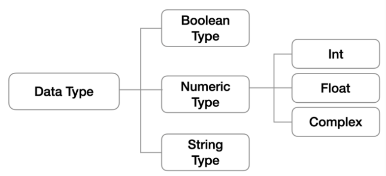
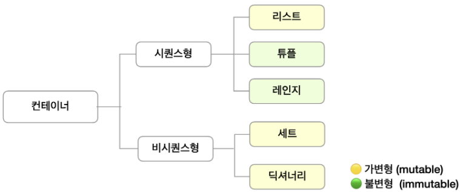
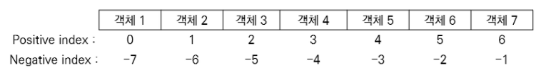
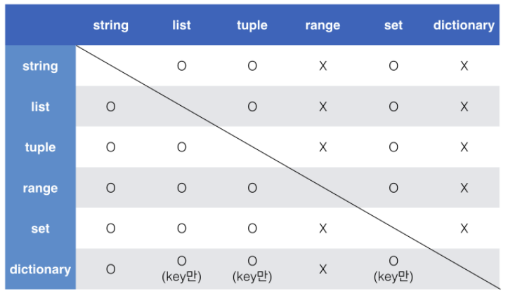

# 파이썬 기초, 데이터

## 변수(Variable)

### 변수

컴퓨터 메모리 어딘가에 저장되어 있는 객체를 참조하기 위해 사용되는 이름


* 객체(object): 숫자, 문자, 클래스 등 값을 가지고 있는 모든 것
  파이썬은 객체지향 언어, 모든 것이 객체로 구현되어 있음
* 동일 변수에 다른 객체를 언제든 할당할 수 있다. 즉, 참조하는 객체가 바뀔 수 있기 때문에 '변수'라고 부른다.


### 할당 연산자(Assignment Operator): `=`

변수는 `=`을 통해 할당된다.

해당 데이터 타입을 확인하는 함수는 `type()`

해당 값의 메모리 주소를 확인하는 함수는 `id()`

> `id()`에서 확인되는 메모리 주소는 일종의 주민번호라고 생각하면 된다. 고유의 값이다!


#### x와 y에 저장된 값을 바꿔서 저장하는 코드 작성하기.

```python
# 방법1: 임시변수 활용
x, y = 10, 20

tmp = x
x = y
y = tmp
```

```python
# 방법2: Pythonic
x, y = 10, 20

x, y = y, x
```

```python
# 방법 3: Mind Blowing
x, y = 10, 20

x = x + y
y = x - y
x = x - y
```


### 식별자(Identifiers)

변수, 함수, 모듈, 클래스 등을 식별하는 데에 사용되는 이름

* 식별자의 이름은 영문 알파벳(대문자와 소문자), 언더스코어(_), 숫자로 구성
* 첫 글자에 숫자가 올 수 없다.
* 길이에 제한이 없다.
* 대/소문자를 구별한다.
* 아래의 키워드는 사용할 수 없다.

> ```
> ['False', 'None', 'True', '__peg_parser__', 'and', 'as', 'assert', 'async', 'await', 'break', 'class', 'continue', 'def', 'del', 'elif', 'else', 'except', 'finally', 'for', 'from', 'global', 'if', 'import', 'in', 'is', 'lambda', 'nonlocal', 'not', 'or', 'pass', 'raise', 'return', 'try', 'while', 'with', 'yield']
> ```

* 내장함수나 모듈 등의 이름으로도 만들면 안된다.
  기존의 이름에 다른 값을 할당하게 되므로 더 이상 동작하지 않게 된다.


### 사용자 입력 `input([prompt])`

사용자로부터 값을 즉시 입력받을 수 있는 내장함수

대괄호 안에 문자열을 입력하면 해당 문자열을 출력할 수 있다. (대괄호는 생략 가능)

반환값은 항상 **문자열**의 형태로 반환된다!!!


### 주석(comment)

한 줄 주석은 `#`으로 표현

여러 줄의 주석은 1) 한 줄 씩 `#`을 사용해서 표현하거나, 2) `"""` 혹은 `'''`으로 표현할 수 있다. 2)는 주로 함수/클래스를 설명하기 위해 활용된다. 


## 자료형(Data Type)

### 자료형 분류



### 불린형(Boolean Type)

`True` `False`로 구성. 비교/논리 연산 등에서 활용된다.

**비어있는 자료형**이나, **0** 등은 `False`로 변환된다.

> ```python
> 0, 0.0, (), [], {}, '', None
> ```


### 수치형(Numeric Type)

#### 1. `int` 정수

모든 정수는 `int`로 표현된다.

8진수: `0o` / 2진수: `0b` / 16진수: `0x` 로도 표현 가능하다.


> **파이썬에서 표현할 수 있는 가장 큰 수**
>
> 파이썬은 기존 C계열 프로그래밍 언어와 다르게 정수 자료형에서 오버플로우가 없다. 임의 정밀도 산술을 사용하기 때문이다.
>
> **오버플로우**
>
> 데이터 타입 별로 사용할 수 있는 메모리의 크기가 제한되어 있다. 표현할 수 있는 수의 범위를 넘어가는 연산을 하게 되어 기대했던 값이 출력되지 않는 현상, 즉 메모리를 넘어선 상황을 의미한다.
>
> **임의 정밀도 산술**
>
> 사용할 수 있는 메모리양이 정해져 있는 기존의 방식과 달리, 현재 남아있는 만큼의 가용 메모리를 모두 수 표현에 끌어다 쓸 수 있는 형태를 의미
>
> 특정 값을 나타내는데 4bytes가 부족하다면 5 더 부족하면 6까지 사용할 수 있게 유동적으로 운용한다.


#### 2. `float` 부동소수점, 실수

실수는 `float`으로 표현되는데, 컴퓨터가 표현하는 과정에서 부동소수점을 사용하며 항상 같은 값으로 일치되지 않는다. (`floating point rounding error`) 이는 컴퓨터가 2진수(비트)를 통해 숫자를 표현하는 과정에서 생기는 오류이며, 대부분의 경우는 중요하지 않으나 값이 같은지 비교하는 과정에서 문제가 발생할 수 있다.

* 컴퓨터식 지수 표현 방식: `e` 혹은 `E`를 사용한다.
  `312e-2` == `312 * 10 ** -2 == 3.12`

##### 실수 값이 같은지 비교

```python
# 1. 기본 처리 방법: abs()를 사용해 차이가 1e-10이하면 같다고 본다.
a = 3.5 - 3.12
b = 0.38

abs(a - b) <= 1e-10
```

```python
# 2. sys 모듈 사용: epsilon은 부동소수점 연산에서 반올림을 함으로써 발생하는 오차 상환
import sys
abs(a - b) <= sys.float_info.epsilon
```

```python
# 3. math 모듈 사용
import math
math.isclose(a, b)
```


#### 3. `complex` 복소수

각각 실수로 표현되는 실수부와 허수부를 가진다. 허수부를 `j`로 표현한다.

* 문자열을 `complex()`로 반환할 때, `+` `-` 연산자 주위에 공백을 포함하면 `complex`로 반환할 수 없다.


### 문자열(String Type)

문자열은 `'` `"`를 활용해 표현 가능하다. 

단, 문자열을 묶을 때 동일한 문장부호를 활용해야하며, PEP-8에서는 하나의 문장부호를 선택하여 유지하도록 한다.

문자열은 **immutable**하다. 즉, **변경할 수 없다.** 


#### 중첩 따옴표

따옴표 안에 따옴표를 표현할 경우

```python
print('문자열 안에 "작은 따옴표"를 사용하려면 큰 따옴표로 묶는다.')
print("문자열 안에 '작은 따옴표'를 사용하려면 큰 따옴표로 묶는다.")
```


#### 삼중 따옴표

작은 따옴표나 큰 따옴표를 삼중으로 사용한다.  문자열 안에 따옴표를 넣을 때 사용하고, 여러줄에 걸쳐있는 문장을 이렇게 표현한다. PEP-8에 따르면 이 경우에는 반드시`"""`fmf tkdydgksek.


#### 이스케이프 시퀀스

| 예약문자 | 내용 (의미)     |
| -------- | --------------- |
| `\n`     | 줄 바꿈         |
| `\t`     | 탭              |
| `\r`     | 캐리지 리턴     |
| `\0`     | 널(Null)        |
| `\\`     | \               |
| `\'`     | 단일인용부호(') |
| `\"`     | 이중인용부호(") |


#### String Interpolation

1. `%-formatting`
   `%d`: 정수
   `%f`: 실수
   `%s`: 문자열
2. `str.format()`
3. `f-strings`
   형식을 지정할 수 있다!

```python
name = '김혜림'
score = 4.03
# 1. %-formatting
print('%s의 성적은 %.2f' % (name, score))

# 2. str.format()
print('{}의 성적은 {}입니다.'.format(name, score))

# 3. f-strings
print(f'{name}의 성적은 {score}입니다.')
```

```python
# f-strings 형식 지정 출력
import datetime
today = datetime.datetime.now()
print(today)
print(f'오늘은 {today:%y}년 {today:%m}월 {today:%d}일 {today:%A}')
# 오늘은 22년 02월 01일 Tuesday


pi = 3.141592
print(f'원주율은 {pi : .3}. 반지름이 2일 때, 원의 넓이는 {pi * 2 * 2}이라고 출력해봅시다.')
# 원주율은  3.14. 반지름이 2일 때, 원의 넓이는 12.566368이라고 출력해봅시다.
```


### None Type

파이썬에서는 값이 없음을 위해 `None`타입이 존재한다.


## 컨테이너 (Container)

여러 개의 값을 저장할 수 있는 것을 의미, 서로 다른 자료형을 저장할 수 있다.



### 시퀀스형 컨테이터

데이터가 순서대로 나열된(**ordered**) 형식을 나타낸다.

* 순서가 있다.
* 특정 위치의 데이터를 가리킬 수 있다. (인덱스 사용 가능)

`list` `tuple` `range` `string` 등이 있다.


#### 리스트(List)

대괄호`[]` 혹은 `list()`로 생성한다.




#### 튜플(Tuple)

소괄호`()` 혹은 `tuple()`로 생성한다.

**immutable**하다 == **수정 불가능**하다

* 단일 요소를 가진 튜플 생성시 값 뒤에 쉼표를 붙여야 한다!
  쉼표가 없는 경우 요소의 자료형에 따라 class가 정해진다.

튜플 대입은 우변의 값을 좌변의 변수에 한번에 할당하는 과정을 의미한다. 일반적으로 파이썬 내부에서 활용된다.


#### 레인지(Range)

정수의 시퀀스를 나타내기 위해 사용된다.

기본형: `range(n)`

> 0부터 n-1까지 값을 가짐

범위 지정: `range(n, m)`

> n부터 m-1까지 값을 가짐

범위 및 스텝 지정: `range(n, m, s)`

> n부터 m-1까지 +s만큼 증가하는 값을 가짐


#### 패킹 / 언패킹 연산자

모든 시퀀스형은 패킹/언패킹 연산자를 사용해 객체의 패킹 또는 언패킹이 가능하다.

##### 패킹

대입문의 좌변 변수에 위치

우변의 객체 수가 좌변의 변수 수보다 많을 경우 객체를 순서대로 대입한다.

나머지 항목들은 모두 별 기호 표시된 변수에 **리스트로 대입**한다.

```python
x, *y = 1, 2, 3, 4
print(X, type(X))  # 1, int
print(y, type(y))  # [2, 3, 4], list
```


##### 언패킹

argument 이름이 `*`로 시작하는 경우, argument unpacking이라고 부른다.

언패킹은 **튜플 형태**로 대입한다.


> **패킹/언패킹 연산자 주의사항**
>
> ` * ` 연산자가 곱셈을 의미하는지 패킹/언패킹 연산자인지 구분하여야 합니다.
> - 패킹/언패킹 연산자의 경우
>     1. 연산자가 대입식의 좌측에 위치하는 경우
>     2. 연산자가 단항 연산자로 사용되는 경우
>         - 단항 연산자 : 하나의 항을 대상으로 연산이 이루어지는 연산자
>         
>     
> - 산술연산자의 경우
>     1. 연산자가 이항연산자로 사용되는 경우
>         - 이항 연산자 : 두 개의 항을 대상으로 연산이 이루어지는 연산자


### 비 시퀀스형 컨테이너

#### 세트(Set)

순서가 없고, 중복된 값이 없는 자료구조

* 수학에서의 집합과 동일하게 처리
* 중괄호`{}`를 통해 만들며 담고 있는 객체를 변경, 삭제 가능하다. **mutable**하다.
* 빈 세트를 만드려면 `set()`를 사용한다. (`{}`는 사용 불가능)
* 활용 가능한 연산자는 차집합`-` 합집합`|` 교집합`&`이다.

리스트의 중복된 값을 세트를 활용하면 손쉽게 제거할 수 있다. 다만 변환하는 순간 순서를 보장할 수 없다.


#### 딕셔너리(Dictionary)

key와 value가 쌍으로 이뤄져있다.

* 중괄호 `{}` 혹은 `dict()`로 생성한다.
* 순서를 보장하지 않는다.
* key는 **변경 불가능**한 데이터만 올 수 있다. (immutable: string, integer, float, boolean, tuple, range)
* value는 list, dictionary를 포함한 모든 것이 가능하다.
* **중복된 key는 존재할 수 없다!!**
* `.items()`로 딕셔너리가 가진 key, value 목록을 튜플로 받을 수 있다.


### 형변환

#### 암시적 형변환

사용자가 의도하지 않았지만, 파이썬 내부적으로 자동으로 형변환하는 경우

* boolean type: `True` => 1, `False` => 0
* numeric type:  int + float => float, int + complex => complex

#### 명시적 형변환

위의 상황을 제외하고는 모두 명시적으로 형변환을 해줘야 한다.

- string -> intger : 형식에 맞는 숫자만 가능
- integer -> string : 모두 가능

암시적 형변환이 되는 모든 경우도 명시적으로 형변환이 가능합니다.

- `int()` : string, float를 int로 변환
- `float()` : string, int를 float로 변환
- `str()` : int, float, list, tuple, dictionary를 문자열로 변환


### 컨테이너 형변환




## 연산자(Operator)

### 산술 연산자

| 연산자 | 내용           |
| ------ | -------------- |
| `+`    | 덧셈           |
| `-`    | 뺄셈           |
| `*`    | 곱셈           |
| `/`    | 나눗셈         |
| `//`   | 몫             |
| `%`    | 나머지(modulo) |
| `**`   | 거듭제곱       |


### 비교 연산자

| 연산자   | 내용                       |
| -------- | -------------------------- |
| `<`      | 미만                       |
| `<=`     | 이하                       |
| `>`      | 초과                       |
| `>=`     | 이상                       |
| `==`     | 같음                       |
| `!=`     | 같지않음                   |
| `is`     | 객체 아이덴티티            |
| `is not` | 객체 아이덴티티가 아닌경우 |


### 논리 연산자

| 연산자  | 내용                         |
| ------- | ---------------------------- |
| a and b | a와 b 모두 True시만 True     |
| a or b  | a 와 b 모두 False시만 False  |
| not a   | True -> False, False -> True |

#### 단축평가

- 파이썬에서 and는 a가 거짓이면 a를 리턴하고, 참이면 b를 리턴합니다.
  (*즉, 참일 경우 뒤의 값을 확인하러 간다고 생각하면 된다. 거짓일 경우 거기서 멈추고 그 값을 리턴하는 것*)
- 파이썬에서 or은 a가 참이면 a를 리턴하고, 거짓이면 b를 리턴합니다.
  (*참을 하나만 갖고 있어도 참을 리턴하기 때문에, 거짓일 경우 뒤의 값을 확인하러 가고, 참일 경우 거기서 멈추고 그 값을 리턴*)
- 파이썬에서 비어있는 자료형 혹은 0이 아니면 모두 `True`라고 본다.

첫번째 값이 확실할 때, 두번째 값은 확인하지 않는다.

조건문에서 뒷 부분을 판단하지 않아도 되기 때문에 속도가 향상된다


### 복합 연산자

| 연산자    | 내용       |
| --------- | ---------- |
| a += b    | a = a + b  |
| a -= b    | a = a - b  |
| a \*= b   | a = a \* b |
| a /= b    | a = a / b  |
| a //= b   | a = a // b |
| a %= b    | a = a % b  |
| a \*\*= b | a = a ** b |

연산과 할당이 함께 이뤄진다. 반복문을 통해서 갯수를 카운트할 때 자주 사용된다.


### 식별 연산자 `is`

동일한 object인지 확인한다. => id가 동일한 것이냐?

257 이후의 정수는 id가 다르다. 그래서 두 변수에 동일하게 257을 할당해도 `a is b`는 `False`가 된다.

> ```python
> a = 257
> b = 257
> 
> a is b  # => False
> 
> a = b = 257
> 
> a is b  # => True
> ```


### 멤버십 연산자

요소가 시퀀스에 속해있는지 확인

`in`연산자, `not in` 연산자


### 시퀀스형 연산자

산술 연산자 `+ `: 시퀀스를 연결

```python
[1, 2] + ['a']  # [1, 2, 'a']
(1, 2) + ('a',)  # (1, 2, 'a')
'12' + 'a'  # '12a'
```


반복 연산자 `*`: 시퀀스를 반복

**range에는 사용할 수 없다!!!!!!**

```python
[0] * 8  # [0, 0, 0, 0, 0, 0, 0, 0]
(1, 2) * 3  # (1, 2, 1, 2, 1, 2)
'hi' * 3  # 'hihihi'
```


## 기타: 인덱싱, 슬라이싱

### 인덱싱

`[]`를 통해서 시퀀스의 특정 인덱스에 해당하는 값에 접근 할 수 있습니다.

찾고자 하는 인덱스가 존재하지 않을 때 `IndexError`가 발생한다.

### 슬라이싱

`[:]`을 통해 시퀀스를 특정 단위로 슬라이싱 할 수 있다.

```python
print([1, 2, 3, 4][1:4])  # 인덱스 1이상 4미만 => 1, 2, 3
print((1, 2, 3)[:2])  # 인덱스 0이상 2미만 => 0, 1
print(range(10)[5:8])  # 인덱스 5 이상 8미만 => 5 6 7 
print('abcd'[2:4])  # 인덱스 2 이상 4 미만 => 4라는 인덱스가 없어도 원래의 인덱스보다 더 크면 에러가 발생하지 않는다.

s = 'abcdefghi'
print(s[::])  # 처음부터 끝까지
print(s[::-1])  # 역순으로 정렬한다!
```


### 연산자 우선순위

1. `()`을 통한 grouping
2. Slicing
3. Indexing
4. 제곱연산자 `**`
5. 단항연산자 `+`, `-` (음수/양수 부호)
6. 산술연산자 `*`, `/`, `%`
7. 산술연산자 `+`, `-`
8. 비교연산자, `in`, `is`
9. `not`
10. `and`
11. `or`