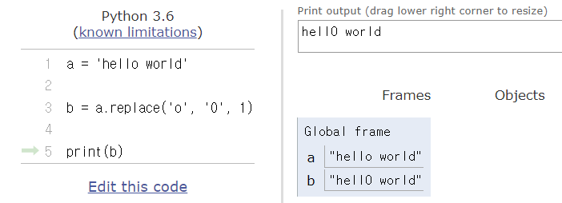
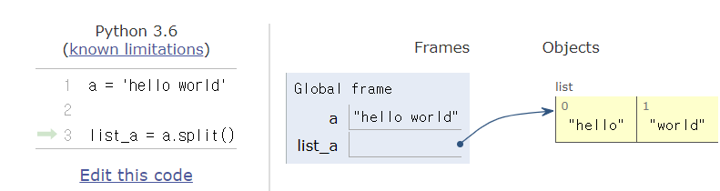
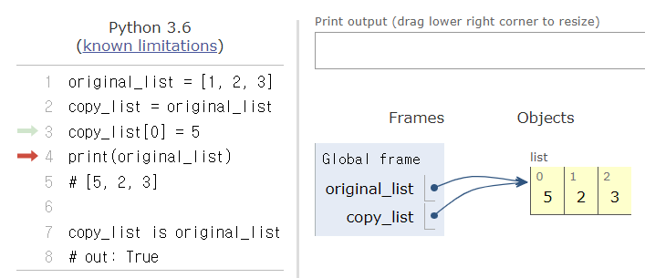
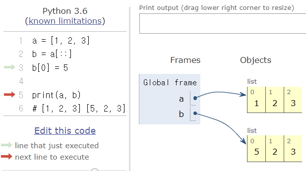
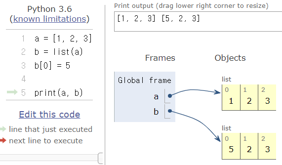
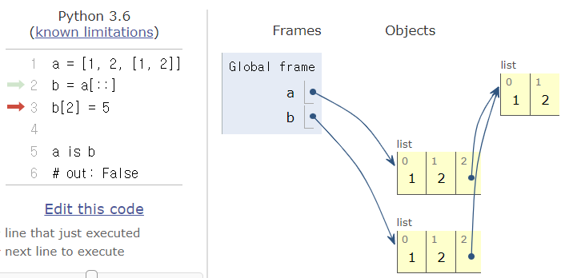
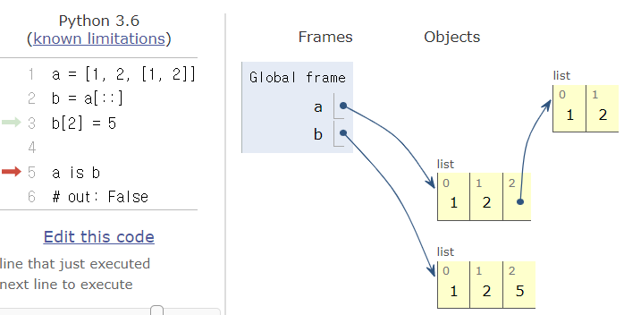
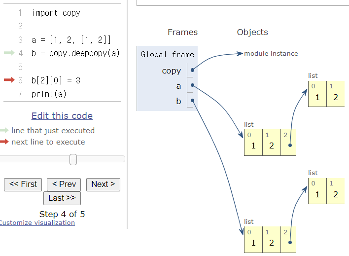
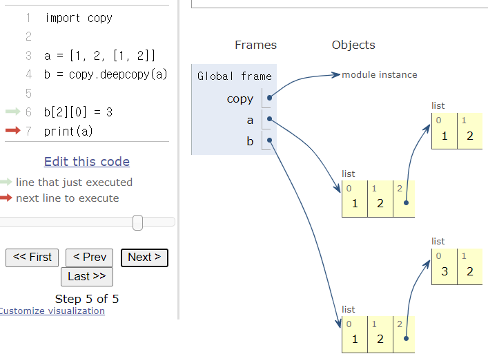

[toc]

# 03_01_데이터구조

데이터 구조(자료 구조)란, 데이터에 효율적인 접근 및 수정을 가능케 하는 데이터의 구성, 관리 및 저장형식을 의미

데이터 값들, 해당 값들의 관계, 그리고 해당 데이터들에게 적용할 수 있는 함수와 명령어들의 모음을 총칭하는 단어.


## Ordered 데이터

### 1. 문자열(string)

* 순서가 있고 ordered
* 변경할 수 없고 immutable
* 순회 가능하다 iterable


#### 문자열 검증 메소드

##### `.find(x)`

`x` 의 첫번째 위치를 반환한다. 만약 자료 내에 `x`가 <u>없으면 `-1`을 반환</u>


##### `.index(x)`

`x`의 첫번째 위치를 반환한다. 만약 자료 내에 `x`가 <u>없으면 오류 발생</u>


##### `.startswith(x)`, `.endswith(x)`

- `.startswith(x)` : 문자열이 x로 시작하면 True를 반환하고 아니면 False를 반환합니다.
- `.endswith(x)` : 문자열이 x로 끝나면 True를 반환하고 아니면 False를 반환합니다.

접두/접미 문자를 검색 시, 화이트 스페이스나 인코딩 문제를 피하기 위해 문자열 분할보다 이 메소드 사용을 권장한다.


##### 기타 문자열 관련 검증 메서드

`is~` 로 시작하는 많은 메서드들은 문자열이 어떠한 조건에 해당하는지 검증하는 역할을 합니다.

- `.isalpha()` : 문자열이 (숫자가 아닌)글자로 이루어져 있는가?
- `.isspace()` : 문자열이 공백으로 이루어져 있는가?
- `.isupper()` : 문자열이 대문자로 이루어져 있는가?
- `.istitle()` : 문자열이 타이틀 형식으로 이루어져 있는가?
- `.islower()` : 문자열이 소문자로 이루어져 있는가?

등

#### 문자열 변경 메소드

##### `.replace(old, new[, count])`

바꿀 대상 글자를 새로운 글자로 바꿔서 반환한다. 그러나 **a가 수정되지는 않는다**. 그러므로 변경된 문자열을 사용하고 싶으면 메소드 사용 결과를 새로운 변수에 할당해줘야 한다. 

count를 지정하면 해당 갯수만큼만 시행합니다.



> 만약 `a.replace('o', '0')`에서 count를 지정하지 않으면, 문자열 내에 존재하는 모든 'o'를 '0'로 변경한다!


##### `.strip([chars])`

특정한 문자들을 지정하면, 양쪽을 제거하거나(`strip`) 왼쪽을 제거하거나(`lstrip`), 오른쪽을 제거한다(`rstrip`).

`chars` 파라미터를 지정하지 않으면 공백을 제거한다.

```python
a = '   hello!  \n'
b = 'hihihihahahahihi'
c = 'monty python'

a.strip()			# => 'hello!'
a.lstrip()  		# => 'hello!  \n'
b.rstrip('hi')		# => 'hihihihahahahi'
c.rstrip('python')	# => 'monty'
```


##### `.split([chars])`

문자열을 특정한 단위로 나누어 **리스트**로 반환합니다. 그러나 a는 절대 수정되지 않으므로 리스트를 다른 변수에 저장해야 한다.

특정한 단위를 지정하지 않으면 공백을 기준으로 나누어 리스트로 반환한다.




##### `'separator'.join(iterable)`

iterable한 자료의 요소들을 separator(구분자)로 이어 붙인(`join()`) 문자열을 반환합니다.

다른 메서드들과 달리, **구분자**가 join 메서드를 제공하는 문자열입니다.

```python
# 문자열에서의 적용
word = '배고파'
print('!'.join(word))  # => 배!고!파
```

```python
# 리스트에서의 적용
words = ['안녕', 'hello']
print(''.join(words))  # => 안녕hello
```


##### 기타 문자열 변경 메소드

- `.capitalize()` : 앞글자를 대문자로 만들어 반환합니다.
- `.title()` : 어포스트로피(*'*)나 공백 이후를 대문자로 만들어 반환합니다.
- `.upper()` : 모두 대문자로 만들어 반환합니다.

- `.lower()` : 모두 소문자로 만들어 반환합니다.
- `.swapcase()` : 대 <-> 소문자로 변경하여 반환합니다.


### 2. 리스트

* 순서가 있고 ordered
* 변경할 수 있고 mutable
* 순회 가능하다 iterable


#### 값 추가 및 삭제 => 원본이 변경되는 메소드

##### `.append(x)`

리스트에 값을 추가할 수 있습니다. *요소를 추가한다*

`a[len(a):] = [x]` 와 동일합니다.

```python
cafe = ['starbucks', 'tomntoms', 'hollys']
cafe.append('banapresso')
print(cafe)
# ['starbucks', 'tomntoms', 'hollys', 'banapresso']

cafe[len(cafe):] = ['banapresso']  # 이 코드로 실행해도 같은 결과
```


##### `.extend(iterable)`

리스트에 iterable(list, range, tuple, string) 값을 붙일 수가 있습니다.

`a[len(a):] = iterable` 와 동일합니다.

```python
cafe = []
cafe.extend(['wcafe', '빽다방'])
print(cafe)  	# ['wcafe', '빽다방']

cafe += ['mc_cafe', 'droptop']
print(cafe)  	# ['wcafe', '빽다방', 'mc_cafe', 'droptop']
```

```python
# extend로 range를 추가하면?
a = []
a.extend(range(1,5))
print(a)		# [1, 2, 3, 4]
```

> range의 요소를 리스트의 한 요소로 넣어준다.

```python 
# extend로 str을 추가하면?
a = []
a.extend('i love you')
print(a)		# ['i', ' ', 'l', 'o', 'v', 'e', ' ', 'y', 'o', 'u']
```

> 문자열을 한 글자씩 분리해 요소의 한 요소로 넣어준다.
>
> 이때, 공백도 하나의 요소로 들어간다!!!!


##### `.insert(i, x)`

정해진 위치 `i`에 값을 추가합니다. *이것은 사실 그다지 많이 사용되지 않는다*


##### `.remove(x)`

리스트에서 값이 x인 첫번째 항목을 삭제한다. 

만일 그런 항목이 없으면 `ValueError`가 발생!!!

```python
numbers = [1, 2, 3, 1, 2]
numbers.remove(1) # numbers = [2, 3, 1, 2]
numbers.remove(1) # numbers = [2, 3, 2]
numbers.remove(1) # ValueError
```


##### `.pop([i])` => 예외, return이 있음

정해진 위치 `i`에 있는 값을 삭제하며, 그 항목을 반환한다 *변수에 저장하면 삭제한 값을 확인할 수 있다*

`i`가 지정되지 않으면 마지막 항목을 삭제하고 되돌려줍니다.

*pop(i)는 그냥 사용하지 말자!!!!!!!!!* 배열의 경우 중간값이 in/out되어서 복잡한 과정이 일어남, list는 그것이 아니긴 하지만 그래도 사용하지 말자!!!

```python
numbers = [1, 2, 3, 4, 5, 6]
a = numbers.pop(3)
print(numbers, a)
# [1, 2, 3, 5, 6] 4
```


#### 탐색 및 정렬

##### `.index(x)`

x 값을 찾아 해당 index 값을 반환합니다.


##### `.count(x)`

자료 내에 `x`의 개수를 반환합니다.


##### `.sort(*, key=None, reverse=False)`

리스트를 정렬하는 메소드, 내장함수 `sorted()` 와는 다르게 **원본 list를 변형**시키고, **`None`**을 리턴합니다.

파라미터로는 `key`와 `reverse`가 있습니다. `key`가 지정되지 않으면, 오름차순으로 정렬한다. 

```python
# sort() vs sorted()

lotto = [2, 41, 3, 45, 11, 16]

lotto.sort(reverse = True)
print(lotto)		# [45, 41, 16, 11, 3, 2]
print(lotto.sort()) # None

sorted(lotto)
print(lotto)		# [45, 41, 16, 11, 3, 2]

s_lotto = sorted(lotto)
print(s_lotto)		# [2, 3, 11, 16, 41, 45]
```


##### `.reverse()`

리스트의 element들을 제자리에서 반대로 뒤집는다. 정렬하는 것이 아닌 원본 순서를 뒤집고 수정한다.

내장함수 `reversed()` 와는 다르게 **원본 list를 변형**시키고, **`None`**을 리턴합니다.

sort와 마찬가지로, 파라미터 `key`와 `reverse`가 있습니다.

```python
classroom = ['Tom', 'David', 'Justin']

classroom.reverse()
print(classroom)		# ['Justin', 'David', 'Tom']
```

* 주의사항

```python
s = '수박이박수'
list(s).reverse() == list(s)  
# 이 코드는 False가 뜬다.
```

> .reverse()는 **None을 return한다!!** 그러므로 메소드를 실행한 결과가 같아보일 수는 있지만 반환값으로는 같지 않다!!


### 3. 튜플

튜플은 불변자료형이므로 값을 변경하는 메서드는 사용할 수 없다.


#### 탐색

##### `.index(x[, start[, end]])`

튜플에 있는 항목 중  `x` 와 같은 항목 중 첫 번째 인덱스를 돌려줍니다.

해당하는 값이 없으면, `ValueError`를 발생합니다.


##### `.count(x)`

튜플에서 x 가 등장하는 횟수를 돌려줍니다.


## 순서가 없는 데이터 구조

### 1. 세트

* 순서가 없고 unordered
* 변경할 수 있고 mutable
* 순회 가능하다 iterable


#### 추가 및 삭제

##### `.add(elem)`

elem을 셋(set)에 추가한다.


##### `.update(*others)`

여러 값을 추가한다. 반드시 **iterable한 데이터** 구조를 전달해야 한다.

```python
a = {'사과', '바나나', '수박'}
a.update({'a'})
a.update(range(2))

print(a)
# {0, '사과', 1, '수박', '바나나', 'a'} 
```


##### `.remove(elem)`

elem을 셋(set)에서 삭제하고, 셋(set) 내에 elem이 존재하지 않으면 `KeyError`가 발생합니다.


##### `.discard(elem)`

`elem`을 셋(set)에서 삭제한다. remove와 다른 점은 elem이 셋(set) 내에 존재하지 않아도, **에러가 발생하지 않는다는** 점입니다.


### 2. 딕셔너리

* 순서가 없고 unordered
* 변경할 수 있고 mutable
* 순회 가능하다 iterable


#### 조회

##### `.get(key[, default])`

key를 통해 value를 가져온다. key가 존재하지 않을 경우 `None`을 반환하는데, `default = 'sth'`이라고 지정하면, `sth`을 반환한다. `KeyError`가 발생하지 않는다!


##### `.setdefault(key[, default])`

`dict.get()` 메서드와 비슷한 동작을 하는 메서드로, key가 딕셔너리에 있으면 value를 반환한다. 

`.get()`과 다른 점은 key가 딕셔너리에 없을 경우, **default 값을 갖는 key 를 삽입한 후 default 를 반환한다는 점**이다. 만일 default가 주어지지 않을 경우, None 을 반환한다.

* *언제쓸까??*

`[]`로 부르는 것 = error

`.get()` = 없으면 none 혹은 원하는 문구

`.setdefault()` = 없으면 새로운 키에 디폴트값 넣어서 생성


* 예시

```python
bank_db = {
    'john' : 300,
    'amy' : 200,
    'justin' : 400
}

newbies = ['I', 'AM', 'john', 'justin']

for newbie in newbies:
    print(bank_db.get(newbie))
    print(bank_db.setdefault(newbie, 0))
    
# None
# 0
# None
# 0
# 300
# 300
# 400   

print(bank_db)
# {'john': 300, 'amy': 200, 'justin': 400, 'I': 0, 'AM': 0}
```


#### 추가 및 삭제

##### `.pop(key[, default])`

key가 딕셔너리에 있으면 제거하고 그 key에 해당하는 value를 돌려준다. 그렇지 않으면 default를 반환합니다.

default가 없는 상태에서 해당 key가 딕셔너리에 경우, `KeyError`가 발생한다.

```python
my_dict = {'apple': '사과', 'banana': '바나나'}

my_dict.pop('apple')
# out: '사과'

my_dict.pop('melon')
# KeyError: 'melon'

my_dict.pop('melon', '없는 키입니다.')
# out: '없는 키입니다.'
```


##### `.update([other])`

`other` 가 제공하는 key,value 쌍으로 딕셔너리를 덮어쓴다. `other` 는 다른 딕셔너리나 key/value 쌍으로 되어있는 모든 iterable을 사용 가능하다.

- `keyword argument`로 업데이트 하는 방법
  - 키워드 인자가 지정되면, 딕셔너리는 그 key/value 쌍으로 갱신됩니다.

```python
my_dict = {'apple': '사과', 'banana': '바나나', 'melon': '멜론'}

my_dict.update({'apple': '사과아'})
print(my_dict)
# {'apple': '사과아', 'banana': '바나나', 'melon': '멜론'}


d = {'mange': '망고', 'watermelon': '수박'}
my_dict.update(d)

print(my_dict)
# {'apple': '사과아', 'banana': '바나나', 'melon': '멜론', 'mange': '망고', 'watermelon': '수박'}
```


## 얕은 복사와 깊은 복사

데이터 분류에 따라 복사가 달라진다. 데이터는 크게 mutable과 immutable로 나뉘며, python에서는 각각을 다르게 다룬다. 

파이썬에서 데이터를 복사하는 방법은 크게 세가지로 나뉜다.

1. 할당(Assignment)
2. 얕은 복사(Shallow copy)
3. 깊은 복사(Deep copy)


**immutable 데이터**

- 리터럴(literal)
  - 숫자(Number)
  - 글자(String)
  - 참/거짓(Bool)
- 레인지 `range()`
- 튜플 `tuple()`
- 프로즌셋 `frozenset()`


**mutable 데이터**

- 리스트 `list`
- 딕셔너리 `dict`
- 셋 `set`


### 1. 할당

```python
original_list = [1, 2, 3]
copy_list = original_list
copy_list[0] = 5
print(original_list)
# [5, 2, 3]

copy_list is original_list
# out: True
```

>변수만 복사하는 것으로, python tutor에서 화살표로 가리키고 있는 형태가 된다. 이럴 경우 객체는 당연히 동일한 것이다. 
>
>즉, 두개 중 하나만 변경이 되어도 나머지 하나도 동일하게 수정되는 현상이 발생한다.




### 2. 얕은 복사

#### slice 연산자 사용 `[:]`

```python
a = [1, 2, 3]
b = a[::]
b[0] = 5

print(a, b)
# [1, 2, 3] [5, 2, 3]
```



#### list() 사용

```python
a = [1, 2, 3]
b = list(a)
b[0] = 5

print(a, b)
# [1, 2, 3] [5, 2, 3]
```




#### 2차원의 mutable 데이터는 어떨까?

데이터가 중첩되어 있는 경우

```python
a = [1, 2, [1, 2]]
b = a[::]
b[2] = 5

a is b
# out: False
```






### 3. 깊은 복사

- 만일 중첩된 상황에서 복사를 하고 싶다면, `깊은 복사(deep copy)`를 해야 합니다.
- 깊은 복사는 새로운 객체를 만들고 원본 객체 내에 있는 객체에 대한 복사를 재귀적으로 삽입합니다.
- 즉, **내부에 있는 모든 객체까지 새롭게 값이 변경**되게 됩니다.



