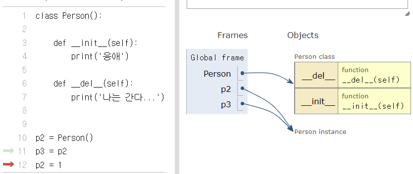
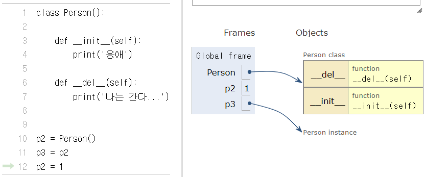
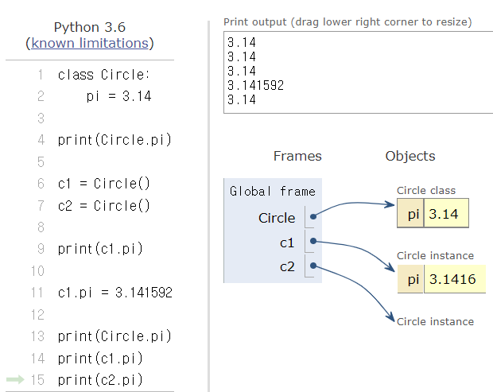
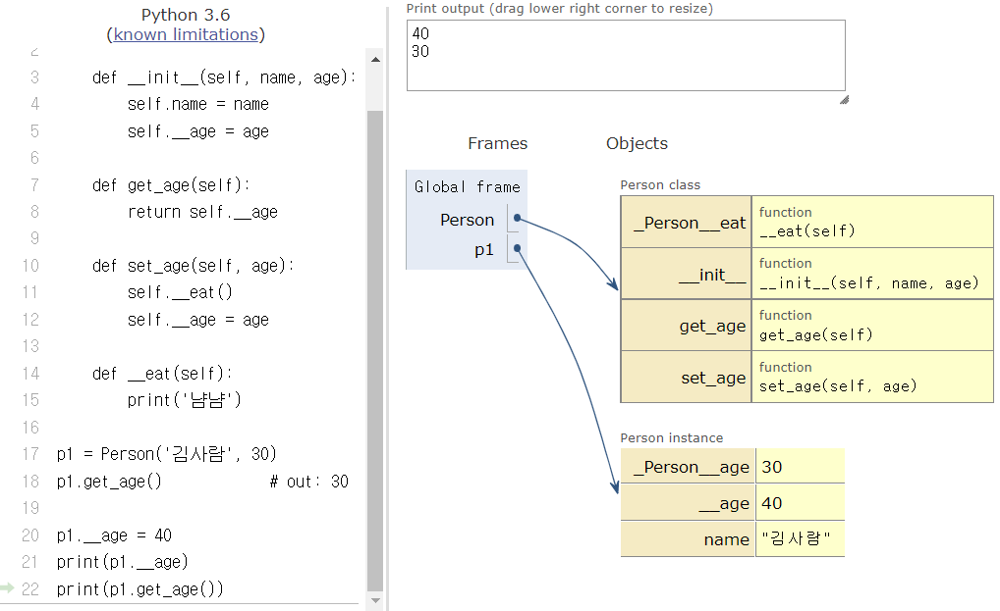

[toc]

# 04_OOP

## 객체(Object)

파이썬에서 모든 것은 객체이다! 

모든 객체는 타입(type), 속성(attribute), 조작법(method)를 가진다.

* 객체의 특징
  * **타입(type)**: 어떤 연산자(operator)와 조작(method)이 가능한가?
  * **속성(attribute)**: 어떤 상태(데이터)를 가지는가?
  * **조작법(method)**: 어떤 행위(함수)를 할 수 있는가?


## 객체 지향 프로그래밍(Object-Oriented Programming)

객체가 중심이 되는 프로그래밍

> **wikipedia - 객체 지향 프로그래밍**
>
> 객체 지향 프로그래밍(영어: Object-Oriented Programming, OOP)은 컴퓨터 프로그래밍의 패러다임의 하나입니다.
>
> 객체 지향 프로그래밍은 컴퓨터 프로그램을 명령어의 목록으로 보는 시각에서 벗어나 여러 개의 독립된 단위, 즉 "객체"들의 모임으로 파악하고자 하는 것입니다.

* 객체 중심의 장점

  * 코드의 직관성
  * 활용의 용이성
  * 변경의 유연성

  

### OOP 기초

#### 기본 문법

```python
# 클래스 정의
class MyClass:
    pass

# 인스턴스 생성
my_instance = MyClass()

# 속성 접근
my_instance.my_attribute

# 메서드 호출
my_instance.my_method()
```


#### 클래스(class)

클래스는 공통된 속성(attribute)과 조작법(method)을 가진 객체들의 분류이다.


#### 인스턴스(instance)

특정 클래스의 실제 데이터 예시를 의미한다.

파이썬에서 모든 것은 객체이고, 모든 객체는 특정 클래스의 인스턴스이다!!

```python
class Person:
    pass

hrookim = Person()
# hrookim은 Person이라는 클래스의 인스턴스이다!

isinstance(hrookim, Person)
# out: True
```


#### 속성(attribute)

객체의 상태/데이터를 의미한다

* 활용법

```python
<객체>.<속성>

# 예시
hrookim.name  # Person이라는 클래스의 인스턴스인 hrookim의 name이라는 속성 
```


#### 메서드(method)

특정 객체가 할 수 있는 행위를 의미

* 활용법

```python
<객체>.<메서드>()

# 예시
hrookim.talk()
hrookim.eat()
```


### 인스턴스(instance)

#### 인스턴스 생성

정의된 클래스(`class`)에 속하는 객체를 해당 클래스의 인스턴스(instance)라고 한다.

`Person` 클래스의 인스턴스는 `Person()`을 호출함으로써 생성된다.

`type()` 함수를 통해 생성된 객체의 클래스를 확인할 수 있다.

* 활용법

```python
# 인스턴스 = 클래스()
person1 = Person()
```

```python
class Person:
    pass
p1 = Person()
p2 = Person()

type(p1), type(p2)
# (__main__.Person, __main__.Person)
```


#### 인스턴스 변수

인스턴스의 속성(attribute), 각 인스턴스들의 고유한 데이터

생성자 메서드에서 `self.변수명`로 정의 *(생성자 메서드는 뒤에 기술)*

인스턴스가 생성된 이후 `인스턴스.변수명`로 접근 및 할당

```python
class Person:
    pass

p1 = Person()
p1.name = 'jack'
p1.age = 25

print(p1.name, p1.age)
# jack 25
```


#### 인스턴스 메서드

인스턴스 메서드는 인스턴스가 사용할 메서드로, 클래스 내부에 정의되는 메서드는 기본적으로 인스턴스 메서드로 생성된다.

<u>메서드도 함수이기 때문에</u> 추가적인 인자를 받을 수 있습니다.

**메서드 호출시, 첫번째 인자로 인스턴스 자기자신에 해당하는 `self`가 전달된다.**

* 활용법

```python
class MyClass:
    def instance_method(self, arg1, arg2, ...):
        ...

my_instance = MyClass()
# 인스턴스 생성 후 메서드를 호출하면 자동으로 첫 번째 인자로 인스턴스(my_instance)가 들어갑니다.
my_instance.instance_method(.., ..)  
```

* 예시

```python
class Person:
    
    def talk(self):
        print('안녕')
    
    def eat(self, food='맘마', *args):
        print(f'냠냠 {food}')
        if args:
            for arg in args:
                print(f'{arg}도 먹고싶긴 하당')

p1 = Person()

p1.talk()	
p1.eat('곱창', '치킨', '돈까스')

# 안녕
# 냠냠 곱창
# 치킨도 먹고싶긴 하당
# 돈까스도 먹고싶긴 하당
```


#### `self`

인스턴스 자신, 파이썬에서 인스턴스 메서드는 호출 시 첫번째 인자로 인스턴스 자신이 전달되게 설계되었다. 

보통 매개변수명으로 `self`를 첫번째 인자로 정의한다. (다른 이름도 가능하지만, 사용하지 않는게 일반적이다!!!!)


#### 생성자(constructor) 메서드

인스턴스 객체가 생성될 때 자동으로 호출되는 함수

반드시 **`__init__`이라는 이름으로 정의**한다!!!

생성자를 활용하면 인스턴스가 생성될 때, <u>인스턴스의 속성을 정의</u>할 수 있다.

* 활용법

```python
class MyClass:
    def __init__(self):
        print('생성될 때 자동으로 호출되는 메서드입니다.')
```

* 예시

```python
class Person:
    def __init__(self, name):
        self.name = name
    
    def talk(self):
        print(f'I am {self.name}')

hrookim = Person('혜림')

hrookim.talk()
# I am 혜림
```

> self는 빈자리가 아니다 
>
> `Person.talk(hrookim)`을 실행하면 똑같은 결과가 나오는 것을 확인할 수 있다. 하지만 이러한 코드는 잘못된 코드이므로 절대 사용하지 않는다!!!!!


#### 소멸자(destructor) 메서드

인스턴스 객체가 소멸되기 직전에 자동으로 호출되는 함수

반드시 **`__del__`이라는 이름으로 정의**한다.

* 활용법

```python
# 소멸자 정의
def __del__(self):
    print('소멸될 때 자동으로 호출되는 메서드입니다.')

# 소멸자 활용
del 인스턴스
```

* 예시

```python
class Person():
    
    def __init__(self):
        print('응애')
        
    def __del__(self):
        print('나는 간다...')

p1 = Person()
# 응애

del p1
# 나는 간다...

# *********추가로**********
p2 = Person()
p3 = p2
p2 = 1
# 이렇게 메모리에 할당된 값을 부를 수 있는 단 하나의 이름이라도 있으면, 죽은 것이 아니다!!!!!! 그래서 p2가 바뀌었지만 소멸자 메서드가 실행되지 않았다
```






### 속성(attribute)

#### 속성 정의

`self.<속성명> = <값>` 혹은 `<인스턴스>.<속성명> = <값>`으로 설정합니다

* 활용법

```python
class Person:
    def __init__(self, name):
        self.name = name

    def talk(self):
        print(f'안녕, 나는 {self.name}')
        
p1 = Person('혜림')
p1.talk()
# 안녕, 나는 혜림

p2 = Person()
# TypeError: __init__() missing 1 required positional argument: 'name'
```


### 매직메서드

더블언더스코어(`__`)가 있는 메서드는 특별한 일을 하기 위해 만들어진 메서드이기 때문에 `스페셜 메서드` 혹은 `매직 메서드`라고 불린다.

* 매직(스페셜) 메서드 형태: `__something__`

```python
'__str__(self)',
'__len__(self)',
'__repr__(self)',
'__lt__(self, other)',
'__le__(self, other)',
'__eq__(self, other)',
'__ne__(self, other)',
'__gt__(self, other)',
'__ge__(self, other)',
```


#### `__str__()` 와 `__repr__()`

`__str__()`: 특정 객체를 출력(`print()`) 할 때 보여줄 내용을 정의할 수 있다.

* 활용법

```python
class Person:
    def __str__(self):
        return '객체 출력(print)시 보여줄 내용'
```

* `__str__()` vs `__repr__()`

```python
class Person:
    def __init__(self, name):
        self.name = name
    
    def __str__(self):
        return f'나는 {self.name}'
    
    def __repr__(self):
        return f'I am {self.name}'
    
p2 = Person('혜림')

print(p2)  # 나는 혜림 
p2         # out: I am 혜림
```

> `__str__`: print를 하면 나오는 문구가 반환됨. 남에게 보여지는 것이 목적인 한마디로 **게임상의 닉네임**
>
> `__repr__`: p2를 입력하면 반환되는 값이 정해짐. 객체 자체를 찍었을 때 무엇을 return할 것인지? / **게임상의 ID**


### 클래스(class)

`class` 객체들의 분류(클래스)를 정의할 때 쓰이는 키워드


#### 클래스 생성

 `class <클래스의 이름>` 으로 생성한다. 이때, `<클래스의 이름>`은 `PascalCase`로 정의한다. (*혹은 카멜 케이스*)

클래스 내부에는 데이터와 함수를 정의할 수 있고, 이때 데이터는 **속성(attribute)** 정의된 함수는 **메서드(method)**로 부른다.

* 활용법

```python
class <클래스이름>:
    <statement>
class ClassName:
    statement
```


#### 클래스 변수

클래스의 속성(attribute)으로 모든 인스턴스가 공유한다.

클래스 선언 내부에서 정의하며, `클래스.변수명`으로 접근 및 할당한다.

* 활용법

```python
class Circle:
    pi = 3.14

print(Circle.pi)  # 3.14

c1 = Circle()
c2 = Circle()

print(c1.pi)	  # 3.14

c1.pi = 3.141592

print(Circle.pi)  # 3.14
print(c1.pi)	  # 3.141592
print(c2.pi)	  # 3.14
```




#### 클래스 메서드

클래스가 사용할 메서드에 해당한다. 

`@classmethod` 데코레이터를 사용하여 정의한다.

**메서드 호출시, 첫번째 인자로 클래스 자체 `cls`가 전달된다.**

* 활용법

```python
class MyClass:
    @classmethod
    def class_method(cls, arg1, arg2, ...):
        ...

# 자동으로 첫 번째 인자로 클래스(MyClass)가 들어갑니다.
MyClass.class_method(.., ..)  
```


#### 스태틱 메서드(static method)

클래스가 사용할 매서드에 해당한다.

인스턴스와 클래스의 속성과 무관한 메서드이다.

`@staticmethod` 데코레이터를 사용하여 정의한다.

**메서드 호출시, 어떠한 인자도 자동으로 전달되지 않는다.**

송성을 다루지 않고 단지 기능(행동)만을 하는 메서드를 정의할 때 사용한다.

* 활용법

```python
class MyClass:
    @staticmethod
    def static_method(arg1, arg2, ...):
        ...

MyClass.static_method(.., ..)
```


#### 인스턴스와 클래스 간의 이름 공간(namespace)

클래스를 정의하면 클래스와 해당하는 이름 공간이 생성된다.

인스턴스를 만들면 인스턴스 객체가 생성되고 이름 공간이 생성된다.

인스턴스에서 특정 속성에 접근하면, 인스턴스 -> 클래스 순으로 탐색한다.

```python
class Person:
    name = 'unknown'
    
    def talk(self):
        print(self.name)
        
p2 = Person()
p2.talk()		# unknown
p2.name = 'kim'
p2.talk()		# kim
```


## 비교 정리

### 인스턴스와 메서드

- 인스턴스는 3가지 메서드(인스턴스, 클래스, 스태틱 메서드) 모두에 접근할 수 있다.
  - 하지만, **인스턴스에서 클래스 메서드와 스태틱 메서드는 호출하지 않는다. (가능하다 != 사용한다)**
- 인스턴스가 할 행동은 모두 인스턴스 메서드로 한정 지어서 설계한다.


### 클래스와 메서드

- 클래스는 3가지 메서드(인스턴스, 클래스, 스태틱 메서드) 모두에 접근할 수 있다.
  - **클래스에서 인스턴스 메서드는 호출하지 않는다. (가능하다 != 사용한다)**
- 클래스가 할 행동은 다음 원칙에 따라 설계한다. (클래스 메서드와 스태틱 메서드)
  - 클래스 자체(`cls`)와 그 속성에 <u>접근할 필요가 있다면</u> **클래스 메서드**로 정의.
  - 클래스와 클래스 속성에 <u>접근할 필요가 없다면</u> **스태틱 메서드**로 정의.
    (스태틱 메서드는 `cls`, `self`와 같이 묵시적인 첫번째 인자를 받지 않기 때문)

```python
# 추가문제
a = 1

class MyClass:
    
    a = 100
    
    def method(self):
        print(a, self.a)
        
mc = MyClass()

mc.method() 
# 1 100
```

> method라는 함수 안에 있으므로, LEGB 룰이 그대로 적용된다.
>
> 그래서 method의 scope에서 찾고 없으면 global로 간다.


## OOP의 핵심 개념

### 추상화(Abstraction)

OOP에서의 추상화는 세부적인 내용은 감추고 필수적인 부분만 표현하는 것을 뜻한다.

현실 세계를 프로그램 설계에 반영하기 위해 사용된다. 

여러 클래스가 공통적으로 사용할 속성 및 메서드를 추출하여 기본 클래스로 작성하여 활용한다.

>만약 내가 `Student`와 `Professor`라는 클래스를 만든다고 하자.
>
>둘다 `name`, `age`, `subject`라는 속성을 갖게 되는데, 이렇게 공통 속성을 가지게 된다면 이를 추출하여 `Student`와 `Professor`의 상위에 존재하는 기본 클래스로 작성하는 것이다.


### 상속(Inheritance)

클래스에서 가장 큰 특징은 **상속**이 가능하다는 것이다! (*클래스와 클래스 사이의 관계에서를 말한다. 인스턴스와의 관계는 아니다*)

부모 클래스의 모든 속성이 자식 클래스에게 상속되므로 재사용성이 높아진다!!!

* 활용법

```python
class ChildClass(ParentClass):
    <code block>
```

* 예시

```python
# 부모 클래스 생성
class Person:
    population = 0
    
    def __init__(self, name='사람'):
        self.name = name
        Person.population += 1

    def __del__(self):
        Person.population -= 1

    def talk(self):
        print(f'반갑습니다. {self.name}입니다.')

p1 = Person('혜림')
p1.talk()				# 반갑습니다. 혜림입니다.
Person.population		# out: 1

# 상속받은 자식 클래스 생성
class Student(Person):
    def __init__(self, student_id, name='학생'):
        self.name = name
        self.student_id = student_id  
        Person.population += 1
        
s1 = Student(12345, '김혜림')
s1.talk()				# 반갑습니다. 김혜림입니다.
Person.population		# out: 2
```


`issubclass(class, classinfo)`

- class가 classinfo의 subclass인 경우 `True`를 반환

`isinstance(object, classinfo)`

- object가 classinfo의 인스턴스거나 subclass인 경우 `True`를 반환


#### `super()`

자식 클래스에 메서드를 추가로 구현할 수 있다.

부모 클래스의 내용을 사용하고자 할 때, `super()`를 사용할 수 있다.

* 활용법

```python
class ChildClass(ParentClass):
    def method(self, arg):
        super().method(arg) 
```

* 예시

```python
class Person:
    def __init__(self, name, age, number, email):
        self.name = name
        self.age = age
        self.number = number
        self.email = email 
        
    def greeting(self):
        print(f'안녕, {self.name}')
      
    
class Student(Person):
    def __init__(self, name, age, number, email, student_id):
        super().__init__(name, age, number, email)
        self.student_id = student_id
        
p1 = Person('홍교수', 200, '0101231234', 'hong@gildong')
s1 = Student('김학생', 20, '01056785678', 'student@naver.com', '190000')

s1.greeting()  # 안녕, 김학생
```


### 다형성(polymorphism)

여러 모양을 뜻하는 그리스어로, 동일한 메서드가 클래스에 따라 다르게 행동할 수 있음을 뜻한다.

즉, 서로 다른 클래스에 속해있는 객체들이 동일한 메시지에 대해 각기 다른 방식으로 응답될 수 있다.


#### 메서드 오버라이딩(Method Overriding)

자식 클래스에서 부모 클래스의 메서드를 재정의하는 것 (*덮어쓰기!!*)

- 상속 받은 메서드를 `재정의`할 수도 있습니다.
- 상속 받은 클래스에서 **같은 이름의 메서드**로 덮어씁니다.
- `__init__`, `__str__`의 메서드를 정의하는 것 역시, 메서드 오버라이딩입니다.

```python
# 부모 클래스
class Person:
    def __init__(self, name, age, number, email):
        self.name = name
        self.age = age
        self.number = number
        self.email = email 
        
    def talk(self):
        print(f'안녕, {self.name}')

# 자식 클래스        
class Soldier(Person):
    def __init__(self, name, age, number, email, army):
        super().__init__(name, age, number, email) 
        self.army = army
        
    def talk(self):
        print(f'충성, 상병 {self.name}')
        
p = Person('김사람', 25, '01012341234', '123@gmail.com')
p.talk()
# 안녕, 김사람

s = Soldier('박군인', 20, '01056785687', '456@gmail.com', '공군')
s.talk()
# 충성, 상병 박군인
```

> `Soldier` 클래스에서 `talk()`메서드가 재정의되었다!!!


### 캡슐화(Encapsulation)

객체의 일부 구현 내용에 대해 외부로부터의 직접적인 액세스를 차단하는 것을 말한다. 

다른 언어와 달리 파이썬에서 캡슐화는 암묵적으로는 존재하지만, 언어적으로는 존재하지 않는다.

* **접근제어자의 종류**

  - Public Access Modifier

  - Protected Access Modifier

  - Private Access Modifier


#### Public Member

언더바가 없이 시작하는 메서드나 속성들이 이에 해당하고, 어디서나 호출 가능하다.

하위 클래서에서 메서드 오버라이딩을 허용한다. 

일반적으로 작성되는 메서드와 속성의 대다수를 차지한다.


#### Protected Member

언더바 1개 `_`로 시작하는 메서드나 속성들이 이에 해당한다.

암묵적 규칙에 의해 부모 클래스 내부와 자식 클래스에서만 호출 가능하다.

하위 클래스에서 메서드 오버라이딩을 허용한다.

* 예시

```python
class Person:
    
    def __init__(self, name, age):
        self.name = name
        self._age = age  
        # 암묵적 규칙에 의해 부모클래스 내부와 자식클래스에서만 호출된다
        
    def get_age(self):
        return self._age
    
p1 = Person('혜림', 20)
p1.get_age()		# out: 20
print(p1._age)		# 20

p1._age = 30
print(p1._age)		# 30
```

> 직접 접근 가능하고, 재할당하면 값 변경도 가능하다!!!!!


#### Private Member

언더바 2개 `__`로 시작하는 메서드나 속성이 이에 해당한다. 

본 클래스 내부에서만 사용이 가능하고, 하위 클래스 상속 및 호출이 불가능하다.

외부 호출도 불가능하다!

* 예시

```python
class Person:
    
    def __init__(self, name, age):
        self.name = name
        self.__age = age
    
    def get_age(self): 
        return self.__age
    
    def set_age(self, age):
        self.__eat()
        self.__age = age
        
    def __eat(self):
        print('냠냠')
        
p1 = Person('김사람', 30)
p1.get_age()			# out: 30

p1.__age = 40
print(p1.__age)			# 40
print(p1.get_age())		# 30
```



> `p1.__age`로 접근해서 값을 할당할 수는 있지만, 그것은 새로 값을 할당하게 된 것이 된다. 그래서 `p1.get_age()`를 실행하면 private member 그대로 나오게 된다.


### `getter` 메서드와 `setter` 메서드

변수에 접근할 수 있는 메서드를 별도로 생성할 수 있다.

- `getter` 메서드: 변수의 값을 읽는 메서드
  - `@property` 데코레이터를 사용합
- `setter`메서드: 변수의 값을 설정하는 성격의 메서드
  - `@변수.setter`를 사용


* 예시

```python
class Person:
    
    def __init__(self, age):
        self._age = age 
        
    # 함수를 마치 변수(property)인 척 변신시켜주기    
    @property
    def age(self):
        return self._age
    
    @age.setter
    def age(self, new_age):
        if new_age <= 19:
            raise ValueError('Too Young For SSAFY')
            return
        
        self._age = new_age

p1 = Person(20)
print(p1.age)		# 20
p1.age = 33			# age.setter를 실행해준다!!!
p1.age = 19 		# age.setter를 실행하고, 조건에 따라 오류나옴
# ValueError: Too Young For SSAFY
```


### 다중 상속

두개 이상의 클래스를 상속받는 경우, 다중 상속이 된다!!

- 상속 받은 모든 클래스의 요소를 활용 가능
- 중복된 속성이나 메서드가 있는 경우 상속 순서에 의해 결정


* 예시

```python
class Person:
    def __init__(self, name):
        self.name = name

    def greeting(self):
        return f'안녕, {self.name}'
    
class Mom(Person):
    gene = 'XX'
    
    def swim(self):
        print('어푸어푸')

class Dad(Person):
    gene = 'XY'
    
    def walk(self):
        print('터벅터벅')
        
m1 = Mom('엄마 정씨')
m1.greeting()		# 안녕, 엄마 정씨

d1 = Dad('아빠 김씨')
d1.walk()			# 터벅터벅
```

```python
# 다중상속 첫번째 애기
class FirstChild(Dad, Mom):
    
    def swim(self):
        print('응애 어푸')
        
    def cry(self):
        print('응애응애')
        
baby1 = FirstChild('첫째 김씨')
baby1.greeting()  	# 안녕, 첫째 김씨
baby1.cry()			# 응애응애
baby1.swim()		# 응애 어푸
baby1.walk()		# 터벅터벅
baby1.gene			# XY -> 아빠의 유전자를 물려받았다!!!
```

```python
# 다중상속 두번째 애기
class SecondChild(Mom, Dad):
    
    def walk(self):
        print('아장아장')
        
    def cry(self):
        print('으아앙')

baby2 = SecondChild('김둘째') 
baby2.cry()			# 으아앙
baby2.walk()		# 아장아장
baby2.swim()		# 어푸어푸
baby2.gene			# XX -> 엄마의 유전자를 물려받았다!!
```


### 상속관계에서의 이름 공간과 MRO(Method Resolution Order)

기존의 `인스턴스 -> 클래스` 순으로 이름 공간을 탐색해나가는 과정에서 상속관계에 있으면 아래와 같이 확장됩니다.

- 인스턴스 -> 자식 클래스 -> 부모 클래스

MRO는 해당 인스턴스의 클래스가 어떤 부모 클래스를 가지는지 확인하는 속성 또는 메서드이다.


* 활용법

```python
ClassName.__mro__

# 또는
ClassName.mro()
```


* 예시

```python
# 부모 클래스
class Mom:
    def walk(self):
        print('사뿐사뿐')
        
        
class Dad:
    def walk(self):
        print('저벅저벅')
        
# 자식 클래스
class Daughter(Mom, Dad):
    pass


class Son(Dad, Mom):
    pass

d = Daughter()
s = Son()

d.walk()		# 사뿐사뿐 -> 본인 클래스 다음에 Mom 클래스
s.walk()		# 저벅저벅 -> 본인 클래스 다음에 Dad 클래스
```

