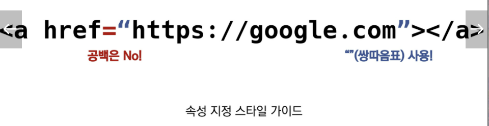

# HTML

## HTML은 무엇인가? <u>What?</u>

`Hyper Text Markup Language` == **웹 페이지를 작성(구조화)하기 위한 언어**

* `Hyper Text`: 참조를 통해 사용자가 한 문서에서 다른 문서로 즉시 접근할 수 있는 텍스트
  
  
  과거에는 정보라고 하는 것이 인쇄된 종이(문서)에 있었다. 종이 문서는 접근하는 데에 물리적인 제약이 있었다. 그런데, 이것이 탄생하고부터 물리적, 혹은 시간적 제약을 뛰어넘게 만들었다. => <u>Hyper!</u>
  `Hyper Link`: 문서와 문서 사이의 점프!!! 예전에는 새로운 정보를 알려면 다른 책이나 문서로 넘어가야 하는데, 이거는 그냥 바로 슥슥 넘어간다. *(완전 신세계)*
  
* `Markup Language`: 태그 등을 이용해 문서나 데이터의 **구조를 명시**하는 언어
  구조를 명시하다 == 역할을 표시한다!!!!


## HTML 왜 쓰는가? <u>Why?</u>

웹을 만드는 표준이기 때문에

그런데 html로 문서를 만드는 것은 그럴싸하게 문서를 만드는 기능은 없다. 보기 좋게 꾸미는 것은 **css의 역할**이다!!! *그러니까 공부하면서 겉보기에 영향받지 않아도 된다.*

> 현재의 웹 표준 - WHATWG


## HTML 기본 구조

html의 요소 == 태그라 부를 것이다.


> html: 문서의 최상위 요소
>
> head: 문서의 메타데이터 요소 (문서 제목, 인코딩, 스타일, 외부 파일 로딩 등 일반적으로 브라우저에 나타나지 않는 내용)
>
> body: 문서 본문 요소 (실제 화면 구성과 관련된 내용)


### head 예시

* `<title>`: 브라우저 상단 타이틀
* `<meta>`: 문서 레벨 메타데이터 요소
* `<link>`: 외부 리소스 연결 요소(CSS파일, 파비콘 등)
* `<script>`: 스크립트 요소(JS파일/코드)
* `<style>`: CSS 직접 작성

 

#### Open Graph Protocol

메타 데이터를 표현하는 새로운 규약

* HTML 문서의 메타 데이터를 통해 문서의 정보를 전달
* 메타 정보에 해당하는 제목, 설명 등을 쓸 수 있도록 정의

*카톡에 링크보내면 뜨는 형태!*


### DOM(Document Object Model) 트리

텍스트 파일인 HTML 문서를 브라우저에서 렌더링 하기 위한 구조

* HTML 문서에 대한 모델을 구성함
* HTML 문서 내의 각 요소에 접근 / 수정에 필요한 property와 method를 제공

> 텍스트 파일로 만들어져 있는 웹 문서를 브라우저에 렌더링하려면 웹 문서를 브라우저가 이해할 수 있는 구조로 메모리에 올려야 한다. 브라우저의 렌더링 엔진은 웹 문서를 로드한 후, 파싱하여 웹 문서를 브라우저가 이해할 수 있는 구조로 구성하여 메모리에 적재하는데 이를 DOM이라 한다. 즉 모든 요소와 요소의 어트리뷰트, 텍스트를 각각의 객체로 만들고 이들 객체를 부자 관계를 표현할 수 있는 트리 구조로 구성한 것이 DOM이다.
>
> 출처: https://poiemaweb.com/js-dom

파싱: 작성된 코드를 소화(해석)하는 것 (우리가 한것중에는 `bs4`)

브라우저는 웹 문서를 로드한 후, 파싱하여 DOM을 생성한다.


* 예시


> DOM에서 모든 요소, 어트리뷰트, 텍스트는 하나의 객체이며 Document 객체의 자식이다. 요소의 중첩관계는 객체의 트리로 구조화하여 부자관계를 표현한다. DOM tree의 진입점(Entry point)는 document 객체이며 최종점은 요소의 텍스트를 나타내는 객체이다.


### 요소(element)

* HTML의 요소는 태그와 내용으로 구성되어 있다. 
  * 태그는 시작태그와 종료태그로 구성
  * 그 두 태그 사이에 내용이 위치해 있다.
* 태그: 내용을 감싸는 것으로 그 정보의 성격과 의미를 정의
  * 내용이 없는 태그도 있다.
    `<br>` `<hr>` `` `<input>` `<link>` `<meta>`

```html
<h1>    시작태그
    Hello world!!!   내용
</h1>	종료태그
```


* 요소는 중첩될 수 있다.
  * 요소의 중첩을 통해 하나의 문서를 구조화
  * 여는 태그와 닫느 태그의 쌍을 잘 확인 해야한다.
  * 파이썬 과는 다르게 오류를 반환하는 것이 아니라 그냥 레이아웃이 깨진 상태로 출력되기 때문에, 디버깅이 힘들어질 수 있다.


#### 속성(attribute)

태그에는 속성을 줄 수 있다. 태그별로 사용할 수 있는 속성은 다르다

* 지정 스타일



* 속성을 통해 태그의 부가적인 정보를 설정할 수 있다.
* 요소는 속성을 가질 수 있으며, 경로나 크기와 같은 추가적인 정보를 제공한다.
* 요소의 시작 태그에 작성하며 보통 이름과 같이 하나의 쌍으로 존재
* 태그와 상관없이 사용 가능한 속성들도 있다. `HTML Global Attribute`
  * `id`: 문서 전체에서 유일한 고유 식별자 지정
  * `class`: 공백으로 구분된 해당 요소의 클래스의 목록 (CSS, JS에서 요소를 선택하거나 접근)
  * `data-*`: 페이지에 개인 사용자 정의 데이터를 저장하기 위해 사용
  * `style`: inline 스타일
  * `title`: 요소에 대한 추가 정보 지정
  * `tabindex`: 요소의 탭 순서


### 시맨틱 태그 (semantic == 의미를 담고 있다.)

HTML5에서 의미론적 요소를 담은 태그가 등장했다. 기존 영역을 의미하는 `div` 태그를 대체하여 사용한다.

> `<div>` division (구역): 어떤 구역인지를 알아볼 수가 없음. 그래서 이를 용도에 따라 이름을 변경한 것! 근본적으로는 같다. 

(*semantic 버전에서 접해봤다: version을 작성하는 방법 a.b.c*)


* 대표적인 시맨틱 태그 목록

  * `header`: 문서 전체나 섹션의 헤더(머리말 부분)
  * `nav`: 내비게이션
  * `aside`: 사이드에 위치한 공간, 메인 콘텐츠와 관련성이 적은 콘텐츠
  * `section`: 문서의 일반적인 구분, 콘텐츠의 그룹을 표현
  * `article`: 문서, 페이지, 사이트 안에서 독립적으로 구분되는 영역
  * `footer`: 문서 전체나 섹션의 푸터(마지막 부분)

  |                           전 -> 후                           |
  | :----------------------------------------------------------: |
  |  |


* Non semantic 요소는 div, span 등이 있고, h1, table 태그들도 시맨틱 태그로 볼 수 있다.
* 개발자 및 사용자 뿐만 아니라 검색엔진 등에 있는 의미 있는 정보의 그룹을 태그로 표현한다.
* 단순히 구역을 나누는 것에 더불어 '의미'를 가지는 태그들을 활용하기 위한 노력이다.
* 요소의 의미가 명확해지기 때문에 **코드의 가독성**을 높이고 **유지보수를 쉽게** 할 수 있다.
* 검색엔진최적화를 위해서 메타태그, 시맨틱 태그 등을 통한 마크업을 효과적으로 활용해야 한다.


## HTML 문서 구조화

### 인라인 / 블록 요소

인라인 vs 블록: 블록 요소는 인스펙터로 눌러보면 블럭단위로 나온다. 근데 인라인 요소는 그냥 내용만 나온다.

 

### 텍스트 요소

| 태그                               | 설명                                                         |
| ---------------------------------- | ------------------------------------------------------------ |
| `<a></a>`                          | `href` 속성을 활용해 다르 URL로 연결하는 하이퍼링크 생성     |
| `<b></b>`<br />`<strong></strong>` | 굵은 글씨 요소. 중요한, 강조하고자 하는 요소(보통 굵은 글씨로 표현) |
| `<i></i>`<br />`<em></em>`         | 기울임 글씨 요소. 중요한 강조하고자 하는 요소(보통 기울임 글씨로 표현) |
| `<br>`                             | 텍스트 내에 줄 바꿈 생성                                     |
| `</img>`                      | `src` 속성을 활용해 이미지 표현                              |
| `<span></span>`                    | 의미 없는 인라인 컨테이너                                    |

`<br>` 문서 배치에서 상하간격 조정하는 것 절대 아니다!!!!! 막 여러번 넣고 그러는 것이 아니다. 예쁘게 조정하는 것은 css에서 할 수 있다!

`<b> <i>` 이런것은 글의 구조와는 다른 스타일이다. 그래서 글의 구조(역할)를 알려줄 수 있는 `<strong> <em>`을 만들게 된 것이다!!!!! 이렇게 작성된 것을 브라우저에서 각각 굵게, 기울인체 이렇게 작성하게 만드는 것이다.

>*우리가 html로 하는 것은, 글의 구조 각각 문단의 역할을 지정해주는 것뿐이다!!!!!!! 절대 이것으로 스타일을 주려고 하면 안된다.* 


### 그룹 콘텐츠

| 태그                        | 설명                                                         |
| --------------------------- | ------------------------------------------------------------ |
| `<p></p>`                   | 하나의 문단                                                  |
| `<hr>`                      | 문단 레벨 요소에서의 주제의 분리를 의미, 수평선의 표현       |
| `<ol></ol>`                 | 순서가 있는 리스트                                           |
| `<ul></ul>`                 | 순서가 없는 리스트                                           |
| `<pre></pre>`               | HTML에 작성한 내용을 그대로 표현. 보통 고정폭 글꼴이 사용되고 공백 문자를 유지 |
| `<blockquote></blockquote>` | 텍스트가 긴 인용문. 주로 들여쓰기를 한 것으로 표현           |
| `<div></div>`               | 의미 없는 블록 레벨 컨테이너                                 |


### table

* table의 각 영역을 명시하기 위한 `<thead>` `<tbody>` `<tfoot>` 태그 활용


* `<tr>`로 가로줄을 구성하고, 내부에는 `<th>` 혹은 `<td>`로 셀을 형성


* `colspan` `rowspan` 속성을 활용해 셀을 병합할 수 있다!!


> 출처: https://m.blog.naver.com/gounsori90/220531860547

* `<caption>`을 통해 표 설명 혹은 제목을 나타낼 수 있다.


```html
<table>
    <thead>
      <tr>
        <th>순서</th>
        <th>영화제목</th>
        <th>id</th>
        <th>작성시간</th>
      </tr>
    </thead>
    <tbody>
      <tr>
        <td>1</td>
        <td>asd</td>
        <td>asd</td>
        <td>123</td>
      </tr>
      <tr>
        <td>1</td>
        <td>asd</td>
        <td>asd</td>
        <td>123</td>
      </tr>
      <tr>
        <td>1</td>
        <td>asd</td>
        <td>asd</td>
        <td>123</td>
      </tr>
    </tbody>
    <tfoot>
      <tr>
        <td>총계</td>
        <td colspan="3">3개의 게시글</td>
      </tr>
    </tfoot>
    <caption>영화 리뷰 모음</caption>
```


### form 태그

정보(데이터)를 서버에 제출하기 위한 영역

* 기본 속성

  - `action=""`:  form을 처리할 서버의 URL.
    기본 URL 뒤에 ?를 붙여서 url을 수정해줌
  - `method`: form을 제출할 때 사용할 HTTP 메서드 (GET 혹은 POST)
    post로 할 경우, 비밀번호같이 입력된 내용이 URL에 포함되지 않는다.
  - `enctype`: method가 post인 경우 데이터의 유형
    - `application/x-www-form-urlencoded`: 기본값
    - `multipart/form-data`: 파일 전송시 (input type이 file인 경우)
  - `required`: 그 항목을 작성해야 로그인이 가능하게!!!

  - `disabled`: 창은 있지만 입력할 수 없게 둠

  - `autofocus`: 해당 요소에 자동으로 커서가 깜빡이고 있음


### input 태그

다양한 타입을 가지는 입력 데이터 유형과 위젯이 제공됨

* 대표 속성
  * `name`: form control에 적용되는 이름 (이름/값 페어로 전송)
  * `value`: form control에 적용되는 값 (이름/값 페어로 전송)
  * `required`, `readonly`, `autofocus`, `autocomplete`, `disabled`


> action에 /search가 들어갔기 때문에, google.com뒤에 이것이 붙어서 URL을 생성한다. 그리고 input으로 받은 데이터가 `q=HTML`이라고 **이름(name)과 값(value)**이 페어로 전송된다!!!!!


#### input label

label을 클릭해서 input 자체의 초점을 맞추거나 활성화시킬 수 있다.

사용자는 선택할 수 잇는 영역이 늘어나 웹/모바일(터치) 환경에서 편하게 사용할 수 있다.

label과 input 입력의 관계가 시각적뿐만 아니라 화면 리더기에서도 label을 읽어 쉽게 내용을 확인할 수 있도록 한다.

**`<input>`에 id 속성을, `<label>`에는 for 속성을 활용해 상호 연관을 시킨다.**


#### input 유형 - 일반

일반적으로 입력을 받기 위해 제공되며 타입별로 HTML 기본 검증 혹은 추가 속성을 활용할 수 있다.

* `text`: 일반 텍스트 입력
* `password`: 입력 시 값이 보이지 않고 문자를 특수기호(*)로 표현
* `email`: 이메일 형식이 아닌 경우 form 제출 불가
* `number`: min, max, step 속성을 활용해 입력 가능한 숫자 범위 설정 가능
* `file`: accept 속성을 활용해 파일 타입 지정 가능


#### input 유형 - 항목 중 선택

일반적으로 label을 사용해 내용을 작성하고, 항목 중 선택할 수 있는 input을 제공한다.

동일 항목에 대해 `name`을 지정하고 선택된 항목에 대한 `value`를 지정해야 한다.

* `checkbox`: 다중 선택
* `radio`: 단일 선택


#### input 유형 - 기타

다양한 종류의 input을 위한 picker를 제공한다.

* `color`: color picker
* `date`: date picker

* `hidden`: hidden input을 활용해 사용자 입력을 받지 않고 서버에 전송되어야 하는 값을 설정. 사용자에게 보이지 않는 input


* **로그인 창 만드는 `input`**

```html
<form action="" method="post">
    <!-- ID -->
    <div>
      <label for="ID">ID</label>
      <input type="text" name="ID" id="ID" autofocus required>
    </div>
    
    <!-- PW -->
    <div>
      <label for="PW">PW</label>
      <input type="password" name="password" id="PW" required>
    </div>
</form>    
```


* **사용자 유형을 선택하는 `select`**

```html
<div>
  <label for="usertype">사용자 유형 선택</label>
    <select name="usertype" id="usertype">
      <option value="student">학생</option>
      <option value="lecturer">강사</option>
      <option value="parents">학부모</option>
      <option value="etc">기타</option>
    </select>
</div>
```


* **지역을 선택하는 `select`**

```html
<div>
    <label for="region">지역을 선택하세요</label>
    <select name="region" id="region" required>
        <option value="">선택하세요</option>
        <option value="1">서울</option>
        <option value="2">대전</option>
        <option value="3">구미</option>
        <option value="4">광주</option>
        <option value="5">부울경</option>
    </select>
</div>
```

> select에 required를 넣고 선택하세요를 남긴 이유는, 선택하세요의 value가 비어있어서 선택을 안한경우 넘어갈 수 없게 설정하는 것이기 때문이다. 
>
> 만약 서울로 해놓은다면 사용자가 설정을 변경하지 않아도 그냥 넘어간다. 그니까 한번더 확인하지 않아도 되게 하는것..?


* **개인정보 제공 동의하는 `input`**

```html
<div>
  <p>개인정보 제공 동의</p>
    <!-- 동의한다는 input -->
    <label for="agree">동의</label>
    <input type="radio" value="agree" name="agreement" id="agree" checked>
    
    <!-- 비동의한다는 input -->
    <label for="disagree">비동의</label>
    <input type="radio" value="disagree" name="agreement" id="disagree">
</div>
```

> 조심해야 할 것은, label의 for와 input의 id가 일치해야 한다는 것이다! 그리고 URL에 넘어갈 것은 name=value 형태이기 때문에, name은 이 항목을 포괄적으로 말할 수 있는 agreement를 부여했다.
>
> 그리고 동의 부분에서는 `value, id, for`을 모두 `agree`로
>
> 비동의 부분에서는 `value, id, for`을 모두 `disagree`로 맞췄다.


* **제출 버튼도 `input`**

```html
<!-- 제출 버튼! -->
<input type="submit" value="로그인" id="submit">
```

> 별도의 label이 필요헚다. `value`에 부여된 이름으로 제출 버튼의 문구가 정해진다. 지정되지 않았을 시 `제출`이 기본값

