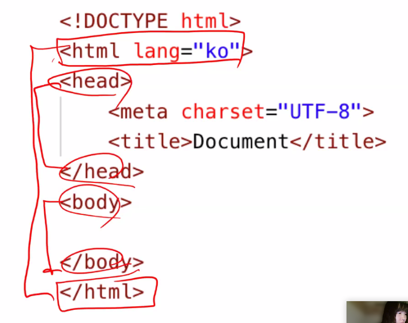
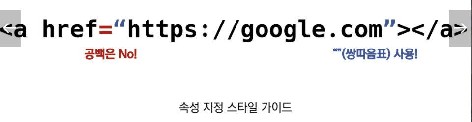

# 0203

## HTML

### HTML은 무엇인가? What?

Hyper Text Markup Language == 웹 페이지를 작성(구조화)하기 위한 언어

* Hyper Text: 참조를 통해 사용자가 한 문서에서 다른 문서로 즉시 접근할 수 있는 텍스트
  과거에는 문서나 글 정보라고 하는 것이 인쇄된 종이에 있었다. 그런데 종이는 물리적으로 제약이 있었음. 근데 이것이 탄생하고부터 물리적, 혹은 시간적 제약을 뛰어넘게 만들었음 => Hyper!
  Hyper Link: 문서와 문서 사이의 점프!!!! 예전에는 새로운 정보를 알려면 다른 책이나 문서로 넘어가야 하는데, 이거는 그냥 바로 슥슥 넘어감! 완전 신세계
* Markup: 태그 등을 이용해 문서나 데이터의 **구조를 명시**하는 언어
  구조를 명시하다 == 역할을 표시한다!!!!
* Language: 언어 


### HTML 왜 쓰는가? Why?

웹을 만드는 표준이기 때문에

그런데 html로 문서를 만드는 것은 그럴싸하게 문서를 만드는 기능은 없다. 보기 좋게 꾸미는 것은 css의 역할이다!!! 그러니까 공부하면서 겉보기에 영향받지 않아도 된다.


### HTML 기본 구조

html의 요소 == 태그라 부를 것이다.




#### head 예시: Open Graph Protocol

카톡에 링크보내면 뜨는 형태!


#### DOM(Documnet Object Model) 트리

파싱: 작성된 코드를 소화(해석)하는 것 (우리가 한것중에는 `bs4`)


#### 요소(element)

시작 태그와 종료 태그로 구정

##### 속성(attribute)

태그에는 속성을 줄 수 있다. 태그별로 사용할 수 있는 속성은 다르다

* 지정 스타일




#### 시맨틱 태그

`<div>` division (구역) 어떤 구역인지를 알아볼 수가 없음. 그래서 이를 용도에 따라 이름을 변경한 것! 근본적으로는 같다. 

* semantic 버전에서 접해봤다: version을 작성하는 방법 a.b.c
* 그래서 semantic == 의미를 담고 있다


### HTML 문서 구조화

#### 인라인 / 블록 요소

인라인 vs 블록: 블록 요소는 인스펙터로 눌러보면 블럭단위로 나온다. 근데 인라인 요소는 그냥 내용만 나온다.

`<br>` 문서 배치에서 상하간격 조정하는 것 절대 아니다!!!!! 막 여러번 넣고 그러는 것이 아니다. 예쁘게 조정하는 것은 css에서 할 수 있다!

`<b> <i>` 이런것은 글의 구조와는 다른 스타일이다. 그래서 글의 구조(역할)를 알려줄 수 있는 `<strong> <em>`을 만들게 된 것이다!!!!! 이렇게 작성된 것을 브라우저에서 각각 굵게, 기울인체 이렇게 작성하게 만드는 것이다.

>우리가 html로 하는 것은, 글의 구조 각각 문단의 역할을 지정해주는 것뿐이다!!!!!!! 절대 이것으로 스타일을 주려고 하면 안된다. 

 


#### form 태그

데이터를 서버에 제출하기 위한 영역

`required` 그 항목을 작성해야 로그인이 가능하게!!!

`disabled` 창은 있지만 입력할 수 없게 둠

`autofocus` 새로고침하면 ID에 자동으로 커서가 깜빡이고 있음

`action=""`기본 URL 뒤에 ?를 붙여서 url을 수정해줌


```html
<div>
    <label for="region">지역을 선택하세요</label>
    <select name="region" id="region" required>
        <option value="">선택하세요</option>
        <option value="1">서울</option>
        <option value="2">대전</option>
        <option value="3">구미</option>
        <option value="4">광주</option>
        <option value="5">부울경</option>
    </select>
</div>
```

> select에 required를 넣고 선택하세요를 남긴 이유는, 선택하세요의 value가 비어있어서 선택을 안한경우 넘어갈 수 없게 설정하는 것이기 때문이다. 
>
> 만약 서울로 해놓은다면 사용자가 설정을 변경하지 않아도 그냥 넘어간다. 그니까 한번더 확인하지 않아도 되게 하는것..?


## CSS

### CSS란 무엇인가?

스타일을 지정하기 위한 언어

> 그래서 프로그래밍 언어가 아니다. 저장 조건 반복 이런거 안됨


### CSS selectors

셀렉터 지정할 때, 점수 같은 셀렉터에서는 마지막에 작성된 아이가 적용된다

> 스타일 줄때, 아이디 안쓸거다!!!!!!


### CSS 스타일


### box model

모든 요소는 박스모델이고, 위에서부터 아래로, 왼쪽에서 오른쪽으로 쌓인다.


### CSS Display


### CSS position


