[toc]

# CSS

## CSS란 무엇인가? what?

Cascading Style Sheets: **스타일을 지정하기 위한 언어**

> 그래서 프로그래밍 언어가 아니다. 저장 조건 반복 이런거 안됨


## CSS 구문 - 용어 정리

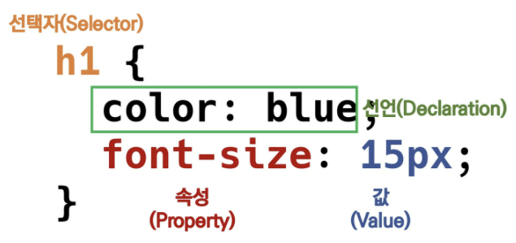

* CSS 구문은 선택자(selector)를 통해 스타일을 지정할 HTML 요소(태그)를 선택
* 중괄호 안에 속성과 값, 하나의 쌍으로 이루어진 선언을 작성
* 각 쌍은 선택한 요소의 속성, 속성에 부여할 값을 의미
  * **속성(property)**: 어떤 스타일 기능인가?
  * **값(value)**: 그 스타일을 어떻게 변경할 것인가?


### CSS 정의 방법

1. 인라인

```html
<!-- html의 각 요소(태그) 안에 style 속성을 사용하는 방법 -->
<h1 style='color: blue; font-size: 100px;'>
   Hello World!!! 
</h1>
```

2. 내부 참조(embedding) - `<style>`

```html
<!DOCTYPE html>
<html lang="en">
<head>
  <meta charset="UTF-8">
  <meta http-equiv="X-UA-Compatible" content="IE=edge">
  <meta name="viewport" content="width=device-width, initial-scale=1.0">
  <title>Document</title>
  <!-- head 태그 안에 style을 작성하는 방법 -->  
  <style>
    h1 {
      color: blue;
      font-size: 100px;
    }
  </style>
</head>

<body>
  <h1>Hello World!!</h1>
  
</body>
</html>
```

3. 외부 참조(link file) - 분리된 CSS 파일

`<link>` 태그를 이용해서 `href=파일명.css`와 참조시킨다.

```html
<!DOCTYPE html>
<html lang="en">
<head>
  <meta charset="UTF-8">
  <meta http-equiv="X-UA-Compatible" content="IE=edge">
  <meta name="viewport" content="width=device-width, initial-scale=1.0">
  <title>Document</title>
  <link rel="stylesheet" href="03_CSS.css">
</head>

<body>
  <h1>Hello World!!</h1>
</body>
</html>
```

```css
h1 {
  color: palevioletred;
  font-size: 100px;
}
```

> 외부 참조를 하는 것이 재사용성이 훨씬 높고, 한번의 css파일 수정으로 여러 html에 변경사항을 입힐 수 있다.


### CSS with 개발자 도구

* styles: 해당 요소에 선언된 모든 CSS
* computed: 해당 요소에 최종 계산된 CSS

| styles                                                       | computed                                                     |
| ------------------------------------------------------------ | ------------------------------------------------------------ |
| 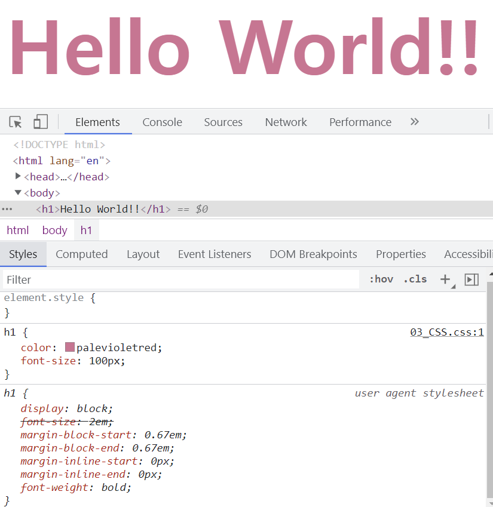 | 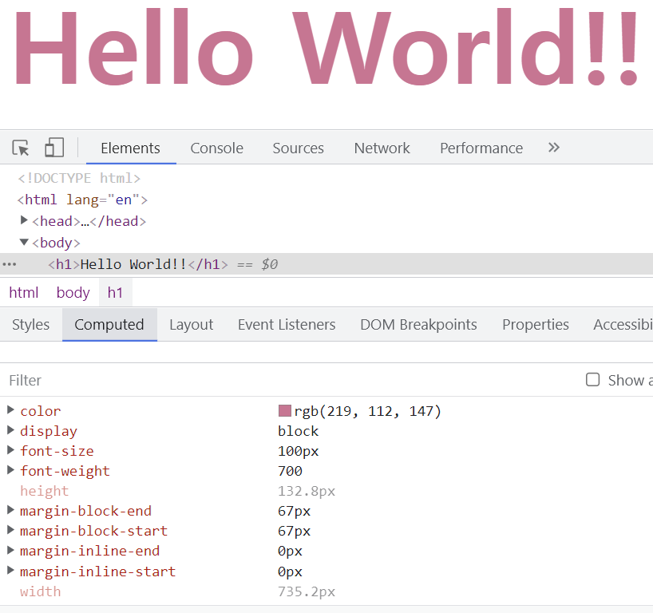 |
| 선언된 css 중에 영향을 미치지 못하는 것은 취소줄이 그어져서 나온다. | 최종적으로 적용된 css가 무엇인지를 보여준다!!!               |


## CSS 선택자(selector)

### 선택자(selector) 유형

* 기본 선택자
  * 전체 선택자, 요소 선택자
  * 클래스 선택자, 아이디 선택자, 속성 선택자
* 결합자(combinators)
  * 자손 결합자, 자식 결합자
  * 일반 형제 결합자, 인접 형제 결합자 (*이건 거의 안다뤘다*)
* 의사 클래스/요소(pseudo class)
  * 링크, 동적 의사 클래스
  * 구조적 의사 클래스, 기타 의사 클래스, 의사 엘리먼트, 속성 선택자


#### 선택자 with 개발자 도구

내가 수정하고 싶은 부분이 있다면 개발자 도구로 선택하면 해당 부분의 코드에 하이라이트가 된다. 거기서 우클릭해서 copy -> copy selector를 하면 선택자가 복사된다!!! 

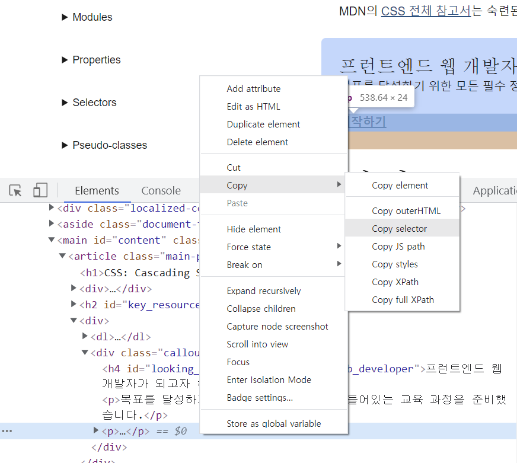

> #sect2 > p:nth-child(3)
>
> 출처: https://developer.mozilla.org/ko/docs/Web/CSS


#### 선택자 정리

* 요소 선택자
  * HTML 파일에 있는 요소(태그)를 직접 지정해서 스타일 주는 거
* 클래스(class) 선택자
  * 마침표(`.`)로 시작하며, 해당 클래스가 적용된 항목을 선택
* 아이디(id) 선택자
  * `#` 문자로 시작하며, 해당 아이디가 적용된 항목을 선택
  * 일반적으로 하나의 문서에 1번만 사용. 여러 번 사용해도 동작하지만, 단일 id를 사용하는 것을 권장
  * *하지만 우리는!!!!! 스타일 줄 때 아이디 안쓸거다. 이건 주로 나중에 `js`를 하면 사용하게 된다.*


#### CSS 적용 우선순위 (cascading order)

1. 중요도(Importance) - 사용시 주의
   * `!important`
2. 우선 순위(Specificity)
   * 인라인 > id > class, 속성, pseudo-class > 요소, pseudo-element
   * 셀렉터를 지정할 때 점수가 있어서 그 숫자의 크기에 따라 부여되는 우선순위가 다르다고 보면 된다.
   * 점수 같은 셀렉터에서는 마지막에 작성된 것이 적용된다!!!
3. CSS 파일 로딩 순서


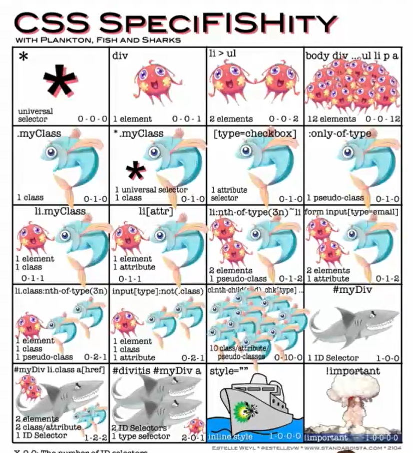


* **예시**

```html
<h1 class="green">CSS</h1>
<h2>선택자 연습</h2>
  
<div class="green box">
  box contents
  <div>
    <p>지역 목록</p> <!-- 이것은 div의 직계 하위 요소가 아니므로 blue가 되지 않는다. -->
      <ul>
        <li id="purple">서울</li>
        <li>인천</li>
        <li>경기</li>
        <li>부산</li>
      </ul>
  </div>
  <p>Lorem ipsum dolor sit amet consectetur adipisicing elit. Nisi, neque illum? Inventore at doloremque culpa odio sequi? Aliquid ducimus est alias, facilis modi doloribus impedit provident exercitationem, unde quia voluptatibus!</p>
</div>

<h3>HELLO</h3>
<h4>CSS</h4>
```

```css
/* 전체 선택자 */
* {
  color: gray;
}

/* 요소 선택자 */
h2 {
  color: orange;
}

h3, h4 {
  font-size: 30px;
}

/* 클래스 선택자 */
.green {
  color: green;
}

/* 아이디 선택자 */
#purple {
  color: purple;
}

/* 자식 결합자 */
.box > p {
  color: blue;
}
```

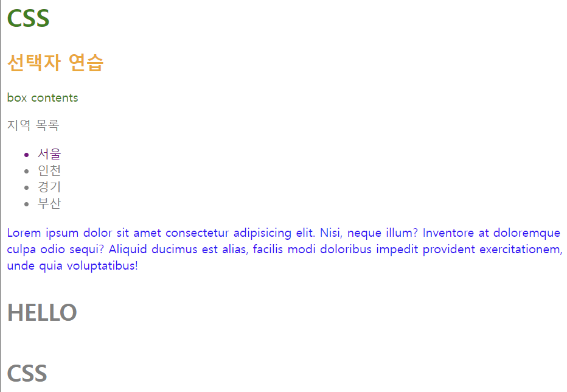


### CSS 상속

상속을 통해 부모 요소의 속성을 자식에게 상속한다.

* 속성(property) 중에는 상속되는 것과 되지 않는 것이 있다.
* 상속되는 것
  * Text 관련 요소(font, color, text-align), opacity, visibility 등
* 상속되지 않는 것
  * **Box model 관련 요소**(width, height, margin, padding, border, box-sizing, display), **position 관련 요소**(position, top/right/bottom/left, z-index 등)


## 결합자(Combinators)

1. 자손 결합자
   * selectorA **하위의 모든** selectorB 요소
2. 자식 결합자
   * selectorA **직계 하위** selectorB 요소
3. 일반 형제 결합자
   * selectorA의 형제 요소 중 **뒤에 위치하는 모든** selectorB 요소
4. 인접 형제 결합자
   * selectorA의 형제 요소 중 **바로 뒤**에 위치하는 selectorB 요소

| 자손                                                         | 자식                                                         | 일반 형제                                                    | 인접 형제                                                    |
| ------------------------------------------------------------ | ------------------------------------------------------------ | ------------------------------------------------------------ | ------------------------------------------------------------ |
| 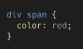 | 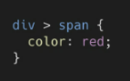 | 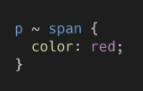 | 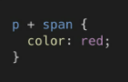 |


* **pseudo-selector**

```html
<style>
    /* #ssafy의 직계 자식 중 p */
    /* pseudo-selector임. p가 2번째 자식일 때(조건을 만족하지 않으면 적용이 안된다), (지금은 h2가 1번째 자식) */
    #ssafy>p:nth-child(2) {
        color: red;
    }
    /* p 중에 2번째 자식일때, */
    #ssafy>p:nth-of-type(2) {
        color: blue;
    }
</style>

<div id="ssafy">
    <h2>어떻게 선택 될까?</h2>
    <p>첫번째 단락</p>
    <p>두번째 단락</p>
    <p>세번째 단락</p>
    <p>네번째 단락</p>
</div>
```

> 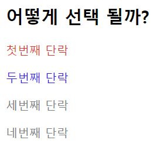


## CSS 기본 스타일

### 크기 단위

1. `px`(픽셀)
   * 모니터 해상도의 한 화소인 '픽셀' 기준
   * 픽셀의 크기는 변하지 않이 때문에 **고정 단위**
2. `%`
   * **백분율 단위**
   * 가변적인 레이아웃에서 자주 사용
     * `fluid`를 사용하면 항상 부모 width의 100%를 갖는다.
3. `em` 
   * (바로 위, 부모 요소에 대한) 상속의 영향을 받음
   * 배수 단위, 요소에 지정된 사이즈에 **상대적인 사이즈**를 가짐
4. `rem`
   * (바로 위, 부모 요소에 대한) 상속의 영향을 받지 않음
   * **최상위 요소(html)의 사이즈**를 기준으로 **배수 단위**를 가짐
5. `viewport`
   * 웹 페이지를 방문한 유저에게 바로 보이게 되는 웹 컨텐츠의 영역(디바이스 화면)
   
   * 디바이스의 viewport를 기준으로 **상대적인 사이즈**가 결정
   
   * `vw`, `vh`, `vmin`, `vmax`
   
     * 50vw라고 한다면 viewport에 보이는 화면의 상대적 너비가 되는 것이다.
   
     * > `vw`, `vh`는 높이값의 1/100인 단위이다. 
       > 예를 들어, 브라우저 높이가 900px일 때, 1vh는 9px이 된다.
       >
       > 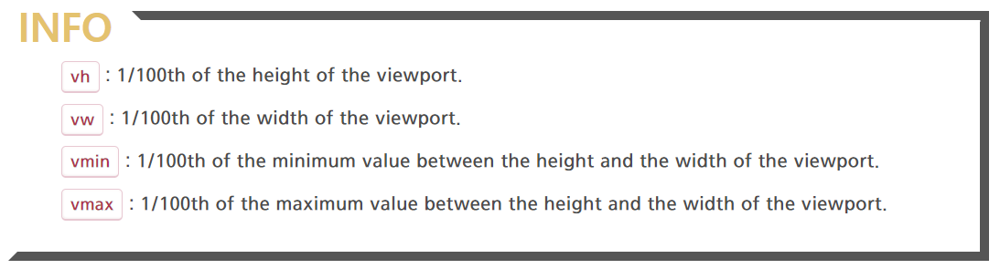


#### `em` vs `rem`

```html
  <ul class="em">
    <li class="em">1.5em</li>
    <li class="rem">1.5rem</li>
    <li>no class</li>
  </ul>
```

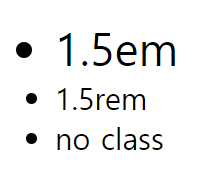

* `rem`

root(최상위인 html)를 기준으로 하는데, 일반적으로 root는 16px이다. 

1.5rem == 16px * 1.5 == 24px


* `em`

바로 위 부모 요소에 의해서 지정이 된다. 

`<ul class="em">` 에서 이미 부모인 root(html)의 크기의 1.5배를 받아왔다. => 24px

그리고 `<li class="em">`에서 위의 크기를 상속받아서, 24px * 1.5 = 36px이 된다!!!!!!!


### 색상 단위

* 색상 키워드
  * 대소문자 구분 없다
  * red, blue, black과 같은 특정 색을 직접 글자로 나타낸다.
* RGB 색상
  * 16진수 표기법 혹은 함수형 표기법을 사용해 특정색을 표현한다.
* HSL 색상
  * 색상, 채도, 명도를 통해 특정 색을 표현하는 방식

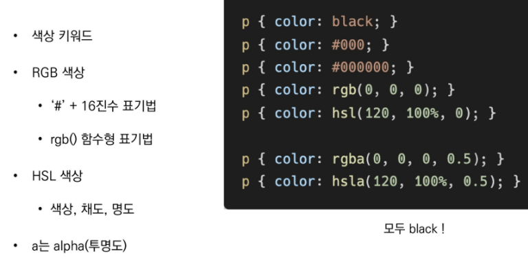


## Box model

모든 HTML 요소는 박스모델이고, 위에서부터 아래로, 왼쪽에서 오른쪽으로 쌓인다. (**Normal flow**)


하나의 박스는 네 영역으로 이루어진다.

1. content
1. padding
1. border
1. margin


### margin

shotrhand를 통해서 표현 가능하고, 시계방향으로 값이 부여된다. **상 - 우 - 하 - 좌**

반약 4개의 값을 주지 않고 두개씩 묶어서 준다면 **상하 - 좌우** 순이 된다.

```css
/* 상 우 하 좌 */
.margin-1 {
    margin: 10px, 20px, 30px, 40px;
}

/* 상하 좌우 */
.margin-2 {
    margin: 10px, 20px;
}

/* 상 우(좌) 하 */
/* 이 경우 좌는 우랑 같이 20px */
.margin-3 {
    margin: 10px, 20px, 30px;
}

```


### border

border는 width, style, color 등의 property가 있다.

shorthand가 존재해서 한번에 작성해도 괜찮다.

```css
.border {
    border-with: 2px;
    border-style: dashed;
    border-color: black;
}

/* 위와 같은 shorthand */
.border {
    border: 2px dashed black;
}
```


### box-sizing

* 기본적으로 모든 요소의 `box-sizing`은 `content-box`
  * padding을 제외한 순수 content 영역만을 box로 지정한다.
* 다만, 우리가 일반적으로 영역을 볼 때는 border까지의 너비를 100px를 보는 것을 원함.
  * 그 경우 `box-sizing`을 `border-box`로 설정

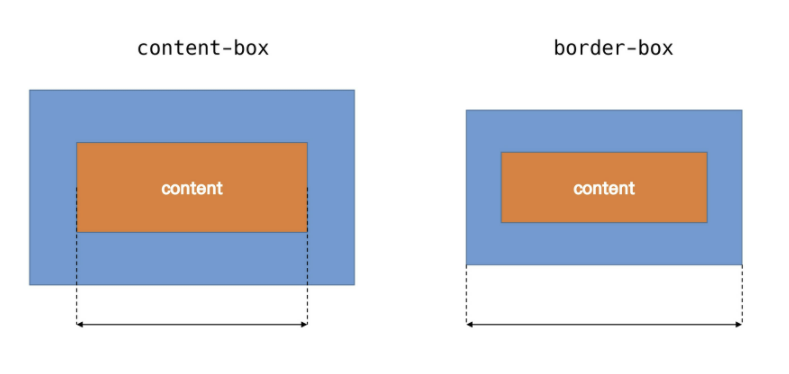

> box는 단순히 `width: 100px;`를 지정한다고 해서 100px을 가진 box가 만들어지지는 않는다. padding, border까지 box의 크기에 포함이 되기 때문이다!!!!!! 그래서 내가 총 100px을 가진 box를 가지고 싶다면 이를 모두 합한 너비로 계산해야 한다.


```css
/* 기본 content-box 기준*/
.box {
  background-color: paleturquoise;
  width: 100px;
  height: 50px;
  border: 3px dashed black;
}

/* 기본 border-box 기준*/
.borderbox {
  width: 100px;
  height: 50px;
  background-color: greenyellow;
  box-sizing: border-box;
  border: 3px solid black;
}
```

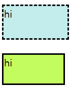


## CSS `Display`

모든 요소는 네모(박스모델)이고, 좌측상단에 배치.

**display에 따라 크기와 배치가 달라진다!!!!!**


1. `display: block`
   * 줄 바꿈이 일어나는 요소
   * 화면 크기 전체의 가로 폭을 차지한다.
   * 블록 레벨 요소 안에 인라인 레벨 요소가 들어갈 수 있다.
2. `display: inline`
   * 줄 바꿈이 일어나지 않는 행의 일부 요소
   * content의 너비만큼 가로 폭을 차지한다.
   * `width, height, margin-top, margin-bottom`을 지정할 수 없다.
   * 상하 여백은 `line-height`로 지정한다.
3. `display: inline-block`
   * block과 inline 레벨 요소의 특징을 모두 가진다.
   * inline처럼 한 줄에 표시 가능하고, block처럼 width, height, margin 속성을 모두 지정할 수 있다.
   * `vertical-align: middle` 글씨가 한 줄 내의 중앙에 위치하게 된다.
4. `display: none`
   * 해당 요소를 화면에 표시하지 않고, **공간조차 부여되지 않는다.**
   * 이와 비슷한 `visibility: hidden;`은 해당 요소가 **공간은 차지하나** 화면에 표시만 하지 않는 것이다.


### 블록 레벨 요소와 인라인 레벨 요소

* 대표적인 블록 레벨 요소
  * `div`
  * `ul` `ol` `li`
  * `p` , `h`
  * `hr`
  * `form`
* 대표적인 인라인 레벨 요소
  * `span`
  * `a`
  * `img`
  * `input`, `label`
  * `b`, `em`, `i` ,`strong`


#### block

block의 기본 너비는 가질 수 있는 너비의 100%

너비를 가질 수 없다면 자동으로 margin이 부여된다.


#### inline

inline의 기본 너비는 컨텐츠 영역만큼


#### 속성에 따른 수평 정렬

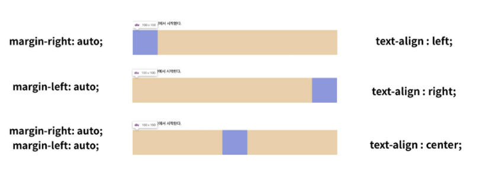


## CSS `position`

문서 상에서 요소의 위치를 지정

* `static`: 모든 태그의 기본 값(기준 위치)
  * 일반적인 요소의 배치 순서에 따른다. (Normal flow: 좌측 상단)
  * 부모 요소 내에서 배치될 때에는 부모 요소의 위치를 기준으로 배치된다.
* 아래 값들은  좌표 property를 사용하여 이동 가능하다. 
  * `relative`
  * `absolute`
  * `fixed`


1. `relative`: 상대 위치

   * 자시 자신의 `static` 위치를 기준으로 이동한다.
   * **normal flow 유지**
   * 레이아웃에서 요소가 차지하는 공간은 static일 때와 같다. (normal position 대비 offset)

2. `absolute`: 절대 위치

   * 요소를 일반적인 문서 흐름에서 제거 후 <u>레이아웃에 공간을 차지하지 않는다</u>. 
   * **normal flow 벗어난다.**
   * static이 아닌 **가장 가까이 있는 부모/조상 요소를 기준**으로 이동한다. (없는 경우 `body`가 된다.)

   > 그래서 relative(부모) -> absolute(자신)으로 지정하면 부모 요소 내에서 이동을 할 수 있게 된다. 그리고 자신이 normal flow를 벗어나기 때문에 자신의 뒤에 있던 요소가 normal flow를 따르면서 좌측 상단으로 올라가게 된다.

3. `fixed`: 고정 위치

   * 요소를 일반적인 문서 흐름에서 제거 후 <u>레이아웃에 공간을 차지하지 않는다</u>.
   * **normal flow 벗어난다.**
   * 부모 요소와 관계없이 **viewport를 기준으로 이동한다.**
     * 스크롤 시에도 항상 같은 곳에 위치한다.

> 위치를 지정하는 것은, 요소의 좌측 상단 점을 기준으로 offset을 주어서 이동시킬 수 있다.


## CSS 원칙

* CSS 원칙 1, 2: Normal flow
  * 모든 요소는 네모(박스모델), 좌측 상단에 배치한다
  * display에 따라 크기와 배치가 달라진다.
* CSS 원칙 3: 
  * position으로 위치의 기준을 변경한다.
    * relative: 본인의 원래 위치
    * absolute: 특정 부모의 위치
    * fixed: 화면으 위치