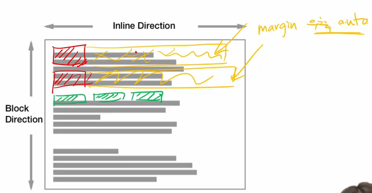
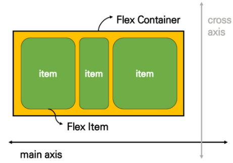
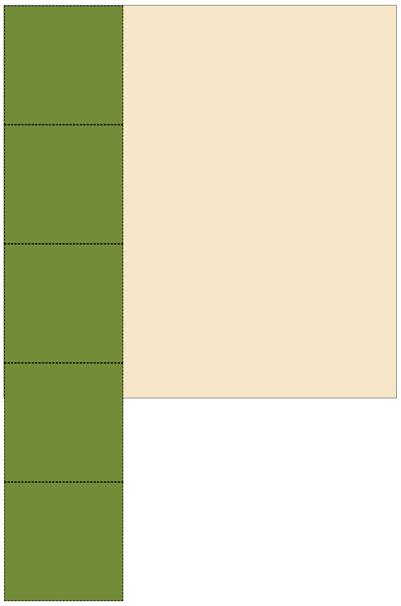
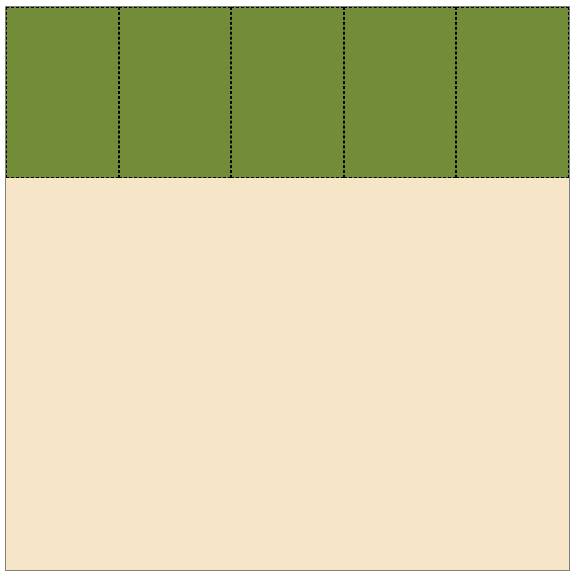
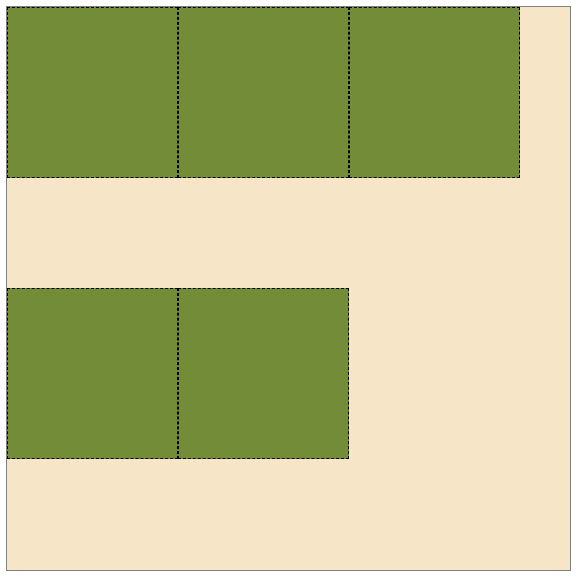
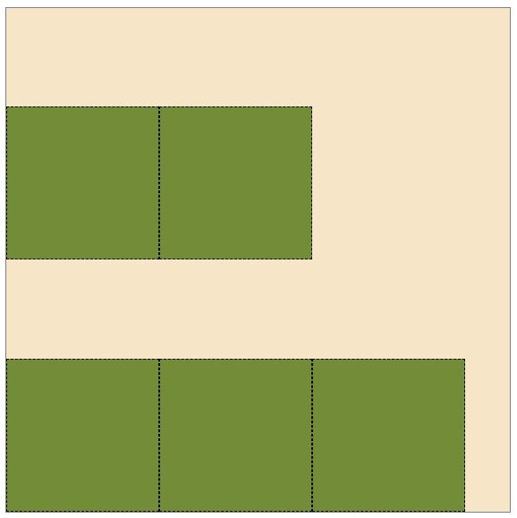
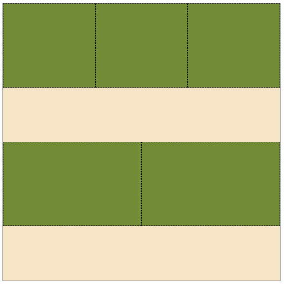
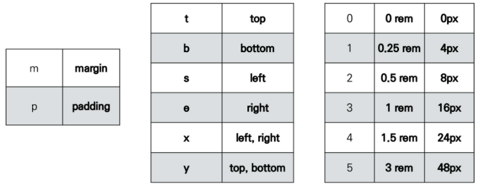
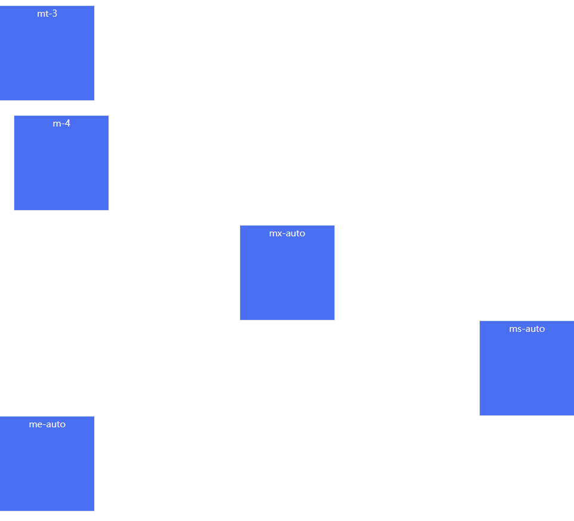
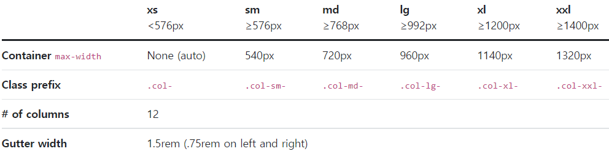

# 03_반응형 웹

>  flexbox가 큰 변화를 일으켜서 이를 핵심으로 잡고 수업 진행


## Float

*평가에는 나오지 않고 요즘에 잘 쓰이지도 않는다.*

### CSS 원칙

블럭 요소의 오른쪽에 마진을 자동으로 부여하고 있다. 그래서 아래의 요소가 나오면 블럭킹이 자동으로 되어있다. 인라인은 옆으로 쌓인다.



인라인에는 너비나 높이를 직접 지정할수는 없었다! (만약 할려면 display = block)으로 변경을 했어야 한다.


### Float란? 

> 어떤 요소를 감싸는 형태로 배치하는 방법은?
>
> 혹은 좌/우측에 배치는?

박스를 왼쪽 혹은 오른쪽으로 이동시켜 텍스트를 포함 인라인 요소들이 주변을 wrapping하도록 배치. 요소가 Normal flow를 벗어나도록 함 

(positioning-absolute(static이 아닌 부모 기준), fixed(브라우저, viewport를 벗어난)가 이를 벗어나서 원하는 곳에 넣고 싶을 때)


### Float 속성

`none`: 기본값

`left`: 요소를 왼쪽으로 띄움

`right`: 요소를 오른쪽으로 띄움


### Clearing Float

Float는 Normal Flow에서 벗어나 부동 상태가 된다. (떠 있음)

따라서, 이후 요소에 대하여 float 속성이 적용되지 않도록 clearing하는 것이 필수적이다.

* `::after`: 선택한 요소의 맨 마지막 자식으로 가상 요소를 하나 생성
  * 보통 content 속성과 함께 짝지어, 요소에 장식용 콘텐츠를 추가할 때 사용
* clear 속성 부여

```html
<header class="clearfix">
    <div class="box1 left">
      	float left
    </div>
</header>

<div class="box2">
    div
</div>
```

> 만약 clearfix가 지정되지 않았다면 `header`는 자식 요소가 떠있는 상태가 되어서 높이가 0이 된다. 이런 것을 막기 위해 clear fix를 추가한다.

```css
.left {
    float: left;
}

.box1 {
    width: 15rem;
    height: 15rem;
    background-color: red;
    border: 1px solid black;
}

.box2 {
    width: 30rem;
    height: 15rem;
    background-color: blue;
    border: 1px solid black;
}

.clearfix::after {
    content: "";
    display: block;
    clear: both;
}
```

> 1. 부모요소의 높이가 0 -> 자식이 float된다. **부모를 clearing하는 것이다**
> 2. box2의 공간을 채운다. 

**이렇게 부모 요소에 clearing을 해야 이후 요소부터 Normal flow를 가지도록 지정할 수 있다!!!!**


## Flexbox

행과 열 형태로 아이템들을 배치하는 1차원 레이아웃 모델 (2차원이 아니다.  메인축을 기준으로 정렬된다.)



* 축
  * main axis(메인 축)
  * cross axis(교차 축)
* 구성 요소
  * Flex containter(부모 요소)
    * flex box 레이아웃을 형성하는 가장 기본적인 모델
    * Flex item들이 놓여있는 영역
    * display 속성을 flex 혹은 inlin-flex로 지정한다.
  * Flex item(자식 요소)
    * 컨테이너에 속해 있는 콘텐츠들(박스)


**item에 주는 것이 아니라 상위에 있는 container 그니까 책상 역할에 flex를 주는 것이다! 그래야 책상 위에 있는 요소들을 배치할 수 있다.**

```CSS
.flex-container {
    display: flex;
}
```


> 그렇다면 이걸 왜 쓰는 것일까?
>
> 이제까지 Normal flow를 벗어난 배치를 하려면 `float` 혹은 `position`을 조정해야 했다. 그러나 이런 수동적인 값 부여없이 1) 수직 정렬, 2) 아이템의 너비와 높이 혹은 간격을 동일하게 배치 하는 것이 어려웠다. 
>
> 그래서 이런 것을 편히 할 수 있는 `flexbox`가 생긴 것이다!!


### Flexbox 속성

* 배치 설정
  * `flex-direction`
  * `flex-warp`
* 공간 나누기
  * `justify-content` (main axis 기준)
  * `align-content` (cross axis 기준)
* 정렬
  * `align-items` (모든 아이템을 cross axis 기준으로)
  * `align-self` (개별 아이템)


#### `flex-direction`

Main axis의 방향을 설정한다. 

1. `row` : 횡으로 메인축 결정. 좌 -> 우
2. `row-reverse`: 횡으로 메인축 결정. 좌 <- 우 
3. `column`: 종으로 메인축 결정. 위 -> 아래
4. `column-reverse`: 종으로 메인축 결정 위 <- 아래


#### `flex-wrap`

아이템이 컨테이너를 벗어나는 경우 해당 영역 내에 배치되도록 설정. 즉, 기본적으로 컨테이너 영역을 벗어나지 않도록 한다.

요소들이 강제로 한 줄에 배치되게 할 것인지 여부 설정

1. `nowrap`: (기본값) 한 줄에 배치
2. `wrap`: 넘치면 다음 줄에 배치
3. `wrap-reverse`: cross축 순서 역으로, 넘치면 다음 줄에 배치

| flex 적용 전                                                 | flex 적용 후 (default: nowrap)                               |
| ------------------------------------------------------------ | ------------------------------------------------------------ |
|  |  |
| **flex적용 후 (wrap)**                                       | **flex적용 후 (wrap-reverse)**                               |
|  |  |


#### `flex-flow`

`flex-direciton`과 `flex-wrap`의 shorthand로, 이에 대한 설정값을 차례로 작성하면 된다.

ex) `flex-flow: row wrap;`


#### `justify-content`

Main axis를 기준으로 공간 배분

1. `flex-start`: (기본값) start 쪽에 배치
2. `flex-end`: end 쪽에 배치
3. `center`: 중앙에 배치
4. `space-between`: item 사이의 간격이 동일하게 배치
5. `space-around`: item을 둘러싼 간격이 일정하게 배치 (가질 수 있는 영역을 반으로 나눠서 양쪽에)
   1<>1 / 1<>1 / 1<>1
6. `space-evenly`: 전체 영역에서 아이템 간 간격을 균일하게 분배


#### `align-content`

(*평가에는 안 나올 예정*)

Cross axis를 기준으로 공간 배분 (아이템이 한 줄로 배치되는 경우 확인할 수 없음)

`stretch`가 기본값


#### `align-items`

모든 아이템을 Cross axis를 기준으로 정렬

1. `stretch`: (기본값) 컨테이너를 가득 채운다
2. `flex-strat`: 위
3. `flex-end`: 아래
4. `center`: 가운데
5. `baseline`: 텍스트 baseline에 기준선을 맞춘다.


#### `align-self`

개별 아이템을 cross axis 기준으로 정렬

* 이 속성은 컨테이너에 적용하는 것이 아니라 **개별 item에 적용**한다!!


### Flex 기타 속성

#### `flex-grow`

아이템을 배치하고 남은 영역을 아이템에 분배하는 속성

분배가 되면 아이템의 영역이 더 커진다.

| flex-grow: 1;                                                |
| ------------------------------------------------------------ |
|  |


#### `order`

배치 순서 -> 기본값은 `0` 숫자의 크기에 따라 재정렬된다.


## Bootstrap

margin-top이 없어지고 margin-bottom이 작아진다. 그리고 inline 요소들의 형태도 살짝 다르다.

* CDN (Content Delivery/Distribution Network): 콘텐츠(CSS, JS, Image, Text 등)을 효율적으로 전달하기 위해 여러 노드에 가진 네트워크에 데이터를 제공하는 시스템.
  * 개별 end-user의 가까운 서버를 통해 빠르게 전달 가능(지리적 이점)
  * 외부 서버를 활용함으로써 본인 서버의 부하가 적어진다.


### Spacing

margin을 부여해서 간격을 조정한다.



`.mx-auto`: 수평 중앙 정렬

```html
<div class="mt-3 box border bg-primary text-light text-center">mt-3</div>
<div class="m-4 box border bg-primary text-light text-center">m-4</div>
<div class="mx-auto box border bg-primary text-light text-center">mx-auto</div>
<div class="ms-auto box border bg-primary text-light text-center">ms-auto</div>
<div class="me-auto box border bg-primary text-light text-center">me-auto</div>
```




### Text


### Display


### Position


### Responsive Web

다양한 화면 크기를 가진 디바이스들이 등장함에 따라 이 개념이 등장

반응형 웹은 별도의 기술 이름이 아닌 웹 디자인에 대한 접근 방식, 반응형 레이아웃 작성에 도움이 되는 사례들의 모음 들을 기술하는데 사용되는 용어

예시: Media Queries, Flexbox, Bootstrap Grid System, The viewport meta tag


### Bootstrap grid system

요소들의 디자인과 배치에 도움을 주는 시스템

* 기본 요소
  * column: 실체 콘텐츠를 포함하는 부분
  * gutter: 칼럼과 칼럼 사이의 공간(사이 간격)
  * container: column들을 담고 있는 공간


flexbox로 제작되었다.

container -> row -> column으로 콘텐츠를 배치하고 정렬한다.

**12개의 column, 6개의 breakpoints**



