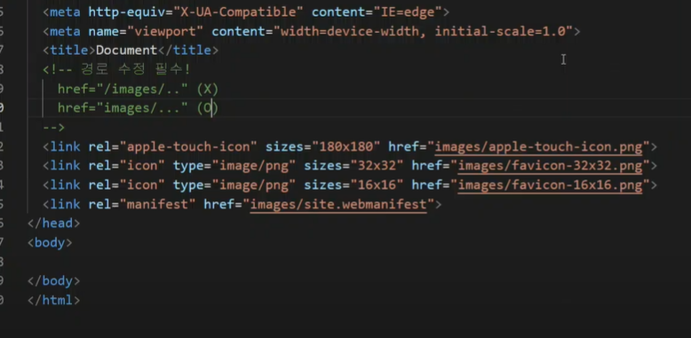
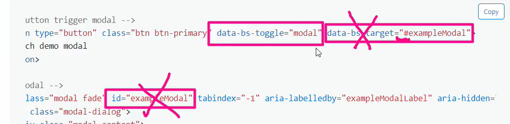

# 0211

## 반응형 웹, media query

`@media`를 활용해서 css를 직접 다르게 구성할 수 있는 방법 중 하나


### 파비콘 

링크 태그를 헤드 안에!!!

favicon.io





### 아이콘

cdn으로 복사해서 첫 줄에 있는 것을 그대로 copy link tag해서 밑에 붙여 넣는다. 그리고 사이트에서 내가 넣고 싶은 아이콘을 찾아서 그대로 넣으면 된다!

fontawesome.com

내 맘대로 스타일도 바꿀 수 있으니 매우 좋당!

```html
.fa-python:hover {
color: green
}
```

> 아이콘 위에 마우스를 대면 그린 색상이 된다!!!


## Modal

버튼을 눌렀을 때 팝업이 뜨고, 보통은 다른 것을 못하게 한다. (팝업 제외하고)

모달에서는 data-bs-target이  #~~ 즉 아이디가 일치해야 한다!!!



이 핑크 네모 다 필요한 것이다!!!!!!!!


## 천기누설..ㅎㅎㅎㅎㅎ


# Web

## HTML (Hyper Text Markup Language)

* HTML 문서의 기본 구조

* DOM 구조

* 시맨틱 태그: 스트롱 이엠 등등

* 주요 태그와 속성

  * table, form, input X 안나옵니다!!!!

    

## CSS

* 단위 (크기, 속성) 이게 중요!!!!

* 선택자 및 우선순위 (selector specificity)

* 박스모델: 컨텐트 영역 padding bolder margin 그리고 마진을 선언하는 short-hand

* 인라인, 블록 요소 특징!!!!!!

* Position

  * static
  * relative 까지는 노멀 플로우
  * absolute
  * fixed는 아웃 오브 플로우
  * sticky

* Float 안나옴

* Flex 다 알자!

  * align-content는 빼고
  * 축과 컨테이너 아이템 개념을 포함한 각 속성을

  

## 반응형 웹

* 붙스트랩
  * 그리드
  * 브레이크포인트


### 코치님의 조언

> 담주 과목평가: 라이브는 당연히 나오고, 코치님이 말한 것까지 나옴. 선택자 관련해서 나오는 것부터 시작. 정보에 대한 정보만 있고, 내용은 body에 있다. inline요소 strong b / i em 의미론적으로 이해를 하자. strong은 강조!->브라우저가 볼드를 한 것. b는 볼드이다. 스타일이다. 그래서 거의 하지 말자했고, b랑 i는 정말 안씀. 
> form
> css 자식, 자손, / id선택자는 스타일링은 안한다!!!!!! 같은 우선순위에서는 마지막에 적힌 것이 먹는다. margin height 등등을 박스에 준다. 
> inline-block도 있고.
> position relative absolute fixed있다. 기본값은 static. 포이마에서 bootstrap은 보지말자. 너무 옛날것임. 
> align-items에서 baseline -> 텍스트를 기준으로 정렬하는 것!!! 
> align-conten 기본값은 stretch
>
> bootstrap ws랑 hw에 나온 내용도 다 공부할것!


## 내가 개발을 할때

### 마크업

* 각 태그별 속성
  * 인라인, 블록
  * `li` -> list-decoration


### 스타일링

#### 레이아웃

> 디스플레이를 가지고 있ㄴ느지 분석, 박스모델을 알아보고 개발자 도구 보면서 조정

* position
  * 네모 위 네모 => 앱솔루트
  * 브라우저 기준 => 픽스드 혹은 스티키
* flex
* bootstrap grid system

#### 스타일

* 색상
* 사이즈
* 각 태그별 속성


### 웹개발

