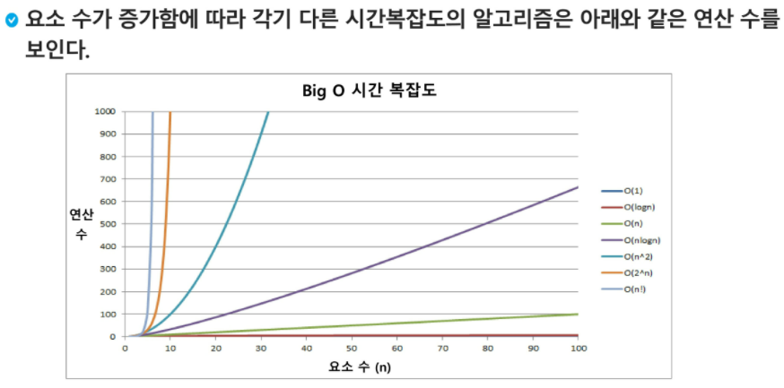

# 01_List 1

## 알고리즘

유한한 단계를 통해 문제를 해결하기 위한 절차나 방법. 주로 컴퓨터 용어로 사용되며, 컴퓨터가 어떤 일을 수행하기 위한 단계적 방법을 말한다.

즉, 어떠한 문제를 해결하기 위한 절차


### 알고리즘 표현 방법

1. 의사코드(pseudo-code): 완벽한 코드는 아니지만, 사용할 코드를 대략적으로 작성해보는 것

2. 순서도


### 알고리즘의 성능은 무엇으로 측정하는가?

APS 과정의 목표 중 하나는 보다 좋은 알고리즘을 이해하고 활용하는 것

#### 좋은 알고리즘이란?

1. 정확성: 얼마나 정확하게 동작하는가
2. 작업량: 얼마나 적은 연산으로 원하는 결과를 얻어내는가
3. 메모리 사용량: 얼마나 적은 메모리를 사용하는가
4. 단순성: 얼마나 단순한가
5. 최적성: 더 이상 개선할 여지없이 최적화되었는가


많은 문제에서 넝능 분석의 기준으로 알고리즘의 작업량을 비교한다.

> 1~100을 하나씩 더하는 방법
>
> n(n+1)/2를 사용하는 방법
>
> 후자가 연산이 더 적으므로 효율이 더 좋다!!


#### 시간 복잡도(Time complexity)

실제 걸리는 시간을 측정

실행되는 명령문의 개수(연산의 횟수)를 측정

>  1~100을 하나씩 더하는 방법 (2n + 1)
>
> n(n+1)/2를 사용하는 방법 (3번의 연산)

입력의 크기가 n이라고 한다면 n이 달라지면 크기도 달라지게 된다.


#### 빅-오(O) 표기법

시간 복잡도 함수 중에서 가장 큰 영향력을 주는 n에 대한 항만으로 표시한다.

계수는 생략하여 표시한다.


n개의 데이터를 입력 받아 저장한 후 데이터에 1씩 증가시킨 후 각 데이터를 화면에 출력하는 알고리즘의 시간 복잡도는? == O(n)




## 배열

### 배열이란 무엇인가?

일정한 자료형의 변수들을 하나의 이름으로 열거해 사용하는 자료구조


### 배열의 필요성

프로그램 내에서 여러 개의 변수가 필요할 때, 일일이 다른 변수명을 이용해 자료에 접근하는 것은 매우 비효율적일 수 있다.

배열을 사용하면 하나의 선언을 통해서 둘 이상의 변수를 선언할 수 있다.

단순히 다수의 변수 선언을 의미하는 것이 아니라, 다수의 변수로는 하기 힘든 작업을 배열을 활용해 쉽게 할 수 있다.


### 1차원 배열

* 선언
  * 별도의 선언 방법이 없으면 변수에 처음 값을 할당할 때 생성
  * 이름: 프로그램에서 사용할 배열의 이름
  * 크기를 정해놓은 배열을 사용하는 것이 더 빠를때가 있다.
* 접근
  * Arr[0] =10
  * Arr[idx] = new_number


### SWEA: Gravity

숫자들 사이의 관계를 찾아내는 것이다. 낙차가 발생하려면, 내 오른쪽에 있는 숫자가 나보다 작으면 되는 것이다. 즉, 내 오른쪽에 나보다 작은 숫자가 몇개가 있는지를 센다. 그래서 그들 중에서 가장 큰 값을 찾으면 된다.


## 정렬

2개 이상의 자료를 특정 기준에 의해 작은 값부터 큰 값(오름차순) 혹은 그 반대의 순서(내림차순)으로 재배열하는 것

* 키 == 자료를 정렬하는 기준이 되는 특정 값


* 종류
  1. 버블 정렬
  2. 카운팅 정렬
  3. 선택 정렬
  4. 퀵 정렬
  5. 삽입 정렬
  6. 병합 정렬


## 버블 정렬(Bubble sort)

인접한 두 개의 원소를 비교하며 자리를 계속 교환하는 방식


* 정렬 과정
  * 첫 번재 원소부터 인접한 원소끼리 계속 자리를 교환하면서 맨 마지막 자리까지 이동한다.
  * 한 단계가 끝나면 가장 큰 원소가 마지막 자리로 정렬된다.
  * 교환하며 자리를 이동하는 모습이 물 위에 올라오는 거품 모양과 같다고 하여 버블 정렬이라고 한다.


* 시간 복잡도
  * O(n^2)

> n^2 n^3 이 정도는 효율적이지는 않은 코드이다..


### 예시

[55, 7, 78, 12, 42]를 버블 정렬로 정렬해보기

1. 첫번째 단계: 가장 큰 수를 맨 뒤로 보낸다!!!! (`max`쓰지 말자)
   * 두 자리씩 비교해서 큰 아이들을 오른쪽으로 보낸다.
   *  
     두개씩 비교를 할 때, 기준으로 삼을 아이가 필요하다. 이 경우 두 자리 중 왼쪽을 기준으로 하기 때문에 (0-N-1)까지 비교하면 되겠다.
2. 두번째 구간: 가장 큰 애가 이미 맨 뒤에 있다. 그러면 두번째 구간은 비교할 길이가 하나 씩 줄어든다!!! 즉 구간의 끝이 변경된다. 
   구간 결정: `for i in range(N-1, 1, -1):` 구간의 끝이 **[N-1]에서 시작해서 [1]두번째 자리)까지** 와야한다.


* 예시 코드

```python
for i in range(N-1, 0, -1):         # 구간의 끝: 구간의 끝이 변경된다.
    for j in range(0, i):           # 기준: 구간의 끝보다 하나 앞자리 요소까지가 기준이 된다.
        if arr[j] > arr[j+1]:
            arr[j], arr[j+1] = arr[j+1], arr[j]
```

리스트를 풀어서 출력을 한다면 Unpacking `*`을 사용하자!!

arr = [1, 2, 3]일 때, print(*arr) 하면 1 2 3 나옴!!


## 카운팅 정렬(Counting sort)

항목들의 순서를 결정하기 위해 집합에 각 항목이 몇개씩 있는지 세는 작업을 하여, 선형 시간에 정렬하는 효율적인 알고리즘


* 제한 사항
  * 정수나 정수로 표현할 수 있는 자료에 대해서만 적용가능: 각 항목의 발생 회수를 기록하기 위해, 정수 항목으로 인덱스 되는 카운트들의 배열을 사용하기 때문이다.
  * 카운트들을 위한 충분한 공간을 할당하려면 집합 내의 가장 큰 정수를 알아햐 한다.
* 시간 복잡도
  * O(n+k): n은 리스트의 길이, k는 정수의 최대값


### 예시

[0, 4, 1, 3, 1, 2, 4, 1]을 카운터 정렬하자.

1. Data에서 각 항목들의 발생 회수를 세고, **정수 항목들로 직접 인덱스 되는 카운트 배열 counts에 저장한다.**

   전체 data를 접근해야 하므로, `range(0, N)`을 사용한다. data자체를 idx로 받아서 그 idx에 해당하는 value에 1을 더해준다.
   

2. **count된 횟수들을 누적해서 적어준다.** counts의 맨 마지막 요소가 data의 길이와 같아질 것이다.

   ```python
   for i in range(1, M): # M은 counts의 길이
       counts[i] += counts[i-1]
   ```

   

3. data를 뒤에서부터 접근해오면서, 배열된 결과를 담을 list를 Temp라고 새로 만든다. 
   그리고 counts[요소]에 1을 감소시키고 Temp[conuts[요소]]에 1을 삽입한다. idx는 `요소의 위치 -1`이니까 하나를 빼서 넣어놓으면 되는 것이다.
   

4.   이것을 역순으로 시작해 맨 첫요소까지 마치면 정렬이 된다.


* 예시코드

```python
arr = [0, 4, 1, 3, 1, 2, 4, 1]
counts = [0]*(len(arr)+1)
Temp = [0]*len(arr)

for number in arr:
    counts[number] += 1

for i in range(1, len(counts)):
    counts[i] += counts[i-1]

for number in arr[::-1]:
    counts[number] -= 1
    Temp[counts[number]] = number
```

리스트를 훑는 것 대신, idx로 접근을 해도 괜찮음. 


* 버블과 카운팅 정렬을 비교해보면


버블 정렬: 당연히 알고 있어야 한다. 

## 완전 검색

- 문제의 해법으로 생각할 수 있는 모든 경우의 수를 나열해보고 확인하는 기법이다.
- Brute-force 혹은 generate-and-test 기법이라고도 불린다.
- 모든 경우의 수를 테스트한 후, 최종 해법을 도출한다.
- 일반적으로 경우의 수가 상대적으로 작을 때 유용하다.
- 모든 경우의 수를 생성하고 테스트하기 때문에 수행 속도는 느리지만, 해답을 찾아내지 못할 확률이 작다.
- 자격검정평가 등에서 주어진 문제를 풀때, 우전 완전 검색으로 접근해 해답을 도출한 후, 성능 개선을 위해 다른 알고리즘을 사용하고 해답을 확인하는 것이 바람직하다. 


### 순열

서로 다른 것들 중 몇 개를 뽑아서 한 줄로 나열하는 것

서로 다른 n개 중 4개를 택하는 순열 == `nPr`

* nPr = n * (n-1) * (n-2) * ... * (n-r+1)
* nPn = n1


#### 모든 순열을 생성하는 함수

고정으로 주어진 경우 앞자리 부터 고정해서 앞자리와 다른 뒷 숫자를 고정하고 나머지들도 고정하는 함수가 있다.

```python
arr = [1, 2, 3]
for i1 in range(1, 3+1):
    for i2 in range(1, 3+1):
        if i1 != i2:
            for i3 in range(1, 3+1):
                if i3 != i1 and i3 != i2:
                    print(i1, i2, i3)
```


## 탐욕 알고리즘(Greedy algorithm)

* 탐욕 알고리즘은 최적해를 구하는 데에 사용되는 근시안적인 방법
* 여러 경우 중 하나를 결정해야 할 때마다 그 순간에 최적이라고 생각되는 것을 선택해 나가는 방시긍로 진행하여 최종적인 해답에 도달한다.
* 각 선택의 시점에서 이루어지는 결정은 지역적으로는 최적이지만, 그 선택들을 계속 수집하여 최종적인 해답을 만들었다고 하여, 그것이 최적이라는 보장은 없다.
* 일반적으로, 머릿속에 떠로으는 생각을 검증 없이 바로 구현하면 Greedy 접근이 된다.


### 동작 과정

* 해 선택: 현재 상태에서 부분 문제의 최적해를 구한 뒤, 이를 부분해 집합에 추가한다.
* 실행 가능성 검사: 새로운 부분해 집합이 실행 가능한지를 확인한다. 곧, 문제의 제약 조건을 위반하지 않는지를 검사한다.
* 해 검사: 새로운 부분해 집합이 문제의 해가 되는지를 확인한다. 아직 전체 문제의 해가 완성되지 않았다면 <해 선택>부터 다시 시작한다.


### 예시

#### 거스름돈 줄이기

* 해 선택: 단위가 큰 동전으로만 거스름돈으로 만들면 동전의 개수가 줄어드니까, 고를 수 있는 가장 단위가 큰 동전을 하나 골라 거스름돈에 추가한다.
* 실행 가능성 검사: 거스름돈이 액수를 초과하는지 확인한다. 초과한다면 마지막에 추가한 동전을 빼고, <해 선택>으로 돌아가서 현재보다 한 단계  작은 단위의 동전을 추가한다.
* 해 검사: 거스름돈을 확인해 액수에서 모자라면 다시 <해 선택>으로 돌아가서 거스름돈에 추가할 동전을 고른다.

**답이 될 것 같지만, 우리가 사용하는 돈의 액면가(1, 5)만 가능하다. 만약 (2, 3, 4)짜리 동전이 생긴다면, 이 방법은 사용할 수 없게 된다.


##  SWEA: Baby-gin

1. Counting을 사용한다. 맨 처음에  run을 조사한다. 그리고 3만큼을 뺀다.
2. 이후에 연속된 세개의 idx가 111이상이면 triplet이다.

```python
for tc in range(1, T+1):
    numbers = list(map(int, input()))
    counts = [0]*12
    
    # counts에 숫자별 개수 채우기
    for number in numbers:
        counts[number] += 1
    
    # triplete, run 찾기
    triplete = run = 0
    for _ in range(2):
        idx = 0
        while idx < 10:
            if counts[idx] >= 3:
                triplete += 1
                counts[idx] -= 3
                continue
            elif counts[idx] and counts[idx+1] and counts[idx+2]:
                run += 1
                counts[idx] -= 1
                counts[idx+1] -= 1
                counts[idx+2] -= 1
                continue
            idx += 1
            
    if triplete + run == 2:
        answer = 'Baby-gin!'
    else:
        answer = 'Wrong'
    print(f'#{tc} {answer}')
```


### 자주하는 실수

입력받은 숫자를 정렬해서 3자리씩 끊는 경우 123123 -> 112233으로 baby-gin을 못잡는다!