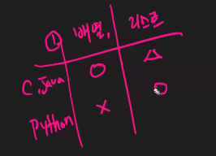
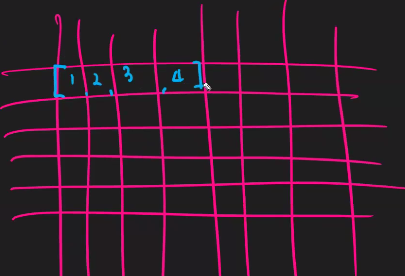
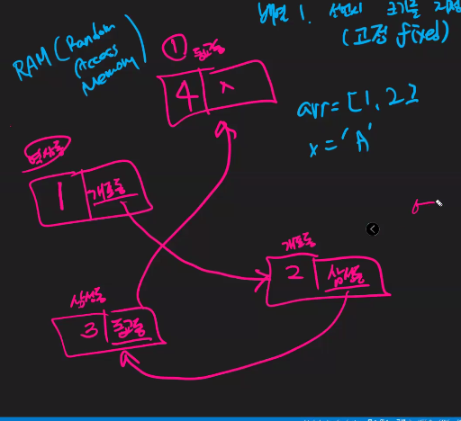
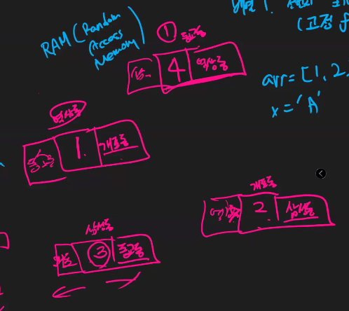

# 0209

## 1. 개요

| 자료구조      | + what to do                                                 |
| ------------- | ------------------------------------------------------------ |
| 파이썬        | 파이썬 배울 때 다뤘던 내용                                   |
| 추상 자료구조 | 우리가 이번에 배우는 것은 이것에 관련된 내용 Queue나 Stack 같은 것을 배움 |

| 알고리즘 | 이론의 영역, 원래는 문제를 푸는 것이 아님                    |
| -------- | ------------------------------------------------------------ |
|          | 실제로 문제를 다룰 수 있게 하는 것!  거의 문제풀이에 가까울 것이다. |

* 배열 vs 리스트:

* 배열의 형태: 물리적으로 데이터들이 **꼭** 붙어있다. 
  * 선언시, 크기를 지정해야 한다. 그리고 이때 지정된 크기는 고정되어 있다. 
  * 파이썬에서 리스트는 가변 자료형이기 때문에, 배열이 존재하지 않는다고 말하는 것이다.

* 리스트의 형태: 연결리스트, 참조해서 연결을 시켰다! 데이터들이 붙어있지 않은 형태이다.
  * 자신의 뒤에 있는 아이는 알 수 있지만, 앞에 있는 아이는 알 수 없게 된다.
  * 그러므로, 요소 앞뒤를 비워서 앞뒤 요소의 주소를 참조해 놓으면 된다!

​											링크드 리스트(연결 리스트): 뒤만 참조

​											더블링크드 리스트: 앞뒤 참조