# 0214

## NxM 배열

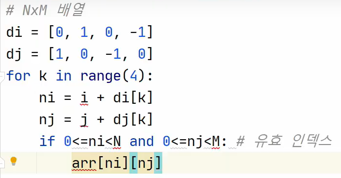

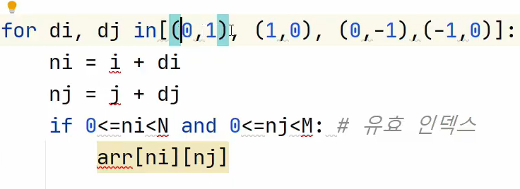

## 비트연산자

한 byte = 8 bit : 메모리에 접근할 수 있는 최소 단위

같은 번호에 위치한 두개의 비트 사이에서만 연산을 하고 끝난다. (십진수 계산처럼 막 윗 단위로 넘어가고 그런거 없음)

* `&`
* `|`
* `<<`
* `>>`

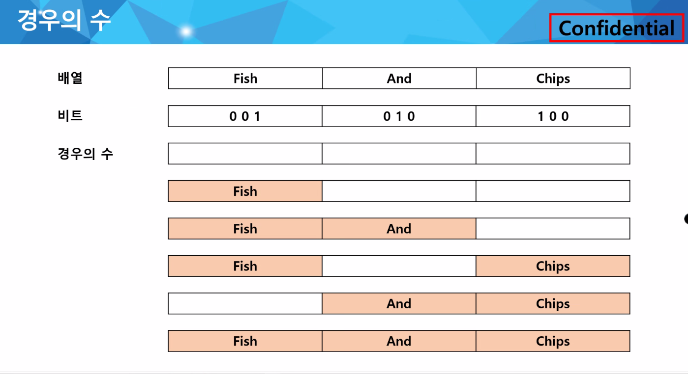

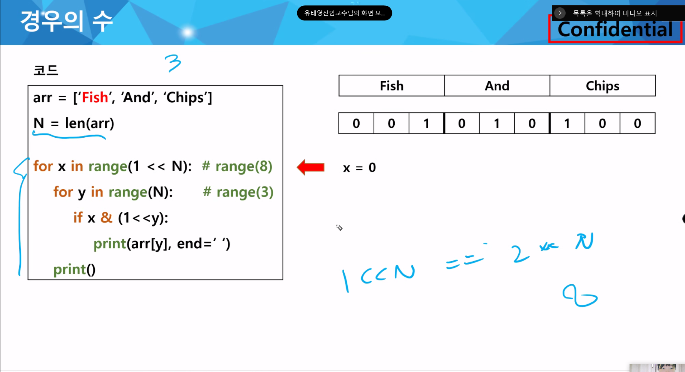

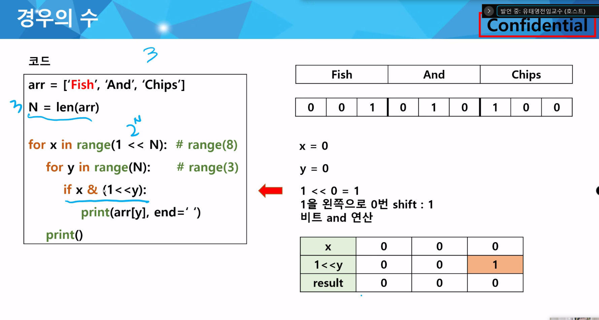

`&` 연산이 되어 있음 

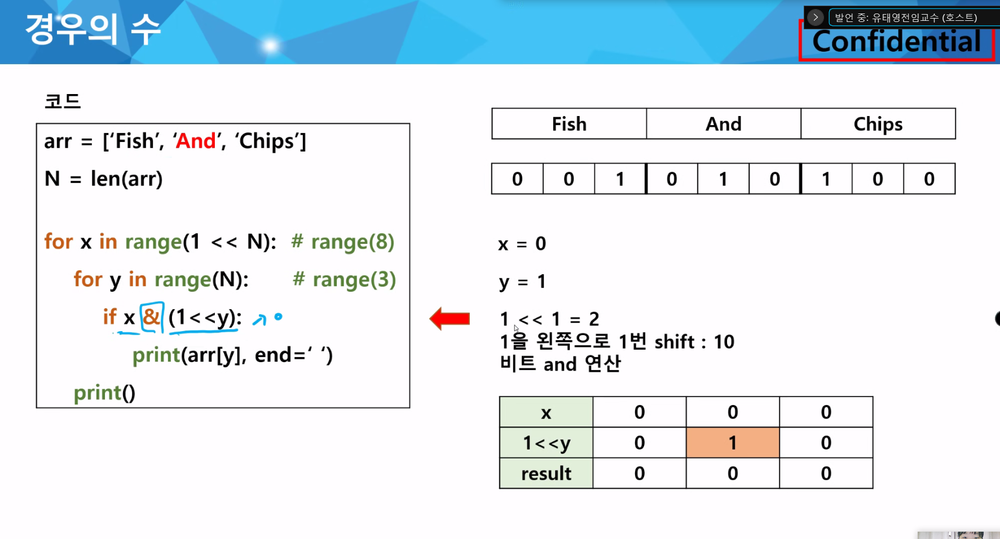

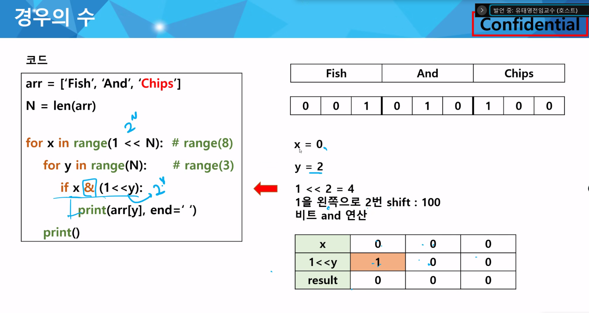

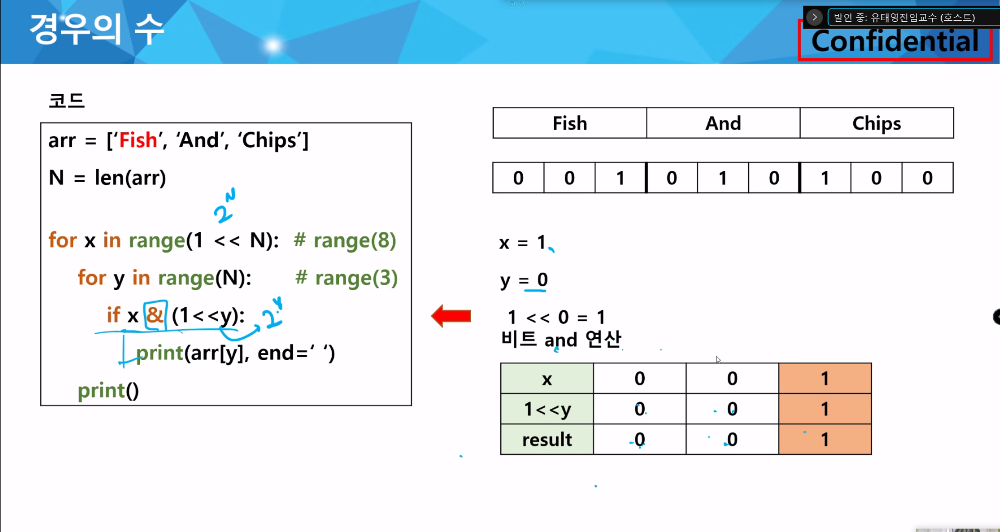

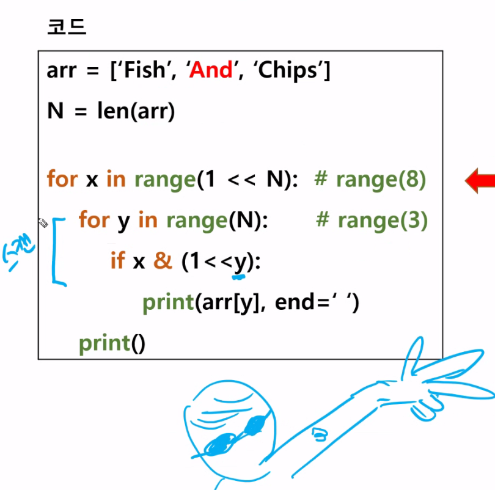

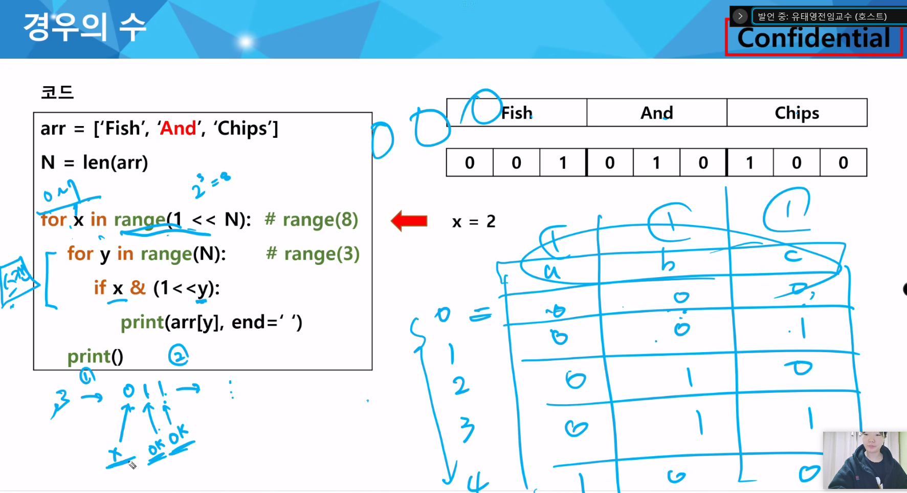

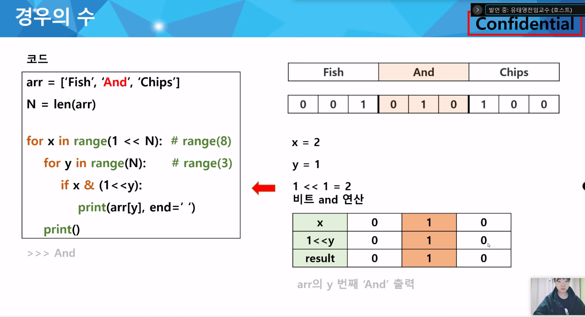

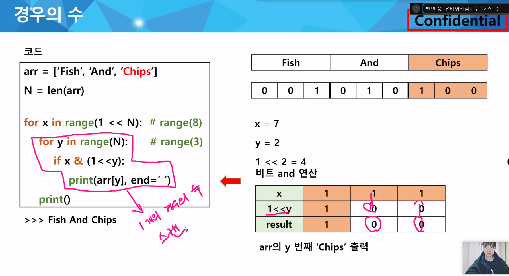

### 부분집합

