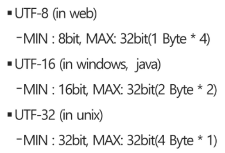
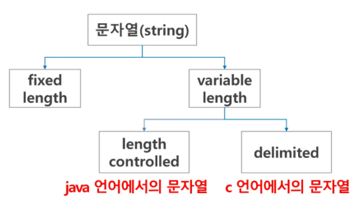
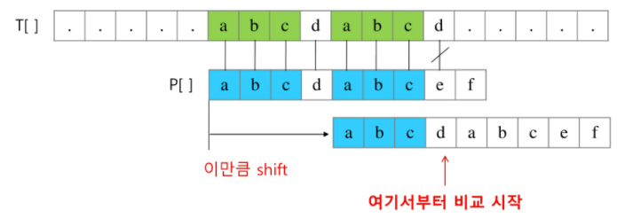
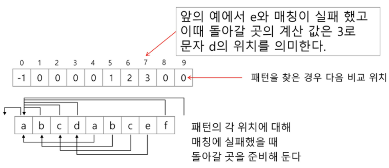
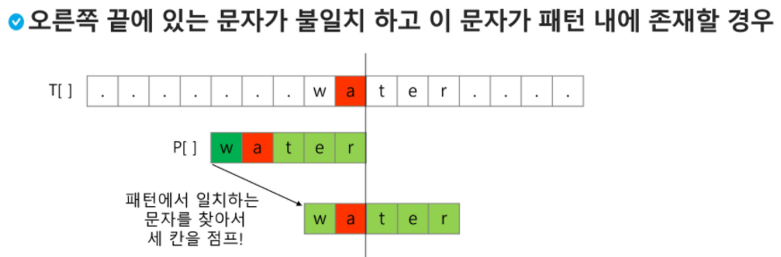
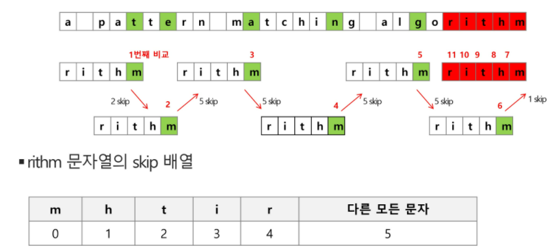
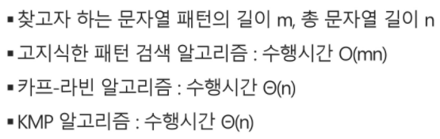

[toc]

# 03_String

## 컴퓨터에서의 문자표현

글자 A를 메모리에 저장하는 방법: 메모리는 숫자만을 저장할 수 있기 때문에, 각 문자에 대해 대응되는 숫자를 정해놓고 이것을 메모리에 저장하는 방법이 사용된다. 

영어가 대소문자 합쳐서 52자이므로, 6비트(64가지)면 모두 표현할 수 있다. 이를 **코드체계**라고 한다.

그런데, 네트워크가 발전하면서 서로간 정보를 주고 받을 때 정보를 달리 해석하는 문제가 생겼다. 그래서 혼동을 피하기 위해 표준안을 만드리고 했다 -> ASCII라는 문자 인코딩 표준이 제정되었다. ASCII는 7-bit 인코딩으로 128문자를 표현하며 33개의 출력 불가능한 제어 문자들과 공백을 비롯한 95개의 출력 가능한 문자들로 이루어져 있다.

확장 아스키는 표준 문자 이외의 부가적인 문자를 128개 추가할 수 있게 하는 부호이다. 컴퓨터 생산자와 SW 개발자가 여러가지 다양한 문자에 할당할 수 있도록 하고 있다. 이렇게 할당된 확장 부호는 표준 아스키와 같이 서로 다른 프로그램이나 컴퓨터 사이에 교환되지 못한다. 그러므로 확장 아스키는 프로그램이나 컴퓨터 또는 프린터가 그것을 해독할 수 있도록 설계되어 있어야만 올바로 해독될 수 있다.

전 세계간 정보를 주고 받기 위해서 다국어 처리를 위해 표준을 마련했고, 이를 **유니코드**라고 한다.

> 유니코드도 다시 character set으로 분류된다. 유니코드를 저장하는 변수의 크기를 정의하는데, 바이트 순서에 대해서 표준화하지 못했다. 그래서 유니코드의 적당한 외부 인코딩이 필요하게 되었다.


* Endian (몰라도 됨)
  * big-endian: 낮은 자리수를 높은 주소에 저장
  * little-endian: 낮은 자리수를 낮은 주소에 저장


* 유니코드 인코딩(UTF: Unicode Transformation Format)

  

## 문자열



파이썬은 java쪽에 가깝다.

메모리 배치할 때, 단순히 글자에 대한 메모리만이 아니라 그에 대한 조건이 잔뜩 앞에 붙는다.


### 파이썬에서의 문자열 처리

- char 타입 없음
- 텍스트 데이터의 취급방법이 통일되어 있다.
- 문자열은 시퀀스 자료형으로 분류되고, 시퀀스 자료형에서 사용할 수 있는 인덱싱, 슬라이싱 연산들을 사용할 수 있다.


* 문자열 기호
  * `+` 연결
    * 문자열 + 문자열: 이어 붙이는 역할
  * `*` 반복
    * 문자열 * 수: 수만큼 문자열이 반복


### 문자열 뒤집기

반복 수행은 문자열 길이의 반만을 수행하면 된다.


### 문자열 비교

```python
s1 = 'abc'
s2 = 'abc'
s3 = 'def'
s4 = s1
s5 = s1[:2] + 'c'

print(s1 is s2)			# True, s1과 s2는 같은 아이를 참조한다.
print(s1 is s5)			# False, 만약 슬라이싱은 [:3]으로 한다면, True로 나온다.
```

```python
a = 'abc'
b = 'ab'
c = 'de'
d = 'Abc'

print(a<b)			# True, b가 뒤에 있다.
print(a<d)			# False, a가 뒤에 있다.
```

​	

## 패턴 매칭

### 패턴 매칭에 사용되는 알고리즘

* 고지식한 패턴 검색 알고리즘
* 카프-라빈 알고리즘
* KMP 알고리즘
* 보이어-무어 알고리즘


### 고지식한 알고리즘 (Brute Force)

본문 문자열을 처음부터 끝까지 차례대로 순회하면서 패턴 내의 문자들을 일일이 비교하는 방식으로 동작

* 시간 복잡도: O(MN)
  최악의 경우 시간 복잡도는 텍스트의 모든 위치에서 패턴을 비교해야 한다.
* 비교 회수를 줄일 수 있는 방법은 없는가?


### KMP 알고리즘

- 불일치가 발생한 텍스트 스트링의 앞 부분에 어떤 문자가 있는지를 미리 알고 있으므로, 불일치가 발생한 앞 부분에 대하여 다시 비교하지 않고 매칭을 수행한다.
- 패턴을 전처리하여 배열 next[M]을 구해서 잘못된 시작을 최소화한다.
  - `next[M]`(혹은 `lps`): 불일치가 발생했을 경우 이동할 다음 위치
- 시간 복잡도: O(M+N)


#### 예시

텍스트에서 abcdabc까지는 매치되고, e에서 실패한 상황 패턴의 맨 앞의 abc와 실패 직전의 abc는 동일하다. 

실패한 텍스트 문자와 P[4]를 비교한다.




* 매칭이 실패했을 때, 돌아갈 곳을 계산한다. (미리 만들어 놓는다.)

  

  * 앞의 예에서 e와 매칭이 실패했고, 이때 돌아갈 곳의 계산값은 3으로 문자 d의 위치를 의미한다. 그리고 P[3]과 d를 비교하기 시작하면 된다.


### 보이어-무어 알고리즘

* 패턴의 오른쪽에서 왼쪽으로 비교
* 대부분의 상용 sw에서 채택하고 있는 알고리즘
* 보이어-무어 알고리즘은 패턴의 오른쪽 끝에 있는 문자가 불일치하고 이 문자가 패턴 내에 존재하지 않는 경우, 이동 거리는 무려 패턴의 길이만큼이 된다.


#### 오른쪽 끝에 있는 문자가 불일치한데, 이 문자가 패턴 내에 존재할 경우는?



패턴에서 일치하는 문자를 찾아서 그 칸만큼 점프한다.


#### 예시



skip 배열은 전처리를 먼저 해놓은 것이라고 생각하면 된다. 그래서 idx를 앞으로 이동해가면서 비교하는 것이기 때문에 원래 str의 idx를 역순으로 작성해주면 될 것이다.


* 특징
  * 앞의 두 매칭 알고리즘들의 공통점: 텍스트 문자열의 문자를 적어도 한번씩 훑는다는 것이다. 그래서 최선의 경우에는 오메가(n)
  * 보이어-무어 알고리즘은 텍스트 문자를 다 보지 않아도 된다.
  * 발상의 전환: 패턴의 오른쪽부터 비교한다.
  * 최악의 경우 수행시간: 쎄타(mn)
  * 입력에 따라 다르지만 일반적으로 쎄타(n)보다 시간이 덜 든다.


### 문자열 매칭 알고리즘 비교



빅 오 == 최악의 경우

쎄타 == 평균? 항상 이정도다

