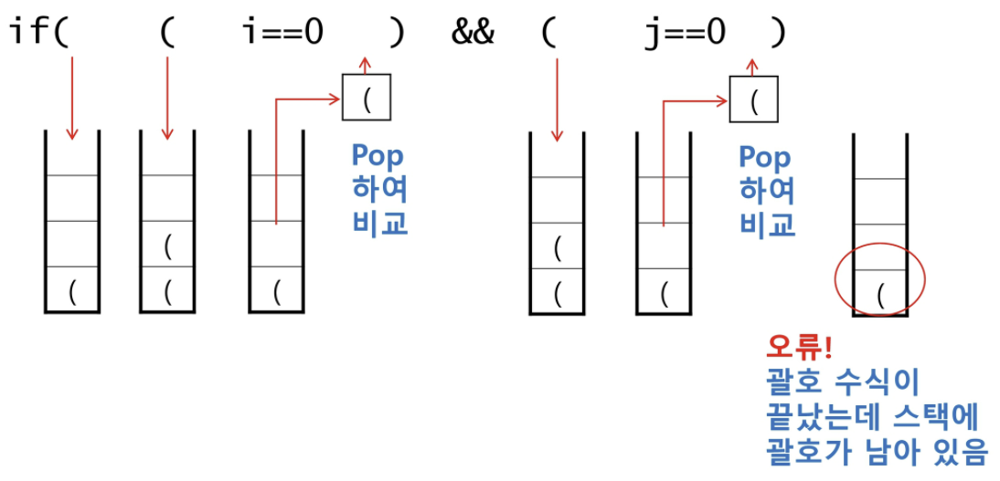

# 04_Stack

## 스택(Stack)

* 물건을 쌓아 올리듯 자료를 쌍하 올린 형태의 자료구조
* 스택에 저장된 자료는 선형 구조를 갖는다.
  * 선형 구조: 자료 간의 관계가 1대1의 관계를 갖는다.
  * 비선형 구조: 자료 간의 관계가 1대 N의 관계를 갖는다. (예: 트리)
* 스택에 자료를 삽입하거나 스택에서 자료를 꺼낼 수 있다.
* 마지막에 삽입한 자료를 가장 먼저 꺼낸다. 후입선출(LIFO, Last-In-Frist-Out)
  * 예를 들어 스택에 1, 2, 3순으로 자료를 삽입한 후 꺼내면 역순인 3, 2, 1순으로 꺼낼 수 있다.


### 스택을 프로그램에서 구현하기 위해서 필요한 자료구조와 연산

왜 쓰는가?

문제를 해결하기 위해 메모리에 접근할 때가 있는데, 마지막에 저장된 메모리를 사용해야 한다면 이 구조를 사용하면 되는 것이다.

* 자료구조: 자료를 선형으로 저장할 저장소
  * 배열을 사용할 수 있다.
  * 저장소 자체를 스택이라 부르기도 한다.
  * 스텍에서 마지막 저장된 원소의 위치를 top이라 부른다. (공식 명칭은 stack pointer가 맨 끝을 참조한다)
    

* 연산
  * 삽입: 저장소에 자료를 저장한다. `push`
  * 삭제: 저장소에서 자료를 꺼낸다. 꺼낸 자료는 삽입한 자료의 역순으로 꺼낸다. `pop`
  * 스택이 공백인지 확인 `isEmpty`
  * 스택의 top에 있는 item(원소)을 반환 `peek`


### 스택의 저장/삭제


### 스택의 구현

#### push 알고리즘

```python
def push(item):
    stack.append(item)
```

> **시간이 오래 걸리는 방법**이라 이걸 쓰지 않는다.

```python
def push(item, size):
    global top
    top += 1
    if top==size:
        print('overflow!')
    else:
        stack[top] = item
```

```python
size = 10
stack = [0] * size
top = -1

# 파이썬에서는 이 방식으로도 push를 할 수는 있음. 속도도 빠름ㅋㅋ
push(10, size)
top += 1
stack[top] = 20
```


#### pop 알고리즘

```python
def pop():
    if len(stack) == 0:
        return  # underflow
    else:
        return s.pop(-1)
```

> **시간이 오래 걸리는 방법**이라 이걸 쓰지 않는다.

```python
def pop():
    global top
    if top == -1:
        print('underflow!')
        return 0
    else:
        top -= 1
        return stack[top+1]
```

```python
print(pop())

# 이 방법도 있기는 하다.
if top > -1:
    print(stack[top])
    top -= 1
```


#### 고려사항

* 1차원 배열을 사용해 구현할 경우 구현이 용이하다는 장점이 있지만, 스택의 크기를 변경하기가 어렵다는 단점이 있다.
* 이를 해결하기 위한 방법으로 저장소를 동적으로 할당해 스택을 구현하는 방법이 있다.
  동적 연결리스트를 이용해 구현하는 방법을 의미한다. 구현이 복잡하다는 단점이 있지만 메모리를 효율적으로 사용한다는 장점을 가진다. 스택의 동적 구현은 생략한다.
  (문제풀이에서는 동적 연결리스트를 굳이 구현하지 않아도 된다. 깊이 공부한다면 한 번 해보는 것도 괜찮다.)


### 스택의 응용1: 괄호 검사

* 괄호의 종류: 대괄호, 중괄호, 소괄호
* 조건:
  1. 왼쪽 괄호의 개수와 오른쪽 괄호의 개수가 같아야 한다.
  2. 같은 괄호에서 왼쪽 괄호는 오른쪽 괄호보다 먼저 나와야 한다.
  3. 괄호 사이에는 포함 관계만 존재한다.


#### 예시



> `&&` == 파이썬의 `and`

여는 괄호일 경우 stack에 쌓는다. 닫는 괄호가 나오면 pop한다. 

* 괄호의 짝이 맞지 않기 때문에 맨 마지막에 남아있게 되고, 이것이 오류가 되는 것이다.
* 닫는 괄호가 나왔는데 비어있는 stack이어도 오류이다!!


* 괄호를 조사하는 알고리즘 개요
  * 문자열에 있는 괄호를 차례대로 조사하면서 왼쪽괄호 -> 삽입, 오른쪽 괄호 -> pop으로 삭제해서 짝이 맞는지를 검사한다.
  * 이때, stack이 비어있거나(조건 1 위배) 괄호의 짝이 맞지 않으면(조건 2 위배) 오류가 되는 것이다.
  * 마지막 괄호까지를 조사한 후에도 스택에 괄호가 남아있으면 조건 1에 위배된다.


### 스택의 응용2: function call

* 프로그램에서 함수 호출과 복귀에 따른 수행 순서를 관리
  * 가장 마지막에 호출된 함수가 가장 먼저 실행을 완료하고 복귀하는 후입선출 구조, 후입선출 구조의 스택을 이용해 수행순서 관리
  * 함수 호출이 발생하면 호출한 함수 수행에 필요한 지역변수, 매개변수, 및 수행 후 복귀할 주소 등의 정보를 스택 프레임에 저장하여 시스템 스택에 삽입한다. (알아서 컴퓨터에서 이렇게 함!!)
  * 함수의 실행이 끝나면 시스템 스택의 top 원소(스택 프레임)을 삭제(pop)하면서 프레임에 저장되어 있던 복귀 주소를 확인하고 복귀
  * 함수 호출과 복귀에 따라 이 과정을 반복하여 전체 프로그램 수행이 종료되면 시스템 스택은 공백 스택이 된다.


#### 함수 호출과 복귀에 따른 전체 프로그램의 수행 순서(다시 듣기!!!!)

메모리 안에 명령어가 들어가 있는 부분이 있고, 메모리가 CPU안으로 들어가고 이 CPU 안에서 명령을 해석해서 실행하는 부분이 있다. 그리고 어느 자리에서 명령어를 읽어야 하지(명령을 실행할 위치)를 찾는 프로그램 카운터가 있다.


* `main()`: 처음에 실행되는 부분
* `F_1()`: 함수별로 메모리 안에 저장돼 있다. 이 함수를 실행하려고 한다면, main안에서 나머지는 건너뛰고 다른 자리에 있는 이 함수를 실행한다. 그러고 난 다음에 F_1이 끝나고 나면 중단되었던 자리에 돌아가야 한다. + 실행되면서 필요한 정보가 메모리에 같이 저장돼 있을 것이다. 


## 재귀호출

* 자기 자신을 호출하여 순환 수행되는 것
* 함수에서 실행해야 하는 작업의 특성에 따라 일반적인 호출방식보다 재귀호출 방식을 사용해 함수를 만들면 프로그램의 크기를 줄이고 간단하게 작성할 수 있다.


* 재귀호출의 예시: factorial
  * n에 대한 factorial: 1부터 n까지의 모든 자연수를 곱하여 구하는 연산
  * 마지막에 구한 하위 값을 이용하여 상위 값을 구하는 작업을 반복한다.

### factorial

```python
def fact(n):
    if n == 1:
        return 1
    else:
        return n * fact(n-1)
```

> 내부 구조는 이렇게 생성을 했는데, 이렇게 하는 것이면 좀 와닿지 않네..
>
> 호출이 될 때마다 서로 다른 메모리에 저장을 하게 된다. 그만큼 사용된다고 생각하면 되는 것이다. 


### fibonacci

0과 1로 시작하고 이전의 두 수 합을 다음 항으로 하는 수열 == 피보나치 수열

피보나치 수열의 i번째 값을 계산하는 함수를 정의하면?

```python
def fibo(n):
    if n < 2:
        return n
    else:
        return fibo(n-1) + fibo(n-2)
```

> 일반적인 재귀 함수를 f(i, N)를 갖는다. (i는 현재, N은 목표 이런식) 


이렇게 재귀함수로 구현한 알고리즘은 문제점이 있다: **엄청난 중복 호출이 존재**한다는 것이다


## DP(Dynamic Programming)

### Memoization

* 메모이제이션은 컴퓨터 프로그램을 실행할 때 이전에 계싼한 값을 메모리에 저장해서 매번 다시 계산하지 않도록 하여 전체적인 실행속도를 빠르게 하는 기술이다. DP의 핵심이 되는 기술이다.
* 앞의 피보나치에서 fibo(n)의 값을 메모한다면, 실행시간을 theta(n)으로 줄일 수 있다. 

```python
def fibo_memo(n):
    global memo
    if n >= 2 and len(memo) <= n:
        memo.append(fibo_memo(n-1) + fibo_memo(n-2))
    return memo[n]

memo = [0, 1]
```


동적 계획(DP) 알고리즘은 그리디 알고리즘과 같이 **최적화 문제**를 해결하는 알고리즘이다.

DP는 먼저 **입력 크기가 작은 부분 문제들을 모두 해결한 후에** 그 해들을 이용해 **보다 큰 크기의 부분 문제들을 해결**하여, 최종적으로 원래 주어진 입력의 문제를 해결하는 알고리즘이다.


### 피보나치 수 DP 적용

* 피보나치 수는 부분 문제의 답으로부터 본 문제의 답을 얻을 수 있으므로 최적 부분 구조로 이루어져 있다.


1. 문제를 부분 문제로 분할한다.
2. 부분 문제로 나누는 일을 끝냈으면 가장 작은 부분 문제부터 해를 구한다.
3. 그 결과는 테이블에 저장하고, 테이블에 저장된 부분 문제의 해를 이용하여 상위 문제의 해를 구한다.

```python
def fibo2(n):
    f = [0, 1]
    for i in range(2, n+1):
        f.append(f[i-1] + f[i-2])
    return f[n]
```


* DP의 구현 방식
  * recursive : `fibo(n)`
  * iterative: `fibo2(n)`
* memoization을 재귀적 구조에 사용하는 것보다 반복적 구조로 DP를 구현한 것이 성능면에서 보다 효율적이다.
* 재귀적 구조는 내부에 시스템 호출 스택을 사용하는 오버헤드가 발생하기 때문이다.