# 07_Tree

## 트리의 기본

* 비선형 구조
* 원소들 간에 1:n 관계를 가지는 자료구조
* 원소들 간에 계층관계를 가지는 계층형 자료구조
* 상위 원소에서 하위 원소로 내려가면서 확장되는 트리(나모)모양의 구조


### 정의

* 한 개 이상의 노드로 이루어진 유한집합, 아래의 조건을 만족
  * 노드 중 최상위 노드 == root
  * 나머지 노드들은 n개의 분리집합 T1, T2, ... ,Tn으로 분리될 수 있다.
* 이들 T1, T2, ... ,Tn은 각각 하나의 트리가 되며(재귀적 정의) 루트의 부트리(subtree)라 한다

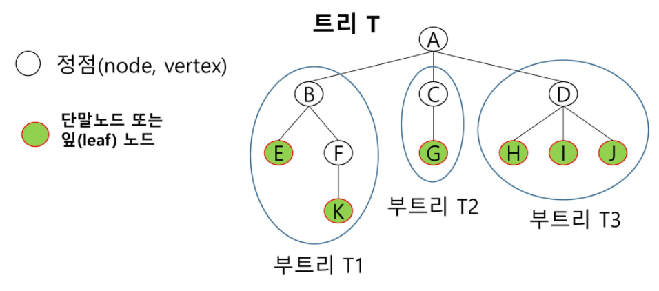

> leaf 노드는 자식이 없는 노드를 의미한다.


### 용어

1. 노드(node): 트리의 원소

2. 간선(edge): 노드를 연결하는 선. 부모 노드와 자식 노드를 연결

3. 루트 노드: 트리의 시작 노드

   > 루트는 보통 제공되거나 특정한 조건을 줘서 찾을 수 있게 한다.

4. 형제 노드(sibling node): 같은 부모 노드의 자식 노드들
5. 조상 노드: 간선을 따라 루트 노드까지 이르는 경로에 있는 모든 노드들
6. 서브 트리: 부모 노드와 연결된 간선을 끊었을 때 생성되는 트리
7. 자손 노드: 서브 트리에 있는 하위 레벨의 노드들
   ex) 위 그림: B의 자손 노드: E, F, K
8. 차수(degree)
   * 노드의 차수: 노드에 연결된 자식 노드의 수
   * 트리의 차수: 드리에 있는 노드의 차수 중에서 가장 큰 값
   * 단말 노드(리프 노드): 차수가 0인 노드. 자식 노드가 없는 노드
9. 높이
   * 노드의 높이: 루트에서 노드에 이르는 간선의 수. 노드의 레벨
     루트를 0으로 볼수도 있고, 루트를 1로 볼 수도 있다. 
   * 트리의 높이: 트리에 있는 노드의 높이 중에서 가장 큰 값, 최대 레벨


## 이진트리

* 모든 노드들이 2개의 서브트리를 갖는 특별한 형태의 트리
* 각 노드가 자식 노드를 최대한 2개까지만 가질 수 있는 트리
  * 왼쪽 자식 노드
  * 오른쪽 자식 노드
* 이진 트리의 예
  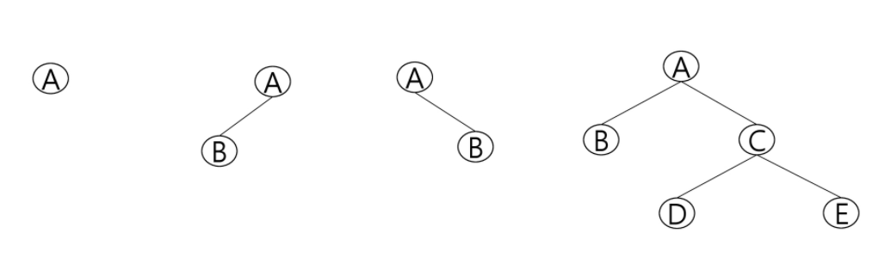

* 레벨 i에서 노드의 최대 개수는 2**i개 (루트가 레벨 0이라 할 때)
* 높이가 h인 이진 트리가 가질 수 있는 노드의 최소 개수는 h+1개가 되며, 최대의 개수는 2**(h+1)-1 개가 된다.


### 포화 이진 트리(Full Binary Tree)

* 모든 레벨에 노드가 포화상태로 차 있는 이진 트리
* 높이가 h일 때, 최대의 노드 개수인 2**(h+1)-1의 노드를 가진 이진 트리
* 루트를 1번으로 하여 2**(h+1)-1까지 정해진 위치에 대한 노드 번호를 가진다.

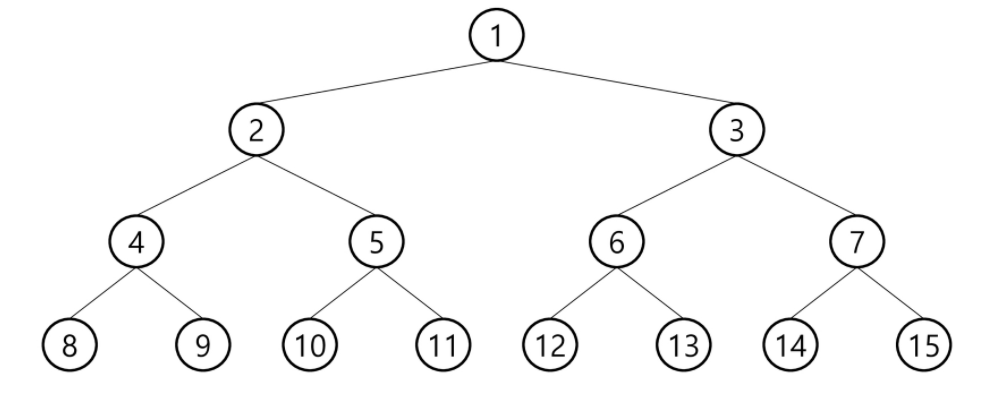


### 완전 이진 트리(Complete Binary Tree)

* 높이가 h이고, 노드 수가 n개일 때, 포화 이진 트리의 노드 번호 1번부터 n번까지 빈자리가 없는 이진 트리
  * ex) 노드가 10개인 완전 이진 트리
    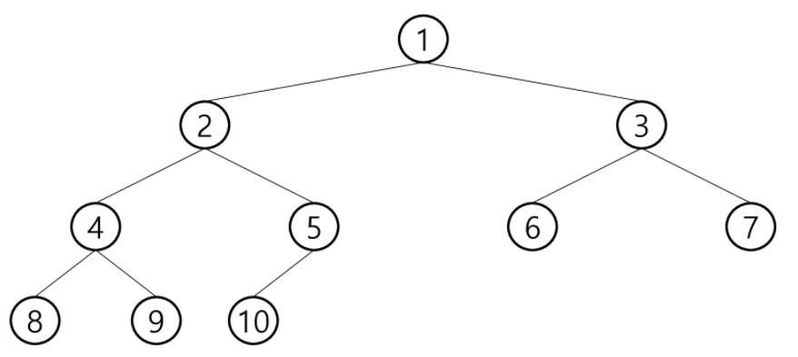


### 편향 이진 트리(Skewed Binary Tree)

* 높이 h에 대한 최소 개수의 노드를 가지면서 한쪽 방향의 자식 노드만을 가진 이진 트리

  * 왼쪽 편향 이진 트리
  * 오른쪽 편향 이진 트리

  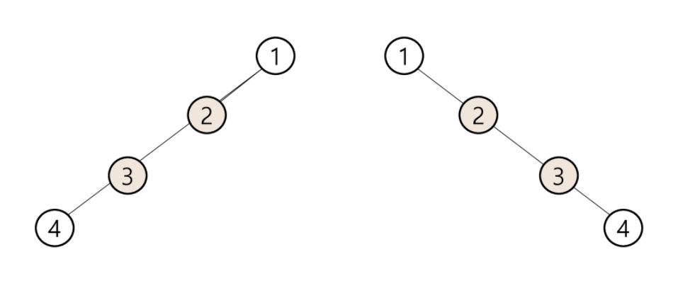

  

## 이진트리 - 순회

### 순회란..(traversal)

트리의 각 노드를 중복되지 않게 전부 방문하는 것을 말하는데, 트리는 비선형 구조이기 때문에 선형구조에서와 같이 선후 연결 관계를 알 수 없다. 그래서 특별한 방법이 필요하다!

* 순회 == 트리의 노드들을 체계적으로 방문하는 것

1. 전위순회(preorder): 부모노드 방문 후, 자식 노드를 좌우 순서로 방문한다.
2. 중위순회(inorder): 왼쪽 자식노드, 부모노드, 오른쪽 자식 노드 순으로 방문한다.
3. 후위순회(postorder): 자식노드를 좌우 순서로 방문한 후 부모노드로 방문한다.

**트리의 순회는 서브트리 내에서만 돈다. 거슬러 올라가지(루트로 올라가지) 않는다!**


### 전위순회 (preorder traversal)

* 수행방법
  1. 현재 노드 n을 방문하여 처리한다. -> **V**
  2. 현재 노드 n의 왼쪽 서브트리로 이동한다. -> **L**
  3. 현재 노드의 오른쪽 서브트리로 이동한다. -> **R**
* 전위 순회 알고리즘

```python
def preorder(N):
    # N이 존재하는지? 
    if N:
        print(N)
        # ch1은 왼쪽 서브노드, ch2는 오른쪽 서브노드
        preorder(ch1[N])
        preorder(ch2[N])
```

* 그림으로 이해하기

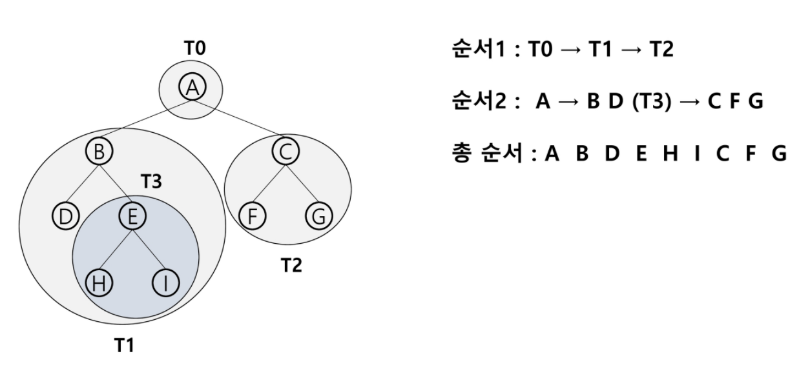


### 중위순회 (inorder traversal)

* 수행 방법
  1. 현재 노드 n의 왼쪽 서브트리로 이동한다. -> **L**
  2. 현재 노드 n을 방문하여 처리한다. -> **V**
  3. 현재 노드 n의 오른쪽 서브트리로 이동한다. -> **R**

* 중위 순회 알고리즘

```python
def preorder(N):
    # N이 존재하는지? 
    if N:
        # ch1은 왼쪽 서브노드, ch2는 오른쪽 서브노드
        preorder(ch1[N])
        print(N)
        preorder(ch2[N])
```

* 그림으로 이해하기

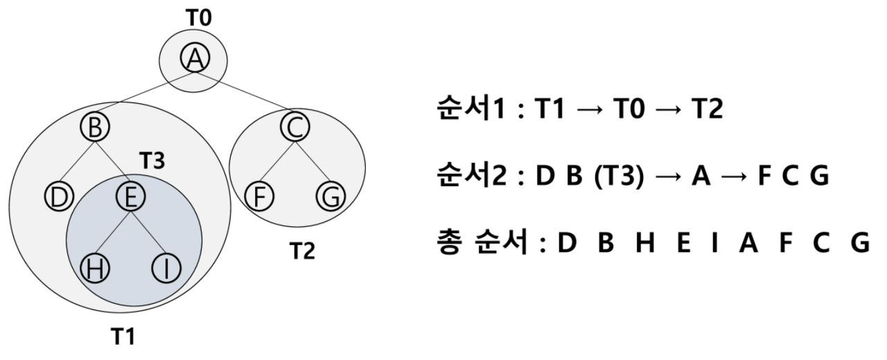


### 후위순회 (postorder traversal)

* 수행 방법
  1. 현재 노드 n의 왼쪽 서브트리로 이동한다. -> **L**
  2. 현재 노드 n의 오른쪽 서브트리로 이동한다. -> **R**
  3. 현재 노드 n을 방문하여 처리한다. -> **V**

* 중위 순회 알고리즘

```python
def preorder(N):
    # N이 존재하는지? 
    if N:
        # ch1은 왼쪽 서브노드, ch2는 오른쪽 서브노드
        preorder(ch1[N])
        preorder(ch2[N])
        print(N)
```

* 그림으로 이해하기

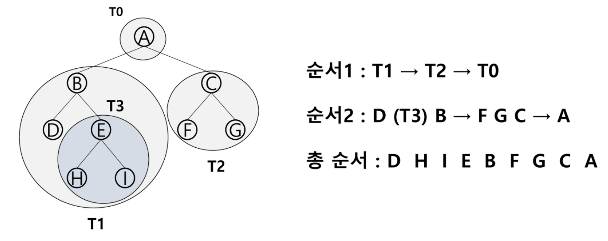

루트가 가장 마지막에 처리가 되는 것이 특징!!


## 이진트리의 표현 - 배열

### 배열을 이용한 이진 트리의 표현

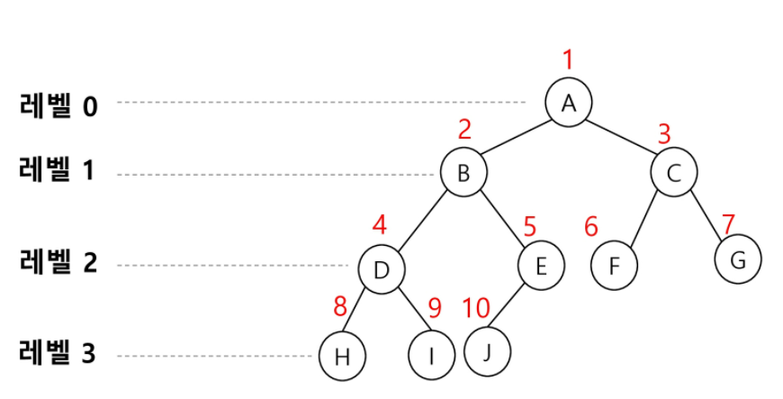

* 노드 번호의 성질
  * 루트의 번호 == `1`
  * 레벨 n에 있는 노드에 대하여 왼쪽부터 오른쪽으로 `2**n`부터 `2**(n+1)-1`까지 번호 부여
  * 노드 번호가 i인 노드의 부모 노드 번호 == `i//2`
  * 노드 번호가 i인 노드의 왼쪽 자식 노드 번호 == `2*i`
  * 노드 번호가 i인 노드의 오른쪽 자식 노드 번호 == `2*i+1`
  * 레벨 n의 노드 번호 시작 번호는? `2**n`
* tree 리스트의 형태
  * 노드 번호를 배열의 인덱스로 사용한다


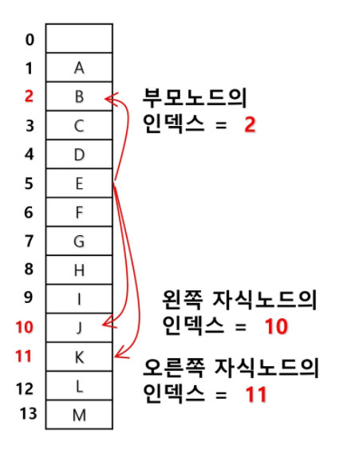


### 이진 트리의 저장 방법

#### 1. 부모 번호를 인덱스로 자식 번호를 저장

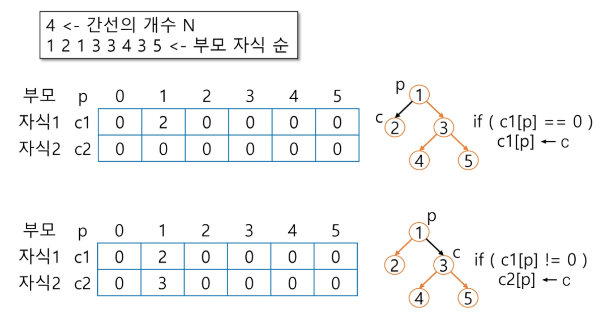


#### 2. 자식 번호를 인덱스로 부모 번호를 저장

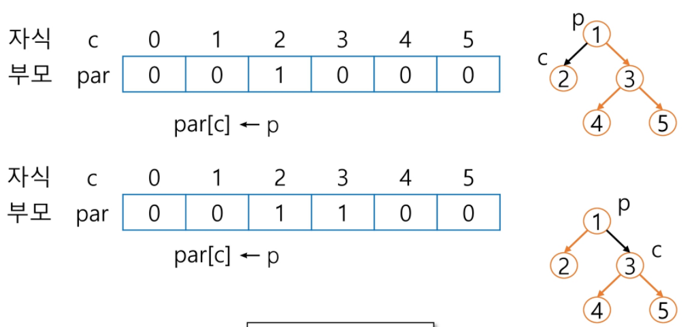


* 이진 트리 정점번호 규칙

  * 포화 이진 트리: 부모 < 자식

  * 그외: 1번이 루트 X, 부모 < 자식 X **(*선입견을 가지지 말자!!!*)**


* 단점
  * 편향 이진 트리의 경우 사용하지 않는 배열 원소에 대한 메모리 공간 낭비 발생
  * 트리의 중간에 새로운 노드를 삽입하거나 기존의 노드를 삭제할 경우 배열의 크기 변경이 어려워 비효율적이다.


##### 2.를 이용해 루트 찾기, 조상 찾기

1. 루트 찾기: 부모가 0이라면 그것이 루트가 된다!!
2. 조상 찾기: 부모가 있다면 리스트에 저장하고, 자신의 번호를 부모 번호로 바꿔서 반복


## 트리의 표현 - 연결리스트

* 배열을 이용한 이진 트리의 표현의 단점을 보완하기 위해 연결리스트를 이용하여 트리를 표현할 수 있다. (메모리를 덜 사용하지만, 문법적으로 복잡해지게 된다.)

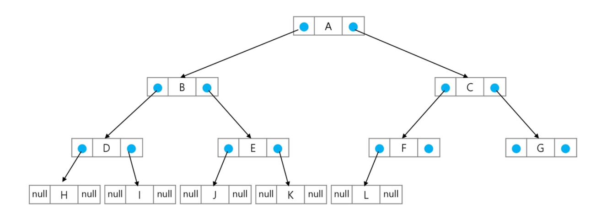


### 수식 트리 (SWEA 문제!)

- 수식을 표현하는 이진 트리, 수식 이진 트리라고 부르기도 한다.

- 연산자는 루트 노드이거나 가지 노드이며, 피연산자는 모두 잎 노드


## 이진 탐색 트리

* 탐색 작업을 효율적으로 하기 위한 자료구조
* 모든 원소는 서로 다른 유일한 키를 갖는다.
* 왼쪽 서브트리 key < 루트 노드 key < 오른쪽 서브르티 key
* 왼쪽 서브트리와 오른쪽 서브트리도 이진 탐색 트리다.
* 중위 순회하면 오름차순으로 정렬된 값을 얻을 수 있다.

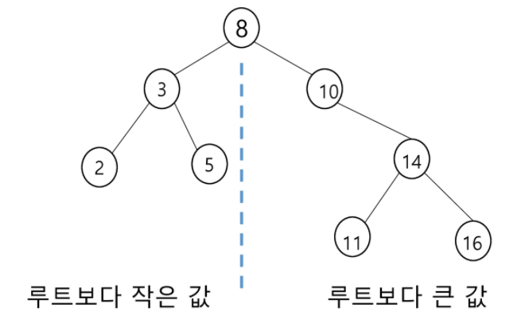


### 탐색 연산

1. 루트에서 시작한다
2. 탐색할 키 값 x를 루트 노드의 키 값과 비교한다
3. 키 값 x == 루트노드의 키 값: 원하는 원소를 찾았으므로 탐색 연산 성공
4. 키 값 x < 루트노드의 키 값: 루트노드의 왼쪽 서브트리에 대해서 탐색연산 수행
5. 키 값 x > 루트노드의 키 값: 루트노드의 오른쪽 서브트리에 대해서 탐색연산 수행

* 서브트리에 대해서 순환적으로 탐색 연산을 반복한다. 


#### 삽입 연산

1. 먼저 탐색 연산을 수행
   * 삽입할 원소와 같은 원소가 트리에 있으면 삽입 불가이므로, 같은 원소가 트리에 있는지 탐색
   * 탐색에서 실패가 결정되는 위치가 삽입 위치가 된다.
2. 탐색 실패한 위치에 원소를 삽입한다.

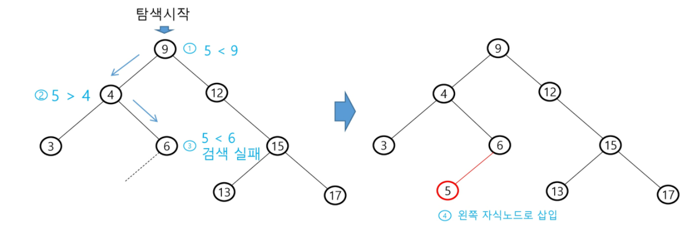


* 탐색, 삽입, 삭제 시간은 트리의 높이만큼 시간이 걸린다.
  * O(h), h == BST의 깊이


* 평균의 경우, 이진 트리가 균형적으로 생성되어 있는 경우
  * O(logn)


* 최악의 경우, 한쪽으로 치우친 경사 이진트리의 경우
  * O(n), 순차 탐색과 시간복잡도가 같다.


#### 삭제 연산

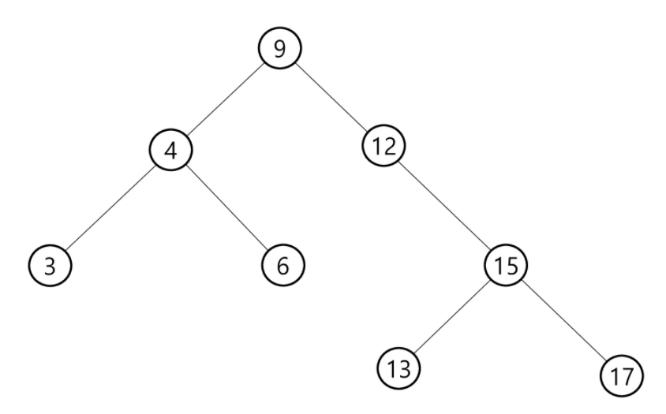

* 이 트리에서 13, 12, 9를 삭제한다면?
  1. 13 탐색을 해서 자식이 없으므로 바로 삭제한다.
  2. 12 탐색 -> 자식이 하나이므로 9와 15를 연결시키면 삭제되는 것
  3. 9 탐색 -> 자식이 둘이므로, 왼쪽 서브트리 중에 제일 큰 아이를 올려서 붙인다. 그리고 오른쪽 서브트리 중에 가장 작은 아이를 올려서 붙인다. (복잡해진다..)
