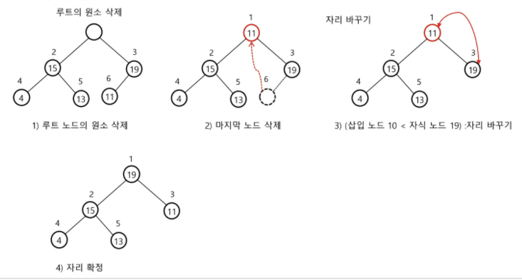

# 07-02 heap

완전 이진 트리에 있는 노드 중에서 키 값이 가장 큰 노드나 키 값이 가장 작은 노드를 찾기 위해서 만든 자료구조

* **최대 힙**
  * 키 값이 가장 큰 노드를 찾기 위한 **완전 이진 트리**
  * 부모 노드의 키값 > 자식 노드의 키 값
  * 루트 노드: 키 값이 가장 큰 노드
* **최소 힙**
  * 키 값이 가장 작은 노드를 찾기 위한 **완전 이진 트리**
  * 부모 노드의 키 값 < 자식 노드의 키 값
  * 루트 노드: 키 값이 가장 작은 노드

## 연산

### 삽입 연산

**최대 힙 기준**

1. 마지막 정점을 추가 하고, 그 정점에 새로 삽입할 값을 저장한다.
   (`맨 마지막 정점 번호 + 1`에 삽입할 값을 삽입한다.)
2. 부모와 값을 비교해서 부모보다 값이 크다면, 자리를 변경한다.
3. 계속 반복해서 더 이상 바꾸지 않아도 될 때까지 (바꿀 부모가 없을 때까지) 자리를 바꾼다. 

​	

### 삭제 연산

**최대 힙 기준**

* 힙에서는 루트 노드의 원소만을 삭제할 수 있다.
* 루트 노드의 원소를 삭제하여 반환한다.
* 힙의 종류에 따라 최대값 또는 최소값을 구할 수 있다.

1. 루트 노드를 삭제하고, 마지막 노드를 루트에 넣어 놓는다.
2. 그 다음 루트의 자식 중 자신보다 큰 값을 찾아서 그 자식과 자리를 바꾼다. 
3. 계속 반복해서 더 이상 바꾸지 않아도 될 때까지 자리를 바꾼다.

 

## 힙의 활용

* 힙을 활용하는 대표적인 2가지 예는 **특별한 큐의 구현(우선순위 큐)**과 **정렬**이다.
* 우선순위 큐를 구현하는 가장 효율적인 방법이 힙을 사용하는 것이다.
  * 노드 하나의 추가/삭제가 시간 복잡도가 O(logN)이고, 최대값 혹은 최소값을 O(1)에 구할 수 있다.
  * 완전 정렬보다 관리 비용이 적다.
* 배열을 통해 트리 형태를 쉽게 구현할 수 있다.
  * 부모나 자식 노드를 O(1) 연산으로 쉽게 찾을 수 있다.
  * n위치에 있는 노드의 자식은 2n과 2n+1에 위치한다.
  * 완전 이진 트리의 특성에 의해 추가/삭제의 위치는 자료의 시작과 끝 인덱스로 쉽게 판단할 수 있다.

### 힙을 이용한 우선순위 큐

* 힙: 완전 이진 트리로 구현된 자료로서 키값이 가장 큰 노드나 가장 작은 노드를 찾기에 유용한 자료구조
* 힙의 키를 우선순위로 활용하여 우선순위 큐를 구현할 수 있다.

### 힙 정렬

* 힙 정렬은 힙 자료구조를 이용해서 이진 탐색과 유사한 방법으로 수행된다.
* 정렬을 위한 2단계
  1. 하나의 값을 힙에 삽입한다. (반복)
  2. 힙에서 순차적(오름차순)으로 값을 하나씩 제거한다.
* 힙 정렬의 시간 복잡도
  1. N개의 노드 삽입 연산 + N개의 노드 삭제 연산
  2. 삽입과 삭제 연산은 각각 O(logN)이다.
  3. 따라서, 전체 정렬은 O(NlogN)이다.

* 힙 정렬은 배열에 저장된 자료를 정렬하기에 유용하다.

> 웹엑스!
>
> Graph vs Tree
>
> 1. 트리는 순환 구조를 갖지 않는 그래프
> 2. root node 제외 모든 노드는 부모가 하나
> 3. root node는 하나