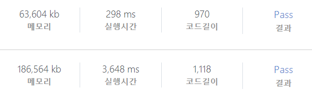
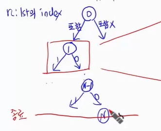
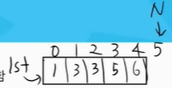

[toc]

# 0318 문제풀이 2차


1. 문제 읽기: TC, 주요조건, 실수할 것은 미리 적어두자
2. 시각적으로 그려놓고 실수를 줄이자
3. 구현할 때는 최대한 익숙한 방법으로 사용하자
4. 디버그하며 부족한 부분을 채우자

**알고리즘은 top-down 형식으로 작성하자!**


* 문제 유형
  1. 아이디어 구현: 규칙성 발견, edge case 생각하기
  2. 알고리즘: 규칙을 가지고 체계화 시킨 것이 알고리즘이다. 이것을 사용하면 실수를 줄일 수 있다.
     기본 템플릿을 정확히 익힌 다음에 변형을 해가며 문제를 풀어가는 것이다!
     BFS, DFS

##  BFS

* 한 단계씩 발전 -> 최단거리, 영역/조건 탐색

* 미로, 특정위치/조건까지의 거리/단계 수 등 한 단계씩 탐색하면서 답을 찾는 경우
* 기본적으로 각 단계 진행에 필요한 비용이 동일한 경우에 중복방문을 방지하면서 진행
  * 경우에 따라 조건에 따른  중복방문을 허용하면서 진행하는 경우도 있음: 추후 다룰 것
* 아래 세 문제의 BFS 문제들에서 차이가 나는 부분은?
  * 조건이 차이가 났다!!!!
  * 2차원 배열인지 혹은 연결 / 관계인지가 차이가 났다. 
  * 그리고 정답을 처리하는 부분이 달랐다.
* BFS로 접근하지 말아야 하는 경우는?
  * 출제자가 BFS로 내지 않은 문제들


* 템플릿

```python
# 그래프 G, 시작점 v
def BFS(G, v, n):
    # 생성
    visited = [0] * (n+1)
    queue = []
    queue.append(v)
    visited[v] = 1
    
    while queue:
        t = queue.pop(0)
        visit(t)
        # 조건에 맞는 경우
        for i in G[t]:
            if not visited[i]:
                queue.append(i)
                # n으로부터 1만큼 이동한 것이다
                visited[i] = visited[n] + 1
```


### 1238 contact

1. BFS를 사용하되, loop가 아닌 재귀를 사용하면 어떨까?

   

2. input을 인접행렬(`adj`)을 받아와보자
   행1 -> 열17 에 1을 체크!

   * ```python
     for i in range(0, len(lst), 2):
     	#      시작     도착
         adj[lst[i]][lst[i+1]] = 1
     ```

3. q, visited 배열 생성

   * 첫 데이터를 삽입을 하고, visited[s] = 1로 변경

   * ```python
     q = []
     visited = [0] * 101
     sol = s
     while q:
         c = q.pop(0)
         # !!!!!정답인 경우!!!!!
         if visited[c] > visited[sol] or visited[c] == visited[sol] and c > sol:
             sol = c
             
         # !!!!!조건!!!!!
         for j in range(1, 101):
         # 연결이 되어있고, 방문을 안했다면
         if adj[c][j] and visited[j] == 0:
             q.append[j]
             visited[j] = visited[c] + 1
     
     return sol
     ```


### 1861 정사각형 방

* 정수 N이 최대 1000까지 가능함 -> 1000**2의 data를 처리해야한다.
  * 중복방문을 막기 위해서 visited를 만들 필요가 있겠구나 싶은데..
  * 전체가 백만개 데이터를 처리해야 한다면, loop를 도는 것이 시작복잡도가 늘어날 것이다. **적절하지 않을 것이다!!!**


1. 대신, arr를 순회하면서 방문하지 않은 숫자를 발견했다면 BFS를 돌리는 것으로 해보자

   * visited는 BFS 함수 밖에 존재하면서 가야한다.

   * ```python
     for i in range(N):
         for j in range(N):
             if v[i][j] == 0:
                 tn, tc = BFS[i][j]
                 num, cnt 갱신하기
     ```

2. ```python
   # BFS 함수
   q = []
   q.append(si, sj), v[si][sj] = 1
   # s는 방문 번호를 저장, 결국 s의 길이가 최대 이동 길이가 된다.
   s = [arr[si][sj]] 
   
   while q:
       ci, cj = q.pop(0)
       for 4방향 and 범위내 방문X, 나보다 1 크다면:
           q삽입, v표시, s[]추가
   return min(s), len(s)
   ```

> 이 문제에서 BFS 함수 내에 조건으로
>
> `abs(arr[ni][nj] - arr[ci][cj]) == 1` 이라면이 들어가 있는데, 이게 1차이가 난다는 것이 이동가능한 것이고, 결국 그렇게 이동가능한 최대 길이를 넣을 수 있다!!! 
>
> 특정 지점에서 시작해서 1큰 애들로만 이동한다 -> 어느 지점에서 시작됐든 1차이나는 애들로 퍼지면 결국 최대 이동가능한 경우까지 퍼질 수 있다!!!
>
> **내 코드와 비교해보자면**,
>
> 나는 1 큰 경우만 계속 이동하게 했고, 모든 i,j에 대해서 돌게 했다. 그래서 시간이 엄청 오려걸렸는데, 이 코드는 한번에 visisted를 처리해서 방문하지 않았던 ij만 돌기때문에, 시간이 훨씩 절약된다.
>
> 
>
> *시간이... 정말 짧당...*


### 1853 탈주범 검거

* 조건: 4방향 연결된경우

  * 방향 상0 / 하1 / 좌2 / 우3

  * 현재파이프(cpipe)의 방향에 파이프가 있고, 다음 이동할 파이프가 내 방향의 opposite 방향에 파이프가 있다면 연결된 것이다!!!!

  * ```python
    pipe = [0,
        # 상하좌우
        [1, 1, 1, 1], # 1
        [1, 1, 0, 0], # 2
        [0, 0, 1, 1], # 3
        [1, 0, 0, 1], # 4
        [0, 1, 0, 1], # 5
        [0, 1, 1, 0], # 6
        [1, 0, 1, 0]  # 7
    ]
    ```

  * 즉, 조건에 맞으면 q삽입하는 코드는

    ```python
    # 이때 k는 for안에서 0~3까지 움직일 것
    opp = [1, 0, 3, 2]
    
    for k in range(4):
        ni, nj 계산
        if 범위내, 중복 X
        # 내파이프 번호arr[ci][cj]랑, 그거의 방향pipe[][k]
        pipe[arr[ci][cj]][k]
        # 다음파이프 번호arr[ci][cj]랑, 그거의 방향pipe[][k]
        pipe[arr[ni][nj]][opp[k]]
        이 둘이 모두 1이라면 -> append하면 된다.
    ```

* 이동해서 지난 시간을 적어야 한다.
  

  * 종료조건: 꺼냈더니 `v[ci][cj]==L`인 경우!! `return cnt`

> 생각보다 시간 차이는 얼마 안났지만,
>
> 연결됐는지 안됐는지를 찾아보는 신기한 방법이었다!!! 
> 이 방법에서 굳이 현재 방향을 어떤 list로 생성하지 않아도 그 자체 k가 방향을 의미할 수 있다
>
> 


## 백트랙킹 (재귀)

* 가능한 모든 경우를 처리해서 답을 찾는 문제 예시: 부분집합의 합(stack 2 연습문제)
  * 하지만 이 경우는 시간초과가 날 수 있음
* 가능한 모든 경우를 표현하는 효율적인 방법: Tree (상태 공간 트리 설계)!!

```
N개의 숫자를 원소로 가진 집합 A의 부분집합 중, 워소의 합이 K인 부분집합의 개수 출력(없으면 0)
N = 4, 원소는 [1, 4, 3, 2] K = 5인 경우 
```

* 이 숫자를 덧셈에 사용할 것이냐? 안사용할 것이냐?

* 상태공간 트리라는 것은 n이라는 것을 넣을텐데 -> 이것은 배열의 index로 사용할 것이다. 
  0을 넣어서 포함할지 / 안할지 -> 1을 넣어서 포함할지 / 안할지 -> ... -> N-1을 넣어서 포함할지 안할지 -> N이 되므로 종료하면 된다. => 이때 답을 낸다고 생각하면 된다!!!! (*익숙해지면 변형해서 사용할 수 있다.*)

  * ```python
    def DFS(n, 필요인자들):  # ssum(부분집합의 합)
        # 가지치기는 선택, 마지막에 고려한다
        """
        if ssum >= K:
        	return
        """
        # 0. 종료조건 -> 정답처리 / 기본적으로 n관련
        if n >= N:
            return
        
        # 1. 하부 함수 호출
        DFS(n+1, 필요인자들)  # 포함 O: ssum+lst[n]
        DFS(n+1, 필요인자들)  # 포함 x: ssum
    ```

  * 
    저 빨간 네모안에 있는 것을 하나의 함수로 구현하면 된다. 

* 재귀함수는 최대한 간단한 형태로 구현한다!!!!!!!!! 왜냐면 많이 호출되니까

* 재귀는 디버깅이 힘들다.. 그래서 손으로 잘 설계해서 동작이 안되면, 재귀 자체를 다시 설계하는 것이 좋다.

* **2^50**정도는 가지치기 정도로 하면 재귀로 짜도 괜찮다.

* 주로 가지치기가 가능하게 최솟값 혹은 최댓값을 구하라고 한다.!!!


### 1486 장훈이의 높은 선반

* lst로 직원들 키 받아옴

  * 
    

* n은 배열의 인덱스를 받아옴(0번 직원의 키를 받아온다.) 포함할지 안할지...
  N-1번 직원 포함할지 안할지 까지 하면 종료 조건을 맞이할 때가 온다.

* 종료 `n == N`이면 return한다.

  * ```python
    def DFS(n, ssum):
        global ans  # 선반과 키의 차이
        if n == N:
            if ssum >= B and ssum < ans+B:
                ans = ssum-B
            return
        DFS(n+1, ssum+lst[n])  # 포함
        DFS(n+1, ssum)  # 안 포함
    ```


### 4012 요리사

* N = 16이어서, 가능한 모든 경우를 돌려서 구할 수 있겠다!

* 식재료 번호 n을 가져와서 A로 사용할건지/ B로 사용할건지 -> N-1 식재로 가져와서 A할지 / B할지 까지 한 다음에 정답에 대한 처리를 하면 된다.
  

* `alst` / `blst`에 그 식재료들을 담으면, 그 길이가 식재료의 계수가 되겠다

* ```python
  # 맨 처음 호출은 DFS(0, [], [])
  def DFS():
      # 종료조건
      if n == N:
          # 식재료를 반씩 나눠갖기로 했음
          if len(alst) == len(blst):
              asum = 0
              for i in range(len(alst)):
                  for j in range(len(alst)):
                      asum += arr[alst[i]][alst[j]]
                      bsum += arr[blst[i]][blst[j]]
      DFS(n+1, alst + [n], blst)
      DFS(n+1, alst, blst + [n])
  ```

> 매우 빠르고... 메모리도 덜쓴다 ㅠㅜㅠㅜㅠㅜ 헝... 모든 경우를 탐색하는 것을 이 방법으로 연습을 해보자!!
>
> 

