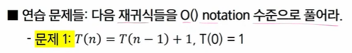

[toc]

# 08_컴퓨팅 사고력

## 2. 수와 표현

* 컴퓨터는 0/1을 표현할 수 있는 비트들을 모아 수를 표현
* k개의 비트를 사용하면 0부터 2^k-1까지 표현 가능
* 사실, 꼭 저 범위인 것은 아님 약속하는 방식에 따라 다르지만, 어떤 경우든 최대 2^k 가지의 값을 표현하는 것이 가능
* 10진수로 k자리르 쓰면 0부터 10^k-2까지 표현이 간으한 것과 완전히 동일한 과정


* 어떤 값 n을 표현하기 위해서는 몇개의 비트가 필요할까?
* 2^k - 1 >= n이 성립해야 한다. 즉 2^k >= n+1
* 같은 의미로, k >= log(n+1) : 약 logn 비트가 필요함

* **컴퓨터에서 다루는 log의 밑은 항상 2다!!!**


* logn이란..
  * 2의 몇 제곱이 n이 되느냐의 답
  * n을 표현하는 데 몇 비트가 필요한가의 답
  * 1로 시작해서 계속 두배를 할 때 몇 번 하면 n이 되느냐의 답
  * n을 계속 2로 나눌 때 몇 번 나누면 거의 1이 되느냐에 대한 답


* x = logn일때 x와 n을 비교하면 x가 더 작고, n이 커질수록 이 차이는 엄청 커진다.
* 100자리로 표현할 수 있는 10진수 값은 읽을 수도 없을 정도로 큰 값이다.


### 문제 1.

2진수 표현에서 logn비트로 표현할 수 있는 숫자 범위는?

```
k = log n
2^k = n

n비트 => 2^n 가지
log n비트 => 2^(log n) 가지/ 즉, n가지
```


## 4. 기초 수식

* 알고리즘의 시간 복잡도를 표현할 수 있는 다양한 수식들이 존재한다.
* 풀이법을 익혀 두어야 알고리즘의 시간 복잡도를 계산할 수 있고, 알고리즘의 시간이 얼마나 걸릴지 예측할 수 있다.


