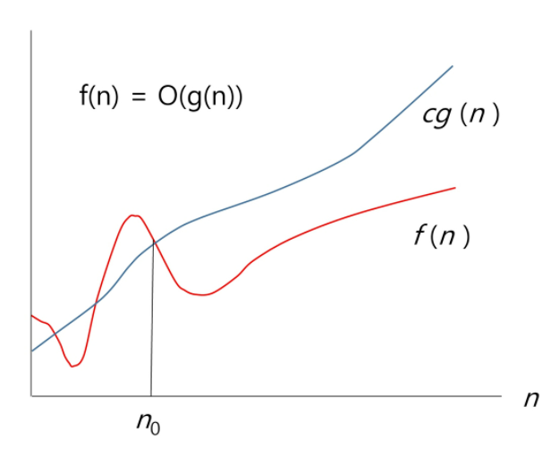
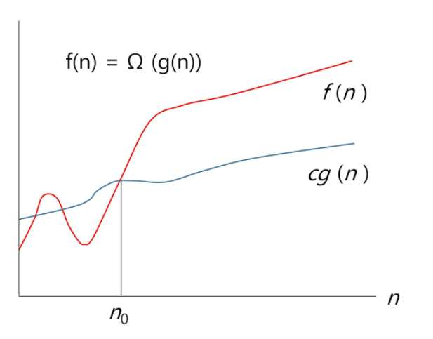
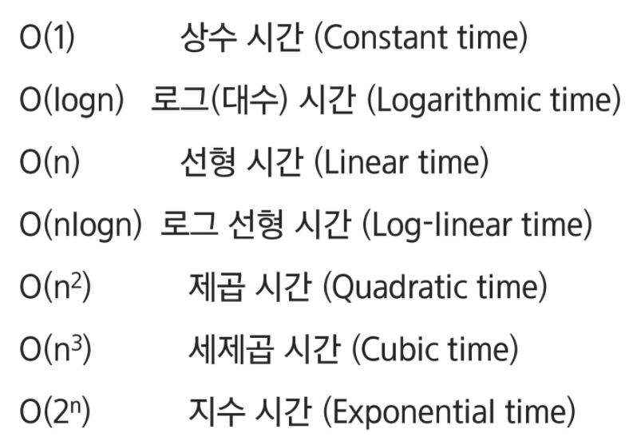

[toc]

# 09_Start

(알고리즘 응용 시작!!!!)

## 복잡도 분석

### 알고리즘

* 유한한 단계를 통해 문제를 해결하기 위한 절차나 방법이다. 주로 컴퓨터 용어로 쓰이며, 컴퓨터가 어떤 일을 수행하기 위한 단계적 방법을 말한다.
* 즉, 어떠한 문제를 해결하기 위한

### 알고리즘의 효율

* 공간적 효율성과 시간적 효율성
  * 공산적 효율성: 연산량 대비 얼마나 적은 메모리 공간을 요하는가
  * 시간적 효율성: 연산량 대비 얼마나 적은 시간을 요하는가
* 효율성을 뒤집어 표현하면 복잡도(complexity)가 된다. 복잡도가 높을수록 효율성을 저하된다.

* 시간적 복잡도 분석
  * 하드웨어 환경에 따라 처리시간이 달라진다.
    * 부동소수 처리 프로세서 존재유무, 나눗셈 가속기능 유무
    * 입출력 장비의 성능, 공유여부
  * 소프트웨어 환경에 따라 처리시간이 달라진다.
    * 프로그램 언어의 종류
    * 운영체제, 컴파일러의 종류
  * 이러한 환경적 차이로 인해 분석이 어렵다.

### 복잡도의 점근적 표기

* 시간(공간) 복잡도는 입력 크기에 대한 함수로 표기하는데, 이 함수는 주로 여러개의 항을 가지는 다항식이다.
* 이를 단순한 함수로 표현하기 위해 점근적 표기(Asymptotic Notation)을 사용한다.
* 입력 크기 n이 무한대로 커질 때의 복잡도를 간단히 표현하기 위해 사용하는 표기법은 아래와 같다
  * O: 빅오
  * Ω: 빅오메가
  * θ: 빅쎄타

#### O: 빅오 표기

* 복잡도의 점근적 상한을 나타낸다
* 복잡도가 f(n) = 2n^2 - 7n +4 라면, f(n)의 O-표기는 O(n^2)이다.
* 먼저 f(n)의 단순화된 표현은 n^2
* 단순화된 함수 n^2에 임의의 상수 c를 곱한 cn^2이 n이 증가함에 따라 f(n)의 상한이 된다.
  * 단순히 **"실행시간이 n^2에 비례"**하는 알고리즘이라고 말한다.
* 그래프로 나타내 보면,
  
  * n이 증가함에 따라 O(g(n))이 점근적 상한이라는 것
    즉, g(n)이 n0보다 큰 모든 n에 대해서 항상 f(n)보다 크다는 것을 보여준다.
  * 여기서 g(n)은 f(n)이 갖고 있는 가장 높은 차수항을 가져온다.
    간단히, 최악의 경우라고 생각하면 된다

#### Ω: 빅오메가 표기

* 복잡도의 **점근적 하한**을 의미한다.
* f(n) = 2n^2 - 7n +4 의 Ω-표기는 Ω(n^2)이다.
* f(n) = Ω(n^2)은 "n이 증가함에 따라 2n^2 - 7n +4이 cn^2보다 작을 수 없다"라는 의미인다. 이때 상수 c=1로 놓으면 된다.
* O-표기 때와 마찬가지로, 복잡도 다항식의 최고차항만 계수 없이 취하면 된다.
  그래프 상에서 큰 기울기는 최고차항에 의해서만 결정되기 때문에
* "**최소한 이만한 시간은 걸린다**" *잘해봤자 이정도다*

* 그래프로 나타내 보면,
  
  * n이 증가함에 따라 O(g(n))이 점근적 하한이라는 것
    즉, g(n)이 n0보다 큰 모든 n에 대해서 항상 f(n)보다 작다는 것을 보여준다.

#### θ: 빅쎄타 표기

* O-표기와 Ω-표기가 같은 경우에 사용한다.
* f(n) = 2n^2 + 8n + 3 = O(n^2) = Ω(n^2)이므로, f(n) = θ(n^2)이다.
* "f(n)은 n이 증가함에 따라 **n^2과 동일한 증가율을 가진다**"라는 의미

#### 자주 사용하는 O-표기

로그시간: T(n) = T(n/2) + 1

#### 왜 효율적인 알고리즘이 필요한가

* 10억개의 숫자를 정렬하는데 PC에서 O(n^2) 알고리즘은 300여 년이 걸리는 반면에, O(nlogn) 알고리즘은 5분 만에 정렬한다.
* 효율적인 알고리즘은 슈퍼텀퓨터보다 더 큰 가치가 있다. 
* 값 비싼 HW 기술 개발보다 효율적인 알고리즘 개발이 훨씬 더 경제적이다.

## 표준 입출력 방법

## 비트 연산

## 진수

## 실수

## (재귀)