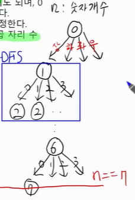
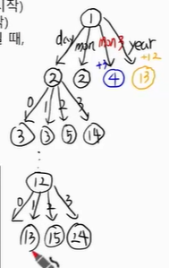
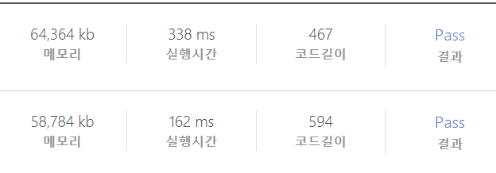
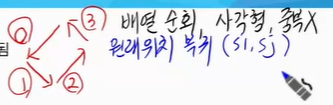
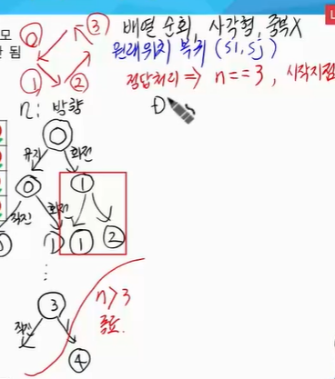
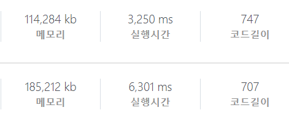

[toc]

# 0325 (문제풀이 3차)

## DFS 백트랙킹 (재귀)

* 가능한 모든 경우를 연산하여 정답을 도출 -> 무조건 정답을 구할 수 있으나, 시간 내에 가능한지 사전검토
* 복잡도를 판단하여, 이진 트리 형태의 상태 공간 트리로 설계
  * 해당 선택이 가능한지 visited, 조건, 함수 구현을 통해 판단하는 경우도 있음
* 가능한 모든 경우를 설계하여 정답 도출 후, 가지치기 고려
* 오늘 푼 세문제의 차이나는 부분은?
  * 종료조건, 어떨 때 하부함수로 넘어가는 가
* DFS로 접근하지 말아야 하는 경우는?
  * n의 크기를 보고 판단한다


### 2819 격자판의 숫자 이어 붙이기

* 시작지점을 기준으로 6번 이동 : 7자리 숫자를 구할 수 있음! -> 경우의 수는 set을 이용해서 중복을 제거하면 되겠다.

* 상태공간 트리가 4가지 갈라질 것!
  
  이때! 이동하는 곳이 범위내에 있는지 체크하는 과정이 필요할 것이다

* ```python
  def DFS(n, i, j, num):
      # 종료조건
      if n == 7:
          sset.add(num)
          return
      # 함수호출
      for di, dj in [(-1, 0), (1, 0), (0, -1), (0, 1)]:
          ni, nj = i+di, j+dj
          if 0<=ni<4 and 0<=nj<4:
              DFS(n+1, ni, nj, num*10+arr[ni][nj])
  ```


### 1952 수영장

* `lst`는 월을 인덱스로 받아서 사용할 것 -> 크기가 13

* 1월일 때: 1일권 / 한달권 / 세달권 / 연간권 선택 -> 2월일 때: 1일권 / 한달권 / 세달권 / 연간권 이렇게 된다. 
  근데 조심해야 할 것은, 1월 일때 세달권을 구매하는 것은 1 + 3 -> 4월로 넘어가야 한다!
  그리고 연간권 구매시 그 한해를 그냥 다 이용하게 되는 것이므로 이것은 최종적으로 맨 마지막에 비교를 하면 되는 것이다.

  * 
  * 종료조건: n > 12인 경우!!

* ```python
  def DFS(n, ssum):
      if n > 12:
          if ssum < ans:
              ans = ssum
          return
      # 일일권
      DFS(n+1, ssum + lst[n]*day)
      # 한달권
      DFS(n+1, ssum + mon)
      # 세달권
      DFS(n+3, ssum + mon3)
      # 일년권
      DFS(n+12, ssum + year)
  ```

* ```python
  # 두번째 방법 그리디 DP
  D = [0]*13
  for i in range(1, 13):
      mmin = D[i-1] + lst[i]*day
      mmin = min(mmin, D[i-1] + mon)
      if i >= 3:
          mmin = min(mmin, D[i-3] + mon3)
      if i >= 12:
          mmin = min(mmin, D[i-12] + year)
          D[i] = mmin
  print(f'#{tc} {D[12]}')
  ```


> DP와 비교를 해보면..
>
> 
>
> 아래가 DP로 푼 경우, 역시 함수를 여러번 호출하는 것보다는 DP가 훨씬 빠르고 메모리도 적게 사용이 된다.


### 2105 디저트 카페

* 
  이런 개념이 들어가 있다.

* 방향은 4번 꺾어서 만들면 된다!

  * n: 방향 방향은 유지 / 회전 둘 중 하나만 가능 -> n == 4 종료 조건(0부터 시작했기 때문에)

* 정답처리: n == 3번이고, 거기서 꺾었는데, 시작지점으로 복귀한다면 정답 
  

* ```python
  def DFS(n, ci, cj, v, cnt):
      # v는 내가 방문하게 된 디저트집
      # 종료 조건
      if n > 3:
          return
      
      # 정답
      if n == 3 and ci == si and cj == sj and ans < cnt:
          ans = cnt
          return
          
      # 하부 함수
      # k는 n / n+1 이 둘 중 하나밖에 안된다
     	for k in range(n, n+2):
          ni, nj = ci+di[k] cj+dj[k]
          if 0<=ni<N and 0<=nj<N and not in v:
      		DFS(k, ni, nj, v+[arr[ni][nj]], cnt+1)
  ```

  * 모든 범위에서 다 돌아야 하는가? 아니다 -> 그래서 모든 범위의 si, sj가 하는 일부를 쳐낼 수 있다
  * v를 저렇게 직접 더해서 넘기지 말고 append pop을 사용하는 것이 시간이 더 빠르다
    


## 구현

### 4366 정식이의 은행업무

* 구현 문제
* lst2 = [1, 0, 1, 0], lst3 = [2, 1, 2]

1. 이진수를 한자리씩 변경 -> 십진수 -> 3진수로 변경

   * ```python
     for i in range(len(lst2)):
         lst[i] = (lst[i]+1) % 2
         10진수 변경 후 3진수 만들기
         
         3진수를 비교해서
         
         차이가 1자리가 난다면 그 10진수 반환하기
         
         lst[i] = (lst[i]+1) % 2
     ```

2. 두 3진수를 비교하는데, 한 자리만 차이가 난다면 그게 정답!!


### 4615 재미있는 오셀로 게임

* 초기 돌 놓는 작업 이후 M번동안 반복 수행

  * si, sj, d 입력 -> `arr[si][sj] = d`

  * ```python
    for di, dj in 8방향:
        for k in (1, N):
            ni, nj = si+di*k, sj+dj*k
            if 범위내:
                if arr[ni][nj] == 0: break
                if arr[ni][nj] == d
                    s에 저장된 위치값에 d를 바꿈
                else
                	s.append(d)
            else:
                break
    ```

  * 

* 돌을 놓고, 8방향을 뻗어가면서

  * 범위 내:
    0 끝 / 같은돌 만남 후보s[] 뒤집기 끝 / 다른돌 만남 후보s[]에 넣기
  * 범위 밖: break


### 2382 미생물 격리

* M번 동안 반복

1. 각각의 미생물 이동, 경계값이면 개수를 반으로 줄이고 방향을 반대로 한다

   * ```python
     for idx in range(N):
         arr[i][0] = arr[i][0] + di[arr[i][3]]
         if 경계:
             arr[i][3] = opp[arr[i][3]]
             arr[i][2] //= 2
     ```

2. 좌표순, 개체수(내림차순)

   * ```python
     sort(key = lambda x: x[0]x[1]x[2])
     ```

3. 같은 좌표라면 => 큰 개체에 합산한다
   입력받은 것을 arr라고 하면 i, j, cnt, dir이 0 1 2 3이라는 인덱스가 될 것

   * ```python
     i = 1
     while i < N:
         if arr[i-1][0] == arr[i][0] and arr[i-1][1] == arr[i][1]:
             arr[i-1][2] += a[i][2]
             arr.pop(i)
         else:
             i += 1
     ```


### 2117 홈 방범 서비스

