[toc]

# 0330

## 분할정복

### 가짜 동전 찾기

* n개의 동전들 중에 가짜 동전이 하나 포함 -> 가짜 동전은 진짜 동전에 비해 아주 조금 가벼운데, 진짜 동전들의 무게가 동일하다고 할 때 양팔 저울을 이용해서 가짜 동전 찾아보기!
* 양팔 저울 최소로 사용해서 가짜 동전 찾는 방법은?
  * 가짜 1 진짜 23이 있다면,
    24 -> 12 /12로 비교해서 가벼운 쪽을 택함 -> 6 /6 비교해서 가벼운 쪽을 택함 ----> 가짜 동전 1개 찾기 가능!

### 설계 전략

* 분할(Divide): 해결할 문제를 여러 개의 작은 부분으로 나눈다.
* 정복(Conquer): 나눈 작은 문제를 각각 해결한다.
* 통합(Combine): (필요하다면) 해결된 해답을 모은다.

### Top-down approach

#### 거듭 제곱

* 반복(Iterative) 알고리즘: O(n)
  * 내부적으로 **반복 연산**을 한다. 덧셈 곱셈은 구조적으로 한 싸이클에 일어나는 연산. `<<` 연산(2**n)도 한번의 싸이클로 일어나는 연산이다. 하드웨어 내에서 한번에 일어날 수 있어서 한번에 연산이 일어난다.
* 분할 정복 기반의 알고리즘: O(logn)
  * 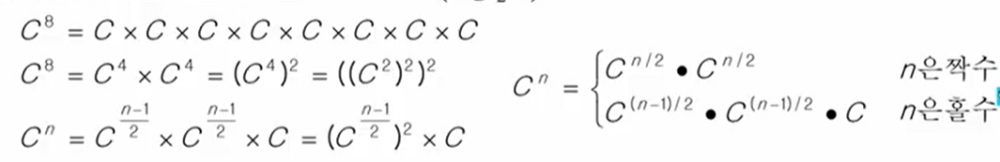
  * 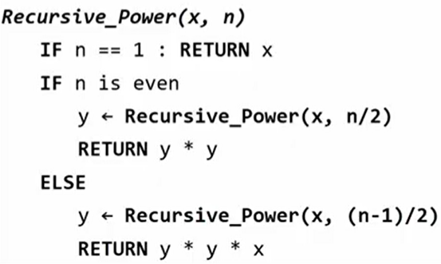

### 병합 정렬(Merge Sort)

* 여러 개의 정렬된 자료의 집합을 병합하여 한 개의 정렬된 집합으로 만드는 방식
* 분할 정복 알고리즘 활용
  * 자료를 최소 단위의 문제까지 나눈 후에 차례대로 정렬하여 최종 결과를 얻어냄
  * **top-down 방식**
* 시간 복잡도: O(nlogn)

#### 병합 정렬 과정

- [69, 10, 30, 2, 16, 8, 31, 22]를 병합 정렬하는 과정

1. 분할 단계: 전체 자료 집합에 대하여, 최소 크기의 부분집합이 될 때까지 분할 작업을 계속한다.
   {사진} -> 최소 한개 크기가 될 때까지 나눈다.
2. 병합 단계: 2개의 부분집합을 정렬하면서 하나의 집합으로 병합
   8개의 부분집합이 1개로 병합될 때까지 반복한다.
   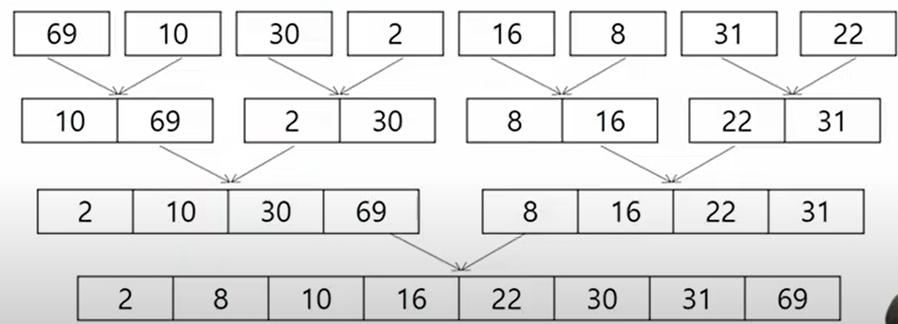
   * idx(0->len(부분집합)) 같은 idx끼리 비교해서 작은 것을 먼저 넣음 => 새로운 부분집합 생성

* 장점:
  * 구간끼리 서로 교차되는 일이 없다!!! 일부가 왔다갔다 하지 않는다. 실제 구현에서 새롭게 저장하는 것이 인덱스만 주는 방식이기 때문이다!!  
* 단점:
  * 분할 단계에서 메모리를 많이 잡아먹는다.

* 의사코드

  * 분할 과정
    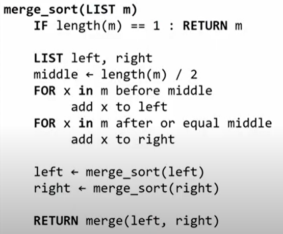

  * 병합 과정
    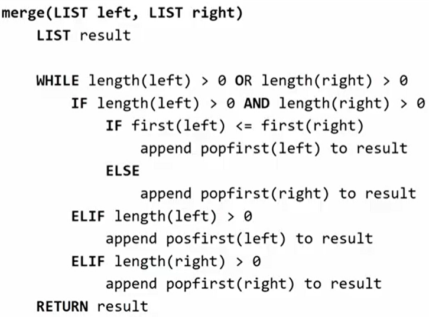

    > while 둘 중 하나라도 남아있으면
    > if 둘 다 남아있으면, 두개를 비교해서 작은 것을 넣음
    > elif 왼쪽만 남아있으면 -> 왼쪽에 다 붙이고
    > elif 오른쪽만 남아있으면 -> 오른쪽에 다 붙인다.

### 퀵 정렬

* 주어진 배열을 두개로 분할하고, 각각을 정렬한다.
* 병합 정렬과의 차이:
  * 병합 정렬은 그냥 두 부분으로 나누는 반면에, 퀵 정렬은 분할할 때 기준 아이템 중심으로 이보다 작은 것은 왼편 큰 것은 오른편에 위치시킨다.
  * 각 부분 정렬이 끝난 후, 병합 정렬은 "병합"이란 후처리 작업이 필요하나, 퀵 정렬은 필요로 하지 않는다. 

* 의사코드
  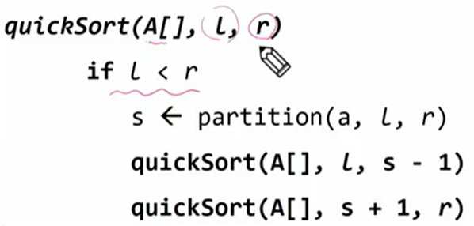
  * Hoare-Partition 알고리즘
    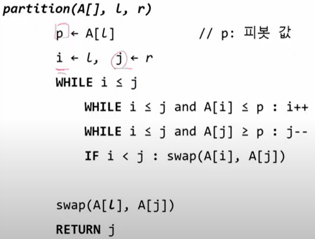 사진 수정 필요 (등호 없당)

* 아이디어

  * P값들보다 큰 값은 오른쪽, 작은 값은 왼쪽 집합에 위치하도록 한다.
    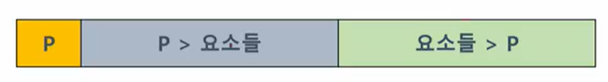
  * P를 두 집합의 가운데에 위치시킨다. (`swap`)
     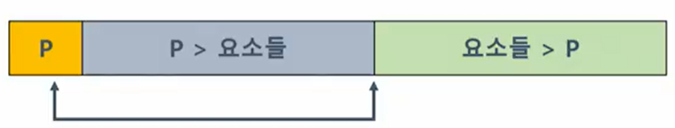
  * 피봇 선택
    * 왼쪽 끝 / 오른쪽 끝 / 임의의 세개 값 중에 중간 값
      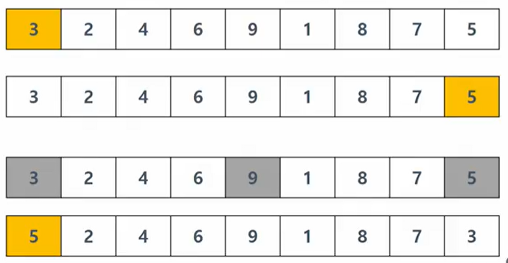

  * 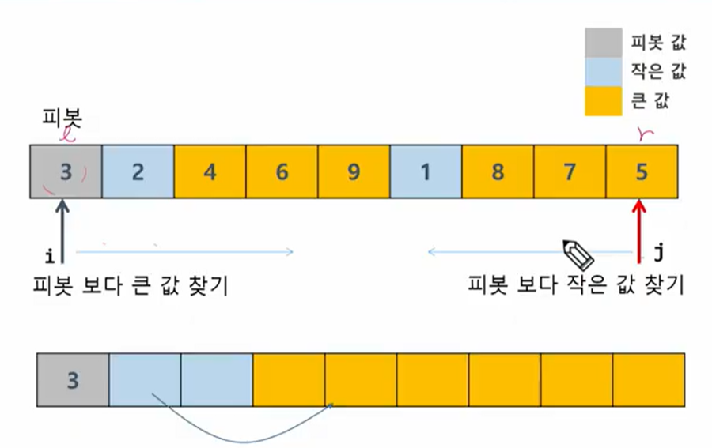
  * 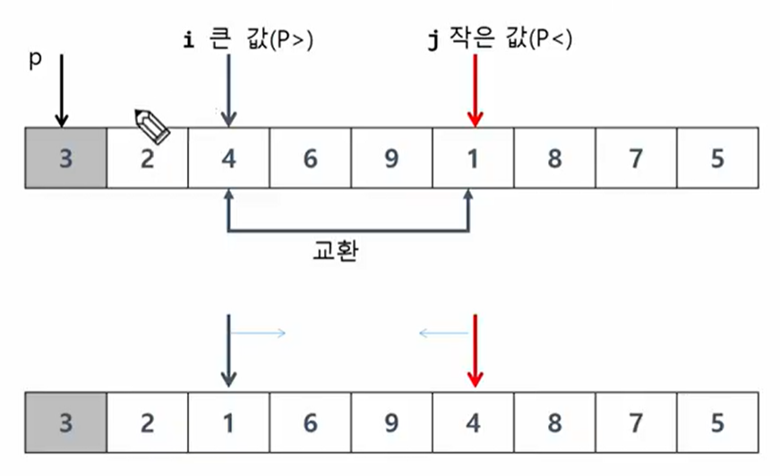
  * 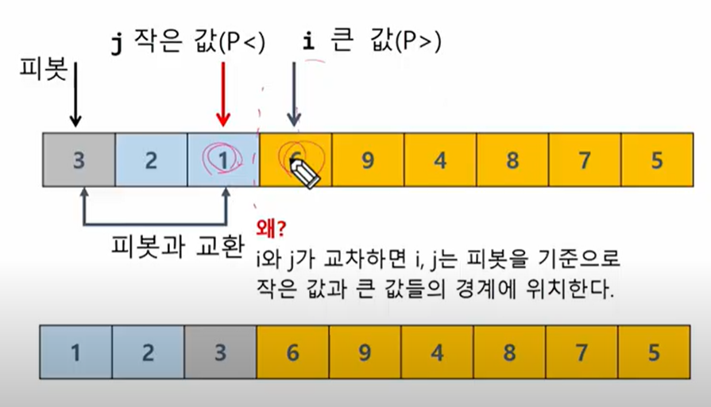
  * 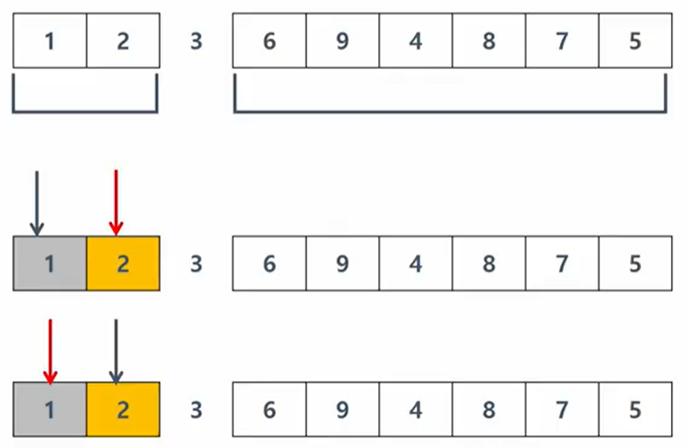
  * 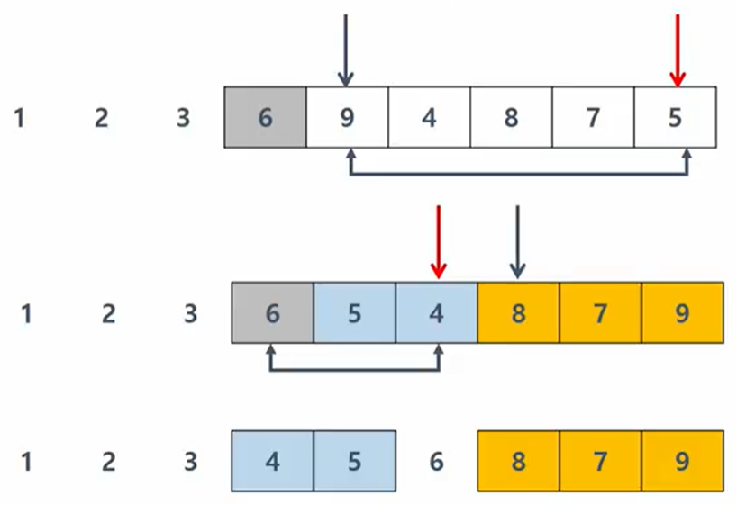

## 백트랙킹

### 상태공간트리를 구축하여 문제를 해결

#### {1, 2, 3}의 powerset을 구하는 백트래킹 알고리즘

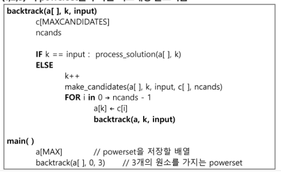

> `c[MAXCANDIDATES]`: 후보군을 저장할 배열
>
> `ncands`: 후보의 수

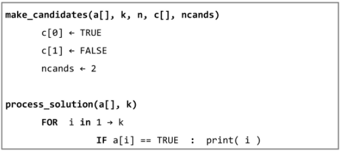

## 트리

* 싸이클이 없는 무향 연결 그래프이다
  * 두 노드 사이에는 유일하 경로가 존재한다.
  * 각 노드는 최대 하나의 부모 노드가 존재할 수 있다.
  * 각 노드는 자식 노드가 없거나 하나 이상이 존재할 수 있다.
* 비선형 구조
  * 원소들 간에 1:n 관계를 가지는 자료구조
  * 원소들 간에 계층 관계를 가지는 계층형 자료구조