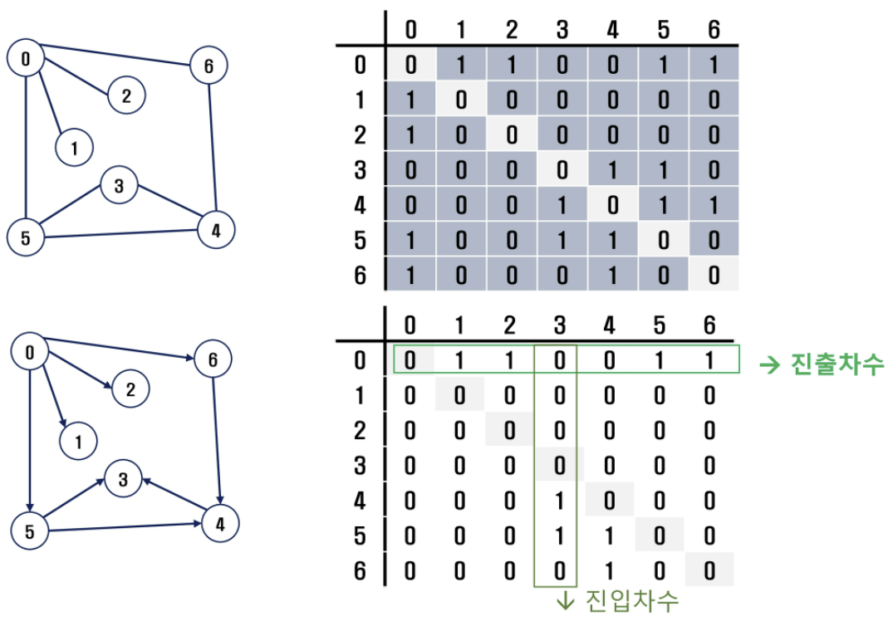
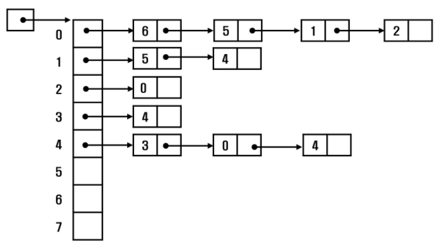
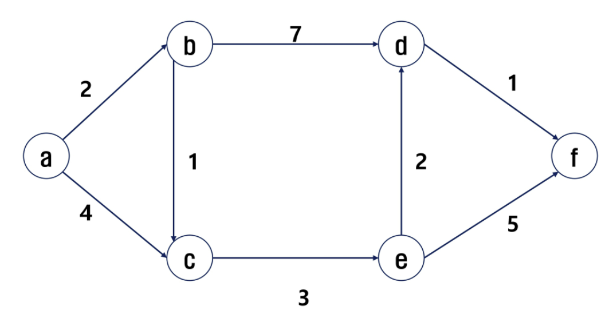
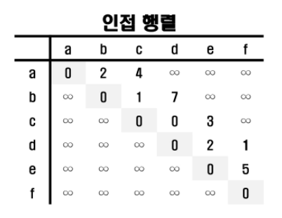
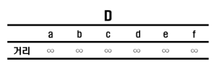
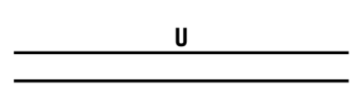

# 12_그래프

## 그래프 기본

* 그래프는 아이템(사물 또는 추상적 개념)들과 이들 사이의 연결 관계를 표현한다.
* 그래프는 정점들의 집합과 이들을 연결하는 간선들의 집합으로 구성된 자료 구조
  * V: 정점의 개수, E: 그래프에 포함된 간선의 개수
  * V개의 정점을 가지고 있는 그래프는 최대 V(V-1)/2 개의 간선이 간으
* 선형 자료구조나 트리 자료구조로 표현하기 어려운 N:N관계를 가지는 원소들을 표현하기에 용이하다.


### 그래프 유형

* 무향 그래프(Undirected Graph)
* 유향 그래프(Directed Graph)
* 가중치 그래프(Weighted Graph)
* 사이클없는 방향 그래프(DAG, Directed Acyclic Graph)


* 완전 그래프: 정점들에 대해 가능한 모든 간선들을 가진 그래프
* 부분 그래프: 원래 그래프에서 일부 정점이나 간선을 제외한 그래프


* 인접: 두개의 정점에 간선이 존재(연결됨)하면 서로 인접해 있다고 한다.
  * 완전 그래프에 속한 임의의 두 정점들은 모두 인접해 있다.


### 그래프 경로

* 경로: 간선들을 순서대로 나열한 것
  * 간선들: (0, 2), (2, 4), (4, 6)
  * 정점들: 0 - 2 - 4 - 6
* 경로 중 한 정점을 최대 한번만 지나는 경로를 **단순경로**라 한다.
  * 0 - 1 - 3 - 5 - 6
* 시작한 정점에서 끝나는 경로를 **사이클**이라고 한다.
  * 1 - 2 - 5 - 3 - 1


### 그래프 표현

* 간선의 정보를 저장하는 방식, 메모리나 성능을 고려해서 결정
* 인접 행렬
  * V * V 크기의 2차원 배열을 이용해서 간선 정보를 저장
  * 배열의 배열(포인터 배열)
* 인접 리스트
  * 각 정점마다 해당 정점으로 나가는 간선의 정보를 저장
* 간선의 배열
  * 간선(시작 정점, 끝 정점)을 배열에 연속적으로 저장


#### 인접 행렬

* 두 정점을 연결하는 간선의 유무를 행렬로 표현
  * V * V 정방 행렬
  * 행번호와 열번호는 그래프의 정점에 대응
  * 두 정점이 인접되어 있으면 1, 그렇지 않으면 0으로 표현
* 
* 무향 그래프
  * i번째 행의 합 = i번째 열의 합 = Vi의 차수
* 유향 그래프
  * 행 i의 합 = Vi의 진출 차수
  * 열 i의 합 = Vi의 진입 차수
* 인접 행렬의 단점
  * 사이즈가 커질 때 메모리 낭비가 많고, 인접 관계도 파악하기 어렵다.


#### 인접 리스트

* 각 정점에 대한 인접 정점들을 순차적으로 표현
* 하나의 정점에 대한 인접 정점들을 각각 노드로 하는 연결 리스트로 저장



* 무방향 그래프
  * 노드 수 = 간선 수 * 2
  * 각 정점의 노드 수 = 정점의 차수
* 방향 그래프
  * 노드 수 = 간선 수
  * 각 정점의 노드 수 = 정점의 진출 차수


## 그래프 탐색

## 서로소 집합들

## 최소 비용 신장 트리(MST)

## 최단 경로

* 간선의 가중치가 있는 그래프에서 두 정점 사이의경로들 중에 간선의 가중치 합이 최소인 경로


* 하나의 시작 정점에서 끝 정점까지의 최단 경로
  * 다익스트라(dijkstra) 알고리즘
    * 음의 가중치를 허용하지 않음
  * 벨만-포드(Bellman-Ford) 알고리즘
    * 음의 가중치 허용
* 모든 정점들에 대한 최단 경로
  * 플로이드-워살(Floyd-Warshall) 알고리즘


### Dijkstra 알고리즘

* 시작 정점에서 거리가 최소인 정점을 선택해 나가면서 최단 경로를 구하는 방식
* 시작 정점(s)에서 끝정점(t) 까지의 최단 경로에 정점 x가 존재한다.
* 이때, 최단 경로는 s에서 x까지의 최단 경로와 x에서 t까지의 최단 경로로 구성된다
* 탐욕 기법을 사용한 알고리즘으로 MST의 프림 알고리즘과 유사하다.



#### 알고리즘

```python
def dijkstra(s, V):
    U = [0] * (V+1)
    U[s] = 1
    for i in range(V+1):
        D[i] = adjM[s][i]
    for _ in range(V):
        minV = INF
        w = 0
        for i in range(V+1):
            if U[i] == 0 and minV > D[i]:
                minV = D[i]
                w = i
        U[w] = 1
        for v in range(V+1):
            if 0 < adjM[w][v] < INF:
                D[v] = min(D[v], D[w]+adjM[w][v])
```


* 인접 행렬 표현
  * 
* 거리 D
  * 
* 경로 U
  * 