[toc]

# 01_Django

 ## Web Framework

* Django: Python Web framework
* WWW: World Wide Web, 인터넷에 연결된 컴퓨터를 통해 정보를 공유할 수 있는 전세계적인 정보 공간

클라이언트는 서버에 접속할 수 있는 응용 프로그램, 웹 브라우저 등이 될 수 있다. 

서버는 네트워크 환경으로 클라이언트에게 정보를 제공하는 프레임워크다.


### Static web page(정적 웹 페이지)

* 서버에 미리 저장된 파일이 사용자에게 그대로 전달되는 웹 페이지
* 서버가 정적 웹 페이지에 대한 요청을 받은 경우, 서버는 추가적인 처리 과정 없이 클라이언트에게 응답을 보낸다.
* 모든 상황에서 모든 사용자에게 동일한 정보를 표시한다.
* 일반적으로 HTML, CSS, JS로 작성되며, flat page라고도 한다.


### Dynamic web page(동적 웹 페이지)

* 웹 페이지에 대한 요청을 받은 경우 서버는 추가적인 처리 과정 이후 클라이언트에게 응답을 보낸다.
* 동적 웹 페이지는 방문자와 상호작용하기 때문에 페이지 내용은 그때그때 다르다.
* 서버 사이드 프로그래밍 언어(Python, Java, C++ 등)가 사용되며, 파일을 처리하고 DB와의 상호작용이 이뤄진다.


### Framework

* 프로그래밍에서 특정 운영 체제를 위한 응용 프로그램 표준 구조를 구현하는 클래스와 라이브러리 모임
* 재사용할 수 있는 수많은 코드를 프레임워크로 통합함으로써 개발자가 새로운 애플리케이션을 위한 표준 코드를 다시 작성하지 않아도 같이 사용할 수 있도록 돕는다.
  * 0부터 시작하는 것이 아니라, 거인의 어깨위에서 시작하는 것이다.
* Application framework라고도 한다.
* 웹 페이지를 개발하는 과정에서 겪는 어려움을 줄이는 것이 주목적으로 DB 연동, 템플릿 형태의 표준, 세션 관리, 코드 재사용 등의 기능을 포함한다.
* 동적 웹 페이지나, 웹 애플리케이션, 웹 서비스 개발 보조용으로 만들어지는 Application framwork의 일종


#### Framework Architecture (구조)

* MVC Design Pattern (model-view-controller): 소프트웨어 공학에서 사용되는 디자인 패턴 중 하나
* 사용자 인터페이서로부터 프로그램 로직을 분리하여 애플리케이션의 시각적 요소나 이면에서 실행되는 부분을 서로 영향 없이 쉽게 고칠 수 있는 애플리케이션을 만들 수 있다.
* Django는 **MTV pattern**이라고 한다.


## Django Intro

### MTV pattern

1. Model
   * 응용 프로그램의 데이터 구조를 정의하고 DB의 기록을 관리(CRUD)
2. Template
   * 파일의 구조나 레이아웃을 정의
   * 실제 내용을 보여주는 데 사용된다. (presentation)
3. View
   * HTTP 요청을 수신하고 HTTP 응답을 반환한다.
   * Model을 통해, 요청을 충족시키는데 필요한 데이터에 접근한다.
   * template에게 응답의 서식 설정을 맡긴다.

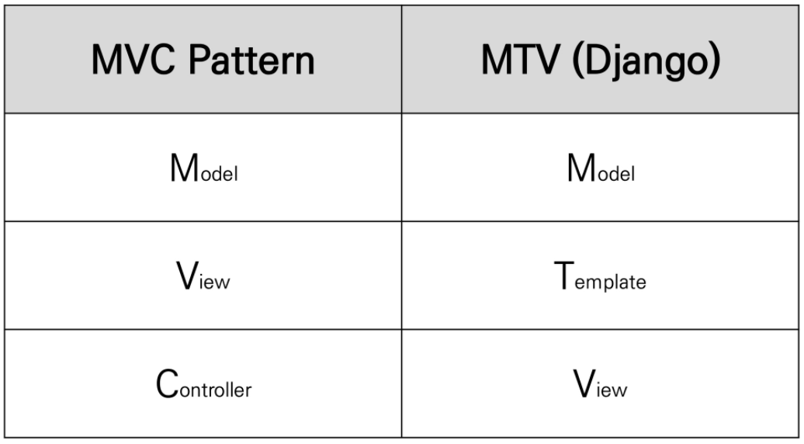

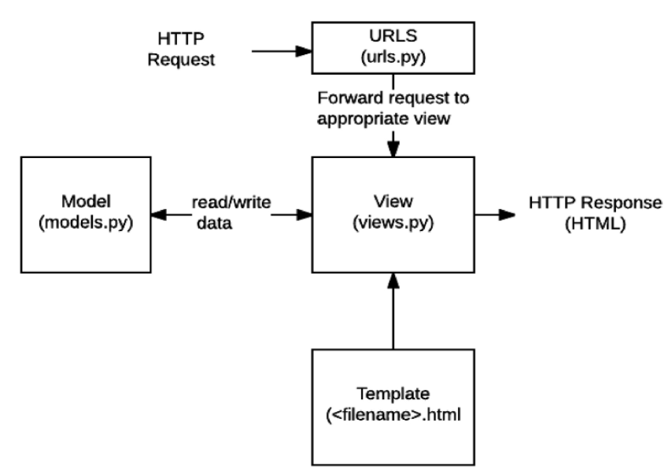

> URLS가 요청을 받아서, 적당한 view를 찾아서 view에게 전달을 한다. 
>
> 그리고 view에서는 template을 가져오거나 model과의 상호작용을 해서 응답을 다시 보낸다.


### 1. 가상환경 생성 및 활성화

가상환경 -> 독립적인 개발환경을 만들어 나가기 위해서 만든다.

나중에 프로젝트를 함께 진행했을 때, 같은 환경으로 맞추기 위해서 그 셋팅을 가상환경에서 맞춘다.

```shell
$ python -m venv venv

$ source venv/Scripts/activate
(venv)

$ pip install django==3.2.12
```

> **LTS(Long Term Support): 장기 지원 버전**
>
> 일반적인 경우보다 장기간에 걸쳐 지원하도록 고안된 SW와 버전


### 2. 프로젝트 생성 -> 서버 확인

```shell
$ django-admin startproject <프로젝트 이름> .
$ python manage.py runserver
```

> `.`은 현재 위치에 만들어라 라는 의미
>
> 실행을 하고 나면, `<프로젝트 이름>` 파일과 `manage.py`파일이 생성됨

* 프로젝트 이름에는 파이썬이나 장고에서 사용중인 키워드를 피해야 한다!! `-`도 사용할 수 없다.
  django, text, class, django-test 이런거 다 안된다.
* 서버 활성화해서 로켓 나오면 정상적으로 생성이 된 것이다.


#### 프로젝트 폴더의 구조

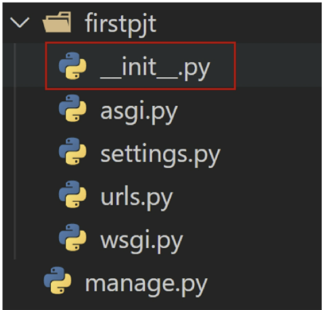

1. `__init__.py`: python에게 이 디렉토리를 하나의 python 패키지로 다루도록 지시 / *우리가 만지지 않는다.*

2. `asgi.py`: django 애플리케이션이 비동기식 웹 서버와 연결 및 소통하는 것을 도움 / *우리가 배포를 할 때 만지는 것이다.*

3. `settings.py`: 애플리케이션의 모든 설정을 포함

4. `urls.py`: 사이트의 url과 적절한 views의 연결을 지정

5. `wsgi.py`: django 애플리케이션이 웹 서버와 연결 및 소통하는 것을 도움 / *우리가 배포를 할 때 만지는 것이다*

6. `manage.py`: django 프로젝트와 다양한 방법으로 상호작용하는 커맨드라인 유틸리티

   ```shell
   $ python manage.py <command> [options]
   ```


### 3. 애플리케이션 생성 -> 등록

```shell
$ python manage.py startapp <애플리케이션 이름>
```

* 일반적으로 애플리케이션명은 복수형으로 하는 것을 권장한다.


#### 애플리케이션 폴더의 구조

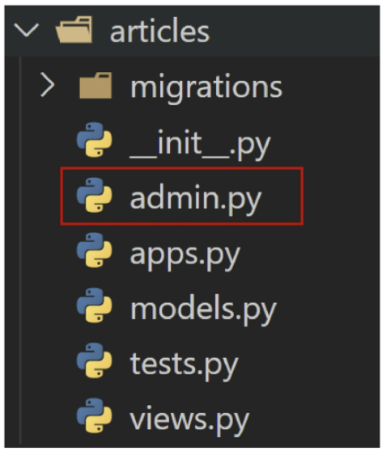

1. `admin.py`: 관리자용 페이지를 설정하는 곳
2. `apps.py`: 앱의 정보가 작성된 곳 / *우리가 건들지 않는다.*
3. `models.py`: 앱에서 사용하는 model을 정의하는 곳
4. `tests.py`: 프로젝트의 테스트 코드를 작성하는 곳 
5. `views.py`: view 함수들이 정의 되는 곳

> templates는 우리가 직접 생성한다! 폴더구조로 만들어서 그 안에 html 파일을 생성할 것이다.


### 프로젝트와 애플리케이션

* 프로젝트
  * 프로젝트는 애플리케이션의 집합이다.
  * 하나의 프로젝트에는 여러 앱이 포함될 수 있고, 앱은 여러 프로젝트에 있을 수 있다.
* 애플리케이션
  * 앱은 실제 요청을 처리하고 페이지를 보여주고 하는 등의 역할을 담당한다.
  * 일반적으로 앱은 하나의 역할 및 기능 단위로 작성한다.

* 프로젝트에서 앱을 사용하기 위해서는 반드시 `INSTALLED_APPS`리스트에 추가해야 한다. 
  이때, **꼭 앱을 생성한 후 리스트에 등록해야한다!!!!**
  * `settings.py`에 들어가서 설치한 앱을 **문자열 형태**로 입력해준다.
  * `INSTALLED_APPS`: django installation에 활성화된 모든 앱을 지정하는 문자열 목록
  * local apps -> third party apps -> django apps 순서로 작성해주는 것이 좋다.
    이 순서를 지키지 않아도 문제가 없지만, 그래도 심화 단계로 가면 순서가 의미가 있으므로 지키는 것을 권장한다.


### 추가 설정 / `settings.py`

1. `LANGUAGE_CODE`
   * 모든 사용자에게 제공되는 번역을 결정한다.
   * 이 설정이 적용되려면 `USE_I18N`이 활성화되어 있어야 한다.
2. `TIME_ZONE`
   * 데이터베이스 연결의 시간대를 나타내는 문자열 지정
   * `USE_TZ`가 `True`이고 이 옵션이 설정된 경우, DB에서 날짜 시간을 읽으면 UTC 대신 새로 설정한 시간대의 인식 날짜 & 시간이 반환된다.
   * `USE_TZ`이 `Flase`인 상태로 이 값을 설정하는 경우 에러가 발생하므로 주의한다.

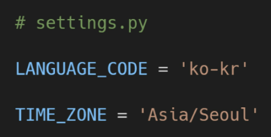

> 우리나라 버전으로 변경하는 방법!


3. `USE_I18N`
   * django의 번역 시스템을 활성화해야 하는지 여부를 설정
4. `USE_L10N`
   * 데이터의 지역화된 형식을 기본적으로 활성화할지 여부를 지정
   * True일 경우, django는 현재 locale의 형식을 사용하여 숫자와 날짜를 표시
5. `USE_TZ`
   * datetimes가 기본적으로 시간대를 인식하는지 여부를 지정
   * True일 경우, django는 내부적으로 시간대 인식 날짜 / 시간을 사용한다.

> 셋 다 그냥 True로 두면 된당


## 요청과 응답

### 1. urls.py

```python
firstpjt URL Configuration
Function views
    1. Add an import:  from my_app import views
    2. Add a URL to urlpatterns:  path('', views.home, name='home')
Class-based views
    1. Add an import:  from other_app.views import Home
    2. Add a URL to urlpatterns:  path('', Home.as_view(), name='home')
Including another URLconf
    1. Import the include() function: from django.urls import include, path
    2. Add a URL to urlpatterns:  path('blog/', include('blog.urls'))

```

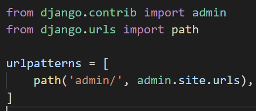

* `admin/`은 url 주소를 의미한다. <u>end slash</u>를 써준다!!
  그리고 **꼭 쉼표를 써준다!!!!** trailing comma

* views 라는 모듈을 가져오려면 이것을 import해서 가져온다.
  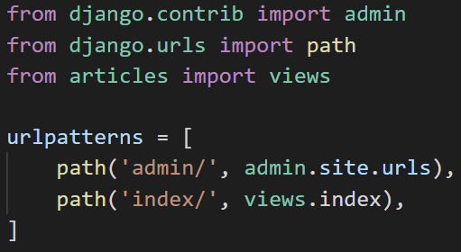


### 2. views.py

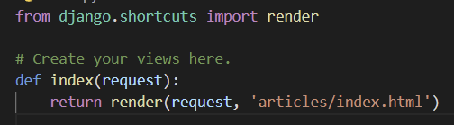

* 첫번째 필수 인자는 **`request`**다! == HTTP request 객체 
  * 이 안에 클라이언트가 보낸 모든 정보들이 있어서, 그것을 사용하는 방식이다.
  * 작성 안하면 에러난다
* **`render`**: 템플릿을 렌더링해서 보여주는 함수 


* HTTP request 를 수신하고, HTTP response를 반환하는 함수를 작성한다.
* model을 통해 요청에 맞는 필요 데이터에 접근할 수 있다.
* template에게 HTTP response 서식을 맡긴다.


### 3. templates

* 실제 내용을 보여주는데 사용되는 파일
* 파일의 구조나 레이아웃을 정의한다 (ex. html)
* `app/templates`안에 `.html`파일을 작성한다! 장고가 자동으로 이 경로를 인식해서 파일을 html 파일은 찾아준다.


## Template

* 데이터 표현을 제어하는 도구이자 표현에 관련된 로직이다
* 사용하는 built-in system: django template language


### DTL: Django Template Language

* django template에서 사용하는 built-in template system
* 조건, 반복, 변수, 치환, 필터 등의 기능을 제공
* 단순히 python이 html에 포함된 것이 아니며, **프로그래밍적 로직이 아니라 프레젠테이션을 표현하기 위한 것이다.**
* python처럼 일부 프로그래밍 구조를 사용할 수 있지만, 이것은 python 코드로 실행되는 것이 아니다!


#### 1. Variable: 변수명

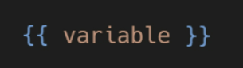

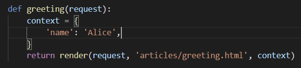

* `render()`를 사용하여 `views.py`에서 정의한 변수를 template 파일로 넘겨 사용하는 것
* 변수명은 영어, 숫자와 밑줄의 조합으로 구성될 수 있으나 밑줄로는 시작할 수 없다
  * 공백이나 구두점 문자 또한 사용할 수 없다.
* **dot(.)를 사용하여 변수 속성에 접근**할 수 있다.
* render()의 세번째 인자로 **{'key': value}와 같이 딕셔너리 형태**로 넘겨주며, 여기서 정의한 **key에 해당하는 문자열이 template에서 사용 가능한 변수명**이 된다.


#### 2. Filters: 필터명

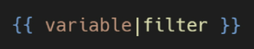

* 변수 뒤에 pipeline을 작성하고 필터를 쓴다!!!
* 표시할 변수를 수정할 때 사용하며, 60개의 built-in template filters를 제공한다.
* chained가 가능하며 일부 필터는 인자를 받기도 한다.

```django
{{ name|lower}}
# name 변수를 모두 소문자로 출력한다.

{{ variable|truncatewords:30}}
```


> 예시
>
> 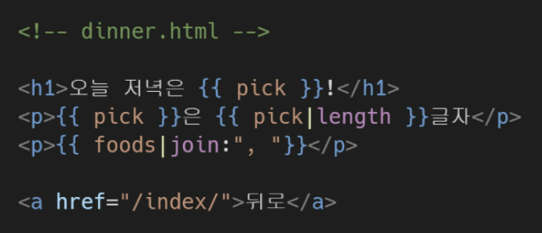


#### 3. Tags

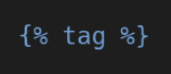

* 출력 텍스트를 만들거나, 반복 또는 논리를 수행하여 제어 흐름을 만드는 등 변수보다 복잡한 일들을 수행한다.
* 일부 태그는 시작과 종료 태그가 필요하다.
* 약 24개의 built-in templates tags를 제공한다.

> 예시
>
> 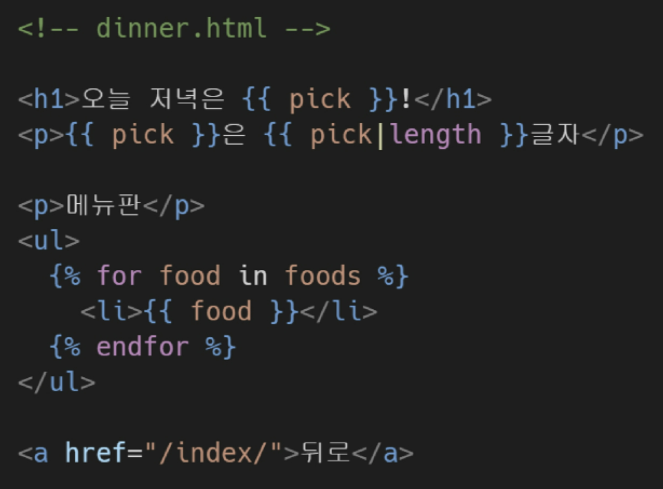
>
> foods라는 변수를 별도로 중괄호를 써서 작성하지 않아도 된다.


```django
{# forloop: for 순서의 번호를 붙여준다. 1부터~ / counter0는 0부터~ #}

<p>{{ forloop.counter }} {{ food }}</p>


{# date.items: 딕셔너리의 .items()와 같은 형태, 하지만 파이썬은 아니다! #}
{# for... empty: for문을 돌 때, 반복가능한 개체가 비었을 때 출력할 내용을 넣는다. #}



```

> 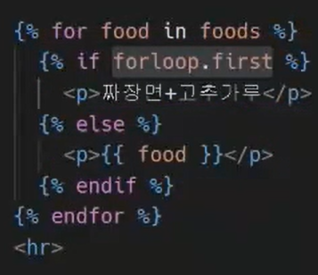
>
> 반복의 첫번째 루프일때는 짜장면+고춧가루를 출력하고, 그 외에는 {{food}}를 출력한다.

> 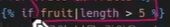
>
> 필터 부등호도 가능하다!

> 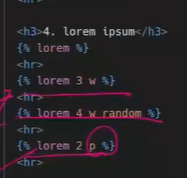
>
> w는 word, p는 paragraph / 앞에 숫자는 그것의 개수

> 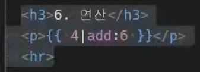
>
> 연산은 한 종류 add만 있음 이것은 필터!


#### 4. Comments

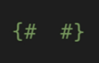

* django template에서 라인의 주석을 표현하기 위해 사용한다.
* 유효하지 않은 템플릿 코드가 포함될 수 있다.
* 한줄 주석에만 사용할 수 있고, 줄바꿈을 허용하지 않는다.
* 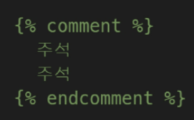
  여러 줄을 작성하려면 이것을 이용하면 된다.

> html의 주석처리를 하면 개발자 도구에서 보이고, django의 comments를 사용하면 웹페이지의 개발자 도구에서도 보이지 않는다.


### 상속

base.html -> 상속받은 자식 html 형태로 작성할 수 있다.

* 템플릿 상속은 기본적으로 코드의 재사용성에 초점을 맞춘다.
* 템플릿 상속을 사용하면 사이트의 모든 공통 요소를 포함하고, 하위 템플릿이 재정의(override) 할 수 있는 블록을 정의하는 기본 skeleton 템플릿을 만들 수 있다.

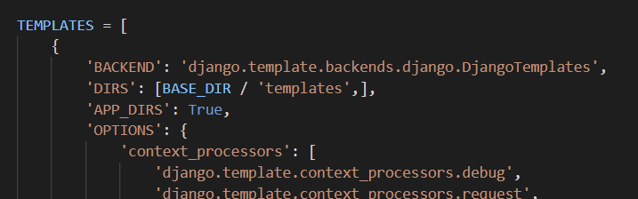

> 파이썬의 객체 지향적 파일시스템 경로를 작성하는 것이다!! 이 형태로 작성하는 것은 다양한 운영체제에서도 읽을 수 있게 하기 위함(맥에서는 역슬래시로 적는 경로를 못 읽는다.)

`BASE_DIR`은 django project를 가지고 있는 최상단 폴더를 의미한다. == django 프로젝트, 앱, venv를 모두 갖고 있는 최상단 폴더


1. 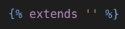
   * 자식 템플릿이 부모 템플릿을 확장한다는 것을 알림
   * 반드시 자식 템플릿의 최상단에 작성되어야 한다!!! 아니면 에러 뜬다.
2. 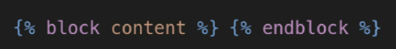
   * 자식 템플릿에서 재정의(override)할 수 있는 블록을 정의한다.
   * 즉, 자식 템플릿이 내용을 채울수 있는 공간이 된다.
3. 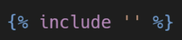
   * 템플릿을 로드하고 현재 페이지로 렌더링 한다.
   * 템플릿 내에 다른 템플릿을 포함하는 방법: base 안에 nav, footer를 포함시키는 형식
   * 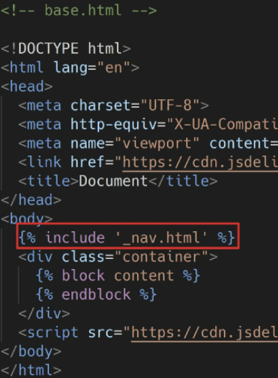
   * 파일명 앞에 `_`를 붙인 것은 관행적으로 사용되는 것으로, 단순히 include되는 템플릿이라는 것을 분류하기 위함이다. 특수한 기능이나 규칙을 포함하지는 않는다.

즉, 이런 형태로 확장 받고 오버라이드가 될 수 있는 것이다!

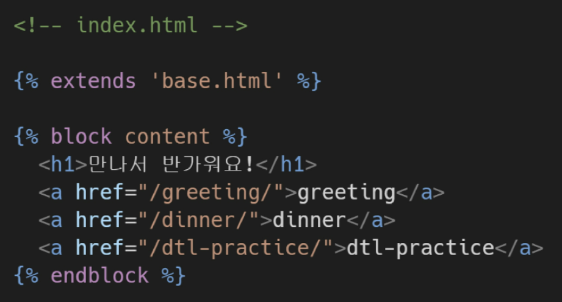


* **DTL과 Django 설계 철학**
  * **표현과 로직을 분리한다.**
    * 템플릿 시스템은 표현을 제어하는 도구이자 표현에 관련된 로직일 뿐이라고 생각한다.
    * 즉, 템플릿 시스템은 이러한 기본 목표를 넘어서는 기능을 지원하지 말아야 한다.
  * **중복을 배제한다**
    * 대다수의 동적 웹사이트는 공동 헤더, 풋터, 내브바같은 사이트 공통 디자인을 갖는다.
    * django 템플릿 시스템은 이러한 요소를 한 곳에 저장하기 쉽게 하여 중복 코드를 없애야 한다.
    * 이것이 템플릿 상속의 기초가 되는 철학이다!!


## HTML Form

### 1. `form`

* 웹에서 사용자 정보를 입력하는 여러 방식(text, button, checkbox, file, hidden, image, password, radio, reset, submit)을 제공하고, 사용자로부터 할당된 데이터를 서버로 전송하는 역할을 담당한다
* 핵심 속성
  * `action`: 입력 데이터가 전송된 URL을 지정
  * `method`: 입력 데이터의 전달 방식을 지정


### 2. `input`

* 사용자로부터 데이터를 입력 받기 위해 사용
* type 속성에 따라 동작 방식이 달라진다
* 핵심 속성
  * `name`: 양식을 제출했을 때, name이라는 이름에 설정된 값을 넘겨서 값을 가져올 수 있다. (중복 가능하다!!)
    * 주요 용도는 GET/POST 방식으로 서버에 전달하는 파라미터(name은 key로, value는 value)로 매핑하는 것
    * GET 방식에서는 URL에서 **`?key=value&key=value`** 형식으로 데이터를 전달한다.


### 3. `label`

* 사용자 인터페이스 항목에 대한 설명(caption)을 나타낸다
* `label`과 `input` 요소와 연결하기
  * `input`에는 `id`를 부여
  * `label`에는 `input`의 `id`와 동일한 값의 `for` 속성이 필요
* `label`과 `input` 요소 연결의 주요 이점
  * 시각적인 기능뿐만 아니라 화면 리더기에서 label을 읽어 사용자가 입력해야 하는 텍스트가 무엇인지 더 쉽게 이해할 수 있도록 돕는 프로그래밍적 이점도 있다.
  * label을 클릭해서 input에 초점을 맞추거나 활성화시킬 수 있다.
* `for`
  * 이 속성의 값과 일치하는 `id`를 가진 문서의 첫번째 요소를 제어
  * 연결된 요소가 label될 수 있는 요소(`button`, `input`, `select`, `textarea` 등..)인 경우, 이 요소에 대한 labeled control이 된다.
* `id`
  * 전체 문서에서 고유해야 하는 식별자를 정의한다.
  * 사용 목적: linking, scripting, styling시 요소를 식별한다.


### 4. HTTP

* Hyper Text Transfer Protocol
* 웹에서 이뤄지는 모든 데이터 교환의 기초
* 주어진 리소스가 수행할 작업을 나타내는 request methods를 정의한다.
* HTTP request method 종류: `GET`, `POST`, `PUT`, `DELETE` 등..


#### HTTP request method: `GET`

* 서버로부터 정보를 조회하는 데 사용
* 데이터를 가져올 때만 사용해야 한다
* 데이터를 서버로 전송할 때 body가 아닌 Query String Parameters를 통해 전송
* 우리는 서버에 요청을 하면 HTML 문서 파일 한 장을 받는데, 이때 사용하는 요청의 방식의 GET

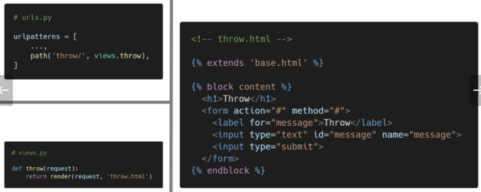

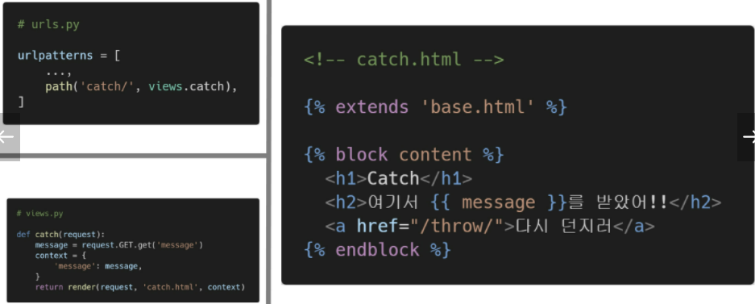


## URL

* dispatcher(발송자, 운항 관리자)로서의 URL
* 웹 애플리케이션은 URL을 통한 클라이언트의 요청에서부터 시작된다.


### Variable Routing

* URL 주소를 변수로 사용하는 것
* URL의 일부를 변수로 지정하여 view 함수의 인자로 넘길 수 있다.
* 즉, 변수 값에 따라 하나의 path()에 여러 페이지를 연결시킬 수 있다

```python
urlpatterns = [
    path('detail/<int:pk>/')
]
```

> pk번호에 따라 해당 번호의 레코드의 detail을 보여줄 수 있다.


#### URL path converters

* `str`
  * `/`를 제외하고 비어있지 않은 모든 문자열과 매치
  * 작성하지 않을 경우 기본값
* `int`
  * 0 또는 양의 정수와 매치
* `slug`
  * ASCII 문자 또는 숫자, 하이픈 및 밑줄 문자로 구성된 모든 슬러그 문자열과 매치
  * ex) building-your-1st-django-site
* `uuid`
* `path`

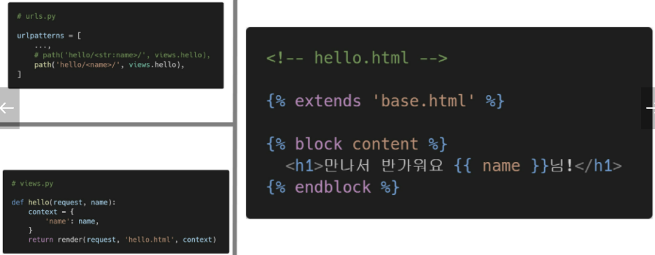


| urls.py                                                      | views.py                                                     |
| ------------------------------------------------------------ | ------------------------------------------------------------ |
| 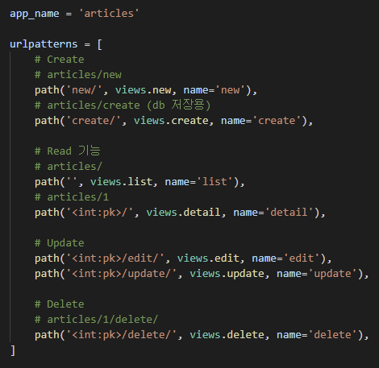 | 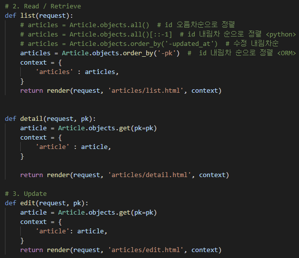 |


### App URL mapping

* app의 view 함수가 많아지면서 사용하는 path() 또한 많아지고, app 또한 더 많이 작성되기 때문에 프로젝트의 urls.py에서 모두 관리하는 것은 프로젝트 유지보수에 좋지 않다.
* 그래서 **각 app의 urls.py를 작성한다!!**
* `include()`
  * 다른 URLconf(`app1/urls.py`)들을 참조할 수 있도록 도움
  * 함수 `include()`를 만나게 되면, URL의 그 시점까지 일치하는 부분을 잘라내고, 남은 문자열 부분을 후속 처리를 위해 include된 URLconf로 전달
* django는 명시적 상대경로(`from .module import ..`)를 권장한다.

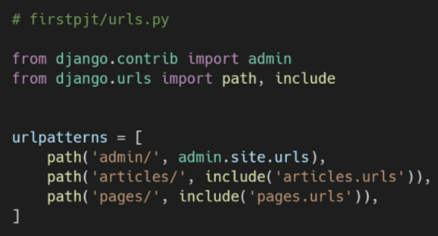


### Naming URL patterns

* 이제는 링크에 url을 직접 작성하는 것이 아니라 path() 함수의 name 인자를 정의해서 사용한다
* DTL 중 하나인 `url`태그를 사용해서 path() 함수에 작성한 name을 사용할 수 있다
* url 설정에 정의된 특정한 경로들의 의존성을 제거할 수 있다.

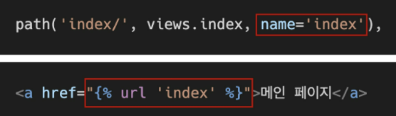

* `url` 태그: 주어진 url 패턴 이름 및 선택적 매개 변수와 일치하는 절대 경로 주소를 반환한다.

  * 템플릿에 url을 하드 코딩하지 않고도 DRY 원칙을 위반하지 않으면서 링크를 출력하는 방법

  * 우리가 app에서 사용할 때는, `app_name = '<앱이름>'` 으로 작성해주고,

    ```django
    <a href="">{{article.title}}</a>
    ```

    이런 식으로, 접근해준다. 만약 variable routing을 위한 추가 인자가 필요하다면 그것도 넘겨준다