[toc]

# 01_DB_SQL&ORM

## DB(데이터베이스)

* 데이터베이스는 체계화된 데이터의 모임
* 여러 사람이 공유하고 사용할 목적으로 통합 관리되는 정보의 집합
* 논리적으로 연관된 (하나 이상의) 자료의 모음으로 그 내용을 고도로 구조화 함으로써 검색과 갱신의 효율화를 꾀한 것
* 즉, 몇 개의 자료 파일을 조직적으로 통합하여 자료 항목의 중복을 없애고 자료를 구조화하여 기억시켜 놓은 자료의 집합체

* DB 사용으로 얻는 장점
  * 중복 최소화, 무결성(정확한 정보를 보장), 일관성, 독립성, 표준화, 보안 유지


## RDB(Relational Database: 관계형 데이터베이스)

* 키와 값들의 간단한 관계를 표 형태로 정리한 데이터베이스
* 관계형 모델에 기반 (*엑셀에서 만드는 표 형태 정도로 생각하면 됨*)
  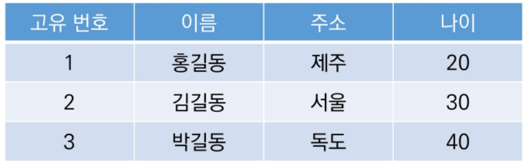


### RDB 용어 정리

* 스키마: 데이터베이스에서 자료의 구조, 표현방법, 관계 등 전반적인 명세를 기술한 것
  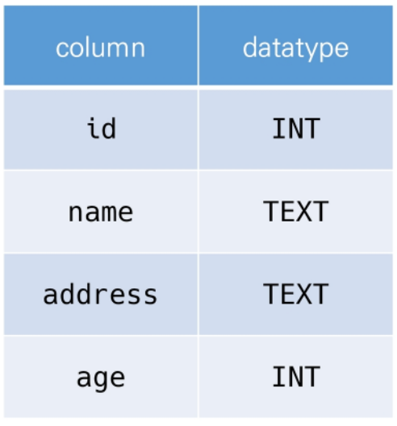
* 테이블: 열(컬럼/필드)과 행(레코드/값)의 모델을 사용해 조직된 데이터 요소들의 집합
  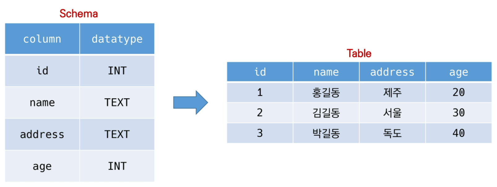
* 열: 각 열에는 고유한 데이터 형식이 지정된다
* 행: 실제 데이터가 저장되는 형태
  * 위 예시에서는 3개의 행이 있으므로 레코드가 3개 있다라고 말할 수 있다.
* 기본키(Primary Key): 각 행(레코드)의 고유값
  * 반드시 설정해야 하며, 데이터베이스 관리 및 관계 설정 시 주요하게 활용된다.


## RDBMS(관계형 데이터베이스 관리 시스템)

* Relational Database Management System
* 관계형 모델을 기반으로 하는 데이터베이스 관리시스템을 의미한다.
  * MySQL, ORACLE, SQLite 등..


### SQLite

* 서버 형태가 아닌 파일 형식으로 응용 프로그램에 넣어서 사용하는 비교적 가벼운 DB
* 구글 안드로이드 OS에 기본적으로 탑재된 DB이며, 임베디드 소프트웨어에서도 많이 활용된다.
* 로컬에서 간단한 DB구성을 할 수 있으며, 오픈소스 프로젝트이기 때문에 자유롭게 사용 가능하다.


#### Data type

1. Null: 값이 없음을 표현하는 값 (*파이썬의 None과 같다고 보면 됨*)
2. INTEGER: 크기에 따라 0, 1, 2, 3, 4, 6, 8바이트에 저장된 부호 있는 정수
3. REAL: 8바이트 부동 소수점 숫자로 저장된 부동 소수점 값
4. TEXT
5. BLOB: 입력된 그대로 정확히 저장된 데이터 (별다른 타입 없이 그대로 저장)

> SQLite는 동적 data type을 가지고 있음. 정적과 반대되는 개념. 타입을 지정하지 않거나 하는 경우 타입 선호도라는 것으로 변경이 된다.


#### Type Affinity

* 특정 컬럼에 저장하도록 권장하는 데이터 타입
  * 같은 정수더라도 많은 Date type 이름이 존재하게 된다. 결과적으로 선호도는 INTEGER로 통합되게 된다.
    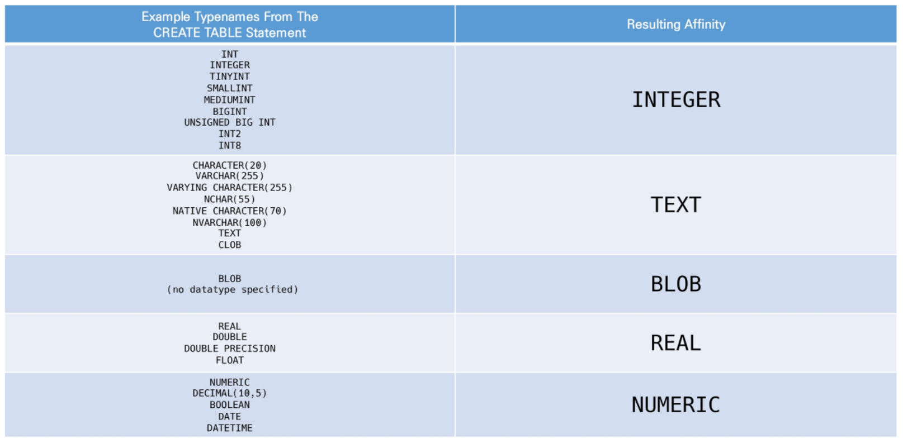
    numeric은 위에서 지정되지 않는 아이들이다. 우리는 처음 쓸때부터 Affinity로 정의할 것이다.


## SQL

* RDBMS의 데이터 관리를 위해 설계된 특수 목적의 프로그래밍 언어
* 데이터베이스 스키마 생성 및 수정
* 자료의 검색 및 관리
* 데이터베이스 객체 접근 조정 관리


### SQL 분류

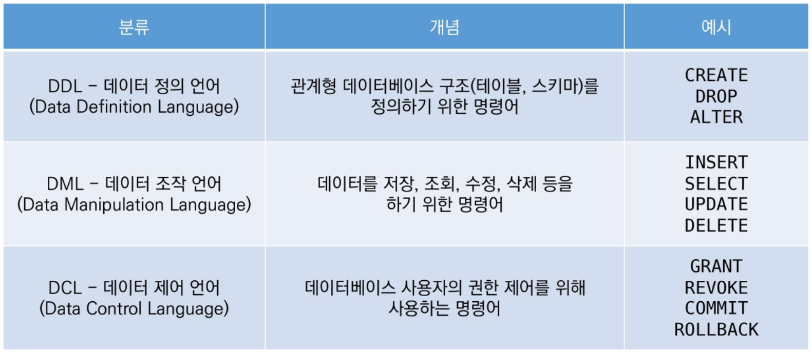

> 데이터 조작언어가 CRUD를 담당한다. 그래서 이 부분을 중요하게 다룰 것이다. 제어 언어는 특별히 다루지 않을 것이다.


#### DML: 데이터 조작언어

* `INSERT`: 새로운 데이터 삽입(추가)
* `SELECT`: 저장되어있는 데이터 조회
* `UPDATE`: 저장되어있는 데이터 갱신
* `DELETE`: 저장되어있는 데이터 삭제


### SQLite3 실행하기

```shell
$ sqlite3 tutorial.sqlite3
```

> sqlite를 사용할 수 있는 shell이 오픈되었음. 아직 db를 생성한 것은 아니다!

```shell
sqlite> .database
```

> db를 처음으로 생성했음 => tutorial.sqlite3 생성됨 (django에서는 db.sqlite3였다.)

`.`은 sqlite 프로그램의 기능을 실행하는 것이다 (SQL의 언어는 아니다!)

```shell
sqlite> .mode csv			# csv를 읽을 수 있는 모드 활성화
sqlite> .import hellodb.csv examples  # csv파일을 examples라는 이름의 테이블로 import
sqlite> .tables  # 지금 있는 tables 목록 가져오기
examples
```

> 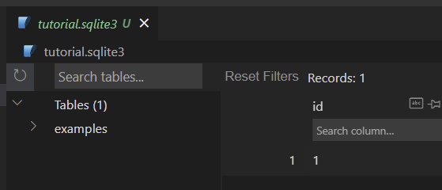
> import 되었음을 확인했다.


```shell
sqlite> SELECT * FROM examples;
1,"길동","홍",600,"충청도",010-0000-0000
```

```shell
sqlite> .headers on  # 열 이름까지 나옴
sqlite> SELECT * FROM examples;
id,first_name,last_name,age,country,phone
1,"길동","홍",600,"충청도",010-0000-0000
```

```shell
sqlite> .mode column  # 열 이름과 레코드를 구분해준다.
```

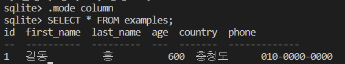


> sql query 파일 생성:
>
> `ctrl + shift + p` 누른 후 SQLite: New Query 클릭하면  sql 파일 생성

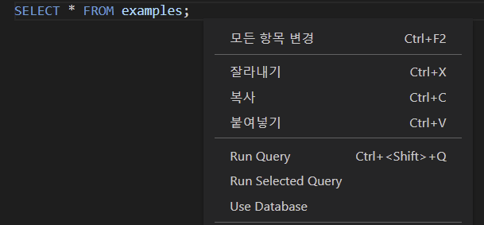

실행을 위해서는 우클릭 후 `Run Query` or `Run Selected Query`를 클릭한다.
Run Query 클릭 후 어떤 db인지를 선택해주면 된다!! (우리는 tutorial.sqlite3)


### 테이블 생성과 삭제

#### `CREATE TABLE`

* DB에서 테이블 생성
* 스키마를 작성하는 것이다.
  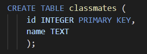

#### `DROP TABLE`

* DB에서 테이블 제거
  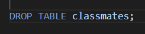


### CRUD 기본

#### 1. CREATE

##### `INSERT`

* 테이블에 단일 행 삽입

* 

* ```sql
  INSERT INTO classmates (name, age) VALUES ('홍길동', 23);
  ```

  비어있는 열 값이 있다면 Null로 저장된다.

  ```sql
  -- 모든 열에 값을 넣는 경우 특별히 컬럼을 지정하지 않아도 된다.
  INSERT INTO classmates VALUES ('김혜림', 27, '서울시 양천구');
  ```

* ```sql
  SELECT rowid, * FROM classmates;
  ```

  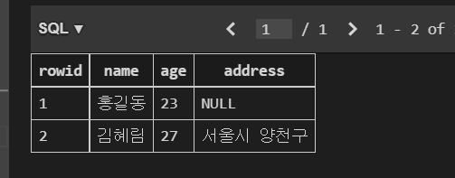


* INSERT 문을 실행하고 나서 db를 확인해보면, id가 존재하지 않는다.
  * 이때 `rowid`를 `SELECT` 문에 포함에서 조회하면 같이 출력된다.
  * SQLite는 따로 **`PRIMARY KEY` 속성의 컬럼을 작성하지 않으면** **값이 자동으로 증가하는 PK 옵션을 가진 `rowid` 컬럼을 정의**한다.

* DB에 Null 값이 들어가 있는 것은 괜찮은가?

  * 안된다.

  * 꼭 필요한 정보라면 빈 값으로 되면 안된다. 그래서 Null이 들어가면 안된다는 의미의 `NOT NULL`을 처음 스키마 작성때 넣어준다.

    ```sql
    CREATE TABLE classmates (
        id INTEGER PRIMARY KEY,
        name TEXT NOT NULL,
        age INT NOT NULL,
        address TEXT NOT NULL
        );
    ```

    > 여기서 `INT`라고 작성된 타입도 결국엔 동적 데이터 타입이므로 `INTEGER`로 변하게 될 것이다.

  * 이렇게 지정하고, 컬럼 값이 비어있는 코드를 실행하게 된다면, 에러가 뜬다. 심지어는 `id`도 지정을 해줘야 한다.
    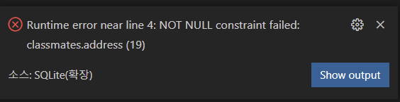

    * id 지정 방법 1) `id`를 포함한 모든 value를 작성
      매번 INSERT 할 때마다 id에 해당하는 숫자를 넣어준다.
    * id 지정 방법 2) 각 value에 맞는 column들을 명시적으로 작성
      id를 제외한 나머지 컬럼을 지정해서 INSERT를 해준다.

* 주의사항!!

  * `PRIMARY KEY` 속성을 줄때는 꼭 데이터 타입을 `INTEGER`로만 줘야 한다.


* INSERT 여러 레코드는 어떻게 할까?

  * ```sql
    -- INSERT 5명 넣어보기 
    INSERT INTO classmates
    VALUES
    ('김씨', 20, '서울'),
    ('우씨', 20, '서울'),
    ('곡씨', 20, '서울'),
    ('박씨', 20, '서울'),
    ('공씨', 20, '서울');
    ```

  * 이렇게 `VALUES`에 5명을 넣는다!


#### 2. READ

##### `SELECT`  

* 테이블에서 데이터를 조회
  

* SQLite에서 가장 복잡한 문이며 다양한 절과 함께 사용된다.
  `ORDER BY`, `DISTINCT`, `WHERE`, `LIMIT`, `GROUP BY` 등..


##### `LIMIT`

* 쿼리에서 반환되는 행의 수를 제한한다.
  

* ```sql
  -- 3개의 행만 조회한다
  SELECT * FROM classmates LIMIT 3;
  ```

* 특정 행부터 시작해서 조회하려고 한다면 `OFFSET` (~부터)키워드와 함께 사용

* ```sql
  -- LIMIT(개수) + OFFSET(몇번부터인지?)
  -- 3번째 행 하나만 보겠다!
  SELECT rowid, name FROM classmates LIMIT 1  OFFSET 2 ;
  -- 시작이 0번이라고 생각하면 쉽다
  ```

* > `OFFSET`
  >
  > 동일 오브젝트 안에서 오브젝트는 처음부터 주어진 요소나 지점까지의 변휘차(위치 변화량)을 나타내는 정수형
  >
  > 문자열 'abcdef'에서 문자'c'는 시작점' a'에서 2의 OFFSET을 지닌다.
  >
  > `SELECT * FROM my_table LIMIT 10 OFFSET 5;`
  > 6번째 행부터 10개 행을 조회한다.


##### `WHERE`

* 쿼리에서 반환된 행에 대한 특정 검색 조건을 지정한다.
  

* ```sql
  SELECT rowid, name FROM classmates WHERE address='서울';
  ```


##### `DISTINCT`

*  조회 결과에서 특정 컬럼을 기준으로 중복없이 조회한다.
  `SELECT DISTINCT` 처럼 키워드 바로 뒤에 작성해야 한다.
  

* ```sql
  SELECT DISTINCT age FROM classmates;
  ```

  classmates 테이블의 나이 행에 있는 값을 중복 제거해서 가져온다.


#### 3. DELETE

##### `DELETE`

* 테이블에서 행을 삭제한다.
  
  특정 조건을 넣기 위해서 `WHERE`를 같이 사용한다.

* 중복 불가능한 값인 `rowid`를 기준으로 삭제한다.

  ```sql
  DELETE FROM classmates WHERE rowid=5;
  ```

* 지워진 id 5는 어떻게 될까? 새로 INSERT를 해보자 => SQLite는 기본적으로 id를 재사용한다! 

  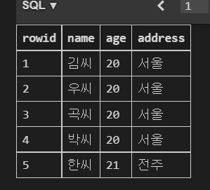

  > 5를 지우고 새로 한씨를 INSERT했는데, 다시 5를 사용했다.

* django처럼 재사용하지 않게 하려면 `AUTOINCREMENT` 속성을 추가하면된다. 
  맨 처음에 테이블을 생성할 때 이 속성을 넣어서 만든다.
  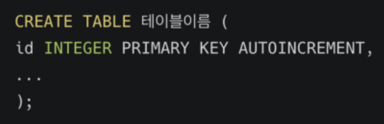

* > django의 경우 migrate를 할 때 SQL문에서 기본적으로 `AUTOINCREMENT`가 들어가 있고, `NOT NULL`도 들어가 있다.


#### 4. UPDATE

##### `UPDATE`

* 기존 행의 데이터를 수정, `SET`에서 테이블의 각 열에 대해 새로운 값을 설정
  

* 조건을 통해 특정 레코드를 수정, 중복 불가능한 값인 rowid를 기준으로 수정하자!

* ```sql
  UPDATE classmates 
  SET name='홍길동', address='제주도'  # 어떻게 바꿀 것인지를 적는다
  WHERE rowid=5;
  ```


**정리하기**

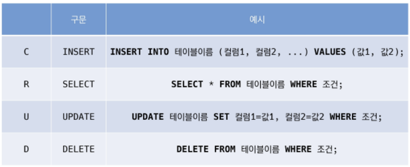


### WHERE

> 시작하기 전, csv 파일을 db로 import 하려면
>
> 우선 CREATE TABLE을 해서 어떤 열에 어떤 데이터 타입이 들어오는지 스키마를 작성해준다. 그리고 생성된 테이블 이름에 import를 해주면 된다.
>
> ```shell
> $ sqlite3 tutorial.sqlite3
> sqlite> .mode csv			
> sqlite> .import users.csv users 
> ```

* users 테이블에서 age가 30 이상인 유저의 모든 칼럼을 조회한다면?

  ```sql
  SELECT * FROM users WHERE age >= 30;
  ```

* users 테이블에서 age가 30 이상인 유저의 이름만 조회한다면?

  ```sql
  SELECT first_name FROM users WHERE age >= 30;
  ```

* age가 30 이상이고 성이 '김'인 사람의 나이와 성만 조회하려면? (`AND` `OR`도 사용 가능)

  ```sql
  SELECT age, last_name, first_name FROM users WHERE age >= 30 AND last_name='김';
  ```

  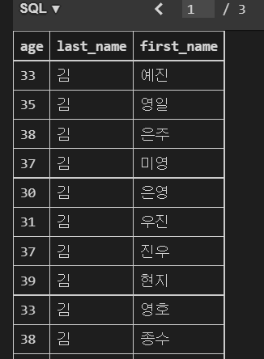


### Aggregate Functions (집계 함수)

* 값 집합에 대한 계산을 수행하고 단일 값을 반환한다. 즉, 여러 행으로부터 하나의 결과값을 반환하는 함수
* SELECT 구문에서만 사용된다


* `COUNT`: 그룹의 항목 수를 반환

  * 

  * 레코드의 총 개수 조회하기

    ```sql
    SELECT COUNT(*) FROM users;
    ```


-  `AVG`: 모든 값의 평균을 계산 (여기부터 있는 예시들은 모두 해당 컬럼이 `INTEGER` 타입일 때만 사용가능)

  - 30살 이상인 사람들의 평균 나이는?

    ```sql
    SELECT AVG(age) FROM users WHERE age >= 30;
    ```

  - 30살 이상인 사람들의 평균 잔액은?

    ```sql
    SELECT AVG(balance) FROM users WHERE age >= 30;
    ```

- `MAX`: 그룹에 있는 모든 값의 최대값을 가져온다.

  - 계좌 잔액이 가장 높은 사람의 이름과 그 액수는?

    ```sql
    SELECT first_name, MAX(balance) FROM users;
    ```

- `MIN`: 그룹에 있는 모든 값의 최소값을 가져온다.
- `SUM`: 모든 값의 합을 계산한다.


### LIKE

* 패턴 일치를 기반으로 데이터를 조회하는 방법
* 2가지 wildcard를 제공한다
  * `%`: 0개 이상의 문자
  * `_`: 임의의 단일 문자

> Wildcard
>
> 파일을 지정할 때, 구체적인 이름 대신에 여러 파일을 동시에 지정할 목적으로 사용하는 특수 기호
> 주로 특정한 패턴이 있는 문자열 혹은 파일을 찾거나, 긴 이름을 생략할 때 쓰인다.
> 텍스트 값에서 알 수 없는 문자를 사용할 수 있는 특주 문자로, 유사하지만 동일한 데이터가 아닌 여러 항목을 찾기에 매우 편리한 문자
> 지정된 패텬 일치를 기반으로 데이터를 수집하는 데도 도움이 될 수 있다.

* 

* |                     `%`                      |                      `_`                       |
  | :------------------------------------------: | :--------------------------------------------: |
  | 이자리에 문자열이 있을 수도, 없을 수도 있다. | 반드시 이 자리에 한 개의 문자가 존재해야 한다. |
  |     `ss%fy`: ssfy, ssafy ssaaaaafy 가능      |       `ss_fy`: ssafy, ssofy, ssify 가능        |

* 사용 예시
  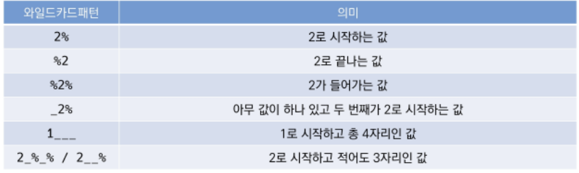

  * 나이가 20대인 사람만 조회한다면

    ```sql
    SELECT * FROM users WHERE age LIKE '2_' ;
    ```

    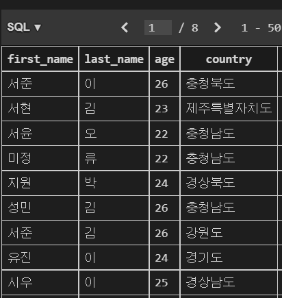

    > 만약 `LIKE '2%'`를 썼다면, 2살이나 200살도 나오게 된다.

  * 지역 번호가 02인 사람만 조회한다면?

    ```sql
    SELECT first_name, phone FROM users WHERE phone LIKE '02-%'; 
    ```

    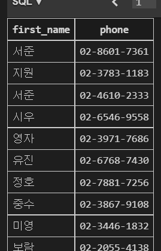

  * 이름이 '준'으로 긑나는 사람만 조회한다면

    ```sql
    SELECT * FROM users WHERE first_name LIKE '%준';
    ```

  * 중간 번호가 5114인 사람만 조회한다면

    ```sql
    SELECT first_name, phone FROM users WHERE phone LIKE '%-5114-%';
    ```

    

### ORDER BY

* 조회 결과 집합을 정렬,`SELECT` 문에 추가하여 사용한다.

* 정렬 순서를 위한 2개의 keyword를 제공한다

  * `ASC`: 오름차순 (default)
  * `DESC`: 내림차순

* 
  특정 컬럼을 기준으로 데이터를 정렬해서 조회한다. 

  * 나이 순으로 오름차순 정렬하여 상위 10개만 조회한다면?

    ```sql
    SELECT * FROM users ORDER BY age LIMIT 10;
    ```

  * 나이 순, 성 순으로 오름차순 정렬하여 상위 10개 조회

    ```sql
    SELECT * FROM users ORDER BY age, last_name LIMIT 10;
    ```

    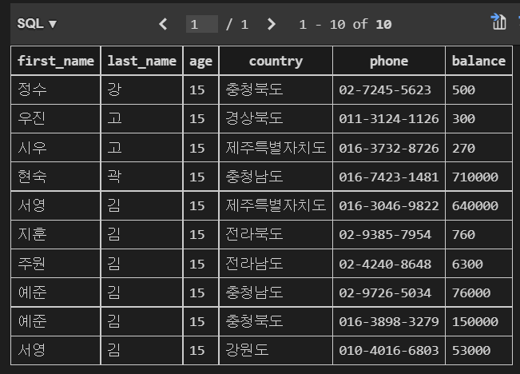

    > 같은 나이 기준 안에서 성별 정렬이 되어 있는 형태가 된다.

  * 계좌 잔액 순으로 내림차순 정렬, 성과 이름을 10개만 조회

    ```sql
    SELECT last_name, first_name, balance FROM users ORDER BY balance DESC LIMIT 10;
    ```


### GROUP BY

* 행 집합에서 **<u>요약 행</u> 집합**을 만든다.

* SELECT문의 optional 절

* 선택된 행 그룹을 하나 이상의 열 값으로 요약 행으로 만든다.

* **문장에 WHERE 절이 포함된 경우 반드시 WHERE 절 뒤에 작성해야 한다.**

* 지정된 기준이 `GROUP BY` 다음에 나오는 column 명이 되어야 한다.

* 
  지정된 기준에 따라 행 세트를 그룹으로 결합, 데이터를 요약하는 상황에 주로 사용한다.

  * users에서 각 성씨가 몇 명씩 있는지 조회한다면?

    ```sql
    SELECT last_name, COUNT(*) AS name_count FROM users GROUP BY last_name;
    ```

    > | 성   | 그 성인 사람 수 |
    > | ---- | --------------- |
    > |      |                 |
    >
    > 형태로 나와야 한다는 것을 생각해보자
    >
    > 이 코드를 이해해보자면 last_name을 기준으로 그룹으로 묶은(GROUP BY) 결과를 개수를 세겠다는 것이다. 그리고 COUNT(*)의 컬럼 명을 `AS`로 지정해준다. 

    | 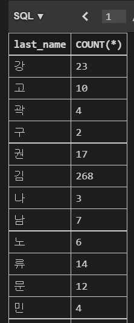 | 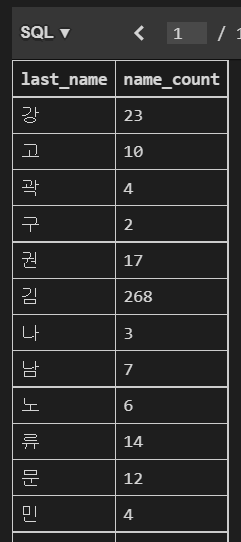 |
    | ------------------------------------------------------------ | ------------------------------------------------------------ |


> GROUP BY 컬럼이 여러개인 경우
>
> `SELECT country, last_name, COUNT(*)  FROM users GROUP BY country, last_name;`
> 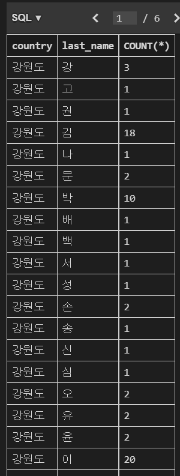


### ALTER TABLE

* 3가지 기능
  1. 테이블 이름 변경
  2. 테이블에 새로운 column 추가
  3. column 이름 수정 (3.25.0 버전 신기능) *[참고]*
     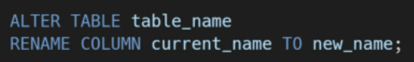
  4. column 삭제 `DROP COLUMN` (3.35 버전 신기능) *[참고]*


#### 1. 테이블 이름 변경

* 

* ```sql
  ALTER TABLE articles RENAME TO news;
  ```


#### 2. 테이블에 새로운 column 추가

* 

* ```sql
  ALTER TABLE news ADD COLUMN create_at TEXT NOT NULL;
  ```

  그런데, 이렇게 하면 에러 문구가 뜬다.
  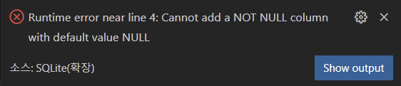
  새로 열을 추가하려면 기본값으로 들어갈 값이 필요하다. 이것을 지정하지 않으면 에러가 난다!

  * 해결 방법:

    1. `NOT NULL` 없이 추가하기

       ```sql
       ALTER TABLE news ADD COLUMN create_at TEXT ;
       ```

    2. 기본값 (`DEFAULT`) 설정하기

       ```sql
       ALTER TABLE news ADD COLUMN subtitle TEXT NOT NULL DEFAULT '소제목';
       ```


#### 3. column 이름 수정

* ```sql
  ALTER TABLE news RENAME COLUMN title TO name;
  ```


> SQL과 ORM을 같이 연결해서 알아두면 좋당!


## DBMS (DB Management System) / 웹엑스

### RDBMS (Relational DBMS)

SQL은 여기에서만 사용한다. 

ORM: OOP의 언어와 RDMS를 연결시켜 주는 것.

* 차이점
  * 엑셀에서 그려지는 표 형태로 저장된다. 하나의 레코드(행)를 저장하는 느낌

### NoSQL

SQL을 쓰지 않는다!

* 차이점
  * 표 형태로 저장하지 않는다. 내맘대로 저장한다. A4 용지에서 그림 그리는 느낌? 정도ㅋㅋ 내가 하고 싶은 말 다 쓰는 느낌. 
  * 딕셔너리 형태로 저장하게 되는 것이다. == **schema-less**. 그래서 레코드라고 부르지 않고, 데이터 하나를 도큐먼트라고 부른다(이것이 단위)
  * ODM(Object Document Mapping)

빅데이터 때문에 떴다. 데이터로 여겨지지 않았던 것(트래픽)을 데이터로 인식하게 되면서 뜨지 않았을까.. 


> DB는 파일이 아니다ㅋㅋ
