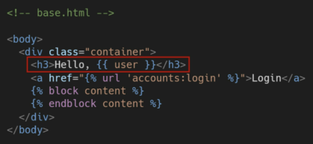
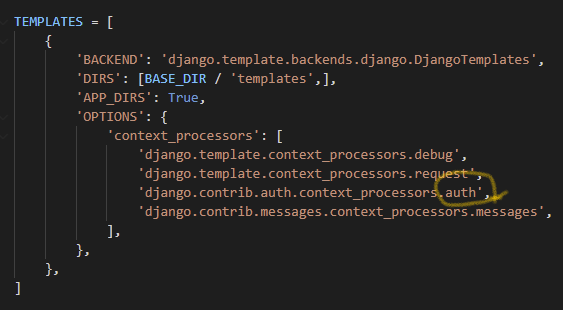
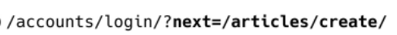
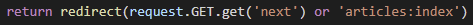
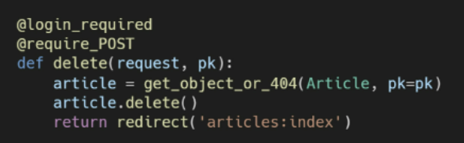
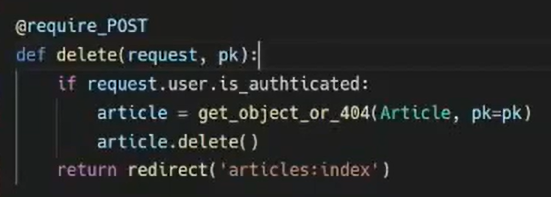

[toc]

# 04_Django_Authentication

* Django 인증 시스템은 `django.contrib.auth`에 Django contirb module로 제공
* 필수 구성은 `settings.py`에 이미 포함되어 있으며, `INSTALLED_APPS` 설정에 나열된 아래 두 항목으로 구성된다.
  1. `django.contrib.auth`: 인증 프레임워크의 핵심과 기본 모델을 포함
  2. `django.contrib.contenttypes`: 사용자가 생성한 모델과 권한을 연결할 수 있다.

* django 인증 시스템은 **인증(Authentication)**과 **권한(Authorization)** 부여를 함께 제공(처리)하며, 이러한 기능이 어느 정도 결합되어 일반적으로 인증 시스템이라고 한다.

> * 인증(Authentication)
>   * 신원 확인, 사용자가 자신이 누구인지 확인하는 것
> * 권한(Authorization)
>   * 권한 부여, 인증된 사용자가 수행할 수 있는 작업을 결정


> `accounts`라는 두번째 앱을 생설할 것인데, django 내부적으로 accounts라는 이름으로 사용되고 있기 때문에 이렇게 저장하는 것을 권장한다. 


## 쿠키와 세션

### HTTP(Hyper Text Transfer Protocol)

* HTML 문서와 같은 리소스들을 가져올 수 있도록 해주는 프로토콜(규약)
* 웹에서 이루어지는 모든 데이터 교환의 기초
* 클라이언트 - 서버 프로토콜 이기도 하다.


#### HTTP의 특징

1. 비연결지향(connectionless): 서버는 요청에 대한 응답을 보낸 후 클라이언트와 연결을 끊는다.
2. 무상태(stateless): 연결을 끊는 순간 클라이언트와 서버 간의 통신이 끝나며 상태 정보가 유지되지 않는다. 클라이언트와 서버가 주고 받는 메세지들은 서로 완전히 독립적이다.

**클라이언트와 서버의 지속적인 관계를 유지하기 위해 쿠키과 세션이 존재한다!!** 
(로그인 상태처럼 유지되어야 하는 것들은 쿠키와 세션으로 이어지게 되는 것이다.)


### 쿠키의 개념

* 서버가 사용자의 웹 브라우저에 전송하는 작은 데이터 조각
* 사용자가 웹사이트를 방문할 경우 해당 웹사이트의 서버를 통해 사용자의 컴퓨터에 배치(placed-on)되는 작은 기록 정보 파일
  * 브라우저(클라이언트)는 쿠키를 로컬에 KEY-VALUE의 데이터 형식으로 저장한다.
  * 이렇게 쿠키를 저장해 놓았다가, 동일한 서버에 재요청시 저장된 쿠키를 함께 전송한다.

> SW가 아니기 때문에 프로그램처럼 실행될 수 없으며 악성코드를 설지할 수 없지만, 사용자의 행동을 추적하거나 쿠키를 훔쳐서 해당 사용자의 계정 접근 권한을 획득할 수도 있다.

* HTTP 쿠키는 상태가 있는 세션을 만들어준다.
* 쿠키는 두 요청이 동일한 브라우저에서 들어왔는지 아닌지를 판단할 때 주로 사용
  * 이를 이용해 사용자의 로그인 상태를 유지할 수 있다.
  * 상태가 없는 HTTP에서 상태 정보를 기억시켜 주기 때문이다.

**웹 페이지에 접속하면 요청한 웹 페이지를 받으며 쿠키를 저장하고, 클라이언트가 같은 서버에 재요청시 요청과 함께 쿠키도 함께 전송한다.**


### 쿠키의 사용 목적

1. 세션관리(Session Management): 로그인, 아이디 자동 완성, 공지 하루 안보기, 팝업 체크, 장바구니 등의 정보 관리
   *쿠키  > 세션으로 보면된다.*
2. 개인화(Personalization): 사용자 선호, 테마 등의 설정
   시크릿탭 등은 쿠키 허용을 하지 않는 방법이다.
3. 트래킹(Tracking): 사용자 행동을 기록 및 분석


### 세션

* 사이트와 특정 브라우저 사이의 **상태(State)**를 유지시키는 것
  *이 상태를 유지하기 위해 쿠키가 세션을 사용하는 것이다.*
* 클라이언트가 서버에 접속하면 서버가 특정 **`session id`**를 발급하고, 클라이언트는 발급받은 `session id`를 쿠키에 저장한다.
  * 클라이언트가 다시 서버에 접속하면 요청과 함께 (`session id`가 저장된)쿠키를 서버에 전달한다.
  * 쿠키는 요청 때마다 서버에 함께 전송되므로 서버에서 `session id`를 확인해 알맞은 로직을 처리한다.
* ID는 세션을 구별하기 위해 필요하며, 쿠키에는 ID만 저장한다.
  * *로그아웃은 세션 삭제인것이다!!!!*


### 쿠키의 수명

1. Session cookies
   * 현재 세션이 종료되면 삭제된다
   * 브라우저가 현재 세션이 종료되는 시기를 정의
     * 일부 브라우저는 다시 시작할 떄 <u>세션 복원</u>을 사용해 세션 쿠키가 오래 지속될 수 있도록 한다.
2. Persistent cookies
   * `Expires` 속성에 지정된 날짜 혹은 `Max-Age` 속성에 지정된 기간이 지나면 삭제


### Django의 세션

* Middleware를 통해 구현된다
* django는 database-backed sessions 저장 방식을 기본값으로 사용한다.
* django는 특정 session id를 포함하는 쿠키를 사용해서 각각의 브라우저와 사이트가 연결된 세션을 알아낸다.
  * 세션 정보는 django DB의 `django_session`테이블에 저장된다.
* 모든 것을 세션으로 사용하려고 하면, 사용자가 많을 때 서버에 부하가 걸릴수도 있다.


#### 인증 시스템 in MIDDLEWARE

* `SessionMiddleware`: 요청 전반에 걸쳐 세션을 관리
* `AuthenticationMiddleware`: 세션을 사용하여 사용자를 요청과 연결

> Middleware란..
>
> HTTP 요청과 응답 처리 중간에서 작동하는 시스템
>
> django는 HTTP 요청이 들어오면 미들웨어를 거쳐 해당 URL에 등록되어 있는 view로 연결해주고, HTTP 응답 역시 미들웨어를 거쳐서 내보낸다.
>
> 주로 데이터 관리, 애플리케이션 서비스, 메시징, 인증 및 API 관리를 담당한다.


## 로그인

* 로그인은 session을 Create하는 로직과 같다.
* Django는 우리가 session의 매커니즘에 생각하지 않게끔 도움을 준다.
* 이를 위해 인증에 관한 built-in forms를 제공한다. 


* `AuthenticationForm`
  * 사용자 로그인을 위한 form
  * <u>request를 첫번째 인자로 취한다.</u> -> model form이 아니다!!!
    * 아이디와 비밀번호가 db에 저장되는 것이 아니므로 model form이 아니다.!
    * 아이디와 비밀번호가 db에 저장되는 회원가입!!
* `login(request, user, backend=None)` 
  * 현재 세션에 연결하려는 <u>인증된 사용자</u>가 있는 경우 login()함수가 필요하다.
    == <u>authentication form을 통과한 경우</u>
  * 사용자를 로그인 시키며 view함수에서 사용된다.
  * HttpRequest 객체와 User 객체가 필요!
  * Django의 session framework를 사용하여 세션에 user의 ID를 저장 **== 로그인**

```python
from django.contrib.auth import login as auth_login
from django.contrib.auth.forms import AuthenticationForm

@require_http_methods(['GET', 'POST'])
def login(request):
    if request.user.is_authenticated:
        return redirect('articles:index')
	# 데이터를 넘겨 받으면(POST이면) 세션을 생성해야 한다.
    if request.method == 'POST':
        # 아이디와 비밀번호가 db에 저장되는 것이 아니라, 인증에 사용된다.
        # 로그인 전 인증을 먼저 하는 것이고, 이 과정을 거친 후 로그인 함수를 거친다
        form = AuthenticationForm(request, request.POST)
        if form.is_valid():  # 유효성 검사 -> 실제 로그인한다!
            auth_login(request, form.get_user())  # 로그인
            return redirect(request.GET.get('next') or 'articles:index')
    # 처음 로그인하러 들어오는 창은 GET 요청이다!
    else:
        form = AuthenticationForm()
    context = {
        'form': form,
    }
    return render(request, 'accounts/login.html', context)
```

> **AuthenticationForm의 get_user() 메소드**
>
> `return self.user_cache`: 인스턴스 생성시 None으로 할당되다가, 인증이 되면 로그인한 사용자 객체로 할당된다! 즉, 인스턴스의 유효성을 먼저 확인하고, 인스턴스가 유효할 때만 user를 제공하려는 구조


## Authentication data in templates

* 현재 로그인 되어있는 유저 정보 출력
  
  * `user`는 context로 넘겨주지 않아도 이용 가능하다.
* `context processors`
  * 템플릿이 렌더링 될 때 자동으로 호출 가능한 컨텍스트 데이터 목록
  * 작성된 프로세서는 RequestContext에서 사용 가능한 변수로 포함된다.
  * 
    `auth.User` 인스턴스는 템플릿 변수 {{ user }}에 저장된다. *그래서 사용 가능!*


## 로그아웃

* session을 Delete하는 로직과 같다!


* `logout(request)`
  * HttpRequest 객체를 인자로 받고 반환 값이 없다
  * 사용자가 로그인하지 않은 경우, 오류를 발생시키지 않는다
  * 현재 요청에 대한 session data를 DB에서 완전히 삭제하고, 클라이언트의 쿠키에서도 session id가 삭제된다
    * 이는 다른 사람이 동일한 웹 브라우저를 사용해 로그인하고, 이전 사용자의 세션 데이터에 접근하는 것을 방지하기 위한 것이다!

```python
from django.contrib.auth import logout as auth_logout

@require_POST
def logout(request):
    if request.user.is_authenticated:
        auth_logout(request)
    return redirect('articles:index')
```


## 로그인 사용자에 대한 접근 제한

1. `is_authenticated` attribute
   * User model의 속성 중 하나 (*메소드 아니다~*)
   * **모든 User 인스턴스에 대해 항상 True인 읽기 전용 속성**(AnonymousUser에 대해서는 항상 False)
   * 사용자가 인증되었는지 여부를 알 수 있는 방법
   * 일반적으로 request.user에서 이 속성을 사용하며, 미들웨어의 `django.contrib.auth.middleware.AuthenticationMiddleware`를 통과했는지 확인
   * 단, 권한과는 관련이 없으며, 사용자가 활성화 상태이거나 유효한 세션을 가지고 있는지도 확인하지 않는다.
2. `login_required` decorator
   * 사용자가 로그인되어 있지 않으면, `settings.LOGIN_URL`에 설정된 문자열 기반 절대 경로로 redirect한다
     * `LOGIN_URL`의 기본값은 '/accounts/login/'
     * 두번째 app이름은 accounts로 했던 이유 중 하나
   * 사용자가 로그인되어 있으면 정상적으로 view함수를 실행
   * 인증 성공 시 사용자가 redirect 되어야 하는 경로는 "next"라는 쿼리 문자열 매개 변수에 저장된다.
     * 
       *로그인 안된 사용자가 글 작성 누름 -> 로그인 하라 함: 근데 주소가 저런식으로 변경이 되어있다!!!!!*
       `articles/create/`는 이전에 가려고 했던 곳이고, 이것을 django가 기억하고 있어서 
       login 이후에 저기로 보내주려고 쿼리를 생성한 것임!!!
     * 근데 저 링크에서 로그인을 해서 넘겨줄 경우, login view함수에 도달하게 된다! 즉, 저 주소값을 처리해줘야 한다는 것이다.
       `action=""`로 비어주고 form을 보내면 현재 주소값으로 다시 오게 되어있는데,
       query string parameter는 딕셔너리 형태로 존재하므로 request.GET에서 .get('next') next라는 key값을 가진 parameter를 가져오라고 해야한다.
     * 
       그래서 이 코드가 가능하게 되는 것이다! 만약 next 쿼리가 달려서 왔다면, 그 이후인 `articles/create/`로 가고, 그렇지 않으면 로그인 되면서 index로 갈 것이다!


### 두 데코레이더로 인해 발생하는 구조적 문제 해결



* 위 함수의 형태로, 비로그인 상태에서 게시글 삭제를 시도
* `@login_required` 데코레이터 때문에 로그인 페이지로 redirect되었고, 주소가 `accounts/login/?next=/articles/1/delete/`로 변경되었다.
* 이 주소에서 로그인을 성공한 다음에는, `HTTP ERROR 405`가 뜬다!!!!
  * why? <u>**Method Not Allowed**</u>의미이다. 
  * 로그인을 하고 난 후 delete 함수가 실행될 때, `@require_POST`에서 막히게 된다.
    **<u>redirect는 무조건 GET 방식으로만 보내기 때문에 POST만 허용하는 데코레이터가 있으면 함수가 실행되지 않는 것이다.**</u>
    * 두가지 문제 발생
      1) redirect 과정에서 POST 데이터 손실
      2) redirect 요청은 POST 방식이 불가능하기 때문에 GET 방식으로 요청되었음
  * 그러므로, `@login_required`는 GET request를 처리할 수 있는 view함수에서만 사용해햐 하고,
    데코레이터 대신 `is_authenticated`를 사용해서 조건문 처리를 해주면 된다!! 
    