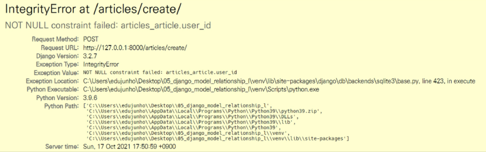

[toc]

# 02_DB_1:N

## Foreign Key

* 외래키(외부키)

* 관계형 데이터베이스에서 한 테이블의 필드 중 다른 테이블의 행을 식별할 수 있는 키

* 참조하는 테이블에서 속성(필드)에 해당하고, 이는 참조되는 테이블의 기본키(Primayr key)를 가리킨다.

* 참조하는 테이블의 외래키는 참조되는 테이블 행 1개에 대응된다.

  * 이 때문에 참조하는 테이블에서 참조되는 테이블의 존재하지 않는 행을 참조할 수 없음

* 참조하는 테이블의 행 여러 개가 참조되는 테이블의 동일한 행을 참조할 수 있다.

  * *참조하는 테이블(댓글) 참조되는 테이블(게시글)* 

* 키를 사용하여 부모 테이블의 유일한 값을 참조 (참조 무결성)

  > 데이터베이스 관계 모델에서 관련되 2개의 테이블 간의 일관성을 말한다.
  >
  > 외래키가 선언된 테이블의 외래키 속성(열)의 값은 그 테이블의 부모가 되는 테이블의 기본키 값으로 존재해야 한다.

* 외래키의 값이 반드시 부모 테이블의 기본키일 필요는 없지만, 유일한 값이어야 한다


* **예시) Article(1) : Comment(N)**

|              참조하는 테이블<br />(N, Comment)               |              참조되는 테이블<br />(1, Article)               |
| :----------------------------------------------------------: | :----------------------------------------------------------: |
|  |  |

> 참조하는 테이블(N)에서 외래키를 가지고 있다. 무조건 id만 할 수 있다는 것은 아니다. 행을 구별할 수 있는 상이한 값을 가지는 속성이라면 다 가능하다.


### `ForeignKey` field

* A many-to-one relationship

* 2개의 위치 인자가 반드시 필요하다.

  * 참조하는 model class,
  * `on_delete` 옵션

* migrate 작업 시 필드 이름에 _id를 추가하여 데이터베이스 열 이름을 만든다.

* [참고] 재귀 관계일 경우, model class에 `'self'`라고 작성한다.

* 

* 만약 FK 인스턴스를 `abcd`로 생성했다면, `abcd_id`로 만들어진다.
* 하지만, 명시적인 모델 관계 파악을 위해 참조하는 모델 클래스 이름의 소문자(단수형)으로 작성하는 것이 바람직하다(1:N)


#### `on_delete`

* 외래키가 참조하는 객체가 사라졌을 때 외래키를 가진 객체를 어떻게 처리할지를 정의
* 데이터 무결성을 위해서 매우 중요한 설정이다
* 이 옵션에서 사용 가능한 값들
  * `CASCADE`: 부모 객체가 삭제됐을 때 이를 참조하는 객체도 삭제
  * `PROTECT`
  * `SET_NULL`
  * `SET_DEFAULT`
  * `SET`
  * `DO_NOTHING`
  * `RESTRICT`

> [참고] 데이터 무결성
>
> * 데이터의 정확성과 일관정을 유지하고 보증하는 것을 가리키며, DB나 RDBMS 시스템의 중요한 기능이다
> * 무결성 제한의 유형
>   1. 개체 무결성
>      * PK의 개념과 관련
>      * 모든 테이블이 PK를 가져야 하며 PK로 선택된 열은 고유한 값이어야 하고, 빈 값을 허용하지 않는다.
>   2. 참조 무결성
>      * FK(외래키) 개념과 관련
>      * FK값이 데이터베이스의 특정 테이블의 PK값을 참조하는 것
>   3. 도메인 무결성
>      * 정의된 형식(범위)에서 관계형 데이터베이스의 모든 컬럼이 선언되도록 규정한다.


#### `related_name` [역참조 먼저 읽고 확인하기!]

* 역참조 시 사용할 이름(`참조하는테이블_set` manager)을 변경할 수 있는 옵션
* 
  이렇게 변경하면, `article.comment_set`은 더이상 사용할 수 없고, `article.comments`로 대체할 수 있다.
* 역참조 시 사용할 이름 수정후, migration 과정이 필요하다! 
* 1:N에서는 이 이름을 변경하는 것을 권장하지 않는다. M:N에서는 변경이 필요해서 변경하게 되어서 M:N에서의 조회라는 것을 알 수가 있다. 


### 댓글 (Comment) 생성하기

```shell
c = Comment()
c.content = '그래 그리 쉽지는 않겠지'
c.save()
# IntegrityError: NOT NULL constraint failed: articles_comment.article_id

# 그래서 게시글을 먼저 생성해줘야 한다.
a = Article.objects.create(title='제목입니당', content='내용입니당')
c.article_id = a.pk
c.save()  # 생성 완료
```

* **주의사항**: `c`에서 외래키를 지정하는 방법
  `a = Article()`로 생성 /  `c = Comment()`로 생성돼 있음을 가정

  1. `c.article_id = a.pk`
     테이블의 컬럼명을 정확하게 명시한 경우, 정확하게 a라는 게시글 인스턴스의 pk라고 지정을 해줘야 한다.
  2. `c.article = a`
     이 경우는 그냥 `a`라는 객체를 넣어주면 된다.

  > ORM을 사용하고 있는 우리, django에서 권장하는 방식은 2번이다! 객체를 그대로 넣어주는 것이 좋다. 알아서 FK를 a의 PK로 추출해서 넣는다.

* `c`에서 `a`를 참조하고 있기 때문에 사용할 수 있는 코드들
  c라는 객체에 저장된 article에서 article 객체의 속성들을 접근할 수 있는 것이다.
  * `c.article` : <Article: 제목입니당>
  * `c.article.pk`: 1
  * `c.article.content`: '내용입니당'
* 두번째 댓글 생성하기

```shell
c = Comment(content="나를 허락해준 세상이란~", article = a)
c.save()
c.article.pk  # 1, 객체 참조해서 부르는 방법
c.article_id  # 1, 필드명으로 부르는 방법
```


* admin site에서 작성된 댓글 확인하기
  


### 1:N 관계 related manager


* Article에서 Comment를 어떻게 참조하면 좋을까?
* **역참조 (`comment_set`): `참조하는테이블명_set`**
  * Article(1) -> Comment(N)
  * `article.comment` 형태로는 사용할 수 없고, `article.comment_set` manager가 생성된다.
  * 게시글에 몇 개의 댓글이 작성 되었는지 django ORM이 보장할 수 없기 때문
    * article은 comment가 있을 수도 있고, 없을 수도 있음
    * **실제로 Article 클래스에는 Comment와의 어떠한 관계도 작성되어 있지 않다.**
  * 사용예시
    
* **참조(`article`): `참조되는테이블명`**
  * Comment(N) -> Article(1)
  * 댓글의 경우 어떠한 댓글이든 반드시 자신이 참조하고 있는 게시글이 있으므로, `comment.article`과 같이 접근할 수 있다.
  * 실제 `ForeginKey` 또한 Comment 클래스에서 작성된다.
  * 사용예시
    


## Comment CREATE

### 1) CommentForm 작성

```python
# articles/forms.py

from django import forms
from .models import Article, Comment


class ArticleForm(forms.ModelForm):

    class Meta:
        model = Article
        fields = '__all__'


class CommentForm(forms.ModelForm):

    class Meta:
        model = Comment
        # fields에서 '__all__'을 입력한다면, 어떤 게시글에서 작성할 것인지를 선택하는 란이 생긴다. 그것을 방지하기 위해 content만 둔다.
        fields = ('content',)
        
```


### 2) detail 페이지에서 CommentForm 출력

```python
# articles/views.py

@require_safe
def detail(request, pk):
    article = get_object_or_404(Article, pk=pk)
    comment_form = CommentForm()
    context = {
        'article': article,
        'comment_form': comment_form,
    }
    return render(request, 'articles/detail.html', context)
```

```html
<--! artilces/detail.html -->


  <h1>DETAIL</h1>
 
  <form action="" method="POST">
    
    {{ comment_form }}
    <input type="submit">
  </form>


```


### 3) 댓글 작성 로직

```python
# articles/urls.py
app_name = 'articles'
urlpatterns = [
    path('<int:pk>/comments/', views.comment_create, name='comment_create'),
]
```

```html
<--! articles/detail.html -->


  <h1>DETAIL</h1>
 
  <form action="" method="POST">
    
    {{ comment_form }}
    <input type="submit">
  </form>

```

```python
# articles/views.py

@require_POST
def comment_create(request, pk):
    article = get_objects_or_404(Article, pk=pk)
    comment_form = CommentForm(request.POST)
    if comment_form.is_valid():
    	comment = comment_form.save(commit=False)
        comment.article = article
        comment.save()
    return redirect('articles:detail', article.pk)
    
```

> 댓글 작성은 GET으로 받는 경우가 없다. 왜냐하면 댓글 작성을 위한 별도의 창을 생성하지 않기 때문. 그래서 분기를 하지 않아도 되고, POST에서 했던 것들을 그대로 해주면 된다.


#### `.save()` method

* `.save(commit=False)`
* 생성은 했으나, 아직 <u>DB에 저장(commit)</u>되지 않은 인스턴스를 반환한다.
* **저장하기 전에 객체에 대한 사용자 지정 처리를 수행**할 때 유용하게 사용
* 이것을 지정하지 않고 실행을 하는 경우, `IntegrityError`가 또 뜬다.


## Comment READ

### 1) 댓글 출력 views.py

* 특정 article에 있는 모든 댓글을 가져온 후 context에 추가한다.

```python 
# articles.views.py

from .models import Article, Comment
from .forms import ArticleForm, CommentForm

def detail(request, pk):
    article = get_object_or_404(Article, pk=pk)
    comment_form = CommentForm
    comments = article.comment_set.all()
    context = {
        'article': article,
        'comment_form': comment_form,
        'comments': comments,
    }
    return render(request, 'articles/detail.html', context)
```


### 2) 댓글 출력 detail.html

```html
<--! artilces/detail.html -->


  <h1>DETAIL</h1>
 	
  <h4>댓글 목록</h4>
  <ul>
    
      <li>{{ comment.content }}</li>
    
  </ul>
   

```


#### +) 댓글 개수 출력하기

1. `{{ comments|length }}` : comments queryset의 갯수 반환. DTL 사용
2. `{{ article.comment_set.all|length }}`
3. `{{ comments.count }}`


#### +) 댓글이 없는 경우, 대체 컨텐츠 출력

```html

  <li>{{comment.cotent}}</li>

  <p>댓글이 없습니다.</p>

```


## Comment DELETE

### 1) 댓글 삭제 로직

```python
# articles/urls.py

urlpatterns = [
    #... 생략
    path('<int:pk>/comments/<int:comment_pk>/delete/', views.comment_delete, name='comment_delete'),
]
```

```python
# articles/views.py

# 1. variable routing사용: pk는 article pk를 의미한다.
@require_POST
def comment_delete(request, pk, comment_pk):
    comment = get_object_or_404(Comment, pk=comment_pk)
    comment.delete()
    return redirect('articles:detail', pk)

# 2. comment에서 article객체를 참조, 이럴경우 넘겨받은 pk는 안 사용
def comment_delete(request, pk, comment_pk):
    comment = get_object_or_404(Comment, pk=comment_pk)
    article_pk = comment.article.pk
    comment.delete()
    return redirect('articles:detail', article_pk)
```

> 하지만 **1번으로 사용**해서 이용할 것이다!!!
>
> Why? url 구조의 일관성 때문이다. REST API를 구현할 때 URL 구조를 구현하는 규칙이 존재해서 그런 것 때문에 우리는 1번으로 사용한다.

```html
<--! artilces/detail.html -->


  <h1>DETAIL</h1>
 	
  <h4>댓글 목록</h4>
  <ul>
    
      <li>
          {{ comment.content }}
          <form action="" method="POST">
          
          <input type="submit" value="삭제">
        </form>
      </li>
      
    
  </ul>
   

```


### 2) 인증된 사용자만 작성/삭제하게 하는 경우

* 모든 view 함수에서 is_authenticated를 추가해준다.

```python 
@require_POST
def comment_create(request, pk):
    if request.user.is_authenticated:
        article = get_objects_or_404(Article, pk=pk)
        comment_form = CommentForm(request.POST)
        if comment_form.is_valid():
            comment = comment_form.save(commit=False)
            comment.article = article
            comment.save()
    	return redirect('articles:detail', article.pk)
    return redirect('accounts:login')
```

```python
@require_POST
def comment_delete(request, pk, comment_pk):
    if request.user.is_authenticated:
        comment = get_object_or_404(Comment, pk=comment_pk)
        comment.delete()
   	return redirect('articles:detail', pk)
```


## Customizing Authentication in Django

### Substituting a custom User model (User 모델 대체하기)

* 일부 프로젝트에서는 Django의 내장 User 모델이 제공하는 인증 요구사항이 적절하지 않을 수 있다.
  * ex) username 대신 email을 식별 토큰으로 사용하는 것이 더 적합한 경우
* Django는 User를 참조하는데 사용하는 `AUTH_USER_MODEL` 값을 제공하여, default user model을 재정의(override)할 수 있도록 한다.
* Django는 새 프로젝트를 시작하는 경우 기본 사용자 모델이 충분하더라도, 커스텀 유저 모델을 설정하는 것을 강력하게 권장한다.
  * **단, 프로젝트의 모든 migrations 혹은 첫 migrate를 실행하기 전에 이 작업을 마쳐야 한다.**


#### `AUTH_USER_MODEL`

* User를 나타내는데 사용하는 모델
* 프로젝트가 진행되는 동안 변경할 수 없다
* 프로젝트 시작 시 설정하기 위한 것이며, 참조하는 모델은 첫번쨰 마이그레이션에서 사용할 수 있어야 한다.
* 기본 값: `auth.User` (`auth`앱의 `User`모델 ) (settings.py에서 생략되어 있음)


#### 1) 새로운 User 모델 작성하기 models.py

* 관리자 권한과 함께 완전한 기능을 갖춘 User 모델을 구현하는 기본 클래스인 `AbstractUser`를 상속받아 새로운 `User` 모델을 작성한다.

```python
# accounts/models.py

from django.contrib.auth.models import AbstractUser

class User(AbstractUser):
    pass
```


#### 2) 사용가능하게 등록하기 settings.py

* 기존에 Django가 사용하는 User모델이었던 auth 앱의 User 모델에서 accounts 앱의 User 모델로 변경

```python
# accounts/settings.py

AUTH_USER_MODEL = 'accounts.User'
```


#### 3) admin site에 등록 admin.py

```python
# accounts/admin.py

from django.contrib import admin
from django.contrib.auth.admin import UserAdmin
from .models import User

admin.site.register(User, UserAdmin)
```


#### +) 프로젝트 중간에 변경하는 경우

* 데이터베이스를 초기화한 후, 마이그레이션 진행
  1. `db.sqlite3` 파일 삭제
  2. `migrations` 파일 모두 삭제 (파일명에 숫자가 붙은 파일만 삭제)
  3. 다시 makemigrations와 migrate하기

* 이렇게 되면, 기존 `auth.user` 테이블이 사라지고 `accounts.user` 테이블이 생성된다.

* `createsuperuser`도 다시 해줘야 한다.


### Custom User & Built-in Auth Forms

* 지금까지 한 것에서 회원가입을 시도하면 에러가 발생한다.
  

* 회원가입에서 사용하는 Form은 `UserCreationForm`이라는 모델폼이다. 모델폼은 `class Meta`가 있고, 거기에 `model=`이 무엇인지 작성되어 있을 것이다.

  * 이 `model=User`이고, 기본 내장 User이기 때문에 우리가 변경한 커스텀 User모델을 인식할 수 없다. 

  


#### 1) CustomUserCreationForm / CustomUserChangeForm 생성

* django에서 User는 직접 참조하지 않는다! `get_user_model`을 통해서 참조한다.
  * 이때, get_user_model은 현재 django에서 사용중인(활성화된) User를 참조해주므로, 변경된 `accounts.User`를 참조해줄 것이다.

```python
from django.contrib.auth.forms import UserChangeForm, UserCreationForm
from django.contrib.auth import get_user_model


class CustomUserChangeForm(UserChangeForm):

    class Meta:
        model = get_user_model() # User
        fields = ('email', 'first_name', 'last_name',)


class CustomUserCreationForm(UserCreationForm):

    class Meta:
        model = get_user_model()
        fields = UserCreationForm.Meta.fields + ('내가 커스텀한 필드',)

```


##### `get_user_model()`

* 현재 프로젝트에서 활성화된 사용자 모델(active user model)을 반환
  * User 모델을 커스터마이징한 상황에서는 당연히 Custom User 모델을 반환
* **이 때문에 Django는 User클래스를 직접 참조하는 것 대신에 `django.contrib.auth.get_user_model()`을 사용해야 한다!!!**


#### 2) view 함수 수정

```python
# accounts/views.py

from .forms import CustomUserChangeForm, CustomUserCreationForm

@require_http_methods(['GET', 'POST'])
def signup(request):
    if request.user.is_authenticated:
        return redirect('articles:index')

    if request.method == 'POST':
        form = CustomUserCreationForm(request.POST)
        if form.is_valid():
            user = form.save()
            auth_login(request, user)
            return redirect('articles:index')
    else:
        form = CustomUserCreationForm()
    context = {
        'form': form,
    }
    return render(request, 'accounts/signup.html', context)


@login_required
@require_http_methods(['GET', 'POST'])
def update(request):
    if request.method == 'POST':
        form = CustomUserChangeForm(request.POST, instance=request.user)
        if form.is_valid():
            form.save()
            return redirect('articles:index')
    else:
        form = CustomUserChangeForm(instance=request.user)
    context = {
        'form': form,
    }
    return render(request, 'accounts/update.html', context)
```


## User(1) : Article(N) (Model Relationship)

### 1) User 외래키 등록하기

```python
# articles/models.py

from django.db import models
from django.conf import settings


class Article(models.Model):
    user = models.ForeignKey(settings.AUTH_USER_MODEL, on_delete=models.CASCADE)
    title = models.CharField(max_length=10)
    content = models.TextField()
    created_at = models.DateTimeField(auto_now_add=True)
    updated_at = models.DateTimeField(auto_now=True)
```

> [참고] 장고에서 app이 실행되는 순서
>
> 1. `INSTALLED_APPS`에서 순차적으로 import
> 2. 각 앱의 models를 import
>
> 만약 get_user_model로 한다면, articles에서 유저를 받을 때, account 앱에 있는 모델을 못 받고 아직은 그냥 User로 데려오게 되는 것이다. 이렇게 내부적으로 앱이 실행되는 순서에 의해, 문자열로 가져오는 `AUTH_USER_MODEL`을 사용한다.

1. `get_user_model()` 은 사용하지 않는다.
   * 반환값이 <u>object</u>
   * 현재 활성화된 User 모델을 반환하고, User를 직접 참조하지 않는다.
   * **단, models.py가 아닌 다른 모든 곳에서 User 모델을 참조할 때 사용한다.**
2. **`settings.AUTH_USER_MODEL`을 사용한다.**
   * 반환값이 <u>문자열</u>: `'accounts.User'`
   * User 모델에 대한 외래키 또는 다대다 관계를 정의할 떄 사용해야 한다.
   * **`models.py`에서만 User 모델을 참조할 때 사용한다.**


### 2) 모델 관계 정의 후 migration -> migrate

* Null 값이 허용되지 않는 user_id 필드가 별도의 값 없이 artcile에 추가되려 하기 때문에,
  * 1 입력 enter: '현재 화면에서 기본값을 설정한다'
  * 1 입력 enter: '기존 테이블에 추가되는 user_id필드의 값을 1로 설정하겠다.'


### 3) 게시글 작성 페이지의 불필요한 필드 제외하기

* ArticleForm의 출력 필드 수정 후 게시글 작성 재시도

```python
from django import forms
from .models import Article, Comment


class ArticleForm(forms.ModelForm):

    class Meta:
        model = Article
        # exclude = ('user', ) 도 가능
        fields = ('title', 'content', )

```

* 게시글 작성 시 IntegrityError 발생; 게시글 작성자정보(article.user)가 누락되었기 때문
  


### 4) 게시글 저장 함수 변경 views.py

```python
# articles/views.py

@login_required
@require_http_methods(['GET', 'POST'])
def create(request):
    if request.method == 'POST':
        form = ArticleForm(request.POST)
        if form.is_valid():
            """추가된 부분"""
            article = form.save(commit=False)
            article.user = request.user
            article.save()
            """"""
            return redirect('articles:detail', article.pk)
    else:
        form = ArticleForm()
    context = {
        'form': form,
    }
    return render(request, 'articles/create.html', context)
```


### 5) 게시글 삭제 함수 변경 views.py

* 자신이 작성한 게시글만 삭제 가능하도록 설정

```python
# articles/views.py

@require_POST
def delete(request, pk):
    article = get_object_or_404(Article, pk=pk)
    """추가된 부분"""
    if request.user.is_authticated:
        if request.user == article.user:
       		article.delete()
            return redirect('articles:index')
    return redirect('articles:detail', article.pk)
```


### 6) 게시글 수정 함수 변경 views.py

* 자신이 작성한 게시글만 수정 가능하도록 설정

```python
# articles/views.py

@login_required
@require_http_methods(['GET', 'POST'])
def update(request, pk):
    article = get_object_or_404(Article, pk=pk)
    """추가된 부분"""
    if request.user == article.user:
        if request.method == 'POST':
            form = ArticleForm(request.POST, instance=article)
            if form.is_valid():
                article = form.save()
                return redirect('articles:detail', article.pk)
        else:
            form = ArticleForm(instance=article)
            """"""
    else:
        return redirect('articles:index')
    context = {
        'article': article,
        'form': form,
    }
    return render(request, 'articles/update.html', context)
```


### 7) 게시글의 작성자만 수정/삭제 버튼 활성화 html

* 해당 게시글의 작성자가 아니라면, 수정/삭제 버튼을 출력하지 않도록 처리한다.

```html
<!-- articles/detail.html -->


  <a href="">수정</a>
  <form action="" method="POST">
    
    <input type="submit" value="삭제">
  </form>

```

> `` 이렇게도 가능하다!
>
> Why?
>
> 
>
> 이곳에서 등록된 아이들은 templates에서 사용할 수 있으므로


## User(1) : Comment(N) (Model Relationship)

> 앞의 User : Article과 같다~


### 1) User 외래키 등록하기

```python
# articles/models.py

from django.db import models
from django.conf import settings


class Comment(models.Model):
    user = models.ForeignKey(settings.AUTH_USER_MODEL, on_delete=models.CASCADE)
    article = models.ForeignKey(Article, on_delete=models.CASCADE)
    content = models.CharField(max_length=200)
    created_at = models.DateTimeField(auto_now_add=True)
    updated_at = models.DateTimeField(auto_now=True)
```


### 2) 모델 관계 정의 후 migration -> migrate

* 상동


### 3) 게시글 작성 페이지의 불필요한 필드 제외하기

```python
# articles/forms.py

class CommentForm(forms.ModelForm):

    class Meta:
        model = Comment
        fields = ('content',)
```


### 4) 댓글 저장 함수 변경 views.py

```python
# articles/views.py

@require_POST
def comment_create(request, pk):
    if request.user.is_authenticated:
        article = get_object_or_404(Article, pk=pk)
        comment_form = CommentForm(request.POST)
        if comment_form.is_valid():
            comment = comment_form.save(commit=False)
            comment.article = article
            """추가된 부분"""
            comment.user = request.user
            """"""
            comment.save()
        return redirect('articles:detail', article.pk)
    return redirect('accounts:login')
```


### 5) 비로그인 유저에게는 댓글 form 숨기기

```html

  <form action="" method="POST">
    
    {{ comment_form }}
    <input type="submit">
  </form>

  <a href="">[댓글을 작성하려면 로그인하세요]</a>

```


### 6) 댓글 작성자만 삭제 html & views.py

* 자신이 작성한 댓글만 삭제 버튼 활성화

```html
<h4>댓글 목록</h4>
  <ul>
    
      <li>
        {{ comment.content }}
        
        <form action="" method="POST">
          
          <input type="submit" value="삭제">
        </form>
        
      </li>
    
  </ul>
```

* 자신이 작성한 댓글만 삭제할 수 있도록 수정

```python
# articles/views.py

@require_POST
def comment_delete(request, article_pk, comment_pk):
    if request.user.is_authenticated:
        """수정된 부분"""
        comment = get_object_or_404(Comment, pk=comment_pk)
        if request.user == comment.user:
            comment.delete()
        """"""
    return redirect('articles:detail', article_pk)
```


> 댓글 수정은 나중에 JavaScript로 구현할 것이야..
