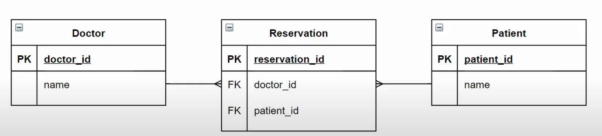
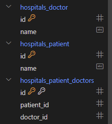

[toc]

# 03_DB_M:N

## Intro: 병원 진료 시스템

### 병원 진료 기록 시스템을 통한 M:N 관계 학습

* 환자와 의사가 사용하는 병원 진료 기록 시스템 구축
  * 병원 시스템에서 가장 핵심이 되는 객체는 무엇일까? -> 환자와 의사
  * 이 둘의 관계를 어떻게 표현할 수 있을까?
* 시작하기 전..
  * 모델링은 현실 세계를 최대한 유사하게 반영하기 위한 것
  * 우리 일상에 가까운 예시를 통해 DB를 모델링하고, 그 내부에서 일어나는 데이터의 흐름을 어떻게 제어할 수 있을지 고민해보기


#### 1) 1:N 의 한계

```python
class Doctor(models.Model):
    name = models.TextField()

class Patient(models.Model):
    doctor = models.ForeignKey(Doctor, on_delete=models.CASCADE)
    name = models.TextField()
```

```shell
doctor1 = Doctor.objects.create(name='justin')
doctor2 = Doctor.objects.create(name='eric')
patient1 = Patient.objects.create(name='tony', doctor=doctor1)
patient2 = Patient.objects.create(name='harry', doctor=doctor2)
patient3 = Patient.objects.create(name='tony', doctor=doctor2)
patient4 = Patient.objects.create(name='harry', doctor=doctor1, doctor2) # 에러
```

* 1번 환자가 1번 의사 진료를 마치고 2번 의사를 만나려고 한다면 새로운 예약을 생성해야한다.
* 기존의 예약을 유지한 상태로 새로운 예약을 생성
* 이때, 새로 생성한 3번 환자와 1번 환자는 다르다.
* 새로운 예약을 생성하는 것이 불가능하다.
  * 새로운 객체를 생성해야 함
* 여러 의사에게 진료 받은 기록을 환자 한 명에 저장할 수 없음
  * 외래키에 1, 2 형식의 데이터를 사용할 수 없다.


#### 2) 중개 모델

```python
class Doctor(models.Model):
    name = models.TextField()

# 외래키 삭제
class Patient(models.Model):
    name = models.TextField()

# 중개모델 작성
class Reservation(models.Model):
    doctor = models.ForeignKey(Doctor, on_delete=models.CASCADE)
    patient = models.ForeignKey(Patient, on_delete=models.CASCADE)
```

* 중개모델 ERD



* 의사의 예약 환자 조회: 역참조
* 환자의 상담 의사 조회: 역참조


#### 3) `ManyToManyField`

* 중개모델은 삭제한다.
* 필드 작성 위치는 Doctor 또는 Patient 모두 작성 가능하다.

* 
  * Patient에는 아무런 변화가 없고, 별도의 테이블로 중개 테이블이 만들어진다!
* M:N 관계는 종속적인 관계가 아닌 동등한 관계이다. 그래서 두개의 클래스 어느 곳에서 작성해도 상관없는 것이다.

## `ManyToManyField`

