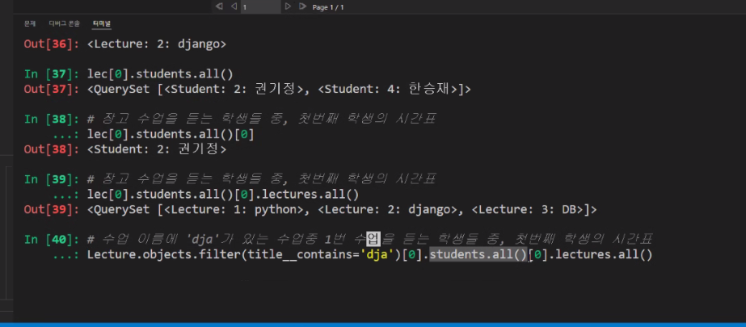

# M:N 웹엑스 코드

```shell
s1 = Student.objects.get(pk=1)
s2 = Student.objects.get(pk=2)
s3 = Student.objects.get(pk=3)
s4 = Student.objects.get(pk=4)
l1 = Lecture.objects.get(pk=1)
l2 = Lecture.objects.get(pk=2)
l3 = Lecture.objects.get(pk=3)
l4 = Lecture.objects.get(pk=4)

lec = Lecture.objects.filter(title__contains='dja')

# 조회
lec[0].students.all()[0].lectures.all()

# 세번째 수업의 수강생 수
l3.students.count()

# s2가 l1을 수강하는지? 
# 이건 좀 낭비가 되는 코드
l1 in s2.lectures.all()
# 있는지 없는지만 말해주는 코드
s2.lectures.filter(pk=l1.pk).extists()
```

