# 05_REST_API

## HTTP

* 웹 상에서 컨텐츠를 전송하기 위한 약속
* HTML 문서와 같은 리소스들을 가져올 수 있도록 하는 규칙, 약속
* 웹에서 이뤄지는 모든 데이터 교환의 기초
  * 요청: 클라이언트에 의해 전송되는 메시지
  * 응답: 서버에서 응답으로 전송되는 메시지

* 기본 특정
  * stateless: 무상태
  * connectionless: 비연결
* 쿠키와 세션을 통해 서버 상태를 요청과 연결하도록 함


### HTTP 메시지

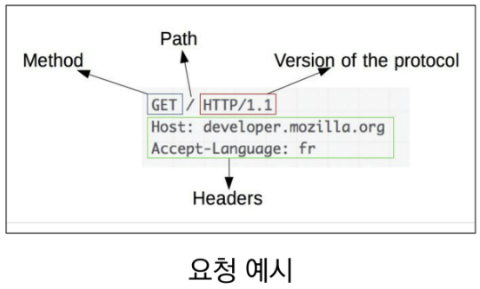

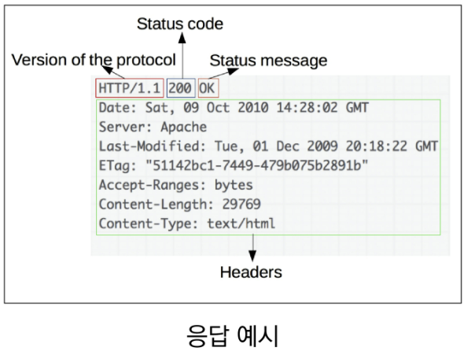


### HTTP request methods

* 자원에 대한 행위(수행하고자 하는 동작)을 정의
* 주어진 리소스(자원)에 수행하길 원하는 행동을 나타낸다
* 예시: `GET`, `POST`, `PUT`, `DELETE`


### HTTP response status codes

* 특정 HTTP 요청이 성공적으로 완료되었는지 여부를 나타낸다
* 5개의 응답으로 이뤄진다.
  1. 100대: Informational 
  2. 200대: Successful
  3. 300대: Redirection
  4. 400대: Client error
  5. 500대: Server error


### 웹에서의 리소스 식별

* HTTP 요청의 대상을 리소스라고 한다
* 리소스는 문서, 사진 또는 기타 어떤 것이든 될 수 있다.
* 각 리소스는 리소스 식별을 위해 HTTP 전체에서 사용되는 URI로 식별된다.


### URI(Uniform Resource Identifier)

* 통합 자원 식별자

* 인터넷의 자원을 식별하는 유일한 주소 (정보의 자원을 표현)

* 인터넷에서 자원을 식별하거나 이름을 지정하는데 사용되는 간단한 문자열

* 하위 개념: URL, URN

  * URL(Uniform Resource Locator)
    * 통합 자원 위치
    * 네트워크 상에 자원이 어디 있는지 알려주기 위한 약속
    * 과거에는 실제 자원의 위치를 나타냈지만 현재는 추상화된 의미론적인 구성
    * 웹주소, 링크 라고도 불린다.

  * URN(Uniform Resource Name)
    * 통합 자원 이름
    * URL과 달리 자원의 위치에 영향을 받지 않는 유일한 이름 역할을 한다.

* URI는 크게 URL과 URN으로 나눌 수 있지만, URN을 사용하는 비중이 매우 적기 때문에 일반적으로 URL과 URI를 같은 의미처럼 사용하기도 한다.


#### URI의 구조

1. Scheme(protocol)
   * 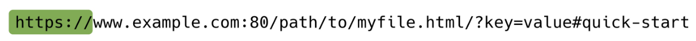
   * 브라우저가 사용해야 하는 프로토콜
   * http, data, file, ftp, mailto
2. Host(Domain name)
   * 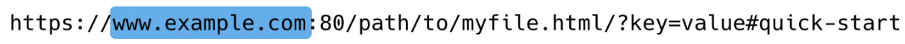
   * 요청을 받는 웹 서버의 이름
   * IP address를 직접 사용할 수도 있지만, 실 사용시 불편하므로 웹에서 그리 자주 사용되지는 않는다.
3. Port
   * 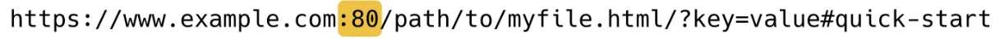
   * 웹 서버 상의 리소스에 접근하는데 사용되는 기술적인 <u>문(gate)</u>
     * *일반적인 웹에서는 사용되지 않고 로컬에서 쓰임*
   * HTTP 프로토콜의 표준 포트: HTTP 80, HTTPS 443
     * *일반적인 웹에서는 이것들이 생략되어서 출력된다.*
4. Path
   * 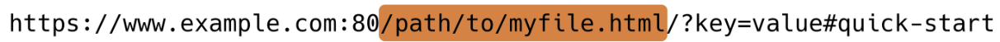
   * 웹 서버 상의 리소스 경로
   * 초기에는 실제 파일이 위치한 물리적 위치를 나타냈지만, 오늘날은 물리적인 실제 위치가 아닌 <u>추상화 형태의 구조</u>로 표현
5. Query(Identifier)
   * 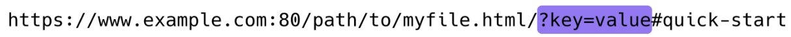
   * Query String Parameters
   * 웹 서버에 제공되는 추가적인 매개 변수
     * *대표적으로 검색을 할 때 나타난다.*
   * `&`로 구분되는 key-value 목록
6. Fragment
   * 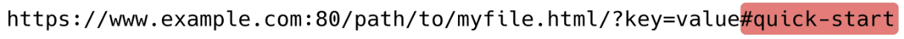
   * Anchor
   * 자원 안에서의 북마크의 한 종류를 나타낸다.
   * 브라우저에게 해당 문서(HTML)의 특정 부분을 보여주기 위한 방법
     * 저 형태로 공유를 하면 문서의 특정 부분을 바로 표시하게 나타난다
   * 브라우저에게 알려주는 요소이기 때문에 fragment identifier(부분 식별자)라고 부르며, `#` 뒤의 부분은 요청이 서버에 보내지지 않는다.

## RESTful API

## API

* Application Programming Interface
* 프로그래밍 언어가 제공하는 기능을 수행할 수 있게 만든 인터페이스
  * 애플리케이션과 프로그래밍으로 소통하는 방법
  * CLI는 명령줄, GUI는 그래픽, API는 프로그래밍을 통해 특정한 기능 숳애
* Web API
  * 웹 애플리케이션 개발에서 다른 서비스에 요청을 보내고 응답을 받기 위해 정의된 명세
  * 현재 웹 개발은 모든 것을 직접 개발하기보다 여러 Open API를 활용하는 추세
* 응답 데이터 타입
  * HTML, XML, JSON 등..

* 대표적인 API 서비스 목록: Youtube API, Naver Papago API, Kakao Map API


### REST

* REpresentational State Transfer
* API 서버를 개발하기 위한 일종의 SW 설계 방법론(*규약이나 약속이 아니다*)
  * 2000년 로이 필딩의 박사학위 논문에서 처음으로 소개된 후 네트워킹 문화에 널리 퍼짐
* 네트워크 구조 원리의 모음
  * 자원을 정의하고 자원에 대한 주소를 지정하는 전반적인 방법
* REST 원리를 따르는 시스템을 RESTful이란 용어로 지칭한다

* 자원을 정의하는 방법에 대한 고민
  * ex) 정의된 자원을 어디에 위치시킬 것인가..?


* REST의 자원과 주소의 지정방법

  1. 자원

     * URL

  2. 행위

     * HTTP method

  3. 표현

      * 자원과 행위를 통해 궁극적으로 표현되는 (추상화된) 결과물
      * JSON으로 표현된 데이터를 제공

     > 우리는 이제껏 HTML이라는 페이지를 만들었었다. REST에서는 json 형태로 응답을 할 것이다!

* REST의 핵심 규칙
  1. 정보는 URI로 표현
  2. 자원에 대한 행위는 HTTP method로 표현 (`GET`, `POST`, `PUT`, `DELETE`)

* 설계 방법론을 지키지 않았을 때 잃는 것보다 지켰을 때 얻는 것이 훨씬 많다.
  * 단, 설계 방법론을 지키지 않더라도 동작 여부에 큰 영향을 미치지는 않는다.


### JSON

* JavaScript Object Notation
  * JavaScript의 표기법을 따른 단순 문자열
* 특징
  * 사람이 읽거나 쓰기 쉽고 기계가 파싱(해석, 분석)하고 만들어내기 쉬움
  * 파이썬의 dictionary, 자바스크립트의 object처럼 C계열의 언어가 갖고있는 자료구조에서 쉽게 변화할 수 있는 key-value 형태의 구조를 갖고 있다.


#### RESTful API

* REST 원리를 따라 설계한 API
* RESTful services, 혹은 simply REST services라고도 부른다

* 프로그래밍을 통해 클라이언트이 요청에 JSON을 응답하는 서버를 구정
  * 지금까지 사용자의 입장에서 썼던 API를 제공자의 입장이 되어 개발해보기


## Response (실습: json response)

### Serialization (직렬화)

* 데이터 구조나 객체 상태를 동일하거나 다른 컴퓨터 환경에 저장하고, 나중에 재구성할 수 있는 포맷으로 변환하는 과정

* Serializers in Django

  * Queryset 및 Model Instance와 같은 복잡한 데이터를 JSON, XML 등의 유형으로 쉽게 변환할 수 있는 <u>Python 데이터 타입</u>으로 만들어준다.

    > 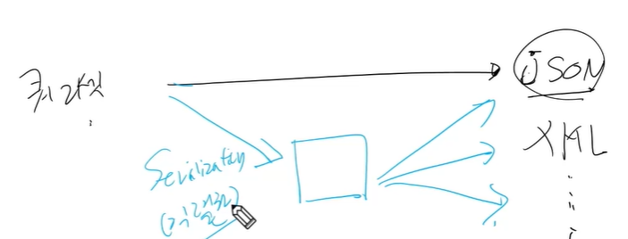
    >
    > 쿼리셋을 json으로 클라이언트에게 줄 때, 바로 json으로 줄 수가 없다. 그래서 json으로 쉽게 바꿀수 있는 데이터 형태로 주는 것이다. 즉, 중간 데이터 타입으로 변경하는 과정을 직렬화 과정이라고 보면 된다.

  * *django 내부적으로는, `from django.core import serializer`를 이용해서 serialization할 수 있다.* 


#### DRF를 이용한 serialization

* DRF(Django REST Framework)
  * Web API 구축을 위한 강력한 Toolkit을 제공하는 라이브러리
  * DRF의 Serializer는 Django의 Form 및 ModelForm 클래스와 매우 유사하게 구성되고 작동한다.

* `djangorestframework`를 install해서 serializers.py를 생성한 후, serialization을 한다. (*우리가 앞으로 사용하게 될 형태!*)
  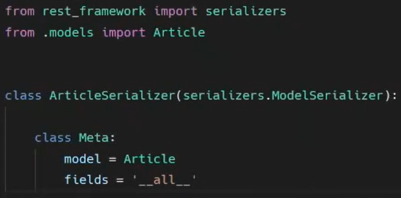
* `ArticleSerializer`: **Article에 대한 쿼리셋을 serialization해주는 도구!**


* views.py에서의 사용방법

```python
def article(request):
    articles = Article.objects.all()
    serializer = ArticleSerializer(articles, many=True)
    # many 옵션은 단일 객체가 아닐 때 사용하는 옵션이다! 
    # 지금처럼 쿼리셋일 때 작성해주는 옵션이다
    return Response(serializer.data)
```


## Single Model (실습: 01_drf)

> **Postman**
>
> * API를 구축하고 사용하기 위해 여러 도구를 제공하는 API 플랫폼
> * 설계, 테스트, 문서화 등의 도구를 제공함으로써 API를 더 빠르게 개발 및 생성할 수 있도록 돕는다.


### `ModelSerializer`

* 모델 필드에 해당하는 필드가 있는 Serializer 클래스를 자동으로 만들 수 있는 shortcut
* 아래 핵심 기능을 제공
  1. 모델 정보에 맞춰 자동으로 필드 생성
  2. serializer에 대한 유효성 검사기를 자동으로 생성
  3. `.create()` & `.update()`의 간단한 기본 구현이 포함되어 있다.

* Model의 필드를 어떻게 직렬화할 지 설정하는 것이 핵심
* 이 과정을 django에서 Model의 필드를 설정하는 것과 동일하다.


#### `many` argument

* `many=True`
* 단일 인스턴스 대신 QuerySet 등을 직렬화하기 위해서는 serializer를 인스턴스화 할때 `many=True`를 키워드 인자로 전달해야 한다.


### `api_view` decorator

* 기본적으로 GET 메서드만 허용되며 다른 메서드 요청에 대해서는 405 Method Not Allowed로 응답
* View 함수가 응답해야 하는 HTTP 메서드의 목록을 리스트의 인자로 받는다
* **DRF에서는 선택이 아닌 필수적으로 작성해야 해당 view함수가 정상적으로 작동한다.**


> GET이 아닐때 URL 맨 마지막 `/`가 빠지면, 아래와 같은 에러가 나온다.
>
> You called this URL via POST, but the URL doesn't end in a slash and you have APPEND_SLASH set. Django can't redirect to the slash URL while maintaining POST data. Change your form to point to 127.0.0.1:8000/api/v1/articles/ (note the trailing slash), or set APPEND_SLASH=False in your Django settings.


## 1:N Relation (실습: 01_drf)

### Read Only Field (읽기 전용 필드)

* 어떤 게시글에 작성하는 댓글인지에 대한 정보를 form-data로 넘겨주지 않았기 때문에 직렬화하는 과정에서 article필드가 유효성 검사(`is_valid()`)를 통과하지 못한다
  * CommentSerializer에서 article field에 해당하는 데이터 또한 요청으로부터 받아서 직렬화하는 것으로 설정되었기 때문
* 이때는 읽기전용 필드(`read_only_fields`) 설정을 통해 직렬화하지 않고 반환 값에만 해당 필드가 포함되도록 설정할 수 있다.


### +1) 특정 게시글에 작성된 댓글 목록 출력하기

* Serializer는 기존 필드를 override하거나 추가 필드를 구성할 수 있다

* 우리가 작성한 로직에서는 크게 2가지 형태 가능

  1. `PrimaryKeyRelatedField`

     * pk를 사용하여 관계된 대상을 나타내는 데 사용할 수 있음

     * 필드가 to many relationships(N)를 나타내는데 사용되는 경우 `many=True` 속성이 필요하다

     * comment_set 필드값을 form-data로 받지 않으므로 `read_only=True` 필요

     * 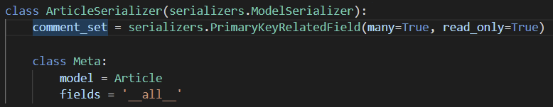

     * | 전                                                           | 후                                                           |
       | ------------------------------------------------------------ | ------------------------------------------------------------ |
       | 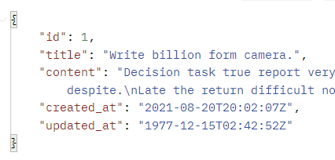 | 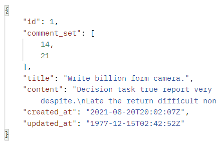 |

     * 단, 역참조시 생성되는 comment_set 필드명을 변경하고 싶으면, models.py에서 `related_name=` 옵션에서 변경을 하고 serializers.py에 반영하면 된다.

  2. Nested relationships

     * 모델 관계상으로 참조된 대상은 참조하는 대상의 표현(응답)에 포함되거나 중첩될 수 있다.

     * 이러한 중첩된 관계는 serializers를 필드로 사용하여 표현할 수 있다!

     * 두 클래스의 위치를 변경해서 사용하면 된다. 

     * 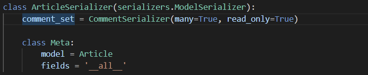

     * |                         생성된 형태                          |
       | :----------------------------------------------------------: |
       | 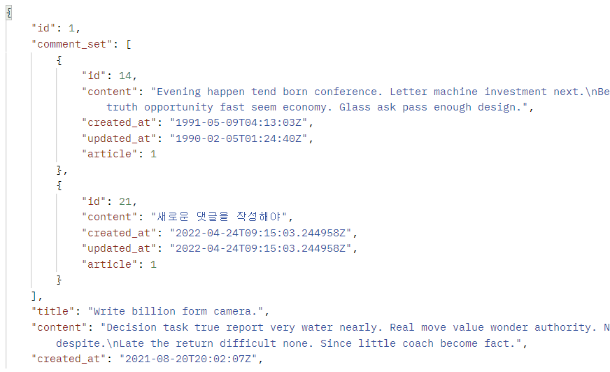 |

       > 다만, 이때는 위의 CommentSerializer에서 정의된 field를 다 데려온다. 

     

### +2) 특정 게시글에 작성된 댓글의 개수 구하기

* comment_set 매니저는 모델 관계로 인해 자동으로 구성되기 때문에 커스텀 필드를 구성하지 않아도 comment_set이라는 필드명을 fields 옵션에 작성만해도 사용할 수 있다
* 하지만 지금처럼 별도의 값을 위한 필드를 사용하려는 경우, 직접 필드를 작성해야 한다.


#### `source` argument

* 필드를 채우는 데 사용할 속성의 이름
* 점 표기법을 사용하여 속성을 탐색할 수 있다.
* comment_set이라는 필드에 `.`을 통해 전체 댓글의 개수 확인 가능
* `count()`는 built-in Queryset API 중 하나
* 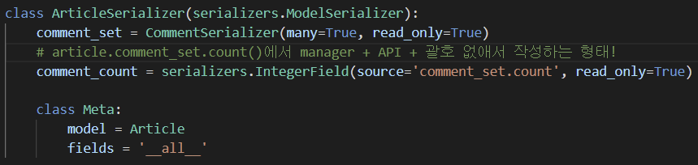

* |                         생성된 형태                          |
  | :----------------------------------------------------------: |
  | 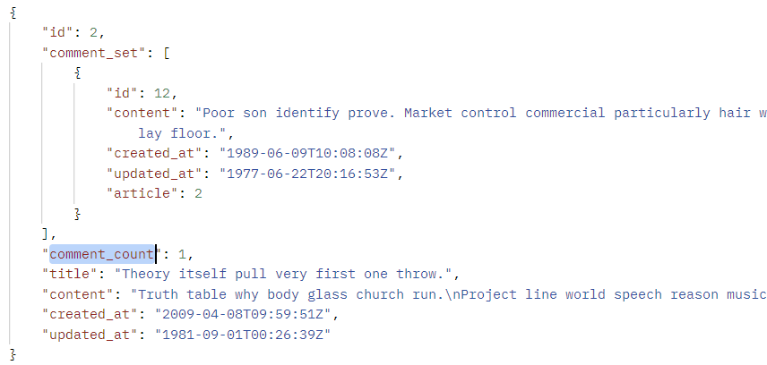 |


> 특정 필드를 override 혹은 새로 추가한 경우, read_only_fields로 사용할 수 없다!!!
