# 02_Django_models

## Model

* 단일 데이터에 대한 정보를 가짐
  * 사용자가 저장하는 데이터들의 필수적인 필드들과 동작들을 포함
* 저장된 데이터베이스의 구조(layout)
* Django는 model을 통해 데이터에 접속하고 관리
* 일반적으로 각각의 model은 하나의 데이터베이스 테이블에 매핑됨


### Database

* DB: 체계화된 데이터의 모임
* Query: 데이터를 조회하기 위한 명령어
  * 조건에 맞는 데이터를 추출하거나 조작하는 명령어
  * "Query"를 날린다 -> DB를 조작한다.


#### Database의 기본 구조

* 스키마(Schema): DB에서 자료의 구조, 표현 방법, 관계 등을 정의한 구조(structure)
* 테이블(Table)
  * 열(column): 필드(field) or 속성
  * 행(row) : 레코드(record) or 튜플
  * PK(기본키): 각 행의 고유값으로 Primary Key로 불린다. 반드시 설정해야하며, 데이터베이스 관리 및 관계 설정시 주요하게 활용된다.

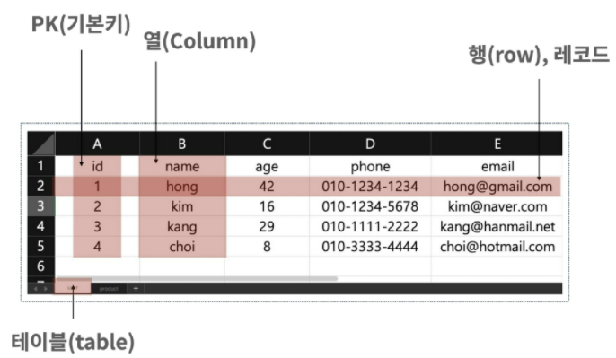

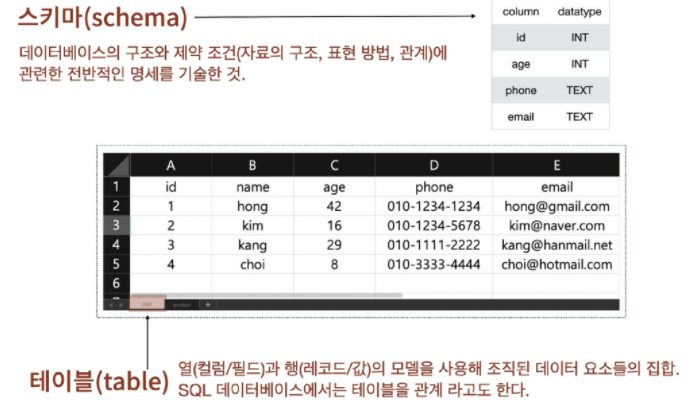

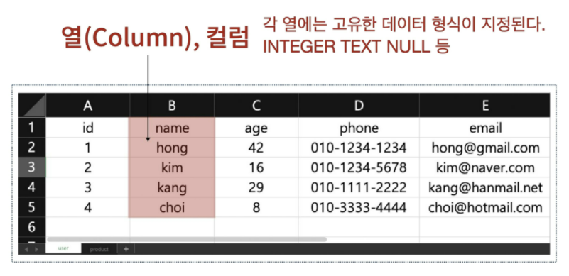

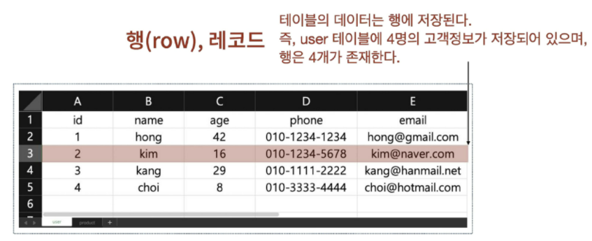

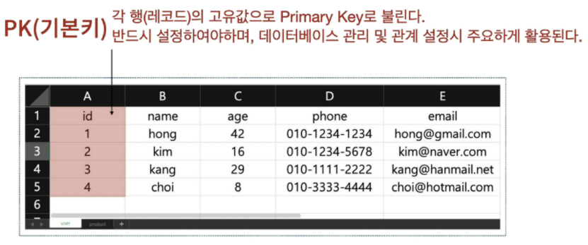


**Model 이란**: <u>웹 애플리케이션의 데이터를 구조화하고 조작하기 위한 도구</u>


## ORM

* Object-Relational-Mapping
* **객체 지향 프로그래밍 언어를 사용하여 호환되지 않는 유형의 시스템간에 데이터를 변환하는 프로그래밍 기술**
* OOP 프로그래밍에서 RDBMS를 연동할 때, 데이터베이스와 OOP 언어 간의 호환되지 않는 데이터를 변환하는 프로그래밍 기법
* Django는 내장 Django ORM을 사용한다. 


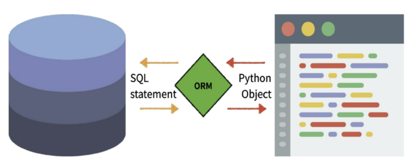


* 장점: 
  * SQL을 잘 알지 못해도 DM 조작이 가능하다.
  * SQL의 절차적 접근이 아닌 객체 지향적 접근으로 인한 높은 생산성
* 단점:
  * ORM만으로 완전한 서비스를 구현하기 어려운 경우가 있음
* 현대 웹 프레임워크의 요점은 웹 개발의 속도를 높이는 것! => **생산성**

> 왜 ORM을 사용할까?
> **"DB를 객체로 조작하기 위해 ORM을 사용한다."**


### models.py 작성

```python
# articles/models.py
class Article(models.Model):
    title = models.CharField(max_length=10)
    content = models.TextField()
```

각 모델을 django.models.Model 클래스의 서브 클래스로 표현된다.

* django.db.models 모듈의 Model 클래스를 상속받음

models 모듈을 통해 어떠한 타입의 DB 칼럼을 정의할 것인지 정의

* title과 content는 모델의 필드를 나타낸다. 
* 각 필드는 클래스 속성으로 지정되어 있으며, 각 속성은 각 DB의 열에 매핑


#### 모델 필드

1. `CharField(max_length=None, **options)`
   * 길이의 제한이 있는 문자열을 넣을 때 사용
   * `CharField`의 `max_length`는 <u>필수 인자</u>
   * 필드의 최대 길이(문자), 데이터베이스 레벨과 Django의 유효성 검사(값을 검증)에서 활용
2. `TextField(**options)`
   * 글자의 수가 많을 때 사용
   * `max_length` 옵션 작성시 자동 양식 필드인 textarea 위젯에 반영은 되지만, 모델과 DB 수준에는 적용되지 않는다.
     * 그러므로 이 옵션 사용은 `CharField`에서 사용한다!!

3. `DateTimeField(auto_now_add=True, auto_now=True)` / `DateTimeField`

   * DateTimeField는 DateField와 동일한 추가 인자(옵션)를 사용한다.

     * DateTimeField는 DateField의 서브 클래스

   * `auto_now_add`

     * 최초 생성 일자: `created_at`에는 `auto_now_add=True` 
     * Django ORM이 최초 insert(테이블에 데이터 입력)시에만 현재 날짜와 시간으로 갱신한다. (테이블에 어떤 값을 최초로 넣을 때)

   * `auto_now`

     * 최종 수정 일자: `updated_at`에는 `auto_now=True`
     *  Django ORM이 save를 할 때마다 현재 날짜와 시간으로 갱신

   * 수정해서 반영하려고 하면 default값을 설정하라는 문구가 뜬다. 

     ```shell
     1) Provide a one-off dafault now (will be set on all existing rows)
     ```

     **1 입력 후 enter** => timezone.now 함수 값 자동 설정 => 빈 값 상태에서 enter 클릭 => `migrate`로 models.py 수정사항을 반영한다.

## Migrations

* **Django가 model에 생긴 변화를 반영하는 방법**

* Migration 실행 및 DM 스키마를 다루기 위한 몇가지 명령어

  * `makemigrations`
    * model을 변경한 것에 기반한 새로운 migration(like 설계도)을 만들 때 사용
  * `migrate`
    * 마이그레이션을 DB에 반영하기 위해 사용
    * 설계도를 실제 DB에 반영하는 과정
    * 모델에서의 변경 사항들과 DB의 스키마가 동기화를 이룬다.

  * `sqlmigrate`

    * 마이그레이션에 대한 SQL 구문을 보기 위해 사용

    * 해당 migrations 설계도가 마이그레이션이 SQL 문으로 어떻게 해석되어서 동작할지 미리 확인할 수 있다.

    * ```shell
      $ python manage.py sqlmigrate <앱이름> 0001
      ```

    * 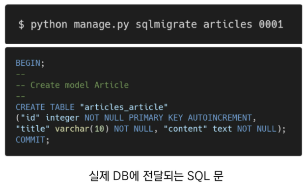

  * `showmigrations`

    * 프로젝트 전체의 마이그레이션 상태를 확인하기 위해 사용
    * 마이그레이션 파일들이 migrate 됐는지 / 안됐는지 여부를 확인할 수 있다.
    * 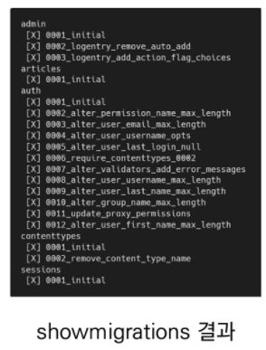


### 모델 생성 -> 마이그레이션

```shell
$ python manage.py makemigration <앱이름>
$ python manage.py migrate <앱이름>    
```

> 모델 변경 후, 이 작업을 해야 변경사항을 인식하고 DB에 반영할 수 있다. 이때 앱 이름은 안 써도 괜찮음 오히려 admin에서 관리를 하려면 앱이름을 없앤 문구를 작성해야 한다.


### 모델 변경 -> 마이그레이션

```shell
$ python manage.py makemigration <앱이름>
$ python manage.py migrate <앱이름>    
```


> **반드시 기억할 migration 3단계**
>
> 1. models.py 변경사항 발생시
> 2. $ python manage.py makemigration -> migrations 파일 생성
> 3. $ python manage.py migrate -> DB 반영(모델과 DB의 동기화)


## Database API

* **DB를 조작하기 위한 도구**
* Django가 기본적으로 ORM을 제공함에 따른 것으로 DB를 편하게 조작할 수 있도록 돕는다.
* Model을 만들면 Django는 객체들을 만들고 읽고 수정하고 지울 수 있는 databast-abstract API를 자동으로 만든다.
* database-abstract API 혹은 database-access API라고도 한다.


### DB API 구문 - Making Queries

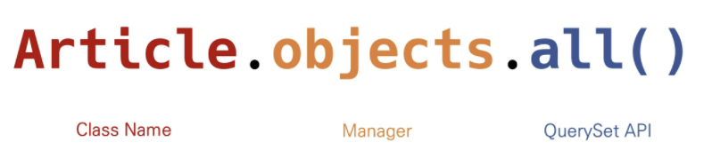

1. Manager
   * Django 모델에 데이터베이스 query 작업이 제공되는 인터페이스
   * 기본적으로 모든 Django 모델 클래스에 objects라는 Manager를 추가한다.
2. QuerySet
   * 데이터베이스로부터 전달받은 객체 목록
   * queryset 안의 객체는 0개, 1개 혹은 여러 개일 수 있다.
   * 데이터베이스로부터 조회, 필터, 정렬 등을 수행할 수 있다.


### Django shell

* 일반 python shell을 통해서는 django 프로젝트 환경에 접근할 수 없다.
* 그래서 django 프로제긑 설정이 로드된 python shell을 활용해 DB API 구문 테스트를 진행한다.
* 기본 Django shell보다 더 많은 기능을 제공하는 shell_plus를 사용해서 진행한다. 
  (Django-extensions 라이브러리의 기능 중 하나)


#### 실습: 활용 방법

```shell
$ pip install ipython
$ pip install django-extensions
```

설치 후, 앱 settings.py의 `INSTALLED_APPS`에 추가

```shell
$ python manage.py shell_plus
```

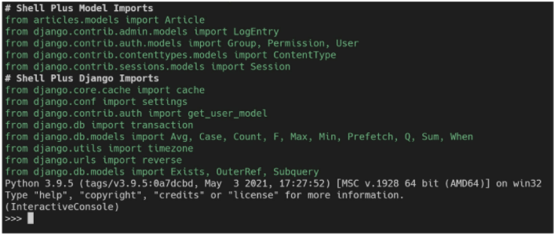


## CRUD

대부분의 컴퓨터 소프트웨어가 가지는 기본적인 데이터 처리 기능인 
**Create, Read(Retrieve), Update, Delete**를 묶어서 일컫는 말


### 실습: READ

shell_plus에서 작성

> DB에 인스턴스 객체를 얻기 위한 쿼리문 날리기
>
> 레코드가 하나만 있으면 인스턴스 객체로, 두 개 이상이면 쿼리셋으로 리턴 저장된 것이 없으므로 빈 형태로 나온다.

```shell
>>> Article.objects.all()
<QuerySet []>
```


#### 관련 메서드

* QuerySet API method를 사용해 다양한 조회를 하는 것이 중요하다
* QuerySet API method는 크게 2가지로 분류된다.
  * Methods that return new querysets
  * Methods that do not return querysets


1. `all()`
   * 현재 QuerySet의 복사본을 반환한다.
   * 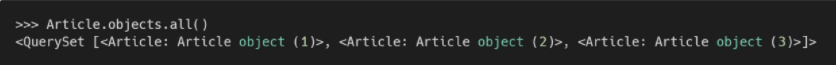
2. `get()`
   * 주어진 lookup 매개변수와 일치하는 객체를 반환
   * 객체를 찾을 수 없으면 `DoesNotExist` 예외를 발생시키고, 둘 이상의 객체를 찾으면 `MultipleObjectsReturned` 예외를 발생 시킨다.
   * 위와 같은 특징을 가지고 있기 때문에 primary key와 같이 고유성을 보장하는 조회에서 사용해야 한다.
   * 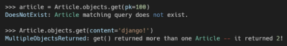
3. `filter()`
   * 주어진 lookup 매개변수와 일치하는 객체를 포함하는 새 QuerySet을 반환한다.
   * 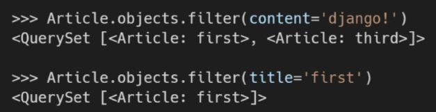


### 실습: CREATE

1. 인스턴스 생성 후 인스턴스 변수 설정하는 방법

```shell
>>> article = Article()
>>> article.title = '제목이얌'
>>> article.content = '이번 시험도 잘보자><'
>>> article.save()
```

```shell
>>> article
<Article: Article object (1)>
```

2. 초기 값과 함께 인스턴스 생성

```shell
>>> article = Article(title='두번째 제목', content='django!')
>>> article.save()
```

3. 쿼리 표현식 리턴

```shell
>>> Article.objects.create(title='세번째다', content='저장쓰')
<Article: Article object (3)>
```


이후, 테이블을 확인해보면 저장된 형태를 화인할 수 있다!!

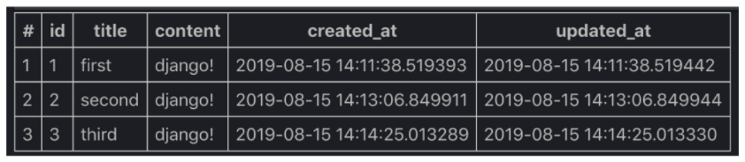


#### 관련 메서드

1. `save()`
   * 객체를 데이터베이스에 저장한다
   * 데이터 생성 시, `save()`를 호출하기 전에는 객체의 ID 값이 무엇인지 알 수 없다. 
     why? ID 값은 Django가 아니라 DB에서 계산되기 때문
   * 단순히 모델을 인스턴스화 하는 것은 DB에 영향을 미치지 않기 때문에 반드시 `save()`가 필요하다.
2. `__str__`
   * 표준 python 클래스 메소드인 str()을 정의하여 각각의 object가 사람이 읽을 수 있는 문자열을 반환하도록 할 수 있다!
   * 작성 후 반드시 <u>shell_plus를 재시작</u>해야 반영된다.
   * 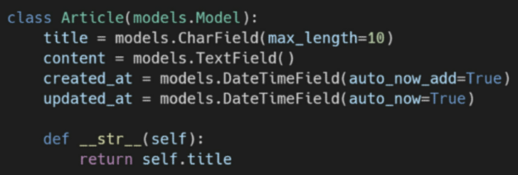


### 실습: UPDATE

article 인스턴스 객체의 인스턴스 변수의 값을 변경한 후 저장한다.

```shell
>>> article = Article.objects.get(pk=1)
>>> article.title
'제목이얌'
>>> article.title = '첫번째 제목이야'
>>> article.save()

>> article.title
'첫번쨰 제목이야'
```


### 실습: DELETE

* `delete()`
  * QuerySet의 모든 행에 대해 SQL 삭제 쿼리를 수행하고, 삭제된 객체 수와 객체 유형당 삭제 수가 포함된 딕셔너리를 반환한다.
  * 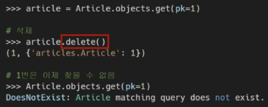


### Field lookups

* 조회 시 특정 검색 조건을 지정한다
* QuerySet method `filter()` `exclude()` `get()`에 대한 키워드 인수로 지정된다.
  * `Article.objects.filter(pk__gt==2)`
  * `Article.objects.filter(content__contains='제')`


## Admin Site

* 사용자가 아닌 서버의 관리자가 활용하기 위한 페이지
* **Model class를 admin.py에 등록하고 관리**
* django.contrib.auth 모듈에서 제공된다.
* record 생성 여부 확인에 매우 유용하며, 직접 record를 삽입할 수도 있다.


### 1. admin 생성

```shell
$ python manage.py createsuperuser
```

* 관리자 계정 생성 후 서버를 실행한 다음 '/admin'으로 가서 관리자 페이지 로그인
  * 계정만 만든 경우 Django 관리자 화면에서 아무것도 보이지 않음
* 내가 만든 Model을 보기 위해 admin.py에 작성해 django 서버에 등록한다.
* 주의! auth에 관련된 기본 테이블이 생성되지 않으면 관리자 계정을 생성할 수 없다 (그래서 makemigrations와 migrate를 전체로 해야한다.)


### 2. admin 등록

```python
from .models import <클래스 이름>

admin.site.register(<클래스 이름>)
```

* admin.py는 관리자 사이트에 Article 객체가 관리자 인터페이스를 가지고 있다는 것을 알려주는 것
* models.py에 정의한 `__str__`의 형태로 객체가 표현된다.


#### ModelAdmin options

* `list_display`: models.py에 정의한 각각의 속성(컬럼)들의 값(레코드)을 admin 페이지에 출력하도록 설정한다.

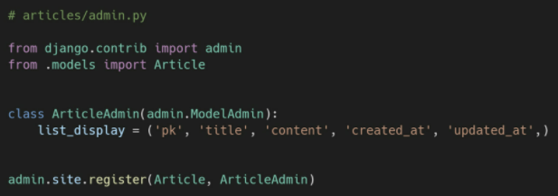

 

## CRUD with views

### READ with views.py

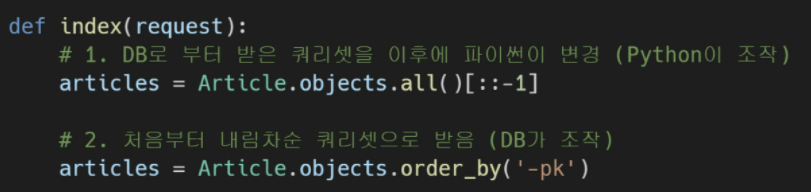

> 최신순 정렬을 하는 두가지 방법


### Detail 페이지

* 개별 게시글 상세 페이지
* 글의 번호(pk)를 활용해서 각각의 페이지를 따로 구현해야 한다. -> **Variable Routing**

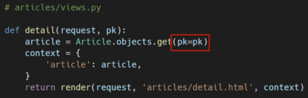

* 왼쪽 pk는 DB에 저장된 레코드의 pk(id)
* 오른쪽 pk는 variable routing을 통해 받은 pk


### HTTP method

1. GET
   * 특정 리소스를 가져오도록 요청할 때 사용
   * 반드시 데이터를 가져올 때만 사용해야 한다.
   * DB에 변화를 주지 않는다
   * CRUD에서 R역할을 담당한다.

2. POST
   * 서버로 데이터를 전송할 때 사용한다.
   * 리소스를 생성/변경하기 위해 데이터를 HTTP body에 담아 전송한다.
   * 서버에 변경사항을 만들기 때문에,
     CRUD에서 C U D 역할을 담당한다.


### CREATE with views.py

#### 사이트간 요청 위조(Cross-Site Request Forgery): CSRF

* 웹 애플리케이션 취약점 중 하나로 사용자가 자신의 의지와 무관하게 공격자가 의도한 행동을 하여 특정 웹페이지를 보안에 취약하게 하거나 수정, 삭제 등의 작업을 하게 만드는 공격 방법
* django는 CSRF에 대항하여 middleware와 template tag를 제공한다.


#### CSRF 공격 방어

* Security Token 사용 방식 (CSRF Token)
  * 사용자의 데이터에 임의의 난수값을 부여해, 매 요청마다 해당 난수값을 포함시켜 전송시키도록 한다.
  * 이후 서버에서 요청을 받을 때마다 전달된 token 값이 유효한지 검증한다.
* 일반적으로 데이터 변경이 가능한 POST, PATCH, DELETE Method 등에 적용한다. (GET은 제외)
* django는 CSRF token 템플릿 태그를 제공한다.


1. `csrf_token` template tag

   * csrf 보호에 사용
   * input type이 hidden으로 작성되며 value는 django에서 생성한 hash값으로 설정된다.
   * 해당 캐그 없이 요청을 보낸다면 django 서버는 403 forbidden을 응답한다.

2. CsrfViewMiddleware

   * CSRF 공격 관련 보안 설정은 settings.py에서 `MIDDLEWARE`에 작성되어 있다.

   * 실제로 요청 과정에서 urls.py 이전에 middleware의 설정 사항들을 순차적으로 거치며 응답은 반대로 하단에서 상단으로 미들웨어를 적용시킨다.

   * > Middleware란,
     >
     > 공통 서비스 및 기능을 애플리케이션에 제공하는 소프트웨어
     >
     > 데이터 관리, 애플리케이션 서비스, 메시징, 인증 및 API 관리를 주로 미들웨어를 통해 처리
     >
     > 개발자들이 애플리케이션을 보다 효율적으로 구축할 수 있도록 지원하여, 애플리케이션, 데이터 및 사용자 사이를 연결하는 요소처럼 작동


* **그래서 작성된 형태!!!**

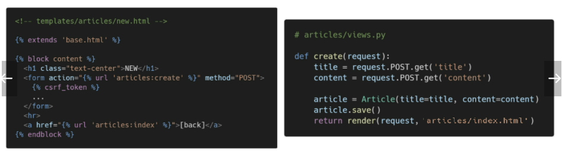

>그런데, 이대로 한다면 문제점이 2가지 생긴다.
>
>1. 글을 작성 후 index 페이지가 출력되지만 게시글이 조회되지 않는다.
>2. url은 여전히 create인 상태
>
>즉, create view 함수에서 다루고 있는 데이터로 index 페이지가 render된다는 것이다.


* **Django shortcut function - `redirect()`**
  * 새 url로 요청을 다시 보낸다.
  * 인자에 따라 `HttpResponseRedirect`를 반환한다.
  * 브라우저는 현재 경로에 따라 전체 url 자체를 재구성한다.(reconstruct)
  * 사용 가능한 인자
    * model / <u>view name</u> / absolute or relative url
* **변경된 형태!!!**
  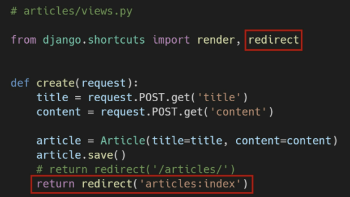


* 혹은 **detail 페이지를 활용**해서 작성할 수도 있다.
  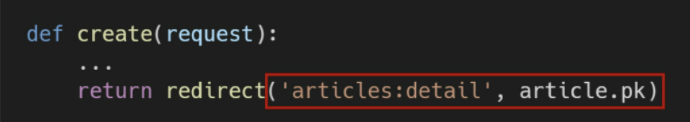


### DELETE with views.py

* detail 페이지의 버튼을 통해 delete라는 view함수를 실행하게 한다!

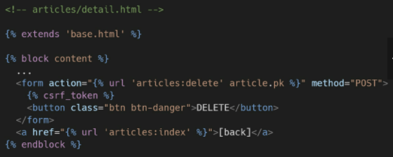

* HTTP Method POST에서만 삭제될 수 있도록 조건을 작성한다.
  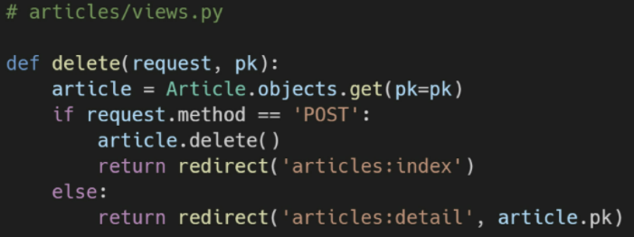


### UPDATE with views.py

* detail 페이지의 버튼을 통해 edit(update)라는 view함수를 실행하게 한다.

* Edit: 수정은 기존에 입력되어 있던 데이터를 보여주는 것이 좋기 때문에, html 태그의 value 속성을 사용해 이전 데이터를 불러온다.
  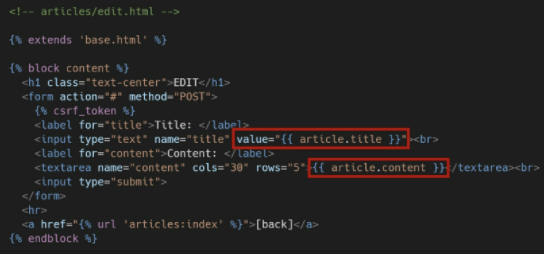

  
