# 01_JS_기초

[toc]

## JavaScript Intro

* 브라우저(browser)

  * URL로 웹(www)을 탐색하며 서버와 통신하고, html 문서나 파일을 출력하는 GUI 기반의 소프트웨어

  * 인터넷의 컨텐츠를 검색 및 열람하도록 한다

  * 웹 브라우저 라고도 함
    * ex) Google chrome, MS edge 등..


### JS의 필요성

* 브라우저 화면을 동적으로 만들기 위함
* **브라우저를 조작할 수 있는 유일한 언어!**


## 브라우저(Browser)

* 브라우저에서 할 수 있는 일
  1. DOM 조작: 문서(html) 조작
  2. BOM 조작: navigator, screen, location, frames, history, XHR
  3. JavaScript Core (ECMAScript): Data Structure(Object, Array), Conditional Expression, Iteration


### 1. DOM (Document Object Model)

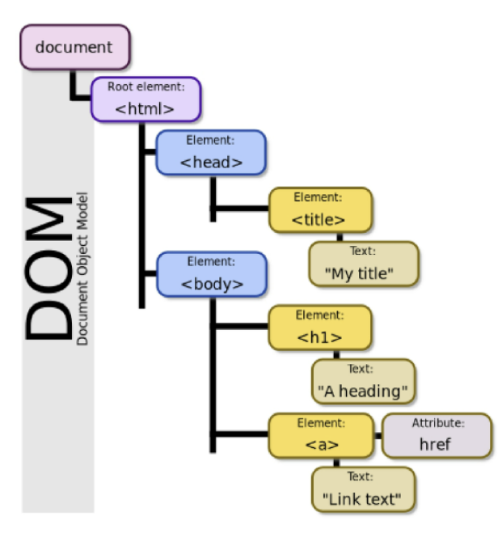

> 문서는 str 덩어리일 뿐인데, 이것을 파싱해서 만든 구조화된 형태가 DOM이 되는 것이다.


* HTML, XML과 같은 **문서를 다루기 위한 프로그래밍 인터페이스**
* 문서를 구조화하고, 구조화된 구성 요소를 하나의 객체로 취급하여 다루는 논리적 트리 모델
* 문서가 객체로 구조화되어 있으며 key로 접근 가능
* 단순한 속성 접근, 메서도 활용뿐만 아니라 **프로그래밍 언어적 특성**을 활용한 조작 가능

> 한줄 요약: 문서를 프로그래밍 언어로 조작할 수 있다!

* 주요 객체
  * `window`: DOM을 표현하는 창(브라우저 탭). 최상위 객체(작성 시 생략 가능)
  * `document`: 페이지 컨텐츠의 Entry Point 역할을 하며, `<head>` `<body>` 등과 괕은 수많은 다른 요소들을 포함한다.
  * `navigator`, `location`, `history`, `screen`


* 파싱(Parsing)
  * 구문 분석, 해석
  * 브라우저가 문자열을 해석하여 DOM Tree로 만드는 과정
  * 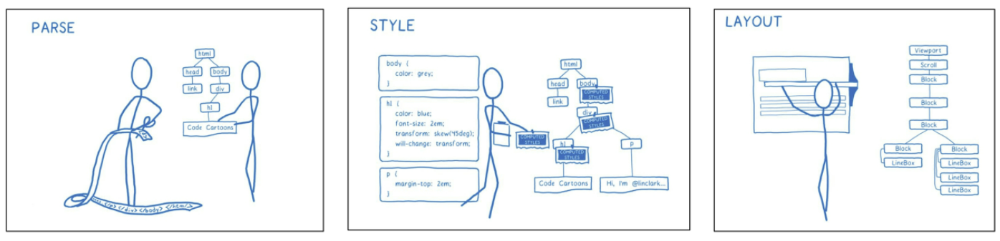


### 2. BOM (Browser Object Model)

* JS가 브라우저와 소통하기 위한 모델
* 브라우저의 창이나 프레임을 추상화해서 프로그래밍적으로 제어할 수 있도록 제공하는 수단
  * 버튼, URL 입력창, 타이틀 바 등 브라우저 윈도우 및 웹 페이지 일부분을 제어 가능하다
* `window` 객체는 모든 브라우저로부터 지원받으며 브라우저의 창(window)을 지칭한다.
* BOM 조작 예시
  * 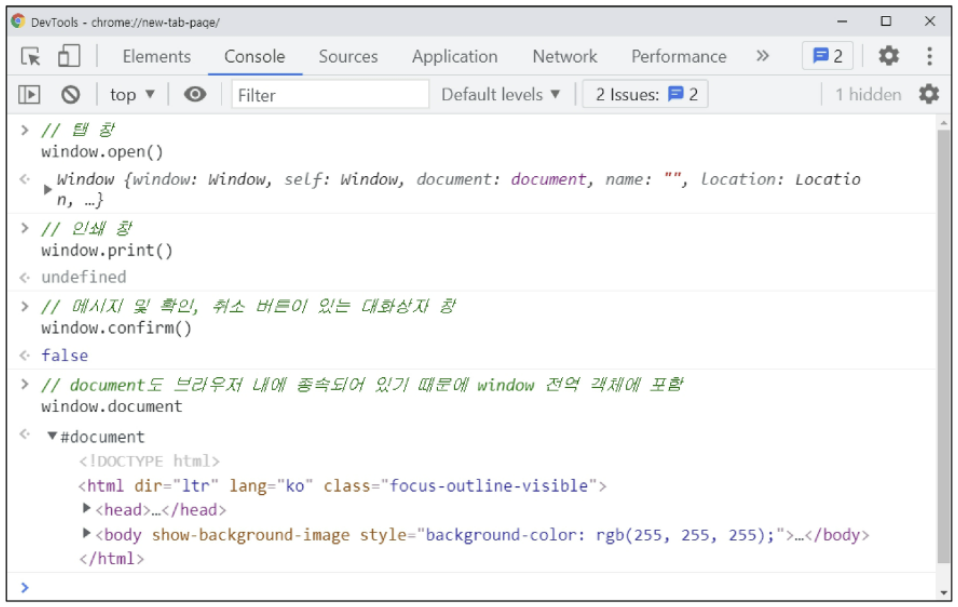
  * 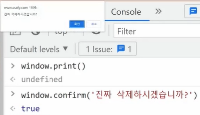


### 3. JavaScript Core

* 브라우저(BOM & DOM)를 조작하기 위한 명령어 약속(언어)

  > 언어 그 자체를 말한다.

  * 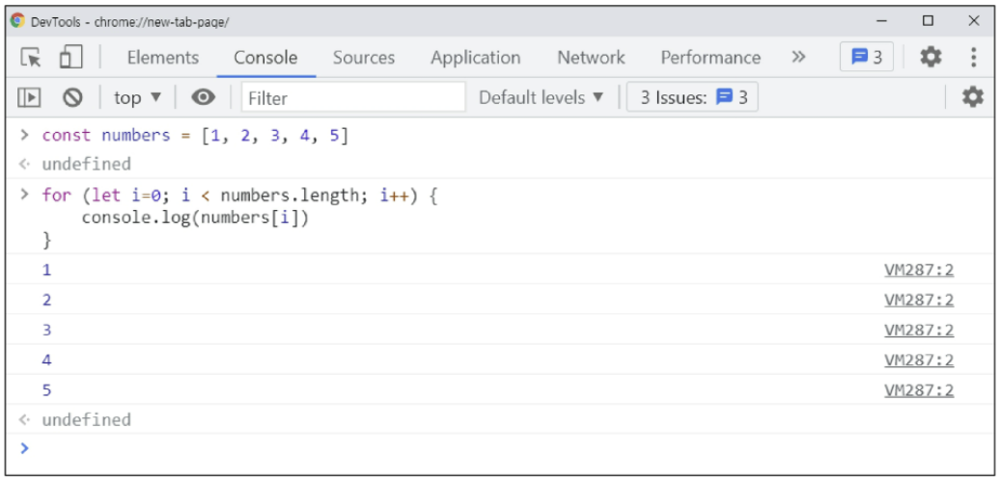


* 정리하자면...
  * 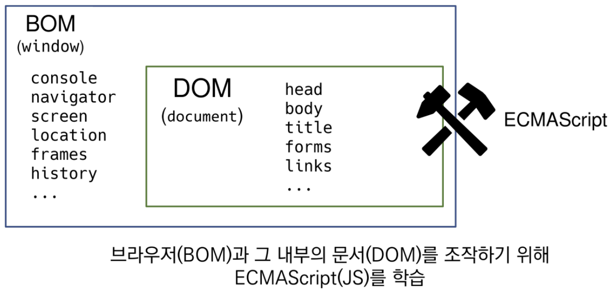


#### ECMAScript

* ECMA: 정보 통신에 대한 표준을 제정하는 비영리 표준화 기구
* ECMAScript는 ECMA에서 ECMA-262 규격에 따라 정의한 언어
  * ECMA-262: 범용적인 목적의 프로그래밍 언어에 대한 명세
* ECMAScript6는 ECMA에서 제안하는 6번째 표준 명세를 말한다.
  * ECMAScript6는 발표 연도에 따라 ECMAScript2015라고도 불린다.


#### 세미콜론(semicolon)

* JS에서는 세미콜론을 선택적으로 사용 가능
* 세미콜론이 없으면 ASI에 의해 자동으로 세미콜론이 삽입됨
  * ASI: 자동 세미콜론 삽입 규칙(Automatic Semicolon Insertion)

> 우리 수업에서는 문법이나 개념적 측면에 집중하기 위해 세미콜론을 사용하지 않고 진행한다.


## 코딩 스타일 가이드

* 코딩 스타일의 핵심은 합의된 원칙과 일관성
  * 절대적인 하나의 정답은 없으며, 상황에 맞게 원칙을 정하고 일관성 있게 사용하는 것이 중요하다
* 코딩 스타일은 코드의 품질에 직결되는 중요한 요소
  * 코드의 가독성, 유지보수 또는 팀원과의 커뮤니케이션 등 개발 과정 전체에 영향을 끼친다.
* ex) Airbnb, Google, standardjs..

> 우리 수업에서는 Airbnb를 중심으로 진행할 예정, 가이드의 일부 항목은 문법 및 개념적 측면에 집중하기 위해 변형해서 사용

<hr>

## 변수와 식별자

### 식별자

* 식별자는 변수를 구분할 수 있는 변수명을 말한다
* 식별자는 반드시 **문자, 달러($) 또는 밑줄(_)로 시작**
* 대소문자를 구분하며, 클래스명 외에는 모두 소문자로 시작한다
* 예약어는 사용 불가능
  * ex) for, if, function


* 식별자 작성 스타일
  * 카멜 케이스(camelCase, lower-camel-case): 변수, 객체, 함수에 사용
    * 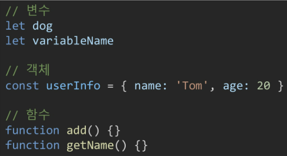
    * 두번째 단어의 첫글자부터 대문자
  * 파스칼 케이스(PascalCase, upper-camel-case): 클래스, 생성자에 사용
    * 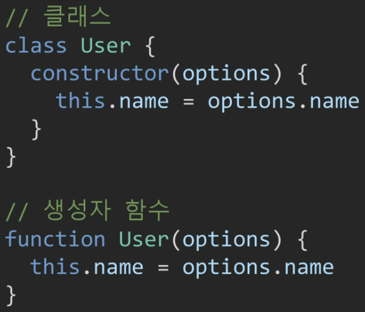
    * 모든 단어의 첫번째 글자를 대문자로 작성
  * 대문자 스네이크 케이스(SNAKE_CASE): 상수(constants)에 사용, 개발자의 의도와 상관없이 변경된 가능성이 없는 값을 의미
    * 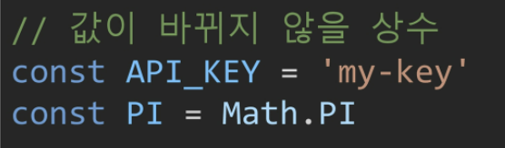
    * 모든 단어 대문자 작성, 단어 사이에 언더스코어 삽입


### 선언, 할당, 초기화

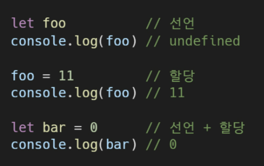

1. 선언(Declaration): 변수를 생성하는 행위 또는 시점

   > 파이썬에서는 불가능 했던 것! 파이썬에서는 할당을 해야 선언이 된다.
   >
   > JS에서는 선언과 할당이 분리되어 있다!!

2. 할당(Assignment): 선언된 변수에 값을 저장하는 행위 또는 시점

3. 초기화(Initialization): 선언된 변수에 처음으로 값을 저장하는 행위 또는 시점


### 변수 선언 키워드

|                            `let`                             |                           `const`                            |
| :----------------------------------------------------------: | :----------------------------------------------------------: |
|           <u>재할당 할 예정</u>인 변수 선언시 사용           |        <u>재할당 할 예정이 없는</u> 변수 선언시 사용         |
|                      **재선언 불가능**                       |                      **재선언 불가능**                       |
|                         블록 스코프                          |                         블록 스코프                          |
|                       **재할당 가능**                        |                      **재할당 불가능**                       |
| 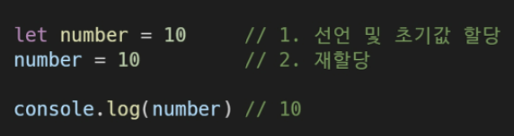 | 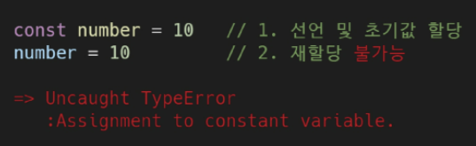<br />값을 바꾸는 것이 아니라 재할당이 불가능!!!!<br /> `=`이라는 기호로 넣는 것이 불가능하다. |

> 재선언 불가능: 브라우저의 console에서는 재선언이 가능한 것으로 보이나, html의 `<script>`에 작성할 경우 에러가 발생한다.
>
> 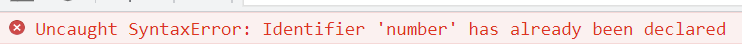


* 블록 스코프(block scope)
  * if, for, 함수 등의 중괄호(js에서 표현되는 블록) 내부를 가리킨다
  * **블록 스코프를 가지는 변수는 블록 바깥에서 접근이 불가능하다!!!**
  * 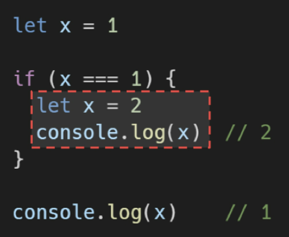


#### `var`

* 재선언 및 재할당 모두 가능

* ES6 이전에 변수를 선언할 때 사용되던 키워드

* **호이스팅되는 특성**으로 인해 예기치 못한 문제가 발생할 수 있다.

  * 변수를 선언 이전에 참조할 수 있는 현상

  * 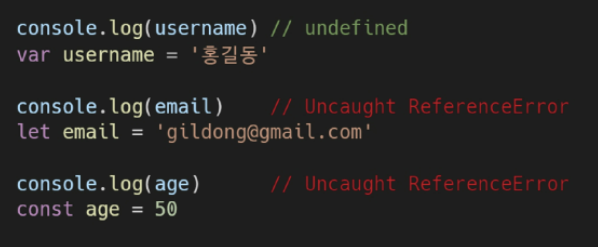

  * 변수 선언 이전의 위치에서 접근 시 `undefined`를 반환한다. 

    > 에러를 내지 않아서 문제가 생긴다!!!!!

* **함수 스코프**

  * 함수의 중괄호 내부를 가리킴
  * 함수 스코프를 가지는 변수는 함수 바깥에서 접근이 불가능하다.

* 따라서 ES6 이후부터는 `const`와 `let`을 사용하는 것을 권장한다.


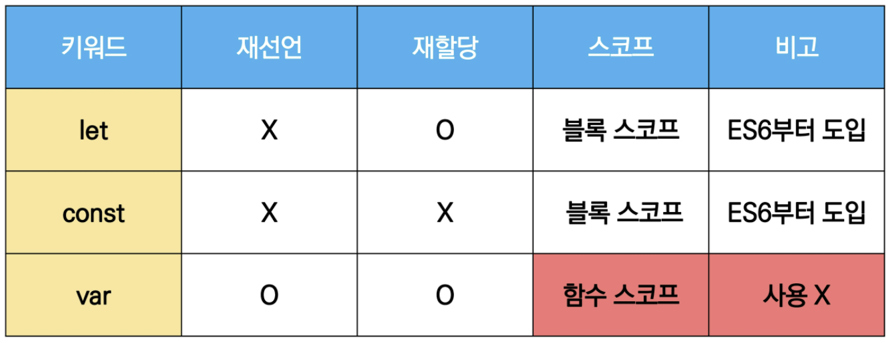

> 참고
>
> ```javascript
> if (true) {
>     var a = 1
>     let b = 2
>     const c = 3
> }
> 
> a // 1
> b // ReferenceError
> c // ReferenceError
> ```
>
> 

## 데이터 타입

* JS의 모든 값은 특정한 데이터 타입을 가진다

* 크게 원시 타입(Primitive type)과 참조 타입(Reference type)으로 분류된다.

  > 파이썬튜터에서 변수에 바로 할당된 숫자나 문자열은 바로 표에 담기는 형태로 표현되었다면, 참조형의 경우 화살표로 표시되었다 

* 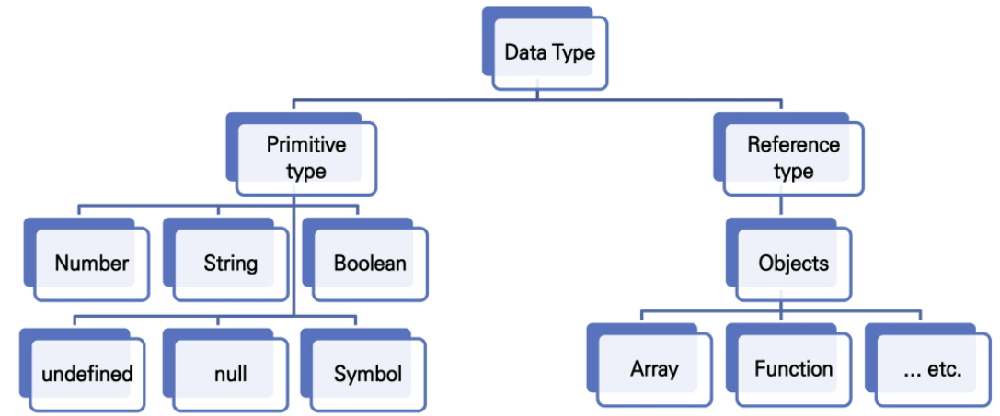


* 원시타입 vs 참조타입

| 원시타입                               | 참조타입                               |
| -------------------------------------- | -------------------------------------- |
| 객체가 아닌 기본 타입                  | 객체 타입의 자료형                     |
| 변수에 해당 타입의 값이 담긴다         | 변수에 대항 객체의 참조값이 담긴다     |
| 다른 변수에 복사할 때 실제 값이 복사됨 | 다른 변수에 복사할 때 참조 값이 복사됨 |


### 원시

#### 숫자(Number) 타입

* 정수, 실수 구분 없는 하나의 숫자 타입
* 부동소수점 형식을 따른다
* `NaN`: Not-A-Number
  * 계산 불가능한 경우 반환되는 값
  * 숫자가 아님을 표현하는 숫자형 데이터
  * ex) 'Angel' / 1004 => `NaN`


#### 문자열(String) 타입

* 텍스트 데이터를 나타내는 타입
* 16비트 유니코드 문자의 집합
* 작은따옴표 또는 큰따옴표 모두 가능
* 템플릿 리터럴
  * ES6부터 지원
  * 따옴표 대신 백틱(``)으로 표현한다
  * `${expression}` 형태로 표현식 삽입 가능
    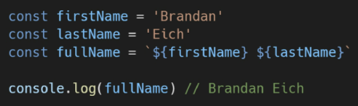 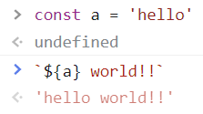


#### `undefined`

* 변수의 값이 없음을 나타내는 데이터 타입
* 변수 선언 이후 직접 값을 할당하지 않는 경우, 자동으로 undefined가 할당된다.
* 함수의 return 값이 없는 경우

> 개발자의 의도가 X


#### `null`

* 변수의 값이 없음을 의도적으로 표현할 떄 사용하는 데이터 타입

> 개발자가 의도적으로 입력을 해야 쓸 수 있는 데이터타입이다!

> [참고] null타입과 typeof 연산자
>
> `typeof`: 자료형 평가를 위한 연산자
>
> null 타입은 ECMA 명세의 원시 타입의 정의에 따라 원시 타입에 속하지만, `typeof` 연산자의 결과는 객체로 표현된다


#### `Boolean`

* 논리적 참 또는 거짓을 나타내는 타입
* `true` / `false`로 표현
* 조건문 또는 반복문에서 유용하게 사용된다.
  * 조건문 또는 반복문에서 boolean이 아닌 데이터 타입은 자동 형변환 규칙에 따라 true 또는 false로 변환된다.

> [참고] 자동 형변환
>
> 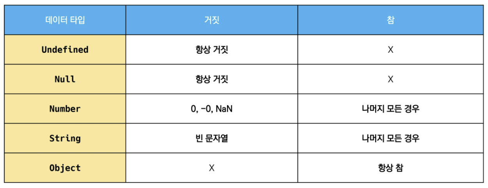
>
> 파이썬에서 빈 배열은 false였으나, js에서는 참이다!!!


### 참조 타입

(자세한 내용은  추후에...)

* 함수, 배열, 객체 다룰 것이다.


## 연산자

### 할당 연산자

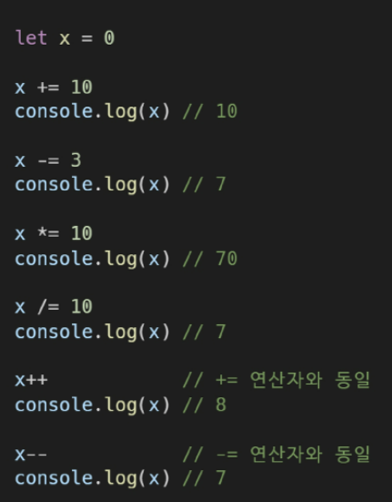

* 오른쪽에 있는 피연산자의 평가 결과를 왼쪽 피연산자에 할당하는 연산자

* 다양한 연산에 대한 단축 연산자를 지원한다.

* Increment 및 Decrement 연산자

  * `++`: 피연산자의 값을 1 증가시키는 연산자

  * `--`: 피연산자의 값을 1 감소시키는 연산자

    > Airbnb에서는 `+=`, `-=`와 같이 더 분명한 표현으로 적을 것을 권장한다.


### 비교 연산자

* 피연산자를 비교하고 결과값을 boolean으로 변환하는 연산자
* 문자열은 유니코드 값을 사용하며 표준 사전 순서를 기반으로 비교한다.
  * 알파벳끼리 비교할 경우
    * 순서상 후순위가 더 크다
    * 소문자가 대문자보다 더 크다


### 동등 비교 연산자(`==`)

* 두 피연산자가 같은 값으로 평가되는지 비교 후 boolean값을 반환
* 비교할 때 암묵적 타입 변환을 통해 타입을 일치시킨 후 같은 값인지 비교
* 두 피연산자가 모두 객체일 경우 메모리의 같은 객체를 바라보는지 판별
* 예상치 못한 결과가 발생할 수 있으므로 특별한 경우를 제외하고 사용하지 않음 => *우리는 그냥 안쓴다!*
* 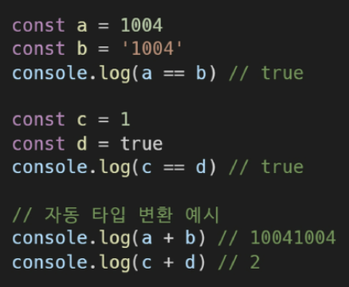

> 


### 일치 비교 연산자 (`===`)

* 두 피연산자가 같은 값으로 평가되는지 비교 후 boolean 값을 반환
* 엄격한 비교가 이뤄지며 암묵적 타입 변환이 발생하지 않는다
  * 엄격한 비교: 두 비교 대상의 타입과 값 모두 같은지 비교하는 방식
* 두 피연산자가 모두 객체일 경우 메모리의 같은 객체를 바라보는지 판별


### 논리 연산자

1. `&&`: and
2. `||`: or
3. `!`: not

* 단축 평가 지원한다!!
  * false `&&` true => false
  * true `||` false => true

|                             and                              |                              or                              |                             not                              |
| :----------------------------------------------------------: | :----------------------------------------------------------: | :----------------------------------------------------------: |
| 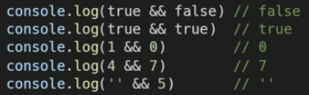 | 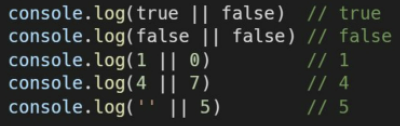 | 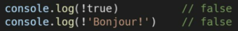 |


### 삼항 연산자 (Ternary Operator)

* 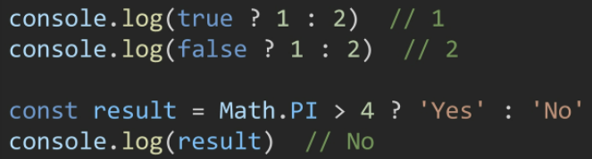

* 세개의 피연산자를 사용하여 조건에 따라 값을 반환하는 연산자

* 가장 왼쪽의 조건식이 참이면 `:` 앞의 값을 사용하고, 그렇지 않으면 `:` 뒤의 값을 사용한다.

* 삼항 연산자의 결과값이기 때문에 변수에 할당 가능하다!!!

* > 한 줄에 표기하는 것을 권장


## 조건문

1. `if` statement
   * 조건 표현식의 결과값을 boolean 타입으로 변환 후 참/거짓을 판단한다.
2. `switch` statement
   * 조건 표현식의 결과값이 어느 값(case)에 해당하는지 판별
   * [참고] 주로 특정 변수의 값에 따라 조건을 분기할 때 활용한다. (조건이 많아질 경우 if문보다 가독성이 나을 수 있다.)


### 1. `if` statement

* `if`, `else if`, `else`
* 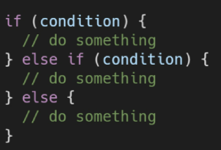 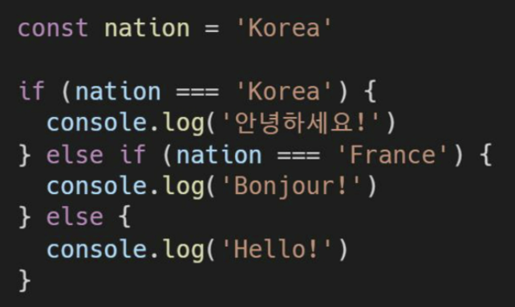
  * 조건은 소괄호 안에 작성하고, 실행할 코드는 중괄호 안에 작성한다.
* 블록 스코프 생성


### 2. `switch` statement

* 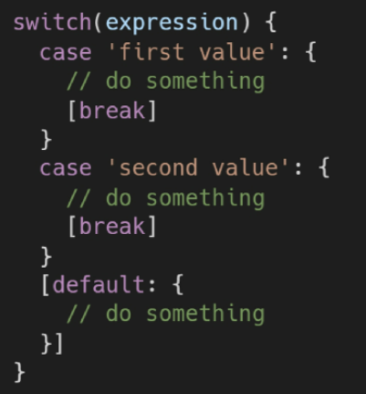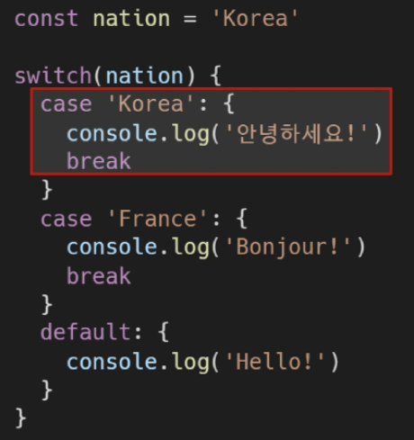

* 표현식(expression)의 결과값을 이용한 조건문

* 표현식의 결과값과 case문의 오른쪽 값을 비교

  * >  위의 예시에서는 switch안에 nation이 들어가 있으므로, nation값만 보겠다는 의미가 된다! case로 나눠진 것들은 nation이 'Korea', 'France'인 경우에 대한 말이고, 이 모두에 해당되지 않으면 default문에서 실행될 것이다.

* break 및 default문은 [선택적]으로 사용 가능

* break문이 없는 경우, break문을 만나거나 default문을 실행할 때까지 다음 조건문 실행

  * > 이 코드에서 `break`를 작성하지 않으면 참인 case부터 모든 출력을 다 한다. 
    >
    > why? **Fall Through**때문
    >  하나의 case에서 참을 만나면 그 뒤는 비교하지 않고 다 실행을 하게 되어있음

* 블록 스코프 생성


## 반복문

1. `while`
2. `for`
3. `for ... in`
   * 주로 **객체의 속성**들을 순회할 때 사용
   * 배열도 순회 가능하지만 인덱스 순으로 순회한다는 보장이 없으므로 권장하지 않는다.
4. `for ... of`
   * **반복 가능한(iterable) 객체를 순회**하며 값을 꺼낼 때 사용
   * 반복 가능한 객체의 종류: Array, Map, Set, String 등..


### 1. `while`

* 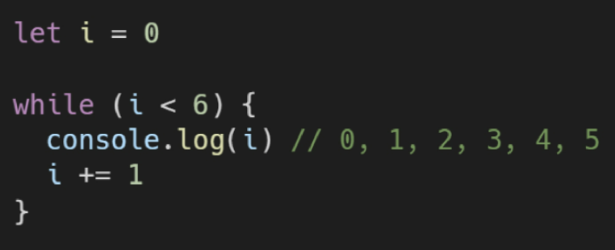
* 조건문이 참인 동안 반복 시행
* 조건은 소괄호 안에 작성
* 실행할 코드는 중괄호 안에 작성
* 블록 스코프 생성


### 2. `for`

* 세미콜론`;`으로 구분되는 세부분으로 구성
  * 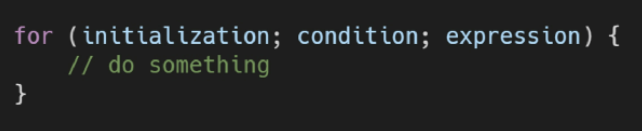
    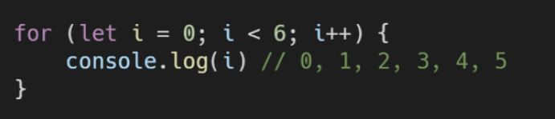
  * initialization: 최초 반복문 진입 시 1회만 실행되는 부분
  * condition: 매 반복 시행 전 평가되는 부분
  * expression: 매 반복 시행 이후 평가되는 부분
  * 블록 스코프 생성


### 3. `for ... in`

* 객체의 속성(key)들을 순회할 때 사용 => **객체 순회 적합**

  > class instance의 객체를 의미하는 것이 아니다. 여기에서의 객체는 dictionary 형태로 이뤄진 것들을 의미하는 것이다!!

* 배열도 순회 가능하지만 권장하지 않는다.

  * 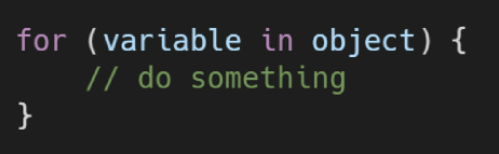
    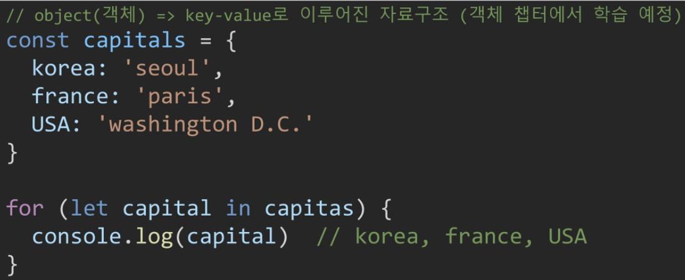

  * 실행할 코드는 중괄호 안에 작성

    ```javascript
    for (let capital in capitals) {
        console.log(`${capital}의 수도는 ${capitals[capital]}`)
    }
    // korea의 수도는 seoul
    // france의 수도는 paris
    // USA의 수도를 washington D.C.
    ```

    > 객체를 for ... of로 돌리면 error가 난다!! 객체는 iterable한 속성이 없기 때문이다

* 블록 스코프 생성


### 4. `for ... of`

* 반복 가능한(iterable) 객체를 순회하여 값을 꺼낼 때 사용 => **배열 순회 적합**

  * 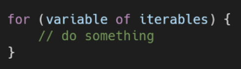
    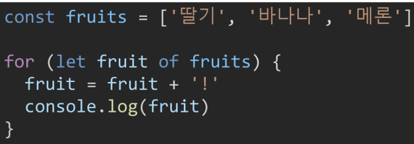

  * 실행할 코드는 중괄호 안에 작성

    > 배열을 for ... in 으로 돌리면 인덱스가 key이기 때문에 인덱스번호가 나온다!!

  * ```javascript
    for (const fruit of fruits) {
        console.log(fruit)
    }
    // 되는 코드다!!
    ```

    > scope가 블록이므로 회차 돌 때마다 블록의 생명주기가 끝나서, 이미 죽고 다시 살아나는 것이라 가능하게 된다!!
    >
    > 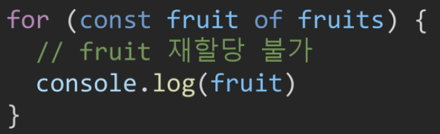 
    >
    > 하지만, 재할당이 불가능 하므로 위의 예시처럼 !를 붙여 재할당하지는 못한다.
    >
    > but, `console.log(fruit + '!')`는 가능하다! 이건 재할당이 아니기 때문에

* 블록 스코프 생성


* 정리

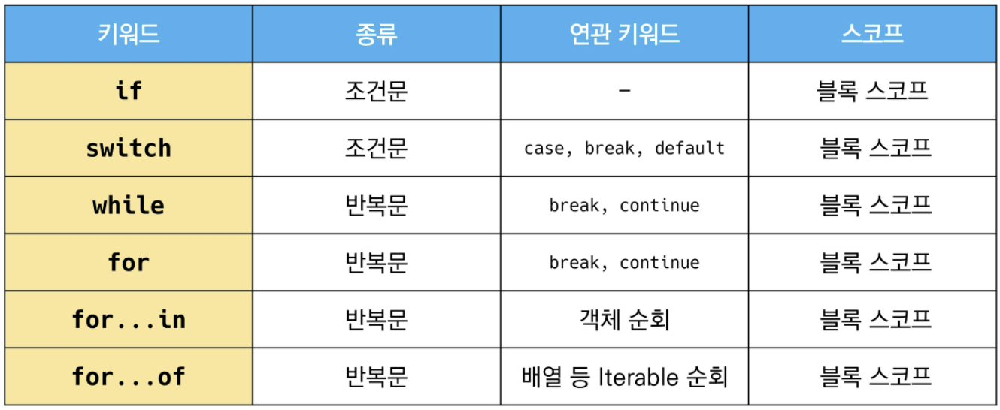
