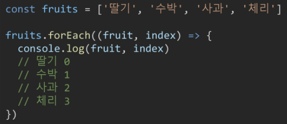

# 02_함수, 메서드

[toc]

## 함수

### 함수 in JavaScript

* 참조 타입 중 하나로써 function 타입에 속한다
* JavaScript에서 함수를 정의하는 방법은 주로 2가지로 구분
  * 함수 선언식(function declaration)
  * 함수 표현식(function expression)
* [참고] JS의 함수는 **일급 객체(First-class citizen)**에 해당한다.
  * 일급 객체: 다음의 조건들을 만족하는 객체를 의미한다
    * 변수에 할당 가능
    * 함수의 매개변수로 전달 가능
    * 함수의 반환 값으로 사용 가능

### 함수 선언식

*  
* 함수의 이름과 함께 정의하는 방식
* 3가지 부분으로 구성
  * 함수의 이름
  * 매개변수
  * 몸통(중괄호 내부)

### 함수 표현식

*  
* 함수를 표현식 내에서 정의하는 방식
  * 표현식: 어떤 하나의 값으로 결정되는 코드의 단위
* 함수의 이름을 생략하고 익명 함수로 정의 가능
  * 익명 함수: 이름이 없는 함수
  * 익명 함수는 함수 표현식에서만 가능
* 3가지 부분으로 구성
  * 함수의 이름(생략 가능)
  * 매개변수
  * 몸통(중괄호)

### 함수 구성요소

* **기본 인자(default arguments)**
  * 인자 작성 시 `=` 문자 뒤 기본 인자 선언 가능
  * 

* **매개변수와 인자의 개수 불일치 허용**
  * 매개변수보다 인자의 개수가 많을 경우
  * 
  * 매개변수보다 인자의 개수가 적을 경우
  * 

* **Rest Parameter(`...`)**
  * 이것을 사용하면 정해지지 않은 수의 매개변수를 배열로 받는다. (파이썬의 *args와 유사)
  * 만약 rest parameter로 처리한 매개변수에 인자가 넘어오지 않을 경우에는 <u>빈 배열로 처리</u>
  * 
* **Spread Operator(`...`)**
  * 배열 인자를 전개하여 전달 가능
  * 

### 선언식 vs 표현식

* 선언식 함수와 표현식 함수 모두 타입은 function으로 동일

#### 호이스팅(hoisting)

* 함수 선언식
  * 이렇게 선언한 함수는 var로 정의한 변수처럼 hoisting이 발생한다
  * 함수 호출 이후에 선언해도 동작하게 된다.
  * 
* 함수 표현식
  * 표현식으로 선언한 함수는 **함수 정의 전에 호출 시 에러 발생**
  * 함수 표현식으로 정의된 함수는 변수로 평가되어 변수의 scope 규칙을 따른다.
  * 
* [참고] 함수 표현식을 `var`로 작성한 경우
  * 변수가 선언 전 `undefined`로 초기화되어 다른 에러가 발생
  * 

### 화살표 함수(Arrow Function)

* 함수를 비교적 간결하게 정의할 수 있는 문법
* `function` 키워드 생략 가능
* 함수의 매개변수가 단 하나뿐이라면, `()`도 생략 가능
* 함수 몸통이 표현식 하나라면 `{ }`과 `return`도 생략 가능
* 기존 fucntion 키워드 사용 방식과의 차이점 => this 키워드에서!

## 메소드

### 문자열 메소드

#### `includes`

* `string.includes(value)`
* 문자열에 value가 존재하는지 판별 후 참 또는 거짓 반환
* 

#### `split`

* `string.split(value)`
* value가 없을 경우, 기존 문자열을 배열에 담아 반환
* value가 빈 문자열일 경우 각 문자로 나눈 배열을 반환
* value가 기타 문자열일 경우, 해당 문자열로 나눈 나눈 배열을 반환
* 

#### `replace`

* `string.replace(from, to)` 
  * 문자열에 from값이 존재할 경우, 1개만 to 값으로 교체하여 반환
* `string.repalceAll(from, to)`
  * 문자열에 from값이 존재할 경우, 모두 to값으로 교체하여 반환
* 

#### `trim`

* `string.trim()`
  * 문자열 시작과 끝의 모든 공백문자(스페이스, 탭, 엔터 등)을 제거한 문자열 반환
* `string.tirmStart()`
  * 문자열 시작의 공백문자(스페이스, 탭, 엔터 등)을 제거한 문자열 반환
* `string.trimEnd()`
  * 문자열 끝의 공백문자(스페이스, 탭, 엔터 등)을 제거한 문자열 반환
* 

### 배열 메소드

* 배열이란
  * 키와 속성들을 담고 있는 참조 타입의 객체(object)
* 순서를 보장하는 특징이 있음
* 주로 대괄호를 이용하여 생성하고, 0을 포함한 양의 정수 인덱스로 특정 값에 접근 가능
* 배열의 길이는 `array.length` 형태로 접근 가능

#### `reverse`

* `array.reverse()`
* 원본 배열의 요소들의 순서를 반대로 정렬
* 

#### `push` & `pop`

* `array.push()`
  * 배열의 가장 뒤에 요소 추가
* `array.pop()`
  * 배열의 마지막 요소 제거
* 

#### `unshift` & `shift`

* `array.unshift()`
  * 배열의 가장 앞에 요소 추가
* `array.shift()`
  * 배열의 첫번째 요소 제거
* 

#### `includes` 

* `array.includes(value)`
* 배열에 특정 값이 존재하는지 판별 후 참 또는 거짓 반환
* 

#### `indexOf`

* `array.indexOf(value)`
* 배열에 특정 값이 존재하는지 확인 후 가장 첫번째로 찾은 요소의 인덱스 반환
* 만약 해당 값이 없을 경우 -1 반환
* 

#### `join`

* `array.join([separator])`
* 배열의 모든 요소를 연결하여 반환
* separator(구분자)는 선택적으로 지정 가능하며, <u>생략 시 쉼표를 기본 값으로 사용</u>
* 

#### Spread Operator(`...`)

* 배열 내부에서 배열 전개 가능
* ES5까지는 `array.concat()`을 사용 했음
* 얕은 복사에 활용 가능

* 

### 배열 메소드 심화

* 배열을 순회하며 특정 로직을 수행하는 메서드
* 메서드 호출 시 인자로 callback 함수를 받는 것이 특징
  * **callback 함수: 어떤 함수의 내부에서 실행될 목적으로 인자로 넘겨받는 함수를 말한다.**

#### `forEach`

* `array.forEach(callback(element[, index[, array]]))`
*  
* 배열의 각 요소에 대해 콜백 함수를 한 번씩 실행
* 콜백 함수는 대가지 매개변수로 구성
  * element:배열의 요소
  * index: 배열 요소의 인덱스
  * array: 배열 자체
* **반환 값이 없는 메서드**

#### `map`

* `array.map(callback(element[, index[, array]]))`
*  
* 배열의 각 요소에 대해 콜백 함수를 한 번씩 실행
* **콜백 함수의 반환 값을 요소로 하는 새로운 배열 반환**
* 기존 배열 전체를 다른 형태로 바꿀 때 유용

#### `filter`

* `array.filter(callback(element[, index[, array]]))`
*  
* 배열의 각 요소에 대해 콜백 함수를 한 번씩 실행
* **콜백 함수의 반환 값이 참인 요소들만 모아서 새로운 배열 반환**
* 기존 배열의 요소들을 필터링할 때 유용

#### `reduce`

* `array.reduce(callback(acc, element[, index[, array]])[, acc의 초기값])`
*  
* 배열의 각 요소에 대해 콜백 함수를 한 번씩 실행
* **콜백 함수의 반환 값들을 하나의 값(acc)에 누적 후 반환**
* reduce 메서드의 주요 매개변수
  * `acc`: 이전 콜백 함수의 반환 값이 누적되는 변수
  * `initialValue`(optional): 최초 콜백 함수 호출 시 `acc`에 할당되는 값, default값은 배열의 첫번째 값
* [참고] 빈 배열의 경우 `initialValue`를 제공하지 않으면 에러 발생

#### `find`

* `array.find(callback(element[, index[, array]]))`

*  

* 배열의 각 요소에 대해 콜백 함수를 한 번씩 실행

* **콜백 함수의 반환 값이 참이면, 조건을 만족하는 첫번째 요소를 반환**

* 찾는 값이 배열에 없으면 `undefined` 반환
  

* > filter와의 차이점!
  >
  > 
  >
  > 

#### `some`

* `array.some(callback(element[, index[, array]]))`
*  
* **배열의 요소 중 하나라도 주어진 판별 함수를 통과하면 참을 반환**
* 모든 요소가 통과하지 못하면 거짓 반환
* [참고] 빈 배열은 항상 거짓 반환

#### `every`

* `array.every(callback(element[, index[, array]]))`
*  
* **배열의 모든 요소가 주어진 판별 함수를 통과하면 참을 반환**
* 하나의 요소라도 통과하지 못하면 거짓 반환
* [참고] 빈 배열은 항상 참 반환

