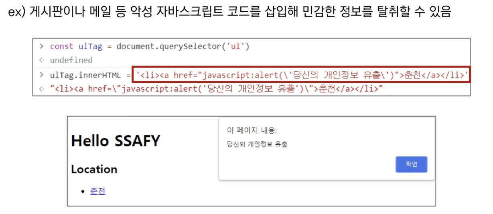

# 03_JS_심화

## JS의 역사

### 핵심 인물

* 팀 버너스리
  * www, url, http, html 최초 설계자
  * 웹의 아버지
* 브랜던 아이크
  * JS 최초 설계자
  * 모질라 재단 공동 설립자
  * 코드네임 피닉스 프로젝트 진행
    * 파이어폭스의 전신


### JS의 탄생

* 1994년 당시 넷스케이프 커뮤니케이션스사의 Netscape Navigator(NN) 브라우저가 전세계 점유율을 80% 이상 독점하며 브라우저의 표준 역할을 함
* 당시 넷스케이프에 재직 중이던 브랜던 아이크가 HTML을 동적으로 동작하기 위한 회사 내부 프로젝트를 진행하던 중 JS를 개발
* JS이름 변천사
  * Mocha -> LiveScript -> JavaScript(1995)
* 그러나 1995년 경쟁사 MS에서 이를 채택하여 커스터마이징한 JScript를 만듦
* 이를 IE 1.0에 탑재 -> 1자 브라우저 전쟁의 시작


### 제1차 브라우저 전쟁

* 넷스케이프 vs 마이크로소프트
* 빌 게이츠 주도하에 MS는 1997년 IE 4를 발표하면서 시장을 장악하기 시작
  * 당시 윈도우 OS의 시장 점유율은 90%
  * 글로벌 기업 MS의 공격적인 마케팅
* MS의 승리로 끝나며 2001년부터 IE의 점유율은 90%를 상회
* 1998년 넷스케이프에서 나온 브랜던 아이크 외 후계자들은 모질라 재단을 설립
  * 파이어폭스를 통해 IE에 대항하며 꾸준히 점유율을 올려 나감

* MS의 폭발적 성장, IE3에서 자체적인 JScript를 지원, 호환성 문제로 크로스 브라우징 등의 이슈 발생
  * *같은 기능을 언어 두가지로 기능을 해야하고...* 
* 이후 넷스케이프 후계자들은 모질라 재단 기반의 파이어폭스를 개발


### 제2차 브라우저 전쟁

* MS vs Google
* 2008년 Google의 크롬 브라우저 발표
* 2011년 3년 만에 파이어폭스의 점유율을 돌파 후 2012년부터 전세계 점유율 1위 등록
* 크롬의 승리 요인
  * 압도적인 속도
  * 강력한 개발자 도구 제공
  * 웹 표준


### 파편화와 표준화

* 제1차 브라우저 전쟁 이후 수많은 브라우저에서 자체 JS 언어를 사용하게 된다
* 결국 서로 다른 JS가 만들어지면서 크로스 브라우징 이슈가 발생하여 웹 표준의 필요성이 제기되었다.
* 크로스 브라우징(Cross Browsing)
  * W3C에서 채택된 표준 웹 기술을 채용하여 각각의 브라우저마다 다르게 구현되는 기술을 비슷하게 만들되, 어느 한쪽에 치우치지 않도록 웹 페이지를 제작하는 방법론(동일성이 아닌 동등성)
  * 브라우저마다 렌더링에 사용하는 엔진이 다르기 때문

* 1996년부터 넷스케이프는 표준 제정의 필요성을 주장
  * ECMA 인터내셔널(정보와 통신 시스템을 위한 국제적 표준화 기구)에 표준 제정 요청
* 1997년 ECMAScript 1 탄생
* 제1차 브라우저 전쟁 이후 제기된 언어의 파편화를 해결하기 위해 각 브라우저 회사와 재단은 표준화에 더욱 적극적으로 힘을 모으기 시작


### JavaScript ES6+

* 2015년 EC6+ 탄생
* "Next-gen of JS"
* JS의 고질적인 문제들을 해결
* JS 다음 시대라고 불릴 정도로 많은 혁신과 변화를 맞이한 버전
* 이때부터 버전 순서가 아닌 출시 연도를 붙이는 것이 공식 명칭이나 통상적으로 ES6이라 부른다
* 현재는 표준 대부분이 ES6+로 넘어왔다.


### Vanilla JS

* 크로스 브라우징, 간편한 활용 등을 위해 많은 라이브러리 등장(jQuery 등)
* ES6 이후, 다양한 도구의 등장으로 순수 JS 활용의 증대


> 정리
>
> JS와 브라우저의 역사: 브라우저 전쟁 -> 파편화와 표준화의 투쟁
>
> 브라우저 전쟁의 여파: Cross Browsing Issue, 표준화를 위한 노력, Vanilla JS


## DOM

* Document는 문서 한장(html)에 해당하고 이를 조작한다
* DOM 조작 순서
  1. 선택(Select)
  2. 변경(Manipulation)


### DOM 관련 객체의 상속 구조


* EventTarget
  * Event Listener를 가질 수 있는 객체가 구현하는 DOM 인터페이스
* Node
  * 여러 가지 DOM 타입들이 상속하는 인터페이스
* **Element**
  * Document 안의 모든 객체가 상속하는 가장 범용적인 인터페이스
  * 부모인 Node와 그 부모인 EventTarget의 속성을 상속
* **Document** (html 파일 자체)
  * 브라우저가 불러온 웹 페이지를 나타냄
  * DOM 트리의 진입점(entry point) 역할을 수행
* **HTMLElement**
  * 모든 종류의 HTML 요소
  * 부모 element의 속성 상속


### DOM 선택

#### `document.querySelector(selector)`

* 제공한 선택자와 일치하는 element 하나 선택
* 제공한 CSS selector를 만족하는 첫번째 element 객체를 반환 (없다면 null)

#### `document.querySelectorAll(selector)`

* 제공한 선택자와 일치하는 여러 element를 선택
* 매칭할 하나 이상의 셀렉터를 포함하는 유효한 CSS selector를 인자(문자열)로 받는다
* 지정된 셀렉터에 일치하는 NodeList를 반환


* 이전에는 getElementById(id),getElementByTagName(name), getElementByClassName(names)를 사용했으나, 이제는 안쓴다.
* 위의 메소드들이 id class tag등을 더 구체적이고 유연하게 선택 가능하기 때문!


> 실습
>
> * 자손 선택자
>   
>
> * 자식 선택자
>   


#### 선택 메서드별 반환 타입


* 아래 둘다 배열과 같이 각 항목에 접근하기 위한 index를 제공(유사 배열)
* `HTMLCollection`
  * name, id, index 속성으로 각 항목에 접근 가능
* `NodeList`
  * index로만 각 항목에 접근 가능
  * 단, HTMLCollection과 달리 배열에서 사용하는 <u>forEach 메서드 및 다양한 메서드 사용 가능</u>
* 둘다 Live Collection으로 DOM의 변경사항을 실시간으로 반영하지만, `querySelectroAll()`에 의해 반환되는 **NodeList는 Static Collection으로 실시간으로 반영되지 않는다.**


#### Collection

* Live Collection
  * 문서가 바뀔 때 실시간으로 업데이트 됨
  * DOM의 변경사항을 실시간으로 collection에 반영
  * ex) HTMLCollection, NodeList
* Static Collection (non-live)
  * DOM이 변경되어도 collection 내용에는 영향을 주지 않음
  * `querySelectorAll()`의 반환 NodeList만 static collection

>  
>
> 1의 출력이 저렇게 나오는 이유는 
>
> for문이 돌 때 liveNodes[0]의 클래스를 변경하고 i가 1 상승했는데, 그 다음 liveNodes를 가져오는 것이 아니라 변경이 적용되고 난 후에 live라는 클래스를 가진 Live Collection을 받아오게 된다. 그러면 이미 i는 1이 되었기 때문에 새 Live Collection의 두번째 요소의 클래스를 변경하게 되는 것이다.


### DOM 변경

* **`document.createElement()`**
  * 작성한 태그 명의 HTML 요소를 생성하여 반환
* **`Element.append()`**
  * 특정 부모 Node의 자식 NodeList 중 마지막 자식 다음에 Node 객체나 DOMString을 삽입
  * 여러 개의 Node 객체, DOMString을 추가할 수 있음
  * 반환 값이 없음
* **`Node.appendChild()`**
  * 한 Node를 특정 부모 Node의 자식 NodeList 중 마지막 자식으로 삽입(Node만 추가 가능)
  * 한번에 오직 하나의 Node만 추가할 수 있음 
    *(두개를 넣어도 에러가 뜨지는 않고 두개중 앞의 하나만 들어간다!!)*
  * 만약 주어진 Node가 이미 문서에 존재하는 다른 Node를 참조한다면 새로운 위치로 이동


#### 변경 관련 속성(property)

* `Node.innerText`

  * Node 객체와 그 자손의 텍스트 컨텐츠(DOMString)를 표현 (해당 요소 내부의 raw text)
    (사람이 읽을 수 있는 요소만 남긴다)
  * 즉, 줄 바꿈을 인식하고 숨겨진 내용을 무시하는 등 최종적으로 스타일링이 적용된 모습으로 표현

* `Element.innerHTML`

  * 요소 내에 포함된 HTML 마크업을 반환

  * [참고] XSS 공격에 취약하므로 사용시 주의

    > XSS (Cross-Site Scripting)
    >
    > 공격자가 입력요소를 사용하여 웹 사이트 클라이언트 측 코드에 악성 스크립트는 삽입해 공격하는 방법
    >
    > 피해자(사용자)의 브라우저가 악성 스크립트를 실행하며 공격자가 엑세스 제어를 우회하고 사용자를 가장할 수 있도록 함
    > 

> 실습 형태
>
> 


### DOM 삭제

* `ChildNode.remove()`
  * ChildNode가 속한 트리에서 해당 Node를 제거
* `Node.removeChild(제거할노드)`
  * DOM에서 자식 Node를 제거하고, 제거된 Node를 반환
  * Node는 인자로 들어가는 자식 Node의 부모 Node

> 실습 형태
>
> 


### DOM 속성

* `Element.setAttribute(name, value)`
  * 지정된 요소의 값을 설정
  * 속성이 이미 존재하면 값을 갱신, 존재하지 않으면 지정된 이름과 값으로 새 속성을 추가
* `Element.getAttribute(attributeName)`
  * 해당 요소의 지정된 값(문자열)을 반환
  * 인자`(attributeName`)는 값을 얻고자 하는 속성의 이름

```javascript
// 4. 속성
// 4-1. setAttribute
const header = document.querySelector('#location-header')
header.setAttribute('class', 'ssafy-location')

// 4-2. getAttribute
const getAttr = document.querySelector('.ssafy-location')
getAttr.getAttribute('class')
getAttr.getAttribute('style')

// 4-3. Element Styling
const li1 = document.querySelector('li')
li1.style.cursor = 'pointer'
li1.style.color = 'blue'
li1.style.background = 'red'
```


> 실습 
>
> ```javascript
> // 이미지 사이즈
> const img = document.querySelector('nav > a > img')
> img.style.width = 50  // 이 코드는 안된다
> img.width = 600 // 이렇게는 가능하다! '600'도 가능, px단위는 사용하지 않는다.


* 정리

  


## Event


* 네트워크 활동이나 사용자와의 상호작용 같은 사건의 발생을 알리기 위한 객체
* 이벤트 발생
  * 마우스를 클릭하거나 키보드를 누르는 등 사용자 행동으로 발생할 수도 있음
  * 특정 메소드를 호출(`Element.click()`)하여 프로그래밍적으로도 만들어 낼 수 있음


### Event 기반 인터페이스

* AnimationEvent, ClipboardEvent, DragEvent 등
* `UIEvent`
  * 
  * 간단한 사용자 인터페이스 이벤트
  * Event의 상속을 받음
  * MouseEvent, KeyboardEvent, InputEvent, FocusEvent 등의 부모 객체 역할을 한다.


### Event의 역할

* **"~하면 ~한다."** => **"특정 이벤트가 발생하면, 할 일을 등록한다."**

  > 할일을 하는 것이 아니라 등록하는 것이다! 이벤트가 발생해야만 일을 하는 것이다.


### Event handler

* `EventTarget.addEventListener(type, listener[, options])`

  * 지정한 이벤트가 대상에 전달될 때마다 호출할 함수를 설정
  * 이벤트를 지원하는 모든 객체(Element, Document, Window 등)을 대상으로 지정 가능

  * `type`
    * 반응할 이벤트 유형(대소문자 구분 문자열) (*정해져있다!*)
  * `listener`
    * 지정된 타입의 이벤트가 발생했을 때 알림을 받는 객체 (*동작/일에 대한 명세*)
      EventListener 인터페이스 혹은 JS function객체(콜백 함수)여야 한다.

* 


#### 실습

* 이벤트를 발생할 수 있는 방법

  1. `onclick`: 그러나 이렇게 사용하지 않는다!!!!! why? inline script이므로..

     ```html
     <button onclick='alertMessage()'>버튼 누르기</button>
     <button onclick='return confirm('정말삭제?')'>삭제 버튼</button>
     
     <script>
       // 1
       const alertMessage = function () {
         alert('메롱!!!')
       }
     </script>
     ```

  2. `addEventListener`

     ```javascript
     const myButton = document.querySelector('#my-button')
     myButton.addEventListener('click', alertMessage)
     ```

     > 이때 `alertMessage()`를 작성하는 것이 아니다! 왜냐면 이것은 함수가 실행된 것을 받는 것이므로 return이 없는 함수인 지금 상태에서 아무것도 일어나지 않는다. 정확히는 `undefined`이다. 만약 return값이 있었다면 그것을 받는 것이다ㅋㅋ

* 내가 작성한 글을 그대로 화면에 출력하기

  ```javascript
  const myTextInput = document.querySelector('#my-text-input')
  myTextInput.addEventListener('input', event => {
    const myParagraph = document.querySelector('#my-paragraph')
    myParagraph.innerText = event.target.value
  })
  
  // 원래대로 입력을 해본다면.. (근데 지금은 함수명이 없어서 선언식으로는 사실 안됨)
  function (event) {
      myParagraph.innerText = event.target.value
  }
  ```

  * `event`라는 인자는 무엇으로 채워져 오는지 우리는 알 수 없음. `addEventListener`<u>가 알아서 채워주고 있다. 알아서 넘어오는 것이다.</u> 
    event 인자를 안쓰면 어떻게 되는 것이지..? => JS를 함수 인자를 넣든 안넣든 크게 에러를 내지 않는다. 그냥 그대로 실행을 해버린다. 

  * `event.target`: 이벤트가 발생한 대상을 반환해준다. (그냥 addEventListener의 객체!!)

    

* 입력한 색상으로 글씨 색 변경하기

  ```javascript
  const colorInput = document.querySelector('#change-color-input')
  const h2Tag = document.querySelector('h2')
  // event 인자를 넘기지 않아도 실행이 된다!!
  const onColorInput = function () {
      h2Tag.style.color = event.target.value
  }
      
  colorInput.addEventListener('input', onColorInput)
  ```

  


### Event 취소

* `event.preventDefault()`
* **현재 이벤트의 기본 동작을 중단**
* HTML 요소의 기본 동작을 작동하지 않게 막음
  * ex) a 태그의 기본 동작은 클릭 시 링크로 이동 / form 태그의 기본 동작은 form 데이터 전송
* 이벤트를 취소할 수 있는 경우, 이벤트의 전파를 막지 않고 그 이벤트를 취소

* 취소할 수 없는 이벤트도 존재한다.
  * 이벤트의 취소 가능 여부는 `event.cancelable`을 사용해 확인할 수 있다.


#### 실습

* checkbox 선택 안되게! (클릭은 막지 않는다. 클릭을 했을 때 일어나는 일을 막는 것이다!)

  ```javascript
  const checkBox = document.querySelector('#my-checkbox')
  
  checkBox.addEventListener('click', event => event.preventDefault())
  ```

* form 제출 안되게!!

  ```javascript
  const formTag = document.querySelector('#my-form')
  
  formTag.addEventListener('submit', event => {
      event.preventDefault()
      event.target.reset()
  })
  ```

  * form 태그의 제출 방법: 1) input > enter / 2) submit 버튼 누르기가 있음
    그런데, submit을 막아버리면 어떤 식의 제출에 대한 행동이든 다 막아버린다!!

* a 태그 링크 이동 안되게!!

  ```javascript
  const aTag = document.querySelector('#my-link')
  
  aTag.addEventListener('click', event => event.preventDefault())
  ```

* document에도 걸 수 있다!!! (근데 이건 의미없음)

  ```javascript
  document.addEventListener('scroll', function (event) {
    event.preventDefault()
  })
  ```

  * 그런데 scroll은 기본 액션이 없다! 그래서 이걸 막아도 뭐가 안일어남ㅋㅋㅋㅋ`cancelable: false`이다!!