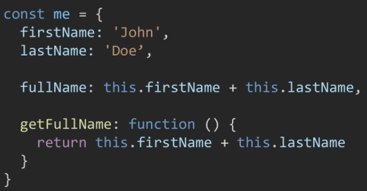

## 04_객체, this

## 객체

### 객체의 정의와 특징

* 객체는 속성(property)의 집합이며, 중괄호 내부에 key와 value의 쌍으로 표현
* **key는 문자열 타입만 가능하다.** (원시 타입만 사용 가능하다는 F~!!!)
  * [참고]key 이름에 띄어쓰기 등의 구분자가 있으면 따옴표로 묶어서 표현
* value는 모든 타입(함수 포함) 가능
* 객체 요소 접근은 <u>점 또는 대괄호</u>로 가능
  * [참고]key 이름에 띄어쓰기 같은 구분자가 있다면 대괄호 접근만 가능


### 객체와 메서드

* 메서드는 객체의 속성이 참조하는 함수

* `객체.메서드명()`으로 호출 가능.

* 메서드 내부에서는 this 키워드가 객체를 의미한다.

  *  

    > `fullName`은 메서드가 아니기 때문에 정상출력 되지 않는다 (`NaN`)
    >
    > `getFullName`은 메서드이기 때문에 해당 객체의 `firstName`과 `lastName`을 정상적으로 이어서 반환


### 객체 관련 ES6 문법 익히기

* ES6에 새로 도입된 문법들로 객체 생성 및 조작에 유용하게 사용 가능
  * 속성명 축약
  * 메서드명 축약
  * 계산된 속성명 사용하기
  * 구조 분해 할당 ([참고] 구조 분해 할당은 배열도 가능하다)
  * 객체 전개 구문(Spread Operator)


#### 1) 속성명 축약 (shorthand)

* 객체를 정의할 때 **key와 할당하는 변수의 이름이 같으면** 예시와 같이 축약 가능
* 


#### 2) 메서드명 축약 (shorthand)

* 메서드 선언시 `function` 키워드 생략 가능
* 


#### 3) 계산된 속성 (computed property name)

* 객체를 정의할 때 key의 이름을 표현식을 이용하여 동적으로 생성 가능
* 


#### 4) 구조 분해 할당 (destructing assignment)

* 배열 또는 객체를 분해하여 속성을 변수에 쉽게 할당할 수 있는 문법
* 

* **key값과 key에 할당하는 변수의 이름이 같으면 축약 가능하다**. *핵심은 중복 제거인 것이다!!!*

* 이런 식의 코드를 작성할 수 있다!!

  ```javascript
  const user = {
      name: '김혜림',
      age: 27,
      balance: 400
  }
  
  function printUser ({name, age, balance}) {
      console.log(name, age, balance)
  }
  ```

  


#### 5) Spread Operator

* spread operator(`...`)을 사용하면 객체 내부에서 객체 전개 가능
* ES5까지는 Object.assign()메서드를 사용
* 얕은 복사에 활용 가능
* 


### JSON(JavaScript Object Notation)

* key-value쌍의 형태로 데이터를 표기하는 언어 독립적 표준 포맷
* JS의 객체와 유사하게 생겼으나, 실제로는 **문자열 타입**
* 따라서 JS의 객체로써 조작하기 위해서는 구문 분석(parsing)이 필수
* JS에서는 JSON을 조작하기 위한 두가지 내장 메서드를 제공
  * `JSON.parse()`: JSON => JS 객체
    
  * `JSON.srtingify()`: JS 객체 => JSON
    


> [참고] 배열은 객체다
>
> 
>
> * 키와 속성들을 담고 있는 참조 타입의 객체(Object)
> * 배열은 인덱스를 키로 가지며 length 프로퍼티를 갖는 특수한 객체


## this 정리

### `this`는 `window`? `object`?

* JS의 `this`는 실행 문맥(execution context)에 따라 다른 대상을 가리킨다.

* 아래 두가지 경우를 제외하면 모두 최상위 객체인 `window`를 가리킨다.

  * class 내부의 생성자 함수: `this` === 생성되는 객체 (파이썬의 `self`)
  * 메서드: **`this` === 해당 메서드가 소속된 객체**

* 

  > 여기에서 me와 you에 들어있는 getFullName 키는 'getFullName' 즉 문자열이다!
  >
  > 이때도 value로 getFullName()을 주는 것이 아니라 명세만 넘기는 것이다!


### `function` 키워드와 화살표 함수 차이

* 
  * `this.radiuses`는 메서드 소속이기 때문에 정상적으로 접근 가능하다. (`객체.메서드명()` 호출 가능)
  * `forEach`의 콜백함수의 경우(`function (r)`) 메서드가 아니다! (`객체.메서드명()` 호출 불가
    때문에 콜백함수 내부의 `this`는 `window`가 되어 `this.PI`는 정상적으로 접근 불가능
  * 이 콜백함수 내부에서 `this.PI`에 접근하기 위해서 `함수객체.bind(this)` 메서드를 사용
    => 이 번거로운 bind 과정을 없앤 것이 **화살표 함수**
* Summary
  * 함수 내부에 `this` 키워드가 존재할 경우
    * 화살표 함수와 `function` 키워드로 선언한 함수가 다르게 동작
  * 함수 내부에 `this` 키워드가 존재하지 않을 경우
    * 완전히 동일하게 동작


## lodash

* 모듈성, 성능 및 추가 기능을 제공하는 JS 유틸리티 라이브러리
* array, object 등 자료구조를 다룰 때 사용하는 유용하고 간편한 유틸리티 함수들을 제공한다.
* ex) `reverse`, `sortBy`, `range`, `random`, `cloneDeep`, ...


* 사용예시

  * 

  * 

    > `lodash`를 사용하지 않을 경우, 깊은 복사는 직접 함수를 만들어서 구현해야 한다. (내장된 깊은복사 관련 함수 없다)

