# 04_비동기프로그래밍

## AJAX

* Asynchronous JavaScript And XML (비동기식 JS와 XML)
* 서버와 통신하기 위해 `XMLHttpRequest` 객체를 활용한다
* JSON, XML, HTML 그리고 일반 텍스트 형식 등을 포함한 다양한 포맷을 주고 받을 수 있다.
  * X가 XML을 의미하긴 하지만, 요즘은 더 가벼운 용량과 JS의 일부라는 장점 때문에 JSON을 더 많이 사용한다.

* 페이지 전체를 reload(새로 고침)를 하지 않고서도 수행되는 **비동기성**
  * 서버의 응답에 따라 전체 페이지가 아닌 일부분만을 업데이트 할 수 있다
* AJAX의 주요 두가지 특징은 아래의 작업을 할 수 있게 해줌
  1. 페이지 새로 고침 없이 서버에 요청
  2. 서버로부터 데이터를 받고 작업을 수행

### XMLHttpRequest 객체

* 서버와 상호작용하기 위해 사용되며 전체 페이지의 새로 고침 없이 데이터를 받아올 수 있다.
* 사용자의 작업을 방해하지 않으면서 페이지 일부를 업데이트할 수 있다.
* 주로 AJAX 프로그래밍에 사용
* 이름과 달리 XML뿐만 아니라 모든 종류의 데이터를 받아올 수 있다
* 생성자: `XMLHttpRequest()`

* 예시
  * 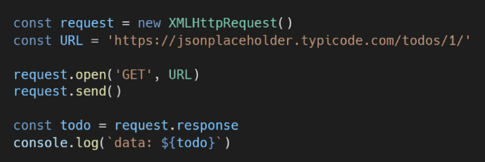
  * console에 todo 데이터가 출력되지 않는다.
    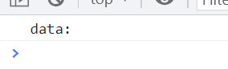
  * why? 데이터 응답을 기다리지 않고 `console.log()`를 먼저 실행했기 때문

## Asynchronous JavaScript

### 동기식

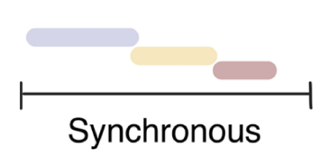

* 순차적, 직렬적 Tack 수행
* 요청을 보낸 후 응답을 받아야만 다음 동작이 이뤄진다(blocking)

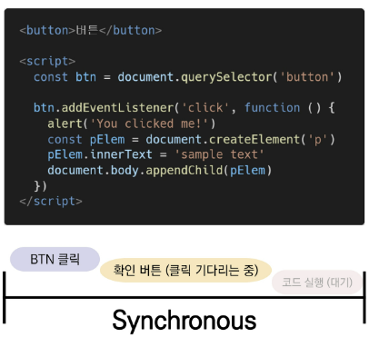

* 버튼 클릭 후 alert 메시지의 확인 버튼을 누를 때까지 문장이 만들어지지 않는다.
* 즉, alert 이후의 코드는 alert의 처리가 끝날 때까지 실행되지 않는다.
* 왜 이런 현상이 발생할까?
  * *JavaScript는 single threaded*

### 비동기식

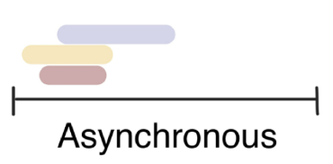

* 병렬적 Task 수행
* 요청을 보낸 후 응답을 기다리지 않고 다음 동작이 이뤄진다. (non-blocking)
* 요청을 보내고 응답을 기다리지 않고 다음 코드가 실행된다.
* 결과적으로 변수 `todo`에는 응답 데이터가 할당되지 않고 빈 문자열이 출력된다.
* 그렇다면 JS는 왜 기다려주지 않는 방식으로 동작하는가?
  * *JavaScript는 single threaded*

### 왜 비동기를 사용하는가?

* **사용자 경험**
  * 매우 큰 데이터를 동반하는 앱이 있다고 가정
  * 동기식 코드라면 데이터를 모두 불러온 뒤 앱이 실행된다.
    * 즉, 데이터를 모두 불러올 때까지는 앱이 모두 멈춘 것처럼 보인다.
    * 코드 실행을 차단하여 화면이 멈추고 응답하지 않는 것 같은 사용자 경험을 제공한다.
  * 비동기식 코드라면 데이터를 요청하고 응답 받는 동안, 앱 실행을 함께 진행한다.
    * 데이터를 불러오는 동안 지속적으로 응답하는 화면을 보여줌으로써 더욱 쾌적한 사용자 경험을 제공한다.
  * 때문에 많은 웹 API 기능은 현재 비동기 코드를 사용하여 실행된다.

### Blocking vs Non-Blocking

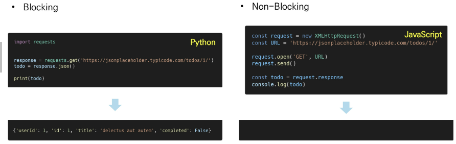

#### JavaScript는 single threaded이다

* 컴퓨터가 여러 개의 CPU를 가지고 있어도 main thread라 불리는 단일 스레드에서만 작업 수행
* 즉, 이벤트를 처리하는 **`Call Stack`이 하나인 언어**라는 의미
* 이 문제를 해결하기 위해 JavaScript는 
  1. 즉시 처리하지 못하는 이벤트들을 다른 곳(`Web API`)으로 보내서 처리하도록 하고,
  2. 처리된 이벤트들은 처리된 순서대로 대기실(`Tack Queue`)에 줄을 세워 놓고
  3. `Call Stack`이 비면 담당자(`Event Loop`)가 대기 줄에서 가장 오래된(제일 앞의) 이벤트를 `Call Stack`으로 보낸다.

### Concurrency model

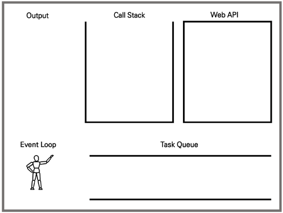

* `Event Loop`을 기반으로 하는 동시성 모델
  1. `Call Stack`
     * 요청이 들어올 때마다 해당 요청을 순차적으로 처리하는 Stack(LIFO) 형태의 자료 구조
  2. `Web API`
     * JavaScript 엔진이 아닌 브라우저 영역에서 제공하는 API
     * `setTimeout()`, DOM events 그리고 AJAX로 데이터를 가져오는 시간이 소요되는 일들을 처리
  3. `Tack Queue`
     * 비동기 처리된 callback 함수가 대기하는 Queue(FIFO) 형태의 자료 구조
     * main thread가 끝난 후 실행되어 후속 JavaScript 코드가 차단되는 것을 방지
  4. `Event Loop`
     * Call Stack이 비어 있는지 확인
     * 비어있는 경우 Tack Queue에서 실행 대기 중인 callback 함수가 있는지 확인
     * Tack Queue에 대기 중인 callback 함수가 있다면 가장 앞에 있는 callback 함수를 Call Stack으로 push

#### Zero delays

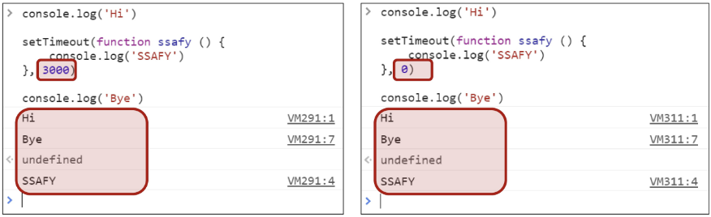

* 실제로 0ms 후에 callback 함수가 시작된다는 의미가 아니다
* 실행은 Tack Queue에 대기 중인 작업 수에 따라 다르며 해당 예시에서는 callback 함수의 메시지가 처리되기 전에 'Hi', 'Bye'가 먼저 출련된다.
  * why? delay는 JavaScript가 요청을 처리하는 데 필요한 최소 시간이기 때문(보장된 시간이 아니다.)
* 기본적으로 `setTimeout` 함수에 특정 시간제한을 설정했더라도 대기 중인 메시지의 모든 코드가 완료될 때까지 대기해야 한다.

### 순차적인 비동기 처리하기

* Web API로 들어오는 순서는 중요하지 않고, **어떤 이벤트가 먼저 처리되느냐가 중요**하다. (즉, 실행 순서 불명확)

* 이를 해결하기 위해 순차적인 비동기 처리를 위한 2가지 작성 방식

1. **Async callbacks**
   * 백그라운드에서 실행을 시작할 함수를 호출할 때 인자로 지정된 함수
   * ex) `addEventListener()`의 두번째 인자
2. **promise-style**
   * Modern Web APIs에서의 새로운 코드 스타일
   * XMLHttpRequest 객체를 사용하는 구조보다 조금 더 현대적인 버전

## Callback Function

* 다른 함수에 인자로 전달된 함수
* 외부 함수 내에서 호출되어 일종의 루틴 또는 작업을 완료한다.
* 동기식, 비동기식 모두 사용된다.
  * 그러나 비동기 작업이 완료된 후 코드 실행을 게속하는 데 주로 사용된다.
* 비동기 작업이 완료된 후 코드 실행을 계속하는 데 사용되는 경우를 비동기 콜백(asynchronous callback)이라 한다.

> **JS의 함수는 `일급 객체`다**
>
> * 일급 객체: 다른 객체들에 적용할 수 있는 연산을 모두 지원하는 객체(함수)
> * 일급 객체의 조건
>   * 인자로 넘길 수 있어야 한다.
>   * 함수의 반환값으로 사용할 수 있어야 한다.
>   * 변수에 할당할 수 있어야 한다.

### 비동기 콜백(Async Callbacks)

* 백그라운드에서 코드 실행을 시작할 함수를 호출할 때 인자로 지정된 함수
* 백그라운드 코드 실행이 끝나면 callback 함수를 호출하여 작업이 완료되었음을 알리거나, 다음 작업을 실행하게 할 수 있다.
* callback 함수를 다른 함수의 인수로 전달할 때, 함수의 참조를 인수로 전달할 뿐이지 즉시 실행되지 않고, 함수의 body에서 'called back'된다.
* 정의된 함수는 때가 되면 callback 함수를 실행하는 역할을 한다.

### 왜 콜백을 사용하는가?

* callback 함수는 명시적인 호출이 아닌 특정 루틴 혹은 action에 의해 호출되는 함수
* Django의 경우 '요청이 들어오면', event의 경우 '특정 이벤트가 발생하면'이라는 조건으로 함수를 호출할 수 있었던 건 `callback function`이라는 개념 때문에 가능
* 비동기 로직을 수행할 때 callback 함수는 필수
  * 명시적인 호출이 아니라 다른 함수의 매개변수로 전달하여 해당 함수 내에서 특정 시점에 호출

### Callback Hell

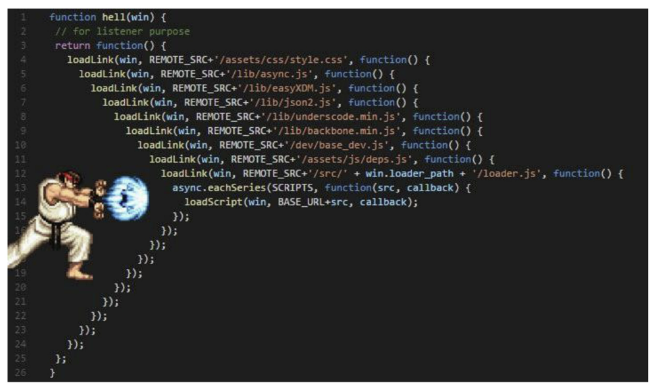

* 순차적인 연쇄 비동기 작업을 처리하기 위해 'callback함수 호출하고.. 그 다음 callback함수 호출하고.. 그 다음 callback함수 호출하고..'의 패턴이 지속적으로 반복될 수 있다.
* 즉, 여러 개의 연쇄 비동기 작업을 할 때 마주하는 상황
* 이를 Callback Hell, Pyramid of Doom이라 한다.
* 이런 상황이 벌어질 경우, 아래 사항들을 통제하기 어렵다
  * 디버깅
  * 코드 가독성..

* 해결하기!
  1. 코드의 깊이를 얕게 유지
  2. 모듈화
  3. 모든 단일 오류 처리
  4. **Promise Callback 방식 사용**

## Promise

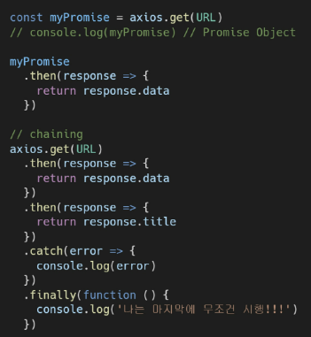

* Promise object
  * 비동기 작업의 최종 완료 또는 실패를 나타내는 객체
  * 미래의 완료 또는 실패와 그 결과값을 나타낸다.
  * 미래의 어떤 상황에 대한 약속
* 성공(이행)에 대한 약속: `.then()`
* 실패(거절)에 대한 약속: `.catch()`

### methods

* **`.then(callback)`**
  * 이전 작업(promise)이 성공했을 때 수행할 작업을 나타내는 callback 함수
  * 그리고 각 callback 함수는 이전 작업의 성공 결과를 인자로 전달받는다.
  * 따라서 성공했을 때의 코드를 callback 함수 안에 작성
* **`.catch(callback)`**
  * `.then()`이 하나라도 실패하면 동작(동기식의 `try-except` 구문과 유사)
  * 이전 작업의 실패로 인해 생성된 `error` 객체는 catch 블록 안에서 사용할 수 있다.

* 각각의 `.then()` 블록은 서로 다른 promise를 반환한다.
  * 즉,  `.then()`을 여러개 사용(chaining)하여 연쇄적인 작업을 수행할 수 있다
  * <u>결국 여러 비동기 작업을 차례대로 수행할 수 있다는 뜻</u>
* `.then()` `.catch()` 메서드는 모두 promise를 반환하기 때문에 chaining 가능
* 주의
  * 반환값이 반드시 있어야 한다
  * 없다면 callback 함수가 이전의 promise 결과를 받을 수 없다.

* **`.finally(callback)`**
  * promise 객체를 반환
  * 결과와 상관없이 무조건 지정된 callback 함수가 실행
  * 어떠한 인자도 전달받지 않는다.
    * prmoise가 성공되었는지 거절되었는지 판단할 수 없기 때문
  * 무조건 실행되어야 하는 절에서 활용
    * `.then()` `.catch()` 블록에서의 코드 중복을 방지

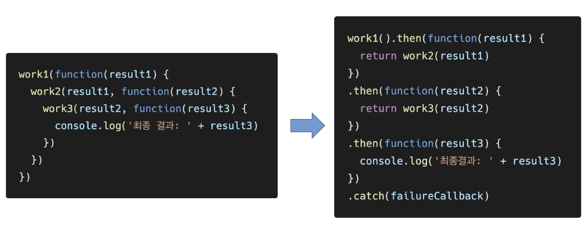

### Promise가 보장하는 것

* Asyn callback 작성 스타일과 달리 promise가 보장하는 특징

1. callback 함수는 JS의 Event Loop가 현재 실행중인 Call Stack을 완료하기 이전에는 절대 호출되지 않는다!
   * promise callback 함수는 Event Queue에 배치되는 엄격한 순서로 호출된다.
2. 비동기 작업이 성공하거나 실패한 뒤에 `.then()` 메서드를 이용하여 추가한 경우에도 1번과 똑같이 동작
3.  `.then()` 을 여러 번 사용하여 여러 개의 callback 함수를 추가할 수 있다 (Chaining)
   * 각각의 callback은 주어진 순서대로 하나하나 실행하게 된다.
   * Chaining은 Promise의 가장 뛰어난 장점

## Axios

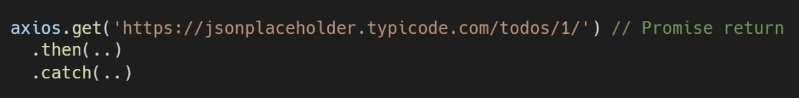

* 브라우저를 위한 Promise 기반의 클라이언트
* 원래는 XHR이라는 브라우저 내장 객체를 활용해 AJAX 요청을 처리하는데, 이보다 편리한 AJAX 요청이 가능하도록 도와줌
  * 확장 가능한 인터페이스와 함께 패키지로 사용이 간편한 라이브러리를 제공한다

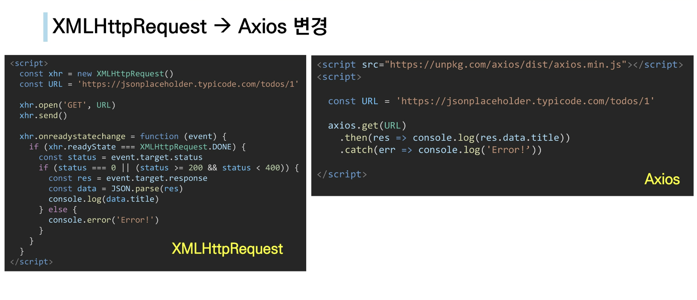

## Async & Await

* 비동기 코드를 작성하는 새로운 방법
  * ECMAScript 2017(ES8)에서 등장
* 기존 Promise 시스템 위에 구축된 syntactic sugar
  * promise 구조의 then chaining을 제거
  * 비동기 코드를 조금 더 동기 코드처럼 표현
  * syntactic sugar
    * 더 쉽게 읽고 표현할 수 있도록 설계된 프로그래밍 언어 내의 구문
    * 즉, 문법적 기능은 그대로 유지하되 사용자가 직관적으로 코드를 읽을 수 있게 만듦

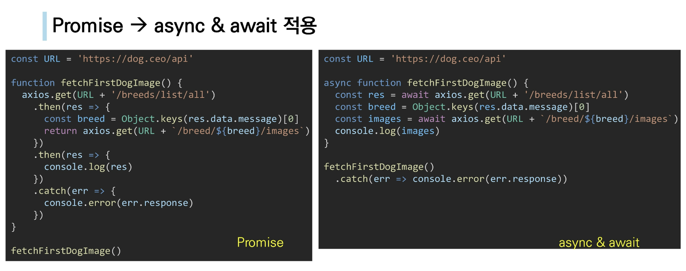