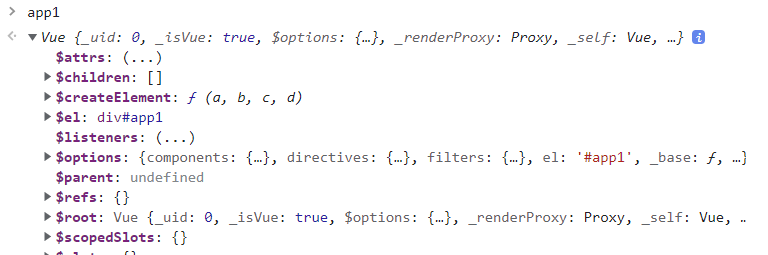

# 01_Vue_Basic

## Intro

### Front-End Development

* HTML, CSS 그리고 JS를 활용해서 데이터를 볼 수 있게 만들어 준다. 이 작업을 통해 **사용자는 데이터와 상호작용** 할 수 있다
* 대표적인 FE 프레임워크
  * Vue.js, React, Angular


### Vue.js

* 사용자 인터페이스를 만들기 위한 진보적인 자바스크립트 프레임워크
* 현대적인 tool과 다양한 라이브러리를 통해 SPA(Single Page Application)를 완벽하게 지원


* Evan You에 의해 발표(2014)
  * 구글의 Angular 개발자 출신
  * 학사 미술, 미술사 전공 / 석사 디자인 & 테크놀로지 전공
  * 구글 Angular보다 더 가볍고, 간편하게 사용할 수 있는 프레임워크를 만들기 위해 개발


### SPA

* Single Page Application (단일 페이지 애플리케이션)
* 현재 페이지를 동적으로 렌더링함으로써 사용자와 소통하는 웹 애플리케이션

* 단일 페이지로 구성되며 서버로부터 최초에만 페이지를 다운로드하고, 이후에는 동적으로 DOM을 구성
  * 처음 페이지를 받은 이후부터는 서버로부터 새로운 전체 페이지를 불러오는 것이 아닌, 현재 페이지 중 필요한 부분만 동적으로 다시 작성한다.
* 연속되는 페이지 간의 UX를 향상
  * 모바일 사용량이 증가하고 있는 현재, 트래픽의 감소와 속도, 사용성, 반응성의 향상은 매우 중요하기 때문
* 동작 원리의 일부가 CSR(Client Side Rendering)의 구조를 따른다.


#### 등장 배경

* 과거 웹 사이트들은 요청에 따라 매번 새로운 페이지를 응답하는 방식이었다. -> MPA(Multi Page Application)

* 스마트폰이 등장하면서 모바일 최적화의 필요성이 대두되었다
  * 모바일 네이티브 앱과 같은 형태의 웹 페이지가 필요해짐
* 이러한 문제를 해결하기 위해 Vue.js와 같은 FE 프레임워크가 등장
  * CSR, SPA의 등장
* 1개의 웹 페이지에서 여러 동작이 이루어지며 모바일 앱과 비슷한 형태의 사용자 경험을 제공


### CSR

* 

* **Client Side Rendering** 

  > CSR vs SSR
  >
  > 누가 사용자가 볼 HTML을 만드는 것인가?

* 서버에서 화면을 구성하는 SSR 방식과 달리 클라이언트에서 화면을 구성

* 최초 요청 시 HTML, CSS, JS 등 데이터를 제외한 각종 리소스를 응답받고 이후 클라이언트에서는 필요한 데이터만 요청해 JS로 DOM을 렌더링하는 방식

* 즉, 처음엔 뼈대만 받고 브라우저에서 동적으로 DOM을 그린다.

* SPA가 사용하는 렌더링 방식 


* 장점

  1. 서버와 클라이언트 간 트래픽 감소

     * 웹 애플리케이션에 필요한 **모든 정적 리소스를 최초에 한 번 다운로드한 후 필요한 데이터만 갱신**

       > 스크립트의 비중을 올리고 마크업은 비중을 낮추는 것이 SPA다.  우리가 작성했던 django를 기억해보면.. base.html을 만들고 일부분을 extends해서 변경하는 방식으로 이뤄졌지만, 사실 그 페이지를 받아올 때 extends되는 부분만이 아닌 전체 페이지를 다 받아오게 되어있다. 그래서 사용자가 이 애플리케이션에 머무는 시간이 많을수록 트래픽이 감소한다는 것이 실감된다.

  2. 사용자 경험 향상

* 단점

  1. SSR에 비해 전체 페이지 최종 렌더링 시점이 느림

  2. SEO(검색 엔진 최적화)에 어려움이 있다. (최초 문서에 데이터 마크업이 없기 때문)

     > 메타데이터만 보기 때문이라고 할 수 있다!
     >
     > 브라우저에서 모든 스크립트를 다 해석해놓지 않는다. 그래서 마크업의 양이 적기 때문에 필요한 정보의 양이 적다고 생각하게 되는 것


### SSR

* 
* **Server Side Rendering**
* 서버에서 클라이언트에게 보여줄 페이지를 모두 구성하여 전달하는 방식
  * <u>이미 서버에서 완성한 HTML</u>을 넘기기 때문에, 브라우저에서 화면을 확인하는 시점이 CSR보다 빠르다!
* JS 웹 프레임워크 이전에 사용되던 전통적인 렌더링 방식


* 장점
  1. 초기 구동 속도가 빠름
     * 클라이언트가 빠르게 컨텐츠를 볼 수 있음
  2. SEO(검색 엔진 최적화)에 적합
     * DOM에 이미 모든 데이터가 작성되어 있기 때문
* 단점
  1. 모든 요청마다 새로운 페이지를 구성하여 전달
     * 반복되는 전체 새로고침으로 인해 사용자 경험이 떨어짐
     * <u>상대적으로 트래픽이 많아</u> 서버의 부담이 클 수 있음


### SSR vs CSR

* 두 방식의 차이는 **최종 HTML의 생성 주체가 누구인가**에 따라 결정
* 즉, 실제 브라우저에 그려질(렌더링) HTML을 서버가 만든다면 SSR, 클라이언트가 만든다면 CSR
* SSR과 CSR을 단순 비교하여 '어떤 것이 더 좋다'가 아니라, 내 서비스 또는 프로젝트 구성에 맞는 방법을 적절하게 선택하는 것이 중요

> 내가 기업을 운영한다면..? CSR을 하는 것이 이득
>
> SSR은 우리 서버에서 일을 하기 때문에 나가는 비용이 더 많을 것이기 때문에..


* 예를 들어, Django에서 Axios를 활용한 좋아요/팔로우 로직의 경우, 대부분은 서버에서 완성된 HTML을 제공하는 구조 => SSR
* 단, 특정 요소(좋아요/팔로우)만 JS(AJAX & DOM조작)를 활용하는 경우 => CSR
  * AJAX를 활용해 비동기 요청으로 필요한 데이터를 클라이언트에서 서버로 직접 요청을 보내 받아오고 JS를 활용해 DOM을 조작


> [참고] **SEO(Search Engine Optimization, 검색 엔진 최적화)**
>
> * 웹 페이지 검색 엔진이 자료를 수집하고 순위를 매기는 방식에 맞게 웹 페이지를 구성해서 검색 결과의 상위에 노출될 수 있도록 하는 작업 (*스파이더 봇이 수행한다.*)
> * 인터넷 마케팅 방법 중 하나
> * 구글의 등장 이후 검색엔진들이 컨텐츠의 신뢰도를 파악하는 기초 지표로 사용되었다.
>   * 다른 웹 사이트에서 얼마나 인용되었나를 반영
>   * 결국 타 사이트에 인용되는 횟수를 늘리는 방향으로 최적화
>
> **SEO 대응**
>
> * Vue.js 또는 React 등의 SPA 프레임워크는 SSR을 지원하는 SEO 대응 기술이 이미 존재한다.
>   * SEO 대응이 필요한 페이지에 대해서는 선별적 SEO 대응 가능
> * 혹은 추가로 별도의 프레임워크를 사용하기도 한다
>   * Nuxt.js
>     * Vue.js 응용 프로그램을 만들기 위한 프레임워크
>     * SSR 지원
>   * Next.js
>     * React 응용 프로그램을 만들기 위한 프레임워크
>     * SSR 지원


### Vue.js의 역할

|                              전                              |                              후                              |
| :----------------------------------------------------------: | :----------------------------------------------------------: |
|  |  |

> JSON으로 변경된 부분을 서버에서 던진다면, 이것을 받아서 브라우저에서 처리를 할 것이다. 그래서 장고의 Template의 부분은 다 Vue로 넘어가게 된 것이다. **=> 결국 DRF로 JSON만 보여주는 형태가 될 것이다!**


## Why Vue.js?

* 가장 인기 있는 FE 프레임 워크

* 현대 웹 페이지는 페이지 규모가 계속해서 커지고 있으며, 그만큼 사용하는 데이터도 늘어나고 사용자와의 상호작용도 많이 이루어진다.
* 결국 Vanilla JS만으로는 관리하기가 어려움
  * 예시, 페이스북 친구가 이름을 수정했을 경우, 화면상에서 변경되어야 하는 것들
  * 타임라인의 이름, 페이스북 메시지 상의 이름, 내 주소록에서의 친구 이름 등.. => 페이스북이 React를 개발한 이유


### 비교

| Vanilla JS                                                   | Vue.js                                                       |
| ------------------------------------------------------------ | ------------------------------------------------------------ |
| 한 유저가 작성한 게시글이 DOM 상에 100개 존재<br />이 유저가 닉네임을 변경하면, DB의 Update와 별도로 DOM상의 100개의 작성자 이름이 모두 수정되어야 한다.<br /><u>모든 요소를 선택해서 이벤트를 등록하고 값을 변경</u>해야 한다. | DOM과 Data가 연결되어있고, Data를 변경하면 이에 연결된 DOM은 알아서 변경된다!<br />즉, 우리가 신경써야 할 것은 오직 Data에 대한 관리<br />=> **Developer Exp가 향상된다!!!** |


## Concepts of Vue.js

### MVVM Pattern

* 애플리케이션 로직을 UI로터 분리하기 위해 설계된 디자인 패턴
* 구성 요소
  1. Model: <u>JS의 객체 (곧, 데이터)</u>
  2. View: <u>HTML</u>
  3. View Model


* **Model**
  * **JS의 Obejct, 객체!**
  * Object === { key: value }
  * Model은 Vue instance 내부에서 data라는 이름으로 존재
  * 이 data가 바뀌면 View(DOM)가 반응한다
* **View**
  * **DOM(HTML)**
  * Data의 변화에 따라서 바뀌는 대상
* **ViewModel**
  * **모든 Vue Instance**
  * View와 Model 사이에서 <u>Data와 DOM에 관련된 모든 일을 처리</u>
  * VM을 활용해 Data를 얼마만큼 잘 처리해서 보여줄 것인지(DOM)를 고민하는 것


### Vue version 2 vs 3

* **Vue 3** (Official Main Version)
  * 2022년 2월부터 vue 프레임워크의 기본 버전이 3.x로 전환
  * CDN or npm을 통한 설치 시 자동으로 Vue 3로 설정
* **Vue 2**
  * 실무에서 여전히 Vue 2가 많이 사용된다. legacy
  * Vue 2의 생태계(문서, 튜토리얼, 자료, QnA 등)가 더 성숙하다
  * 코어/커뮤니티 라이브러리의 호환 역시 Vue 2가 더 안정적
  * 참고자료가 많은 Vue 2로 학습 후, Vue 3로 이전하는 것이 가장 효과적이다.


## Quick Start (실습 코드)

### Django & Vue.js 코드 작성 순서

* Django

  * 데이터의 흐름
  * url -> views -> template

* Vue.js

  * Data가 변화하면 DOM이 변경

  1. Data 로직 작성
  2. DOM 작성


## Basic Syntax of Vue.js

### Vue instance

* 모든 Vue 앱은 Vue 함수로 새 인스턴스를 만드는 것부터 시작한다.
* Vue 인스턴스를 생성할 때는 Options 객체를 전달해야 한다
* 여러 Options들을 사용하여 원하는 동작을 구현한다.
* Vue Instance === Vue Component


#### Vue instance 생성 코드

```html
<div id="app1">
    {{ message }}
    {{ anotherMessage}}
</div>

<script>
const app1 = new Vue({
  el: '#app1', // query selector의 역할
  // data === model
  data: {
    message: '안녕하세요 Vue',
    anotherMessage: '이것도 출력이 가능하다!',
  },
})
</script>
```

> 이렇게 app1으로 잡아놓은 아이는 console에서 출력하면 Vue instance 형태인 것으로 나온다.
>
> 


```javascript
// 이런 형태로도 생성이 가능하다!
const options = {
  el: '#app2',
  data: {
    message: '안녕하세요?'
  },
  methods: {}
}
new Vue(options)
```


#### Options/DOM - `el`

* Vue 인스턴스에 연결(마운트)할 기존 DOM 요소가 필요하다
* CSS 선택자 문자열 혹은 HTML Element로 작성한다
* `new`를 이용한 인스턴스 생성 때만 사용한다.


#### Options/DOM - `data`

* Vue 인스턴스의 데이터 객체
* Vue 인스턴스의 상대 데이터를 정의하는 곳
* Vue template에서 interpolation을 통해 접근 가능하다
* `v-bind`, `v-on`과 같은 directive에서도 사용 가능
* Vue 객체 내 다른 함수에서 `this` 키워드를 통해 접근 가능


#### Options/DOM - `methods`

* Vue 인스턴스에 추가할 메서드
* Vue template에서 interpolation을 통해 접근 가능하다
* `v-on`과 같은 directive에서도 사용 가능
* Vue 객체 내 다른 함수에서 `this` 키워드를 통해 접근 가능
* **주의**
  * **화살표 함수를 메서드 정의하는데 사용하면 안된다!**
  * 화살표 함수가 부모 컨텍스트를 바인딩하기 때문에, `this`는 Vue 인스턴스가 아니다. (`this`*는 window를 가리키게 된다*.)


* interpolation으로 data와 methods를 부른다면?

* 

  > data -> message, methods -> greeting
  >
  > 함수를 실행한 결과를 부르는 것과, 그냥 함수를 호출하는 것은 다르다!!


##### `this` in Vue.js

* Vue 함수 객체 내에서 Vue Instance를 가리킨다
* **단, 화살표 함수를 사용하면 안되는 경우!!!**
  1. `data`
  2. `methods`


#### Options/Data - `computed`

* 데이터를 기반으로 하는 계산된 속성
* 함수의 형태로 정의하지만 함수가 아닌 <u>함수의 반환값이 바인딩 된다.</u> (실행할 수 없는 것이고, 값으로만 존재하게 된다!!)
* 종속된 데이터에 따라 저장(캐싱)된다.
* **종속된 데이터가 변경될 때만 함수를 실행한다.**
* 즉, 어떤 데이터에도 의존하지 않는 computed 속성의 경우 절대로 업데이트 되지 않는다.
* **반드시 반환 값이 있어야 한다.**


##### `computed` & `methods`

* computed 속성 대신 methods에 함수를 정의할 수도 있다

  * 최종 결과에 대해 두가지 접근 방식은 서로 동일하다

* 차이점은 computed 속성은 종속 대상을 따라 저장(캐싱)된다는 점

  * 즉, computed는 종속된 대상이 변경되지 않는 한 computed에 작성된 함수를 여러 번 호출해도 계산을 다시 하지 않고 계산되어 있던 결과를 반환한다.

  * 이에 비해 methods를 호출하면 렌더링을 다시 할 때마다 항상 함수를 실행한다.

    > 즉, 종속된 데이터가 아닌 다른 데이터들의 변경으로 인해 렌더링이 다시 되어도 계속 함수를 실행한다!


#### Options/Data - `watch`

* 데이터를 감시

* 데이터에 변화가 일어났을 때 실행되는 함수

  > 이건 별로 남용하지 말자 

```javascript
var vm = new Vue({
  el: '#demo',
  data: {
    firstName: 'Foo',
    lastName: 'Bar',
    fullName: 'Foo Bar'
  },
  watch: {
    firstName: function (val) { // firstName이 바뀌면 뒤 함수를 실행해라!
      this.fullName = val + ' ' + this.lastName
    },
    lastName: function (val) {
      this.fullName = this.firstName + ' ' + val
    }
  }
})
```


##### `computed` & `watch`

* `computed`
  * 특정 데이터를 직접적으로 사용/가공하여 다른 값으로 만들 때 사용
  * 속성을 계산해야 하는 목표 데이터를 정의하는 방식으로 소프트웨어 공학에서 이야기하는 <u>선언형 프로그래밍 방식</u>
  * **특정 값이 변동하면 해당 값을 다시 계산해서 보여준다.**
* `watch`
  * 특정 데이터의 변화 상황에 맞춰 다른 data 등이 바뀌어야 할 때 주로 사용
  * 감시할 데이터를 지정하고 그 데이터가 바뀌면 특정 함수를 실행하는 방식
  * 소프트웨어 공학에서 이야기하는 <u>명령형 프로그래밍 방식</u>
  * **특정 값이 변동하면 다른 작업을 한다.**
  * 특정 대상이 변경되었을 때 콜백 함수를 실행시키기 위한 트리거
* 이 둘은 어떤 것이 더 우수한 것이 아닌 사용하는 목적과 상황이 다르다


> **선언형 & 명령형**
>
> * 선언형 프로그래밍: 계산해야 하는 목표 데이터를 정의
> * 명령형 프로그래밍: 데이터가 바뀌면 특정 함수를 실행해!


#### Options/Assets - `filter`

* 텍스트 형식화를 적용할 수 있는 필터 (*주로 텍스트를 만질때 이걸 사용한다.*)
* interpolation 혹은 `v-bind`를 이용할 때 사용 가능
* 필터는 자바스크립트 표현식 마지막에 `|`(파이프)와 함께 추가되어야 한다.
* 이어서 사용(chaining) 가능하다.
* 


## Template Syntax(실습)

* 렌더링 된 DOM을 기본 Vue 인스턴스의 데이터에 선언적으로 바인딩할 수 있는 HTML 기반 템플릿 구문을 사용한다.

1. Interpolation
2. Directive


### Interpolation (보간법)

1. Text
   * innerText와 같은 효과
   * `<span>메시지: {{ message }}</span>`
2. Raw HTML
   - innerHTML과 같은 효과
   - `<span v-html="rawHtml"></span>`
3. Attributes
   - `<div v-bind:id="dynamicId"></div>`
4. JS 표현식
   - `{{ number + 1 }}`
   - `{{ message.split('').reverset().join('') }}`


### Directive (디렉티브)

* `v-접두사` 가 있는 특수 속성
* 속성값은 단일 JS 표현식이 된다 (`v-for`는 예외)
* 표현식의 값이 변경될 때 반응적으로 DOM에 적용하는 역할을 한다.
* **전달인자(Arguments)**
  * `:` (콜론)을 통해 전달인자를 받을 수 있다.
* **수식어(Modifiers)**
  * `.` 으로 표시되는 특수 접미사
  * directive를 특별한 방법으로 바인딩해야함을 나타낸다.


#### `v-text`

* 엘리먼트의 textContent를 업데이트
* 내부적으로 interpolation 문법이 `v-text`로 컴파일된다.
* 


#### `v-html`

* 엘리먼트의 innerHTML을 업데이트
  * XSS 공격에 취약할 수 있다.
* 임의로 사용자로부터 입력 받은 내용은 `v-html`에 **절대 사용 금지!**
* 


#### `v-show`

* 조건부 렌더링 중 하나

* 요소는 **항상 렌더링되고 DOM에 남아있다**

  * ```html
    <div id="app">
      <p v-show="isTrue">참이당</p>
      <p v-show="isFalse">거짓이당</p>
    </div>
    
    <script>
      const app = new Vue({
        el: '#app',
        data: {
          isTrue: true
          isFalse: false
        }
      })
    </script>
    ```

  * 

* 단순히 엘리먼트에 <u>display CSS 속성을 토글하는 것</u>


#### `v-if`, `v-else-if`, `v-else`

* 조건부 렌더링 중 하나

* 조건에 따라 요소를 렌더링 -> **directive의 표현식이 true일때만 렌더링**

  * ```html
      <div id="app">
        <p v-if="seen">보이나요?</p>
      
        <p v-if="myType === 'A'">A</p>
        <p v-else-if="myType === 'B'">B</p>
        <p v-else>ZZZ</p>
      </div>
      
      <script>
        const app = new Vue({
          el: '#app',
          data: {
            seen: false,
            myType: 'A'
          }
        })
      </script>
    ```

  * 

* 엘리먼트 및 포함된 directive는 토글하는 동안 삭제되고 다시 작성된다.


##### `v-show` vs `v-if`

* `v-show`: expensive initial load, cheap toggle
  * CSS display 속성을 hidden으로 만들어 토글
  * 실제로 렌더링은 되지만 눈에서 보이지 않는 것이기 때문에 딱 한번만 렌더링이 되는 경우라면 `v-if`에 비해 상대적으로 렌더링 비용이 높다
  * 하지만, **자주 변경되는 요소라면 한 번 렌더링된 이후부터는 보여주는지에 대한 여부만 판단하면 되기 때문에 토글 비용이 적다.**
* `v-if`: cheap initial load, expensevie toggle
  * 전달인자가 false인 경우 렌더링되지 않는다
  * 화면에서 보이지 않을 뿐만 아니라 렌더링 자체가 되지 않기 때문에 렌더링 비용이 낮다.
  * 하지만, **자주 변경되는 요소의 경우 다시 렌더링해야 하므로 비용이 증가할 수 있다.**


#### `v-for`

* 원본 데이터를 기반으로 엘리먼트 또는 템플릿 블록을 여러번 렌더링
* `item in items` 구문을 사용한다
* item 위치의 변수를 각 요소에서 사용할 수 있다.
  * 객체의 경우는 key
* `v-for` 사용시 반드시 key 속성을 각 요소에 작성한다.
  * enumerate처럼 인덱스, 요소를 동시에 불러오는 것도 가능하다!
  * Array: `(item, index) in fruits` 로 하면 인덱스를 가져올 수 있다. (index라고 적을 필요 X, 단순 변수명)
  * Obejct: `(value, key) in myObj`로 하면 키 밸류 모두 가져올 수 있다.
* `v-if`와 함께 사용하는 경우 `v-for`가 우선순위가 더 높다.
  * 단, 가능하면 이 둘을 동시에 사용하지 말 것!


#### `v-on`

* 엘리먼트에 이벤트 리스너를 연결
* 이벤트 유형은 전달인자로 표시한다
* 특정 이벤트가 발생했을 때, 주어진 코드가 실행된다
* 약어(Shorthand) : `@`


#### `v-bind`

* HTML 요소의 속성에 Vue의 상태 데이터를 값으로 할당
* Object 형태로 사용하면 <u>value가 true인 key가 class 바인딩 값으로 할당</u>
  * 배열로 넘기면 여러개의 class를 줄 수도 있다.
  * 

* 약어: `:`
* ex: `v-bind:src` === `:src`


#### `v-model`

* HTML form, input 요소의 값과 data를 양방향 바인딩
* 수식어
  * `.lazy`: input 대신 change 이벤트 이후에 동기화
  * `.number`: 문자열을 숫자로 변경
  * `.trim`: 입력에 대한 trim을 진행


## Lifecycle Hooks


* 각 Vue 인스턴스는 생성될 때 일련의 초기화 단계를 거친다.
  * ex) 데이터 관찰 설정이 필요한 경우, 인스턴스를 DOM에 마운트 하는 경우, 데이터가 변경되어 DOM을 업데이트하는 경우
* 그 과정에서 사용자 정의 로직을 실행할 수 있는 Lifecycle Hooks도 호출된다
* 공식문서를 통해 각 라이프사이클 훅의 상세 동작을 참고


1. create: 새로운 vue 객체가 생성됨
2. mount: vue 객체가 만들어진 후 template의 해당 요소와 연결됨!
3. update: data 변경
4. destroy: 객체 죽음 (*우리는 안본다*)


### `created`

* Vue 인스턴스가 생성된 후에 호출된다
* 이를 사용해 **애플리케이션의 초기 데이터를 API 요청을 통해 불러올 수 있다**.
* 
  * 이 코드가 있는 상태로 실행이 된다면 저 순서대로 console에 출력돼있음


