# 02_Vue_CLI

## SFC(Single File Component)

### Component

* 기본 HTML 엘리먼트를 확장하여 재사용 가능한 코드를 캡슐화하는데 도움을 준다.
* CS에서는 다시 사용할 수 있는 범용성을 위해 개발된 소프트웨어 구성 요소를 의미한다.
* 즉, 컴포넌트는 유지보수를 쉽게 만들어 줄 뿐만 아니라, 재사용성의 측면에서도 매우 강력한 기능을 제공한다.
* **Vue component === Vue Instance**


* 단일 파일에서의 개발이라면..
  * 처음 개발을 시작할 때는 크게 신경 쓸 것이 없기 때문에 쉽게 개발 가능하다
  * 하지만 코드의 양이 많아지면 변수 관리가 힘들어지고 유지보수에 많은 비용이 발생한다.

* 한 화면을 각 기능별로 파일을 나눠서 개발한다면..
  * 처음 개발을 준비하는 단계에서 시간 소요가 증가
  * 하지만 이후 변수 관리가 용이하며 기능별로 유지, 보수 비용이 감소한다.


### SFC

* Vue의 컴포넌트 기반 개발의 핵심 특징
* 하나의 컴포넌트는 `.vue` 확장자를 가진 하나의 파일 안에서 작성되는 코드의 결과물
* 화면의 특정 영영에 대한 HTML, CSS, JavaScript 코드를 하나의 파일(`.vue`)에서 관리
* 즉, `.vue` 확장자를 가진 싱글 파일 컴포넌트를 통해 개발하는 방식
* **Vue component === Vue Instance === `.vue` 파일**


### Vue Component 구조 예시

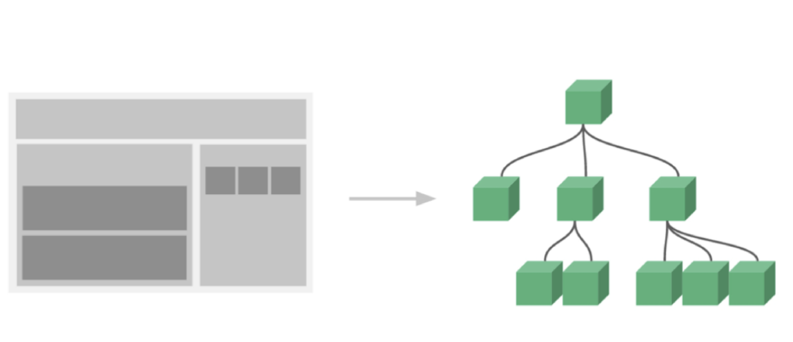

* 한 화면 안에서도 기능별로 각기 다른 컴포넌트가 존재한다.
  * 하나의 컴포넌트는 여러개의 하위 컴포넌트를 가질 수 있다.
  * Vue는 컴포넌트 기반의 개발 환경을 제공한다.
* Vue 컴포넌트는 `const app = new Vue({...})`의 `app`을 의미하며, 이는 Vue 인스턴스이다!
  * 여기서 오해하면 안 되는 것은 컴포넌트 기반의 개발이 반드시 파일 단위로 구분되어야 하는 것은 아니다!! (*하지만 우리는 이렇게 작성할 것이다~*)
  * 단일 .html 파일 안에서도 여러 개의 컴포넌트를 만들어 개발 가능하다.


> 정리
>
> * Vue 컴포넌트는 Vue 인스턴스이다
> * Vue 인스턴스는 .vue 파일 안에 작성된 코드의 집합이다
> * HTML, CSS 그리고 JS를 .vue라는 확장자를 가진 파일 안에서 관리하며 개발


## Vue CLI

* Vue.js 개발을 위한 표준 도구
* 프로젝트의 구성을 도와주는 역할을 하며 Vue 개발 생태계에서 표준 tool 기준을 목표로 한다.
* 확장 플러그인, GUI, Babel 등 다양한 tool을 제공한다.


### Node.js

* JS를 브라우저가 아닌 환경에서도 구동할 수 있도록 하는 **JS 런타임 환경**
  * 브라우저 밖을 벗어날 수 없던 JS 언어의 태생적 한계를 해결한다.
* Chrome V8 엔진을 제공하여 여러 OS 환경에서 실행할 수 있는 **환경을 제공한다.**
* 즉, 단순히 브라우저만 조작할 수 있던 JS를 SSR 아키텍처에서도 사용할 수 있도록 한다.
* [참고] 2009년 Ryan Dahl에 의해 발표

> 언어가 아닌 플랫폼이다! 


### NPM(Node Package Manage)

* JS 언어를 위한 패키지 관리자
  * Python에 pip가 있다면 Node.js에는 NPM
  * pip와 마찬가지로 다양한 의존성 패키지를 관리한다
* Node.js의 기본 패키지 관리자
* Node.js 설치 시 함께 설치된다.


### Vue CLI Quick Start

```shell
$ npm install -g @vue/cli

$ vue create <내가만들 앱 이름>
```

* `-g`: global의미
  * npm은 아무 옵션을 주지 않으면, 현재 앱에서만 패키지를 인스톨한다. 이 옵션을 주면 글로벌 환경에 설치하는 것이다.
  * 그런데 이 옵션은 매우 위험하다.. 설치 문서에 이 옵션이 작성되어 있는 애들만 설치하자!
* Vue 버전 선택 -> **Vue 2**

```shell
$ cd <내가만들 앱 이름>

$ npm run serve
```


## Babel & Webpack

* Vue 프로젝트 구조
* 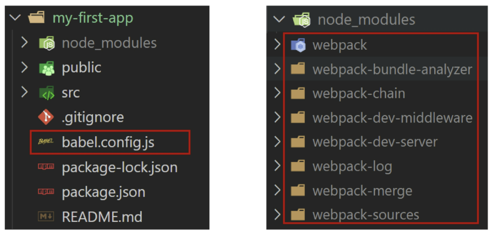


### Babel

* **JavaScript Compiler**
* 자바스크립트의 ECMAScript 2015+ 코드를 이전 버전으로 번역/변환해 주는 도구
* 과거 자바스크립트의 파편화와 표준화의 영향으로 코드의 스펙트럼이 매우 다양했다
  * 이 때문에 최신 문법을 사용해도 이전 브라우저 혹은 환경에서 동작하지 않는 상황이 발생했다.
* 원시 코드(최신 버전)를 목적 코드(구 버전)로 옮기는 번역기가 등장하면서 개발자는 더 이상 내 코드가 특정 브라우저에서 동작하지 않는 상황에 대해 크게 고민하지 않아도 된다!


* 동작예시
  * 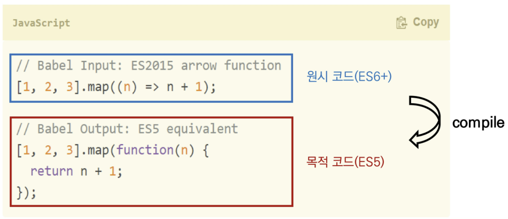


### Webpack

* **Static Module Bundler**
* 모듈 간의 의존성 문제를 해결하기 위한 도구
* 프로젝트에 필요한 모든 모듈을 매핑하고 내부적으로 종속성 그래프를 빌드한다.


#### Module

* 모듈은 단지 파일 하나를 의미한다(ex. js 파일 하나 === 모듈 하나)
* 배경
  * 브라우저만 조작할 수 있었던 시기의 JS는 모듈 관련 문법 없이 사용되었다.
  * 하지만 JS와 애플리케이션이 복잡해지고 크기가 커지자 전역 scope를 공유하는 형태의 기존 개발 방식의 한계점이 드러났다.
  * **그래서 라이브러리를 만들어 필요한 모듈을 언제든지 불러오거나 코드를 모듈 단위로 작성하는 등의 다양한 시도가 이루어졌다.**

* 여러 모듈 시스템
  * ESM(ECMA Scripte Module)
  * AMD(Asynchrounous Modeul Definition)
  * Common JS
  * UMD(Universal Module Definition)

* Module 의존성 문제
  * 모듈의 수가 많아지고 라이브러리 혹은 모듈 간의 의존성(연결성)이 깊어지면서 특정한 곳에서 발생한 문제가 어떤 모듈 간의 문제인지 파악하기 어려움
  * 즉, Webpack은 이 모듈 간의 의존성 문제를 해결하기 위해 등장


#### Bundler

* 모듈 의존성 문제를 해결해주는 작업을 Bundling이라 한다.
* 이러한 일을 해주는 도구가 Bundler이고, Webpack은 다양한 Bundler 중 하나
* 여러 모듈을 하나로 묶어주고 묶인 파일은 하나(혹은 여러 개)로 합쳐진다.
* Bundling된 결과물은 더 이상 순서에 영향을 받지 않고 동작하게 되었다.
* snowpack, parcel, rollup.js 등의 webpack 이외에도 다양한 모듈 번들러가 존재한다.


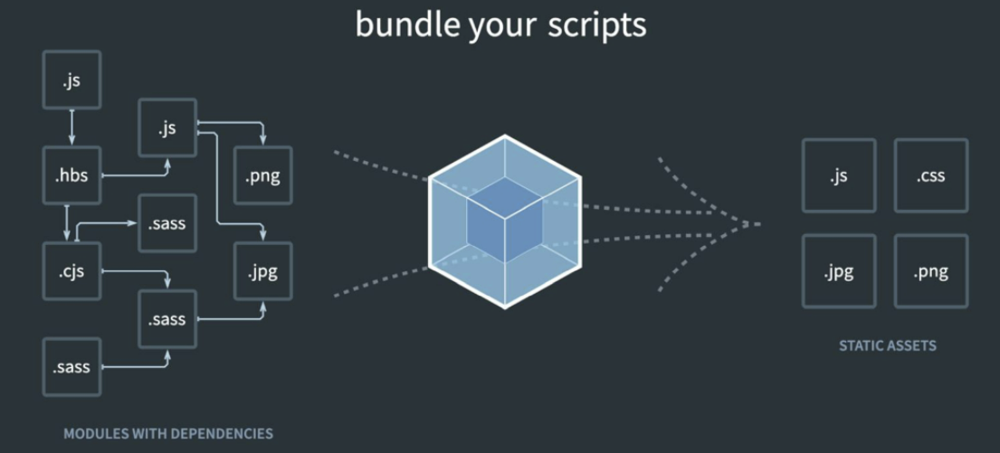

**=> Vue CLI는 이러한 Babel, Webpack에 대한 초기 설정이 자동으로 되어 있다.**


> 정리
>
> 1. Node.js
>    * JS runtime env.
>    * JS를 브라우저 밖에서 실행할 수 있는 새로운 환경
> 2. Babel
>    * Compiler
>    * ES2015+ JS코드를 구 버전의 JS로 바꿔주는 도구
> 3. Webpack
>    * Module Bundler
>    * 모듈 간의 의존성 문제를 해결하기 위한 도구


## Vue프로젝트 구조

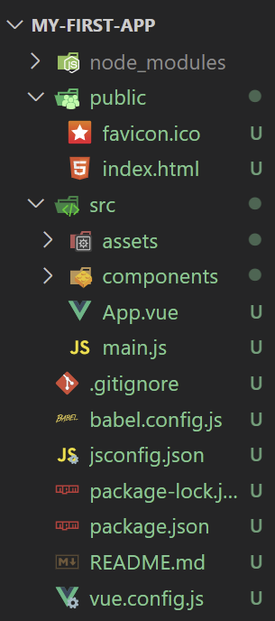

1. `node_modules`

   * node.js 환경의 여러 의존성 모듈

2. `public/index.html`

   * Vue 앱의 뼈대가 되는 파일
   * 실제 제공되는 단일 html 파일

3. `src/assets`

   * webpack에 의해 빌드된 정적 파일

4. `src/components`

   * 하위 컴포넌트들이 위치

5. `src/App.vue`

   * 최상위 컴포넌트

6. `src/main.js`

   * webpack이 빌드를 시작할 때 가장 먼저 불러오는 entry point
   * 실제 단일 파일에서 DOM과 data를 연결했던 것과 동일한 작업이 이뤄지는 곳
   * Vue 전역에서 활용할 모듈을 등록할 수 있는 파일

7. `babel.config.js`

   * babel 관련 설정이 작성된 파일

8. `package.json`

   * 프로젝트의 종속성 목록과 지원되는 브라우저에 대한 구성 옵션이 포함

   * > requirements.txt와 비슷하다.

9. `package-lock.json`

   * node_modules에 설치되는 모듈과 관련된 모든 의존성을 설정 및 관리
   * 팀원 및 배포 환경에서 정확히 동일한 종속성을 설치하도록 보장하는 표현
   * 사용할 패키지의 버전을 고정한다.
   * 개발 과정 간의 의존성 패키지 충돌 방지


## Pass props & Emit event

### 컴포넌트 작성

* Vue app은 자연스럽게 중첩된 컴포넌트 트리로 구성된다.
* 컴포넌트간 부모-자식 관계가 구성되며 이들 사이에 필연적으로 <u>의사소통이 필요하다.</u>
* 부모는 자식에게 데이터를 전달(Pass props)하며, 자식은 자신에게 일어난 일을 부모에게 알림(Emit event)
  * 부모와 자식이 명확하게 정의된 인터페이스를 통해 격리된 상태를 유지할 수 있다.
* **props는 아래로 events는 위로**
* **부모는 props를 통해 자식에게 <u>데이터</u>를 전달하고, 자식은 <u>events</u>를 통해 부모에게 메시지를 보낸다.**


### 컴포넌트 구조

#### 1. 템플릿 `<template>` (HTML)

* HTML의 body부분
* 각 컴포넌트를 작성한다.


#### 2. 스크립트 `<script>` (JS)

* JS가 작성되는 곳
* 컴포넌트 정보, 데이터, 메서드 등 vue 인스턴스를 구성하는 대부분이 작성된다.


#### 3. 스타일 `<style>` (CSS)

* CSS가 작성되며, 컴포넌트의 스타일을 담당한다.


### 컴포넌트 등록 3단계

1. 불러오기 (import)

2. 등록하기 (register)

3. 보여주기 (print)

   ```html
   <div id="app">
     <TheAbout/>  // upper camel 케이스
     <the-about></the-about> // 케밥케이스
   </div>
   ```


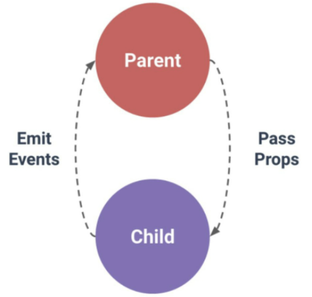


### Props

* props는 부모(상위) 컴포넌트의 정보를 전달하기 위한 사용자 지정 특성
* 자식(하위) 컴포넌트는 props 옵션을 사용하여 수신하는 props를 명시적으로 선언해야 한다
* 즉, **데이터는 props 옵션을 사용하여 자식 컴포넌트로 전달된다**
* 주의
  * 모든 컴포넌트 인스턴스에는 자체 격리된 범위가 있다.
  * 즉, 자식 컴포넌트의 템플릿에서 상위 데이터를 직접 참조할 수 없다.


#### static props 작성하기

* 자식 컴포넌트에게 보낼 prop데이터를 선언한다
  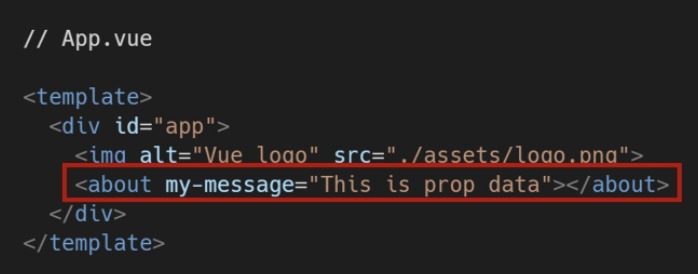

* 작성법: `prop-data-name="value"`

* 수신할 `props` 데이터를 명시적으로 선언한 후, 하위 컴포넌트에서 사용한다.
  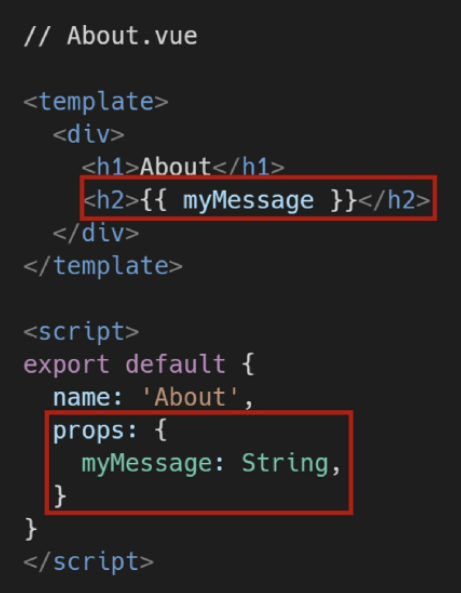

  * 여기서 `my-message`가 넘어간 것이 `myMessage`로 받아지는 것을 확인할 수 있는데, html에서 작성된 것을 JS가 인식하는 형태로 자동 변환하기 때문에 가능한 것이다.
    **넘길때 형태는 케밥이든 카멜이든 가능하지만, 받기로 한 형태는 카멜만 가능하다!!!**

    > 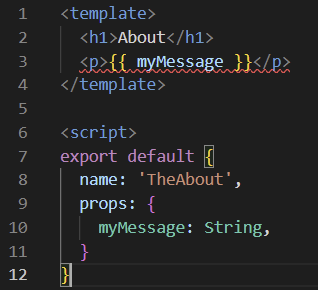
    >
    > 여기서 이렇게 작성하게 되면, 에러가 발생한다. 그래서 div로 꼭 묶어줘야 한다!
    > **template안에는 꼭 하나의 element만 있어야 하기 때문에!!!!!!!!**


#### Dynamic props 작성

* `v-bind` directive를 사용해 부모듸 데이터의 props를 동적으로 바인딩한다
* 부모에서 데이터가 업데이트될 때마다 자식 데이터로도 전달된다.
* 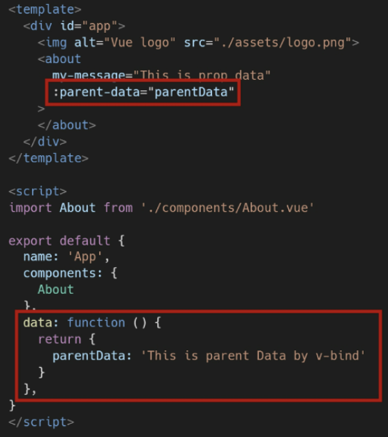


#### Props 이름 컨벤션

* 선언시: `camelCase`
* in template: `kebab-case`


#### Props시 자주하는 실수

* Static 구문을 사용하여 숫자를 전달하려고 시도하는 것
* 실제 JS 숫자를 전달하려면 값이 JS 표현식으로 평가되도록 v-bind를 사용해야 한다.
* 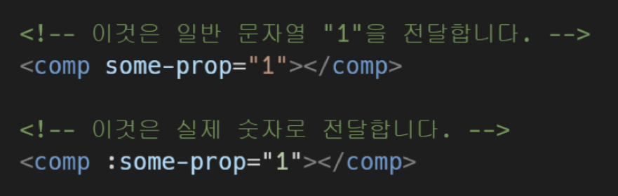


#### 컴포넌트의 `data`는 반드시 함수여야 한다!

* 기본적으로 각 인스턴스는 모두 같은 data 객체를 공유하므로 새로운 data객체를 반환해야 한다.

  > 만약 한 컴포넌트를 상위에서 두번 불러온다고 했을 때, 만약 data가 그냥 키밸류 형태라면 이렇게 상위에서 참조하는 data가 모두 같은 밸류를 참조하게 될 것이다. 근데 함수형으로 작성하게 되면, 같은 컴포넌트를 부르더라고 각각의 data는 별개의 객체로 사용하는 형태가 될 것이다. 


### 단방향 데이터 흐름

* 모든 props는 하위 속성과 상위 속성 사이의 단뱡향 바인딩을 형성한다.
* 부모의 속성이 변경되면 자식 속성에게 전달되지만, 반대 방향으로는 안된다.
  * 자식 요소가 의도치 않게 부모 요소의 상태를 변경하여 앱의 데이터 흐름을 이해하기 어렵게 만드는 일을 방지한다.
* 부모 컴포넌트가 업데이트될 때마다 자식 요소의 모든 prop들이 최신값으로 업데이트 된다.


### Emit Event

* Listening to Child Components Events
* `$emit(eventName, 넘길인자)`
  * 현재 인스턴스에서 이벤트를 트리거
  * 추가 인자는 리스너의 콜백 함수로 전달한다
* 부모 컴포넌트는 자식 컴포넌트가 사용되는 템플릿에서 `v-on`을 사용하여 자식 컴포넌트가 보낸 이벤트를 청취한다 (`v-on`을 이용한 사용자 지정 이벤트)

> 자식에서 변화가 생성되면 emit을 포함한 함수를 실행할 수 있게 한다. 


#### Emit event 작성

* 현재 인스턴스에서 `$emit` 인스턴스 메서드를 사용해 child-input-change 이벤트를 트리거
* 부모 컴포넌트는 자식 컴포넌트가 사용되는 템플릿에서 `v-on`을 사용하여 자식 컴포넌트가 보낸 이벤트를 청취한다.
* 자식 컴포넌트
  * 

* 부모 컴포넌트
  * 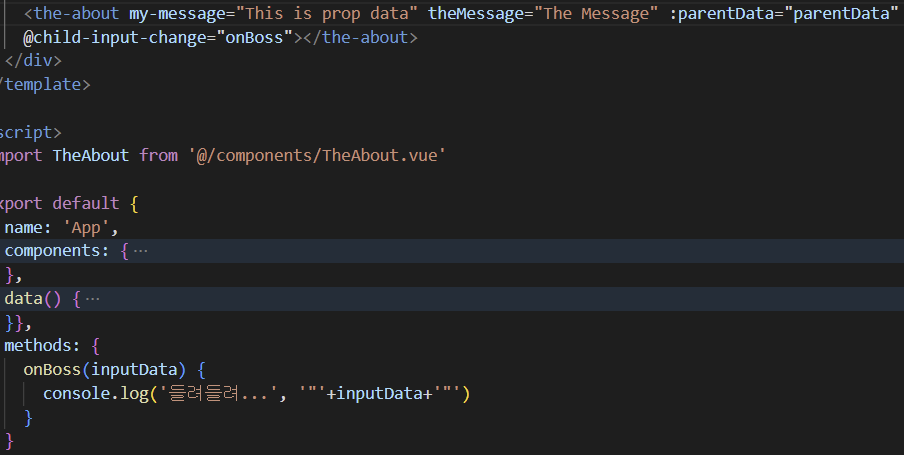


> 여러 개의 인자를 넘긴다면, 부모 컴포넌트에서 이벤트를 듣고 실행할 콜백함수에서 그 인자의 개수만큼 함수 내 인자를 작성하거나 `...`으로 작성해도 괜찮다.
>
> 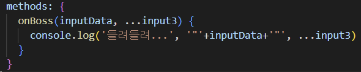
>
> 이런식으로 되면, 첫번째인자는 inputData가 될 것이고 그 뒤에 오는 애들은 몇개가 되었든 input3로 받아볼 수 있다.


#### event 이름 컨벤션

* 컴포넌트 및 props와는 달리, **event는 자동 대소문자 변환을 제공하지 않는다.**

* HTML의 대소문자 구분을 위해 DOM 템플릿의 v-on 이벤트 리스너는 항상 자동으로 소문자 변환되기 때문에 <u>`v-on:myEvent`는 `v-on:myevent`로 변환 => 그래서 안됨!</u>

* 이러한 이유로 **이벤트 이름에는 항상 kebab-case를 사용하는 것**을 권장한다.
  아래 예시들은 모두 동작하지 않는 코드

  * 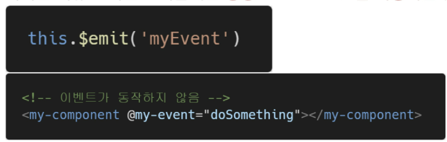

  * ```html
    this.$emit('myEvent')
    <my-component @myEvent="doSth"></my-component>
    ```


## Vue Router

* Vue.js 공식 라우터
* 라우트(route)에 컴포넌트를 매핑한 후, 어떤 주소에서 렌더링할 지 알려준다
  * <u>*URL을 통한 하이퍼링크가 아닌, 그런 척!!*</u>
* SPA 상에서 라우팅을 쉽게 개발할 수 있는 기능을 제공한다

> 현재 우리가 작성했던 코드에서는 single page즉 한장의 html이기 때문에 별도의 url이 없었다. 그래서 SPA인데도 url처럼 움직이는 것처럼 만들어주기 위해 라우터를 사용한다!!


> [참고] router
>
> 위치에 대한 최적의 경로를 지정하며, 이 경로를 따라 데이터를 다음 장치로 전향시키는 장치


### Vue Router 시작하기

```shell
$ vue add router
```

> 기존 프로젝트를 진행하고 있던 도중에 추가하게 되면, App.vue를 덮어쓰므로 프로젝트 내에서 다음 명령을 실행하기 전에 필요한 경우 파일을 백업(커밋)해야 한다.


### Vue Router로 인한 변화

|                              전                              |                              후                              |
| :----------------------------------------------------------: | :----------------------------------------------------------: |
| 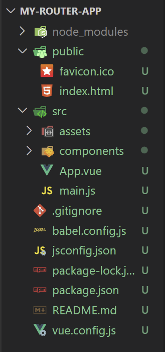 | 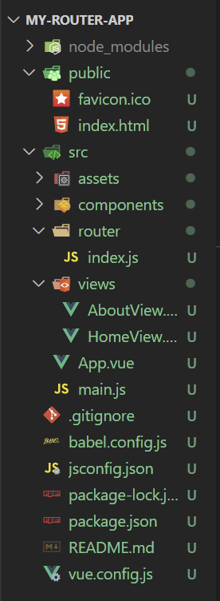 |

1. App.vue 코드
2. router/index.js 생성
3. views 디렉토리 생성


#### router/index.js

* 라우트에 관련된 정보 및 설정이 작성되는 곳


### `<router-link>`

* 사용자 네비게이션을 가능하게 하는 컴포넌트
* 목표 경로는 `to` prop으로 지정된다
* HTML5 히스토리 모드에서 `router-link`는 클릭 이벤트를 차단하여 브라우저가 페이지를 다시 로드하지 않도록 한다
* a 태그지만, 우리가 알고 있는 GET 요청을 보내는 a 태그와 조금 다르게, 기본 GET 요청을 보내는 이벤트를 제거한 형태로 구성되었다.


* router/index.js에 등록된 views를 가는 방법

```html
<nav>
  <router-link to="/">Home</router-link> // 직접 url 주소를 작성하는 방법
  <router-link :to="{name: 'about'}">About</router-link> // 우리가 붙인 별칭으로 부르는 방법
</nav>
```


### `<router-view/>`

* **주어진 라우트에 대해 일치하는 컴포넌트를 렌더링하는 컴포넌트**
* 실제 컴포넌트가 DOM에 부착되어 보이는 **자리를 의미**
* router-link를 클릭하면 해당 경로와 연결되어 있는 index.js에 정의한 컴포넌트가 위치된다.

|                          Home 클릭                           |                          Lotto 클릭                          |
| :----------------------------------------------------------: | :----------------------------------------------------------: |
| 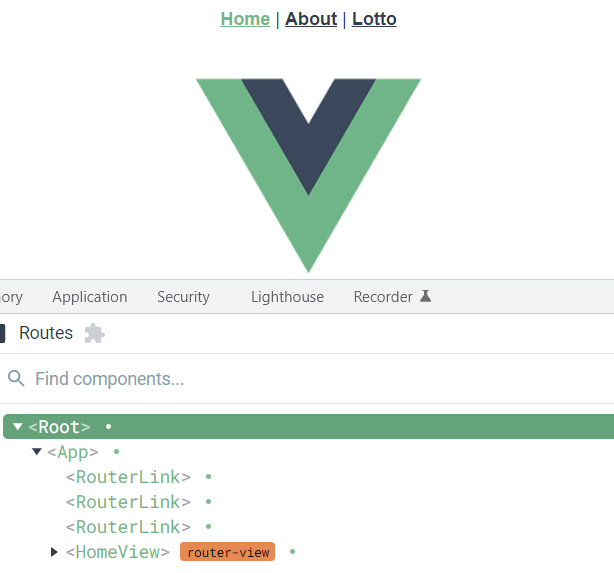 | 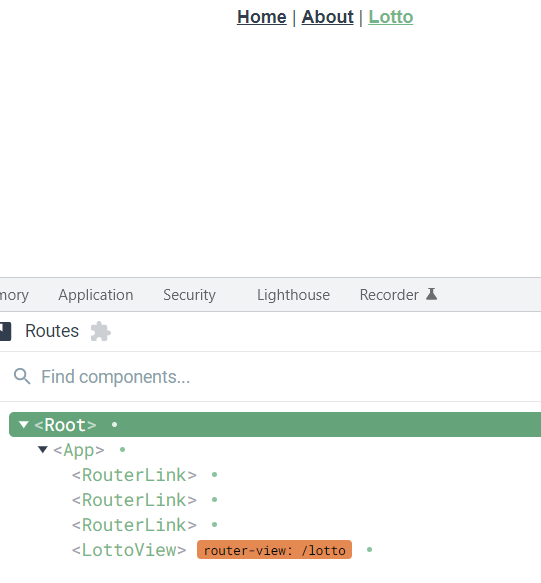 |


#### History Mode

* HTML History API를 사용해서 router를 구현한 것
* 브라우저의 히스토리는 남기지만 실제 페이지는 이동하지 않는 기능을 지원한다.
* 즉, 페이지를 다시 로드하지 않고 URL을 탐색할 수 있다.
  * SPA의 단점 중 하나인 "URL이 변경되지 않는다."를 해결!!

> [참고] History API
>
> DOM의 window 객체는 history 객체를 통해 브라우저의 세션 기록에 접근할 수 있는 방법을 제공한다
>
> history 객체는 사용자를 자신의 방문 기록 앞과 뒤로 보내거나, 기록의 특정 지점으로 이동하는 등 유용한 메서드와 속성을 가진다.


### route 이동하기

#### 1. Named Routes

* 이름을 가지는 라우트
* 명명되 경로로 이동하려면 객체를 vue-router 컴포넌트 요소의 prop에 전달한다

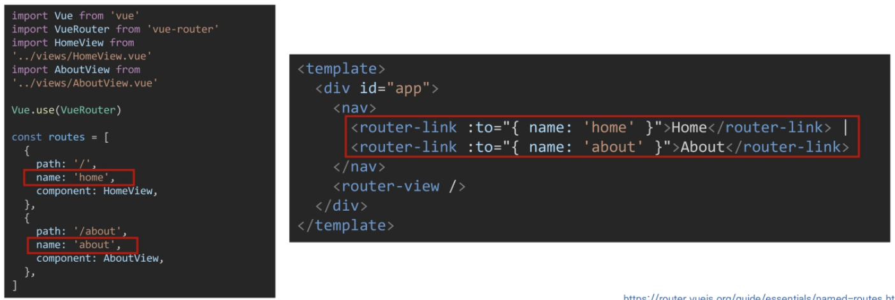


#### 2. 프로그래밍 방식 네비게이션

* `<router-link>`를 사용하여 선언적 탐색을 위한 a 태그를 만드는 것 외에도, router의 인스턴스 메서드를 사용하여 프로그래밍 방식으로 같은 작업을 수행할 수 있다.

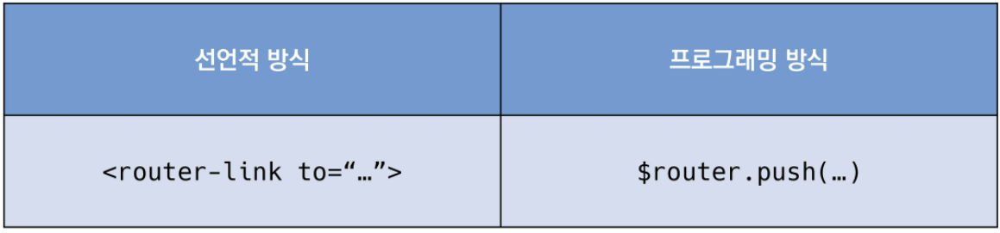

* Vue 인스턴스 내부에서 라우터 인스턴스에 `$router`로 접근할 수 있다

* 따라서 다른 URL로 이동하려면 `this.$router.push`를 호출할 수 있다.

  * 이 메서드는 새로운 항목을 히스토리 스택에 넣기 때문에 사용자가 브라우저의 뒤로가기 버튼을 클릭하면 이전 URL로 이동하게 된다.

* `<router-link>`를 클릭할 때 내부적으로 호출되는 메서드이므로, `<router-link :to="...">`를 클릭하면, `router.push(...)`를 호출하는 것과 같다.

* 작성할 수 있는 인자 예시

  * 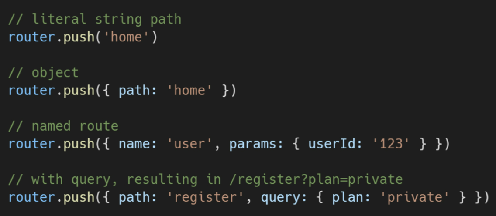

  * 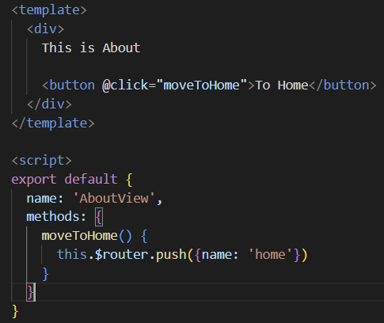

  * 

    > 1, 3이 똑같이 움직이고 / 2, 4가 똑같이 움직인다.
    >
    > 1, 3: localhost:8080/home으로 이동
    >
    > 2, 4: localhost:8080/으로 이동


#### 3. Dynamic Route Matching

* 동적 인자 전달

* 주어진 패턴을 가진 라우트를 동일한 컴포넌트에 매핑해야 하는 경우

* 예를 들어 모든 User에 대해 동일한 레이아웃을 가지지만, 다른 User ID로 렌더링 되어야 하는 User 컴포넌트 예시
  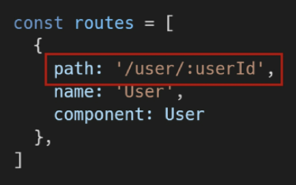

  * 이렇게 작성된 형태는 해당 컴포넌트에서 `this.$route.params`로 사용이 가능하다

  * 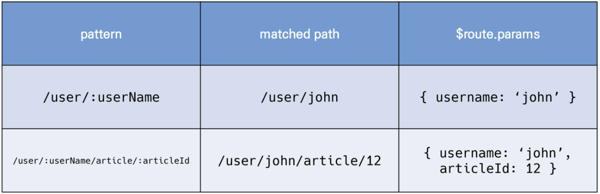

    > 여기서, $route.params 에는 객체가 존재한다. 객체의 이름은 컴포넌트의 data에서 정의할 수 있다. 
    >
    > 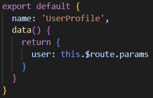
    >
    > 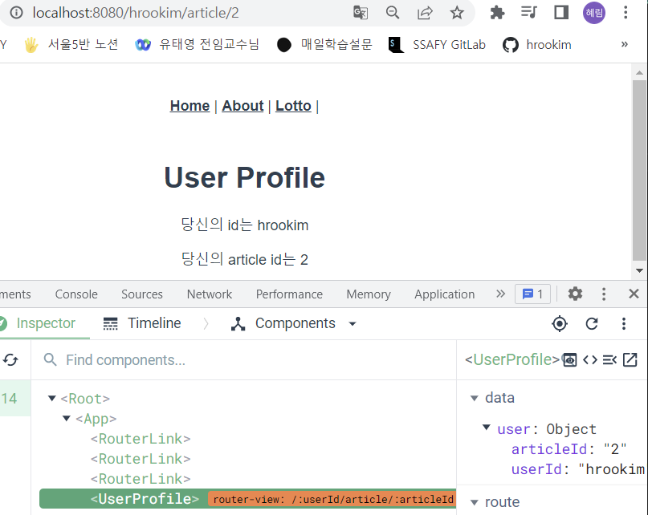


### components와 views

* 기본적으로 작성된 구조에서 components 폴더와 views 폴더 내부에 각기 다른 컴포넌트가 존재하게 된다.
* 컴포넌트를 작성해갈 때 정해진 구조가 있는 것은 아니며, 주로 아래와 같이 구조화하여 활용한다
* `App.vue`
  * 최상위 컴포넌트
* `views/`
  * `router/index.js`에 매핑되는 컴포넌트를 모아두는 폴더
* `components` 
  * router에 매핑된 컴포넌트 내부에 작성하는 컴포넌트를 모아두는 폴더


### Vue Router가 필요한 이유

1. SPA 등장 이전
   * 서버가 모든 라우팅을 통제
   * 요청 경로에 맞는 HTML을 제공한다.
2. SPA 등장 이후
   * 서버는 index.html 하나만 제공한다
   * 이후 모든 처리는 HTML 위에서 JS 코드를 활용해 진행한다.
   * 즉, 요청에 대한 처리를 더 이상 서버가 하지 않는다. (할 필요가 없어졌다.)

3. 라우팅 처리 차이
   * SSR
     * 라우팅에 대한 결정권을 서버가 가진다
   * CSR
     * 클라이언트는 더 이상 서버로 요청을 보내지 않고 응답받은 HTML 문서 안에서 주소가 변경되면 특정 주소에 맞는 컴포넌트를 렌더링
     * 라우팅에 대한 결정권을 클라이언트가 가진다.
   * 결국 Vue Router는 라우팅의 결정권을 가진 Vue.js에서 라우팅을 편리하게 할 수 있는 tool을 제공해주는 라이브러리


## Youtube Project (실습)

