# 03_Vuex

## Vuex

* "Statement management pattern + Library" for vue.js
  * 상태 관리 패턴 + 라이브러리

* 상태(state)를 전역 저장소로 관리할 수 있도록 지원하는 라이브러리
  * 상태가 예측 가능한 방식으로만 변경될 수 있도록 보장하는 규칙 설정
  * 애플리케이션의 모든 컴포넌트에 대한 중앙 집중식 저장소 역할

* Vue의 공식 devtools와 통합되어 기타 고급 기능을 제공


### 상태 관리 패턴

* 컴포넌트의 공유된 상태를 추출하고 이를 전역에서 관리하도록 한다
* 컴포넌트는 커다란 view가 되며 모든 컴포넌트는 트리에 상관없이 상태에 액세스하거나 동작을 트리거할 수 있다.
* 상태 관리 및 특정 규칙 적용과 관련된 개념을 정의하고 분리함으로써 코드의 구조와 유지 관리 기능 향상

> [참고] 트리거
>
> 특정한 동작에 반응해 자동으로 필요한 동작을 실행하는 것


### 기존 Pass props & Emit event

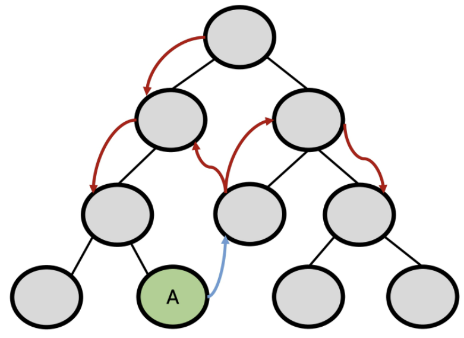

* 각 컴포넌트는 독립적으로 데이터를 관리한다
* 데이터는 단방향 흐름으로 부모 -> 자식 간의 전달만 가능하며, 반대의 경우 이벤트를 트리거 한다.
* 장점
  * 데이터의 흐름을 직관적으로 파악할 수 있다
* 단점
  * 컴포넌트 중첩이 깊어지는 경우 동위 관계의 컴포넌트로의 데이터 전달이 불편해진다.

* 공통의 상태를 공유하는 여러 컴포넌트가 있는 경우 데이터 전달 구조가 매우 복잡해진다
  * 예를 들면, 지나치게 중첩된 컴포넌트를 통과하는 prop

* 단방향 데이터 흐름
  * 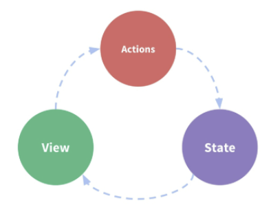
  * state는 앱을 작동하는 원본 소스(data)
  * view는 state의 선언적 매핑
  * action은 view에서 사용자 입력에 대해 반응적으로 state를 바꾸는 방법(methods)


### Vuex management pattern

* 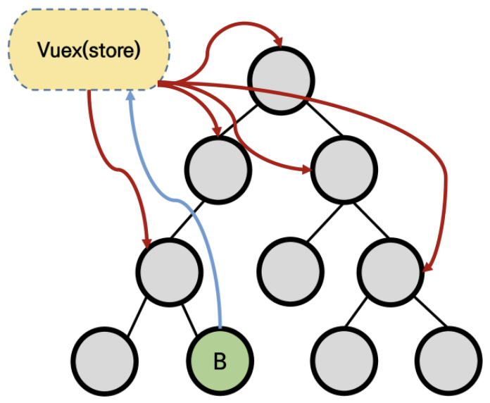
* 중앙 저장소(store)에 state를 모아놓고 관리
* 규모가 큰(컴포넌트 중첩이 깊은) 프로젝트에서 매우 효율적이다
* 각 컴포넌트에서는 중앙 집중 저장소의 state만 신경쓰면 된다.
  * 동일한 state를 공유하는 다른 컴포넌트들도 동기화된다.


#### 단방향 흐름에 의존한 state 관리

1. 부모 자식 간의 컴포넌트 관계가 단순하거나 depth가 깊지 않은 경우에는 문제가 없다.
   * 몇 단계만 거치면 데이터를 쉽게 이동시킬 수 있으며 훨씬 직관적으로 데이터 흐름을 파악할 수 있다.
2. 하지만 규모가 커졌을 경우의 상태 관리가 어려워진다.
   * 상태를 공유하는 컴포넌트의 상태 동기화 관리가 어렵다.
   * 상태는 전달할 때는 상 -> 하로만 가능
3. A 컴포넌트의 상태를 공유하는 다른 컴포넌트에 pass props & emit event를 통해 동기화해야 한다.


#### Vuex를 활용한 state 관리

1. 상태의 변화에 따른 여러 흐름을 모두 관리해야 하는 불편함을 해소할 필요가 있다.
   * 상태는 데이터를 주고 받는 컴포넌트 사이의 관계도 충분히 고려해야 하기 때문에 상태 흐름 관리가 매우 중요해진다.
2. 결국 이러한 상태를 올바르게 관리하는 저장소의 필요성을 느끼게 된다.
   * 상태를 한 곳(store)에 모두 모아 놓고 관리하자
   * 상태의 변화는 모든 컴포넌트에서 공유
   * 상태의 변화는 오로지 Vuex가 관리하여 해당 상태를 공유하고 있는 모든 컴포넌트는 변화에 '반응'
3. A 컴포넌트와 같은 상태를 공유하는 다른 컴포넌트는 신경쓰지 않고, 오로지 상태의 변화를 Vuex에 알린다.


## Vuex Core Concepts

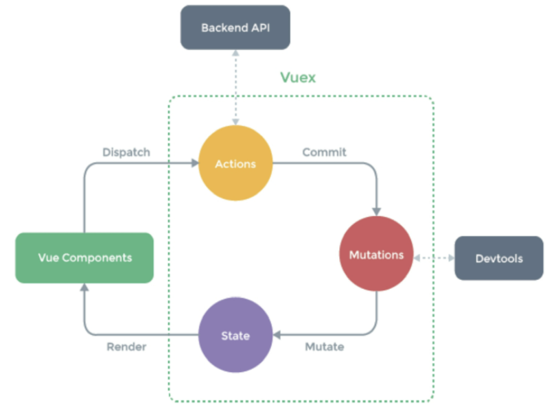

1. State
2. Mutations
3. Actions
4. Getters


### 1. State

* **중앙에서 관리하는 모든 상태 정보(data)**
* Vuex는 single state tree를 사용한다.
  * 즉, 이 단일 객체는 모든 애플리케이션 상태를 포함하는 <u>원본 소스(single source of truth)</u>의 역할을 한다.
  * 이는 각 애플리케이션마다 하나의 저장소만 갖게 된다는 것을 의미한다.

* 여러 컴포넌트 내부에 있는 특정 state를 중앙에서 관리하게 된다.
  * 이전의 방식은 state를 찾기 위해 각 컴포넌트를 직접 확인해야 했다.
  * Vuex를 활용하는 방식은, Vuex Store에서 각 컴포넌트에서 사용하는 state를 한 눈에 파악 가능하다.
* State가 변화하면 해당 state를 공유하는 여러 컴포넌트의 DOM은 (알아서) 렌더링
* 각 컴포넌트는 이제 Vuex Store에서 state 정보를 가져와 사용한다.
* Vuex를 사용한다고 해서 Vuex Store에 모든 상태를 넣어야 하는 것은 아니다!


#### 컴포넌트에서 Vuex Store의 state에 접근하기

* `$store.state`
* 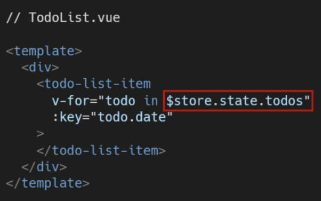

* **컴포넌트의 `data`가 아닌 `computed`에서 불러온다!!** 
  * state에서 가져온 data를 변화시키지 않는다. 그렇기 때문에 매번 새로 호출하는 것은 비효율적
  * 대신 해당 data에 변경 사항이 있을 때만 새로 계산한 값을 반환하는 방향으로 변경 (computed)
  * `this(Vue Instance)`로 접근한다.
  * 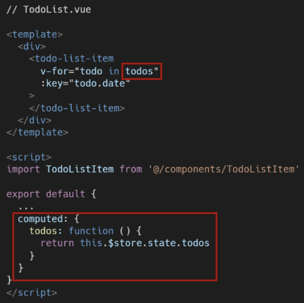


### 2. Mutations

* 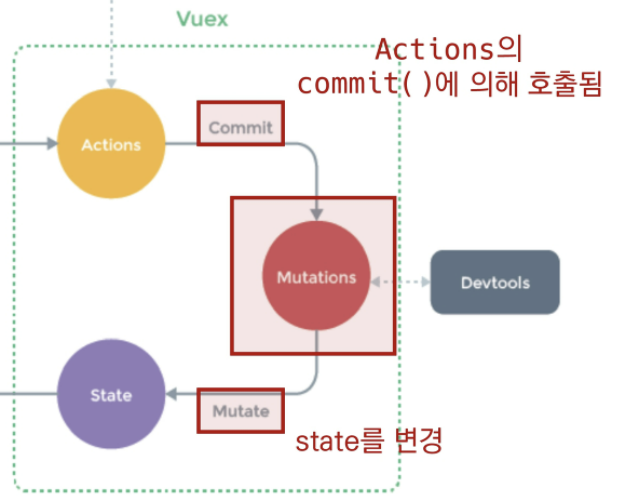
* 실제로 state를 변경하는 유일한 방법
* mutation의 handler(핸들러 함수)는 <u>반드시 동기적</u>이어야 한다
  * 비동기적 로직(ex. 콜백함수)은 state가 변화하는 시점이 의도한 것과 달라질 수 있으며, 콜백이 실제로 호출될 시기를 알 수 있는 방법이 없다(추적할 수 없다)
* 첫번째 인자로 항상 `state`를 받는다.
* Actions에서 `commit()` 메서드에 의해 호출된다.


#### Mutations handler name

* Mutations 함수 (핸들러 함수)의 이름은 상수로 작성하는 것을 권장
  * linter와 같은 tool에서 디버깅하기에 유용하며, 전체 애플리케이션에서 어떤 것이 mutation인지 한눈에 파악할 수 있다.


### 3. Actions

* 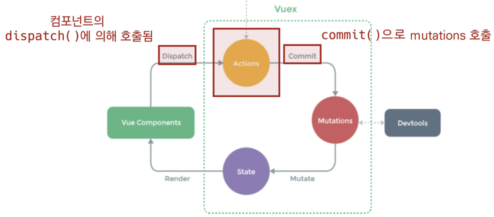

* Mutations와 유사하지만 다음과 같은 차이점이 있다.

  1. state를 변경하지 않고 mutations를 `commit()` 메서드로 호출해서 실행

     ```javascript
     createTodo({commit}, todoItem) {
         commit('CREATE_TODO', todoItem)
     }
     // 이런식으로 문자열로 전달해야 한다!
     ```

  2. mutations와 달리 <u>비동기 작업</u>이 포함될 수 있다 (Backend API와 통신하여 Data Fetching 등의 작업 수행)

* `context` 객체 인자를 받는다

  * 이 객체를 통해 store/index.js 파일 내에 있는 모든 요소의 속성 접근 & 메서드 호출이 가능하다.
  * 단, (가능하지만) state를 직접 변경하지 않는다!

* 컴포넌트에서 `dispatch()`메서드에 의해 호출된다.

* Actions를 통해 state를 조작할 수는 있지만, state는 오로지 Mutations를 통해서만 조작해야 한다.
  * 명확한 역할 분담을 통해 서비스 규모가 커져도 state를 올바르게 관리하기 위함


#### Actions의 `context` 객체

* Vuex store의 전반적인 맥락 속성을 모두 포함하고 있다.
* 그래서 `context.commit`을 호출하여 mutation을 호출하거나, `context.state`와 context.getters를 통해 state와 getters에 접근할 수 있다.
  * `dispatch()`로 다른 actions도 호출 가능
  * 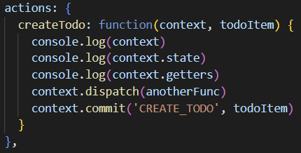
* JS Destructuring assignment
  * 배열의 값이나 객체의 속성을 고유한 변수로 압축 해제할 수 있는 JS 표현식
  * `createTodo({commit, dispatch})`


#### 컴포넌트에서 actions를 부르는 코드

```javascript
// html에서 부른다면 this는 작성하지 않는다!
{{ $store.dispatch('deleteTodo') }}

// script에서 부른다면
deleteTodo() {
    this.$store.dispatch('deleteTodo')
}
// 혹은
...mapActions(['deleteTodo'])


// 이건 안된다.
{deleteTodo} : mapActions(['deleteTodo'])
```


### 4. Getters

* 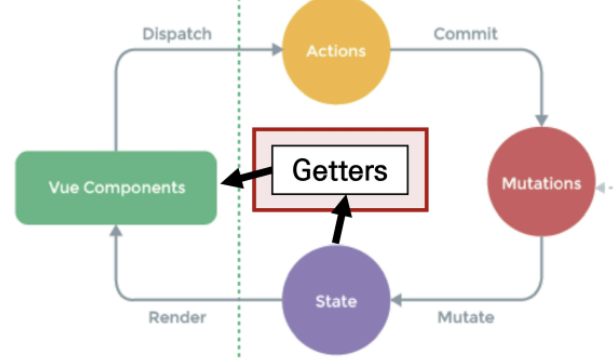
* state를 변경하지 않고 활용하여 계산을 수행한다(computed 속성과 유사)
  * computed를 사용하는 것처럼 getters는 저장소의 상태(state)를 기준으로 계산
  * 예를 들어, state에 todoList라는 해야할 일의 목록의 경우, 완료된 todo 목록만을 필터링해서 출력할 때 혹은 해야할 일의 개수를 출력할 때 등..
* computed 속성과 마찬가지로 getters의 결과는 state 종속성에 따라 캐시(cached)되고, 종속성이 변경된 경우에만 다시 재계산된다.
* getters 자체가 state를 변경하지는 않는다.
  * state를 특정한 조건에 따라 구분(계산)만 한다.
  * 즉, 계산된 값을 가져온다.


## Todo app with Vuex

```shell
$ vue create todo-vuex-app

$ vue add vuex
```


### Vuex로 인한 변화

| 전                                                           | 후                                                           |
| ------------------------------------------------------------ | ------------------------------------------------------------ |
| 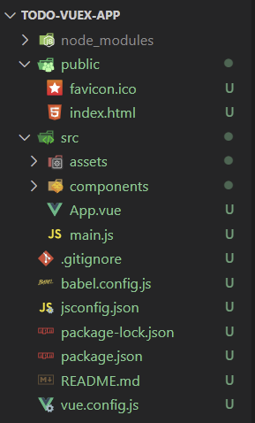 | 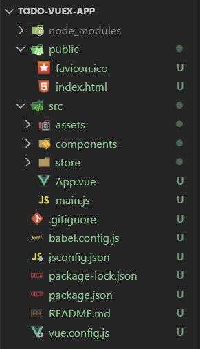 |

1. store 디렉토리 생성
2. index.js 생성
   * Vuex core concepts가 작성되는 곳


### Update TODO

```javascript
UPDATE_TODOS(state, todoItem) {
    state.todos = state.todos.map(todo => {
        if (todo === todoItem) {
            todo.isCompleted = !todo.isCompleted
        }
        return todo
    })
},
```

```javascript
UPDATE_TODOS(state, todoItem) {
    state.todos = state.todos.map(todo => {
        if (todo === todoItem) {
            return {
                ...todo,
                isCompleted = !todo.isCompleted
            }
        }
        return todo
    })
},
```


### Style 주기

* 만약 TodoListItem.vue의 `<style>`에서 div 태그를 잡고 스타일을 준다면..?

  ```html
  <style>
     div {
  	border: 2px solid black;
  	} 
  </style>
  ```

  * 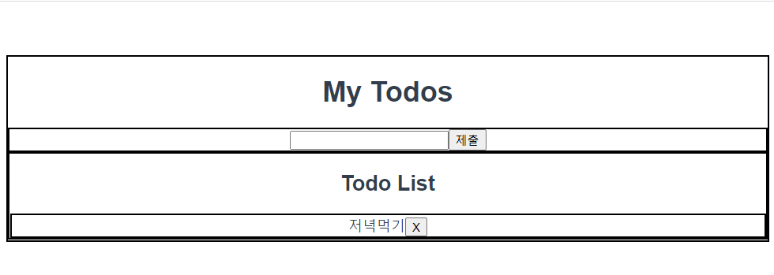
  * 이렇게 전체에 스타일이 입혀진다 ㅜ

* `scoped`를 입력해야 해당 컴포넌트에만 들어간다!!!

  ```html
  <style scoped>
     div {
  	border: 2px solid black;
  	} 
  </style>
  ```

  * 
  * 이렇게 하면, html 개발자 도구로 찍어보면 각각의 id를 생성해준다.
    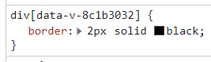


#### JavaScript Spread Syntax

* **전개 구문**
* 배열이나 문자열과 같이 반복 가능한(iterable) 문자를 요소(배열 리터럴의 경우)로 확장하여, 0개 이상의 key-value의 쌍으로 된 객체로 확장시킬 수 있다.
* `...`을 붙여서 요소 또는 키가 0개 이상의 iterable obejct를 하나의 object로 간단하게 표현하는 법
* ECMAScript2015에서 추가 됨
* **반드시 iterable한 객체여야 한다.**

* 주사용처
  1. 함수 호출: 배열의 목록을 함수의 인수로 활용시
  2. 배열: 배열을 연결, 복사
  3. 객체: 객체 복사

* 객체에서의 전개 구문 -> 객체 복사!
  * 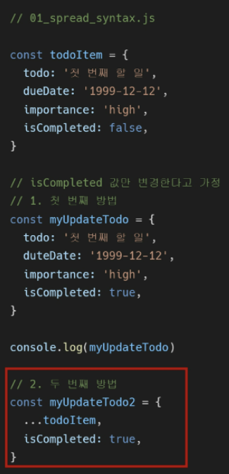


## Component Binding Helper

* JS Array Helper Method를 통해 배열 조작을 편하게 하는 것과 유사
  * 논리적인 코드 자체가 변하는 것이 아니라 쉽게 사용할 수 있도록 되어 있음에 초점
* 종류
  * `mapState`, `mapGetters`, `mapActions`, `mapMutations`

```javascript
import { mapState, mapGetters, mapActions, mapMutations } from 'vuex'
```


#### 1. `mapState`

* computed와 Store의 state를 매핑

* Vuex Store의 하위 구조를 반환하여 component 옵션을 생성한다.

* 매핑된 computed 이름이 state 이름과 같을 때 문자열 배열을 전달할 수 있다.

  * ```javascript
    computed: {
        ...mapState(['state의 이름'])
    }
    ```

* `mapState()`는 객체를 반환한다.


#### 2. `mapGetters`

* Computed와 Getters를 매핑

* gettters도 객체 전개 연산자(`...`)로 계산하여 추가

* 해당 컴포넌트 내에서 매핑하고자 하는 이름이 index.js에 정의해 놓은 getters의 이름과 동일하게, 배열의 형태로 해당 이름만 문자열로 추가

  * ```javascript
    computed: {
        ...mapGetters(['getters의 이름'])
    }
    ```


#### 3. `mapActions`

* action을 전달하는 컴포넌트 method 옵션을 만든다
* actions를 객체 전개 연산자(`...`)로 계산하여 추가하기
* [주의] mapActions를 사용하면, 이전에 dispatch()를 사용했을 때 payload로 넘겨줬던 this.todo를 pass prop으로 변경해서 전달해야 한다.
  * 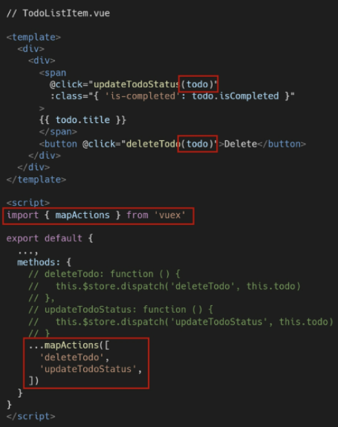

> 신기한거 발견, 넘겨주는 인자가 없는 함수들을 @click=""콜백함수로 넘겨줄 때 `()`있어도, 없어도 다 동작된다.
>
> 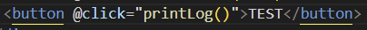
>
> 즉, 위 사진도 제대로 실행이된다.


## Local Storage

* **vue가 아닌 브라우저의 영역입니다!!!**
* Local Storage vs Session Storage
  * local은 사용자 입장에서 영구 저장, session은 탭이 켜져있는 동안만 저장됨


### Local Storage에 저장하기: json으로 넘긴다.

```javascript
const data = JSON.stringify(todos)

locaStorage.setItem('todos', data) // todos라는 키에 data라는 밸류
```


### Local Storage에서 불러오기

```javascript
localStorage.getItem('todos')

const prevData = localStorage.getItem('todos')
const data = JSON.parce(prevData)
```


### store/index.js에서 저장하기

actions에 saveTodos()를 만들어서 그 안에서 사용한다!

```javascript
saveTodos({state}) {
    const strTodos = JSON.stringify(state.todos)
    localStorage.setItem('todos', strTodos)
},
```

그리고 다른 함수에서 이 함수를 불러서 실행한다.

```javascript
createTodo({commit, dispatch}, todoItem) {
    commit('CREATE_TODO', todoItem)
    dispatch('saveTodos')
},
```


### store/index.js에서 저장된 데이터 불러오기

```javascript
mutations: {
    LOAD_TODOS(state) {
      const data = localStorage.getItem('todos')
      state.todos = JSON.parse(data)
    }
}

// 그리고 App.vue에서
  methods: {
    ...mapMutations(['LOAD_TODOS'])
  },
  created() {
    this.LOAD_TODOS()
  }
```


### vuex-persistedstate

* Vuex state를 자동으로 브라우저의 LocalStorage에 저장해주는 라이브러리 중 하나

* 페이지가 새로고침되어도 Vuex state를 유지시킨다

* 설치

  * ```bash
    $ npm i vuex-persistedstate
    ```

* 라이브러리 사용

  * 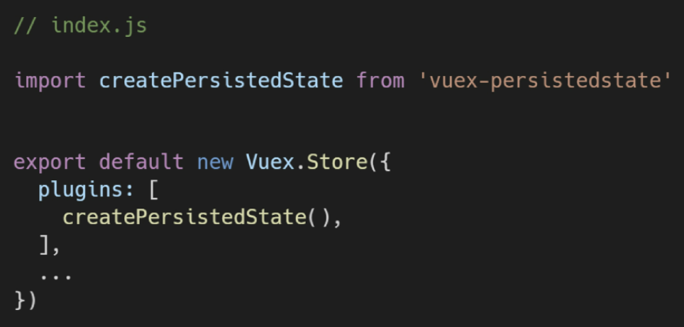
