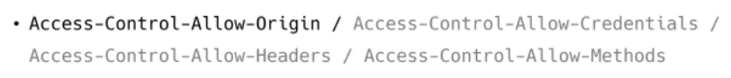

# 04_Server_Client

## Server & Client

### Server

* 클라이언트데에 '정보', '서비스'를 제공하는 컴퓨터 시스템
* 정보 & 시스템
  * Django를 통해 응답한 template
  * DRF를 통해 응답한 JSON
  * 

### Client

* 서버에게 그 서버가 맡는(서버가 제공하는) 서비스를 요청하고, 서비스 요청을 위해 필요한 인자를 서버가 요구하는 방식에 맞게 제공하며, 서버로부터 반환되는 응답을 사용자에게 적절한 방식으로 표현하는 기능을 가진 시스템
  * 
  * 올바른 요청 == 서버가 요구하는 방식으로 요청
  * 

> [정리]
>
> * Server는 정보 제공
>   * DB와 통신하며 데이터를 CRUD
>   * 요청을 보낸 Client에게 이러한 정보를 응답
> * Client는 정보 요청 & 표현
>   * Server에게 정보(데이터) 요청
>   * 응답 받은 정보를 잘 가공하여 화면에 보여준다.

## CORS

### Same-Origin Policy(SOP)

* **동일 출처 정책**
* 특정 출처에서 불러온 문서나 스크립트가 다른 출처에서 가져온 리소스와 상호작용하는 것을 제한하는 보안 방식
* 잠재적으로 해로울 수 잇는 문서를 분리함으로써 공격받을 수 있는 경로를 줄인다.

#### Origin(출처)

* 두 **URL의 Protocol, Port, Host가 모두 같아야 동일한 출처**라 할 수 있다.
  * 

* URL `http://store.company.com/dir/page.html`의 출처를 비교한 예시
  * 

### CORS (Cross-Origin Resource Sharing)

* 교차 출처 리소스(자원) 공유
* 추가 HTTP header를 사용하여 특정 출처에서 실행중인 웹 애플리케이션이 다른 출처의 자원에 접근할 수 있는 권한을 부여하도록 블아줘에 알려주는 체제
* 리소스가 자신의 출처(Domain, Protocol, Port)와 다를 때 교차 출처 HTTP 요청을 실행
* 보안상의 이유로 브라우저는 교차 출처 HTTP 요청을 제한한다.(SOP)
  * 예를 들어 XMLHttpRequest는 SOP를 따른다.
* 다른 출처의 리소스를 불러오려면 그 출처에서 올바른 CORS header를 포함한 응답을 반환해야 한다.

#### CORSP (CORS Policy)

* 교차 출처 리소스(자원) 공유 정책
* 다른 출처에서 온 리소스를 공유한느 것에 대한 정책
* <=> SOP

#### 교차 출처 접근 허용하기

* CORS를 사용해 교차 출처 접근을 허용하기
* CORS는 HTTP의 일부로, 어떤 호스트에서 자신의 컨텐츠를 불러갈 수 있는지 서버에 지정할 수 있는 방법

#### Why CORS?

1. 브라우저 & 웹 애플리케이션 보호
   * 악의적인 사이트의 데이터를 가져오지 않도록 사전 차단
   * 응답으로 받는 자원에 대한 최소한의 검증
   * 서버는 정상적으로 응답하지만 브라우저에서 차단
2. Server의 자원 관리
   * 누가 해당 리소스에 접근할 수 있는지 관리 가능

#### How CORS?

* CORS 표준에 의해 추가된 HTTP Header를 통해 이를 통제
  * 예시
    * 
  * `Access-Control-Allow-Origin` 응답 헤더
    * 이 응답이 주어진 출처로부터 요청 코드와 공유될 수 있는지를 나타낸다.
    * `Access-Control-Allow-Origin: *` 
    * 브라우저 리소스에 접근하는 임의의 origin으로부터 요청을 허용한다고 알리는 응답에 포함
    * `*`는 모든 도메인에서 접근할 수 있음을 의미
    * `*` 외에 특정 origin 하나를 명시할 수 있음

#### 예시

* `https://localhost:8080`(Vue.js)의 웹 컨텐츠가 `https://lab.ssafy.com`(Django) 도메인의 컨텐츠를 호출하기를 원하는 상황
* 
* 요청 헤더의 Origin을 보면 localhost:8080으로부터 요청이 왔다는 것을 알 수 있음
* 서버는 이에 대한 응답으로 `Access-Control-Allow-Origin` 헤더를 다시 전송
* 만약 서버 리소스 소유자가 오직 `localhost:8080`의 요청에 대해서만 리소스에 대한 접근을 허용하려는 경우, `*`가 아닌 `Access-Control-Allow-Origin: localhost:8080`을 전송해야 함

1. Vue.js에서 A 서버로 요청
2. A 서버는 `Access-Control-Allow-Origin`에 특정한 origin을 포함시켜 응답
   서버는 CORS policy와 직접적인 연관이 없고 그저 요청에 응답한다.
3. 브라우저는 응답에서 `Access-Control-Allow-Origin`를 확인 후 허용 여부를 결정
4. 프레임워크 별로 이를 지원하는 라이브러리가 존재
   django는 `django-cors-header` 라이브러리를 통해 응답 헤더 및 추가 설정 가능

#### `django-cors-headers` 라이브러리

* 응답에 CORS header를 추가해주는 라이브러리
* 다른 출처에서 보내는 Django 애플리케이션에 대한 브라우저 내 요청을 허용한다.
* Django App이 header 정보에 CORS를 설정한 상태로 응답을 줄 수 있게 도와주며, 이 설정을 통해 브라우저는 다른 origin에서 요청을 보내는 것이 가능해진다.

## Authentication & Authorization

### Authentication

* 인증, 입증
* 자신이라고 주장하는 사용자가 누구인지 확인하는 행위
* 모든 보안 프로세스의 첫번째 단계 (가장 기본 요소)
* 즉, 내가 누구인지를 확인하는 과정
* `401 Unauthorized`
  * 비록 HTTP 표준에서는 미승인(unauthorized)을 하고 있지만, 의미상 이 응답은 비인증(unauthenticated)을 의미

### Authorization

* 권한 부여, 허가
* 사용자에게 특정 리소스 또는 기능에 대한 액세스 권한을 부여하는 과정(절차)
* 보안 환경에서 권한 부여는 항상 인증을 따라야 한다
  * 예를 들어, 사용자는 조직에 대한 액세스 권한을 부여받기 전에 먼저 자신의 ID가 진짜인지 먼저 확인해야 한다.
* 서류의 등듭, 웹 페이지에서 글을 조회/삭제/수정할 수 있는 방법, 제한 구역
  * 인증이 되었어도 모든 권한을 부여받는 것은 아니다
* `403 Forbidden`
  * 401과 다른 점을 서버는 클라이언트가 누구인지 알고 있다는 점

### Authentication and Authorization word together

* 회원가입을 하고 로그인을 하면 할 수 있는 권한을 생성
  * 인증 이후에 권한이 따라오는 경우가 많다.
* 단, 모든 인증을 거쳐도 권한이 동일하게 부여되는 것은 아니다.
  * django에서 로그인을 했더라도 다른 사람의 글까지 수정/삭제가 가능하지는 않았다.
* 세션, 토큰, 제3자를 활용하는 등의 다양한 인증 방식이 존재한다.

## DRF Authentication

### 다양한 인증 방식

1. Session based
2. Token based
   * **Basic Token** (*우리가 할 방식!*)
   * JWT
3. Oauth
   * google
   * facebook
   * github...

### Basic Token

> 클라이언트가 넘긴 로그인 정보를 받아서 우리의 유저가 맞는지를 확인함

> 그러면 authtoken_token 테이블에서 그 유저에 맞는 토큰 값을 확인해서 돌려줄 것이다 

> 받아온 토큰을 클라이언트는 잘 저장해놨다가 요청을 보낼 때 header에 이 token을 같이 넘겨야한다.

* 정리
* 

## JWT

