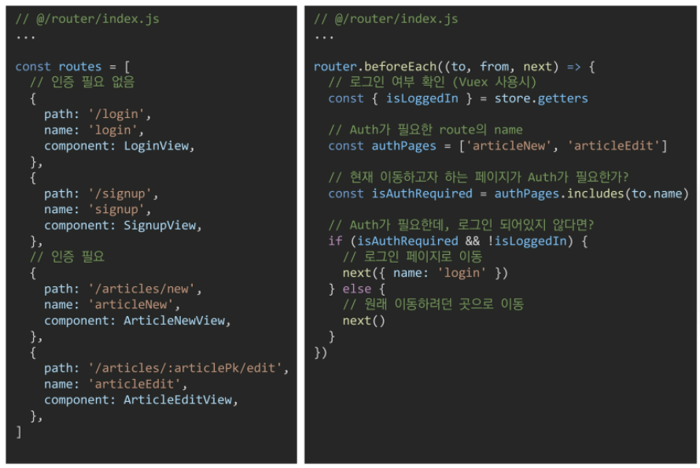
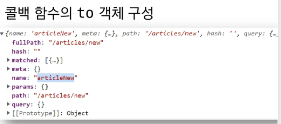
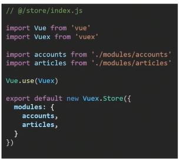

# 05_Vue응용

이 부분은 최종 프로젝트에 그대로 포함될 내용으로, 실습파일을 위주로 확인한다!


## 404 page

### 404 Not Found 시나리오

1. Vue Router에 등록되지 않은 routes일 경우

   * ex) `/no-such-routes`

   * ```javascript
        {
         path: '*', // 위에 있는게 빼고 나머지는 다
         redirect: '/404'
        },
     ```

2. Vue Router에는 등록되어 있지만, 서버에서 해당 리소스를 찾을 수 없는 경우

   * ex) `/articles/3940934024`

   * ```javascript
     axios.get(URL)
     	.then(res => {})
     	.catch(err => {
         if (err.response.status === 404) {
             this.$router.push({name: 'NotFound404'})
             // 혹은 아래 코드도 가능
             router.push({name: 'NotFound404'})
         }
     })
     ```

   * 


## Navigation Guard

### 전역가드 (Global Before Guards)

1. URL을 이동할 때마다, 이동하기 전 모든 경우에 발생
2. `router` 객체의 메서드로, 콜백 함수를 인자로 받고 해당 콜백 함수는 3개의 인자를 받는다.
   1. `to`: 이동하려는 route의 정보를 담은 객체
   2. `from`: 직전 route의 정보를 담은 객체
   3. `next`: 실제 route의 이동을 조작하는 함수
3. 반드시 마지막에 `next()`로 route 이동을 실행해야 한다.




> 




## Vuex Module

1. 단일 파일(`@/store/index.js`)에 모든 state, getters, mutations, actions를 작성할 경우, App이 커질수록 파일의 크기가 너무 커짐

2. 기능에 따라 state, getters, mutations, actions를 모듈(파일)로 분리하여 사용




### Module의 이름공간 (Module Space)

1. 다른 Module에 작성되어 있어도, 실제로는 global namespace에 등록된다
2. 만약 확실하게 모듈별로 구분하고 싶다면, `namespaced: true`옵션을 사용한다.